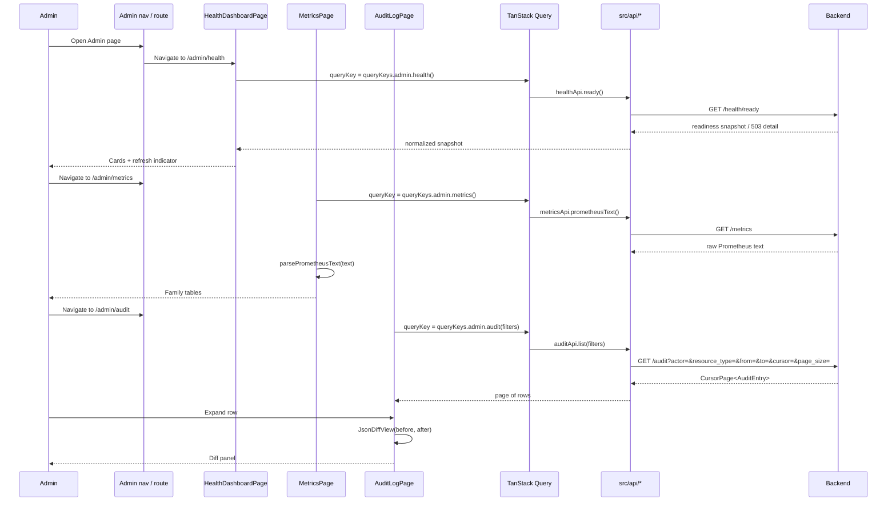
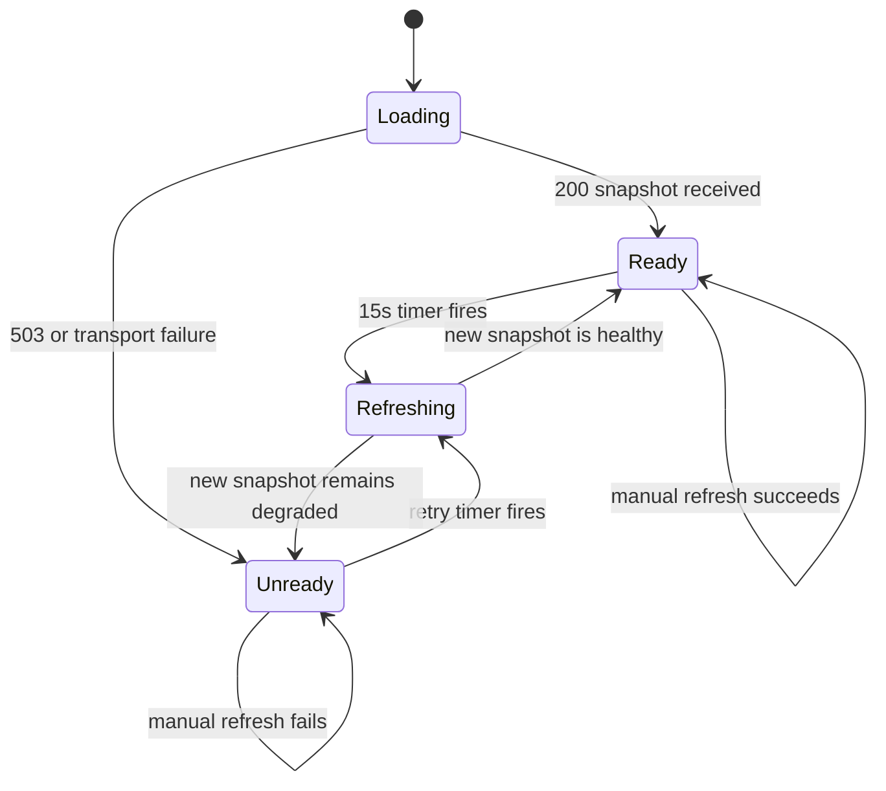

# Module: adm-ui-09-11 — Admin observability pages

**Covers:** ADM-UI-09, ADM-UI-10, ADM-UI-11
**Files:** `web/src/pages/admin/HealthDashboardPage.tsx`, `web/src/pages/admin/MetricsPage.tsx`, `web/src/pages/admin/AuditLogPage.tsx`, plus supporting API and UI modules under `web/src/api/` and `web/src/components/ui/`

## Module purpose

Provide the Platform Admin with a cohesive observability surface inside the Admin section. The Health page shows live readiness data with an explicit refresh indicator and a 15-second polling cycle. The Metrics page converts raw Prometheus exposition text into a grouped, human-readable table by metric family. The Audit Log page exposes a paginated, filterable audit stream and lets the operator expand any row to inspect the before/after JSON diff that explains the change.

The pages share the same front-end constraints as the rest of the application: all network access goes through `src/api/client.ts`, server state uses TanStack Query, and role gating hides the Admin navigation entirely from non-`PLATFORM_ADMIN` users.

## Public interface

### Health page contract

```typescript
export interface AdminHealthComponentStatus {
  status: 'ok' | 'degraded' | 'error'
  detail?: string
  latency_ms?: number
}

export interface AdminHealthSnapshot {
  status: 'ok' | 'degraded' | 'error'
  database: AdminHealthComponentStatus
  scheduler: AdminHealthComponentStatus
  uptime_seconds: number
  db_query_latency_ms: number
  refreshed_at: string
}

export function useAdminHealthSnapshot(): UseQueryResult<AdminHealthSnapshot>
```

Behavioral contract:
- Poll every 15 seconds.
- Keep the last successful snapshot visible while a refresh is in flight.
- Show a visible refresh indicator during polling to satisfy FNFR-02.
- Treat a `503` from readiness as a valid, displayable state rather than a hard page crash.

### Metrics page contract

```typescript
export interface PrometheusMetricSample {
  name: string
  labels: Record<string, string>
  value: number
}

export interface PrometheusMetricFamily {
  name: string
  help?: string
  type: 'counter' | 'gauge' | 'histogram' | 'summary' | 'untyped'
  samples: PrometheusMetricSample[]
}

export function usePrometheusMetrics(): UseQueryResult<PrometheusMetricFamily[]>
export function parsePrometheusText(text: string): PrometheusMetricFamily[]
```

Behavioral contract:
- Fetch raw Prometheus text from `GET /metrics`.
- Parse the exposition format client-side.
- Group the output by metric family and render a table per family.
- Keep unknown or malformed lines out of the UI, but preserve a parse error banner if the payload cannot be interpreted at all.

### Audit log page contract

```typescript
export interface AuditLogFilters {
  actor?: string
  resource_type?: string
  from?: string
  to?: string
  cursor?: string
  page_size?: number
}

export interface AuditEntry {
  id: string
  occurred_at: string
  actor_id: string
  actor_display_name?: string
  resource_type: string
  resource_id: string
  action: string
  before_state?: Record<string, unknown> | null
  after_state?: Record<string, unknown> | null
  ip_address?: string | null
}

export function useAuditLog(filters: AuditLogFilters): UseQueryResult<CursorPage<AuditEntry>>
export function JsonDiffView(props: {
  before: Record<string, unknown> | null | undefined
  after: Record<string, unknown> | null | undefined
}): React.ReactElement
```

Behavioral contract:
- Filters are additive and update the query key so TanStack Query caches each combination separately.
- Pagination uses the backend cursor, not an offset, so the row expansion state survives page turns.
- Row expansion renders a structured before/after diff and never exposes raw JSON blobs as the primary UI.

## Data flow diagram



## State transitions



Audit page row state:
- `collapsed` -> `expanded` when the disclosure control is clicked.
- `expanded` -> `collapsed` when the row is collapsed or the user pages away.
- Expansion state is local to the page and should not be shared across rows.

## Error taxonomy

| Area | Error | UI behavior |
|---|---|---|
| Health | `503` readiness response | Show a red readiness banner, keep the last successful snapshot visible, and mark the failing subsystem tile as degraded or error. |
| Health | Network failure or timeout | Keep stale data visible, show a non-blocking toast or banner, and continue the 15-second polling cycle. |
| Health | Partial payload missing latency or uptime | Render the fields that exist, leave missing fields blank, and mark the page as degraded instead of crashing. |
| Metrics | Invalid Prometheus exposition text | Show a parse error banner and stop short of rendering misleading family tables. |
| Metrics | Empty metric set | Render an explicit empty state rather than an error. |
| Metrics | Network failure | Retain the last successful table, if any, and surface a transient error state. |
| Audit | Invalid filter values or out-of-range cursor | Show validation feedback near the filter bar and avoid firing a request with malformed parameters. |
| Audit | `403` due to missing `PLATFORM_ADMIN` role | Hide the route from navigation; if reached directly, redirect to the shell access-denied path. |
| Audit | Empty page after filtering | Render an empty state that states no audit entries matched the selected filters. |
| Audit | Diff rendering failure | Fall back to a compact JSON tree for the affected row only; never fail the whole page. |

## Dependencies

| Depends on | Direction | Notes |
|---|---|---|
| `src/api/client.ts` | calls | All requests go through the shared client. |
| `web/src/api/queryKeys.ts` | calls | Admin queries must use `queryKeys.admin.*`. |
| `web/src/api/health.ts` | calls | Needs a readiness helper that targets `/health/ready`. |
| `web/src/api/metrics.ts` | calls | New API adapter for raw Prometheus text from `/metrics`. |
| `web/src/api/audit.ts` | calls | New API adapter for the paginated audit stream. |
| `web/src/auth/useAuth.ts` | calls | Determines `PLATFORM_ADMIN` access. |
| `web/src/components/ui/Toast.tsx` | calls | Non-blocking error and refresh feedback. |
| `web/src/components/ui/JsonDiffView.tsx` | calls | Shared diff renderer for audit rows. |
| Backend `GET /health/ready`, `GET /metrics`, `GET /audit` | network | Source endpoints for the three pages. |

Must not depend on:

- `src/engine/transition.zig` for routing, polling, data shaping, or diff rendering logic.
- Raw `fetch` calls or ad hoc HTTP clients in page components; all network access must stay behind `src/api/client.ts`.
- Query-key construction outside `web/src/api/queryKeys.ts`.
- Shared mutable state between the three admin pages; each page owns its own local UI state and cache usage.
- Any backend endpoint other than `GET /health/ready`, `GET /metrics`, and `GET /audit` for the observable data covered by this module.

## Open questions

None. The page contracts are fully determined by ADM-UI-09..11 and the existing Admin shell conventions.