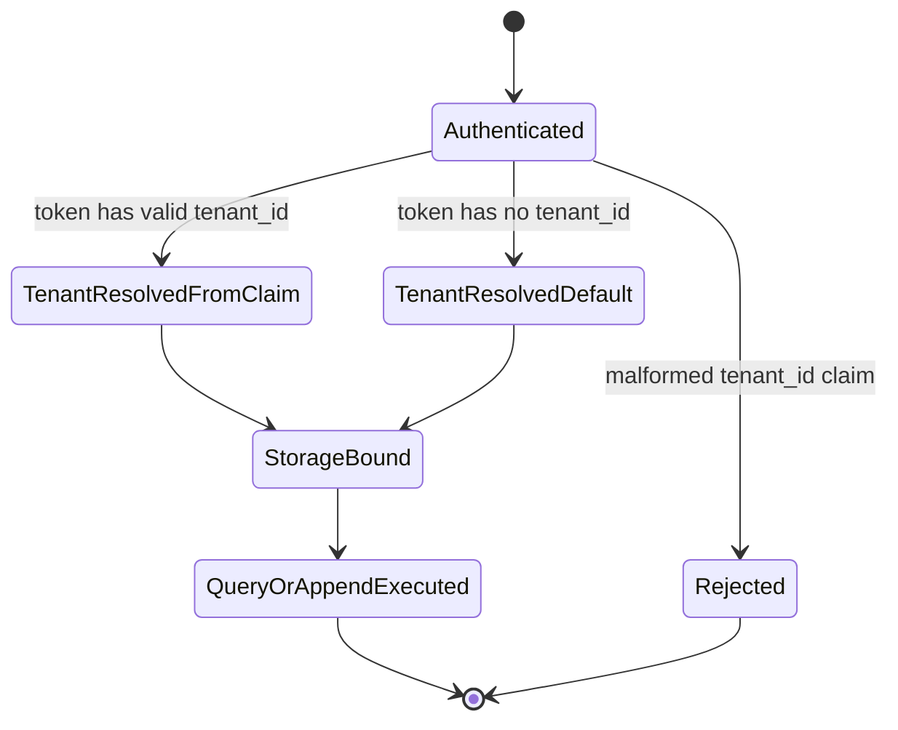
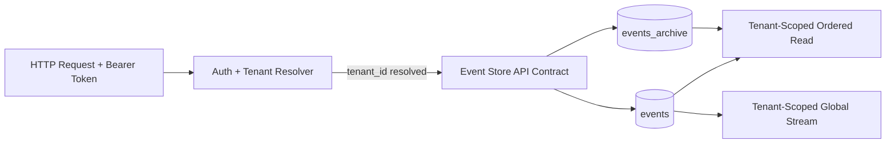

# Module: ADP-01 Tenant Column on Event Store

## Module purpose

This design introduces `tenant_id` to the event store as a strictly additive schema and query contract extension, preserving default-tenant behavior and all existing ordering/idempotency guarantees from ES-01, ES-02, ES-04, and ES-06. The design defines deterministic tenant resolution boundaries between API context and storage, tenant-safe read/write filtering semantics (including archive participation), and compatibility rules so legacy flows without explicit tenant context continue to operate under the reserved default tenant `00000000-0000-0000-0000-000000000000`.

## Scope and non-goals

- In scope: event store schema/index/query contract, default/backfill strategy, event and archive filtering semantics, deterministic behavior for missing tenant context, and requirement traceability.
- Out of scope: middleware/token parser implementation, OIDC provisioning details, non-event-store table adaptations from ADP-02+.

## Public interface

### Zig storage contract (design signatures only)

```zig
pub const TenantId = [16]u8; // UUID bytes

pub const AppendEventArgs = struct {
    tenant_id: TenantId,
    instance_id: Uuid,
    event_type: []const u8,
    payload: JsonObject,
    metadata: ?JsonObject,
    actor_id: []const u8,
    idempotency_key: []const u8,
};

pub const ReadInstanceArgs = struct {
    tenant_id: TenantId,
    instance_id: Uuid,
    cursor: ?Cursor,
    page_size: u32,
};

pub const ReadGlobalArgs = struct {
    tenant_id: TenantId,
    cursor: ?Cursor,
    page_size: u32,
};

pub const PointInTimeArgs = struct {
    tenant_id: TenantId,
    instance_id: Uuid,
    up_to_sequence: ?u64,
    up_to_timestamp_utc: ?i64,
};

pub fn appendEvent(allocator: std.mem.Allocator, pool: *db.Pool, args: AppendEventArgs) EventStoreError!EventRecord;
pub fn readInstanceOrdered(allocator: std.mem.Allocator, pool: *db.Pool, args: ReadInstanceArgs) EventStoreError!Paged(EventRecord);
pub fn readGlobalTenantStream(allocator: std.mem.Allocator, pool: *db.Pool, args: ReadGlobalArgs) EventStoreError!Paged(EventRecord);
pub fn readPointInTime(allocator: std.mem.Allocator, pool: *db.Pool, args: PointInTimeArgs) EventStoreError![]EventRecord;
```

### API context to storage contract assumptions (no middleware implementation)

```typescript
interface ResolvedTenantContext {
  tenantId: string; // UUID, always present before storage layer call
  source: 'token_claim' | 'default_fallback';
}

interface EventStoreCallContext {
  requestId: string;
  tenant: ResolvedTenantContext;
}
```

Rules:

- Storage entry points require `tenant_id` explicitly; they do not infer it.
- API/auth layer resolves tenant before calling storage:
  - token has valid `tenant_id` claim -> use claim;
  - token lacks claim -> use default tenant ID;
  - token has malformed/non-UUID claim -> reject request before storage.

## Data types and invariants

### Event row invariant additions

- `tenant_id` is non-null for every `events` row.
- `tenant_id` is non-null for every `events_archive` row (for ES-07 + ADP-11 replay-safe reads).
- For any ordered read/global read call, returned rows satisfy `row.tenant_id == request.tenant_id`.

### Preserved invariants

- ES-01 immutability remains unchanged.
- ES-02/ES-06 ordering guarantees remain per instance and per query mode.
- ES-04 global ordering remains by global sequence, but visibility is tenant-scoped.
- ES-03 global idempotency key uniqueness remains unchanged (not relaxed to per-tenant).

## Schema and index strategy

### Additive schema changes

1. Add `tenant_id UUID NOT NULL DEFAULT '00000000-0000-0000-0000-000000000000'` to `events`.
2. Add `tenant_id UUID NOT NULL DEFAULT '00000000-0000-0000-0000-000000000000'` to `events_archive`.
3. Backfill behavior is satisfied by default-value column add; all existing rows become default tenant.

### Index strategy

Keep existing indexes for compatibility, add tenant-aware indexes for query efficiency and deterministic plans:

- `idx_events_tenant_instance_seq` on `(tenant_id, instance_id, sequence_num)`.
- `idx_events_tenant_global_seq` on `(tenant_id, sequence_num)`.
- `idx_events_archive_tenant_instance_seq` on `(tenant_id, instance_id, sequence_num)`.
- `idx_events_archive_tenant_global_seq` on `(tenant_id, sequence_num)`.

Rationale:

- Tenant predicate is first to prevent cross-tenant row scans.
- Existing default-tenant traffic remains stable due to both default value and preserved old indexes.
- No destructive index drops are required in ADP-01.

## Read/write behavior

### Write path (append)

1. API layer resolves `tenant_id` from authenticated context (or default fallback).
2. Storage `appendEvent` is called with explicit `tenant_id`.
3. Insert writes `tenant_id` alongside existing event fields.
4. Idempotency behavior (ES-03) unchanged:
   - same idempotency key returns original event even if duplicate submission attempts a different tenant.
5. Event append to CANCELLED/COMPLETED instance retains existing ES-01 rejection behavior.

### Ordered instance read path (ES-02)

Query contract:

- Filter by both `tenant_id` and `instance_id`.
- Order by `sequence_num ASC`.
- Only committed rows visible (existing transaction semantics preserved).

Determinism:

- A request for the same `instance_id` in a different tenant returns 404-equivalent visibility (instance not found in that tenant scope).

### Global stream read path (ES-04 under tenancy)

Query contract:

- Filter by `tenant_id`.
- Order by global `sequence_num ASC`.
- Cursor encodes tenant-scoped position; cursor replay is valid only for same tenant.

Determinism:

- Global stream remains globally ordered in storage, but API exposure is per-tenant partition.
- No cross-tenant rows are returned in a single request.

### Point-in-time read path (ES-06)

Query contract:

- Same tenant + instance filter as ES-02, plus `up_to_sequence` or `up_to_timestamp` rule.
- Precedence remains unchanged: sequence filter wins when both are provided.

### Archive interaction (ES-07 with ADP-11)

- Archival operations must preserve row `tenant_id` on move from `events` to `events_archive`.
- Replay/state reconstruction queries union live + archive per same `tenant_id` and ordering semantics.
- ADP-11 replay-safe retention remains enforceable because tenant partition does not alter event availability rules.

## Compatibility rules (legacy/default tenant)

1. Requests with authenticated token but no `tenant_id` claim map to default tenant.
2. Existing pre-migration data is visible under default tenant and produces identical results for pre-existing tests and callers.
3. Legacy clients that never send tenant context continue to function (default semantics).
4. No API contract break: tenant-awareness is additive and inferred through auth context.

## Failure taxonomy and deterministic behavior

```zig
pub const EventStoreError = error{
    MissingTenantContext,
    InvalidTenantContext,
    CrossTenantAccessDenied,
    InstanceNotFound,
    DuplicateIdempotencyKey,
    ValidationFailed,
    PoolExhausted,
    DatabaseError,
};
```

Failure mode matrix:

| Case | Detection boundary | Result | Deterministic outcome |
|---|---|---|---|
| No auth token | API auth layer | 401 | Storage not called |
| Auth token without tenant claim | Tenant resolver | default tenant used | Request succeeds/fails exactly as legacy default-tenant flow |
| Auth token with malformed tenant claim | Tenant resolver | 401/422 auth-validation failure | Storage not called |
| Storage call missing tenant_id (programming defect) | Event store input validation | `MissingTenantContext` | Request fails; no DB write |
| Tenant mismatch for instance read | Event query filter | not found in scope | 404-equivalent visibility, no leakage |
| Cross-tenant attempt via cursor reuse | Cursor validator/query guard | cursor rejected | 400/410 equivalent; caller must restart in own tenant scope |

## State transitions

### Tenant context state machine (request-level)



### Data flow



## Dependencies

### Calls into

- `api/middleware/auth` or equivalent auth context resolver (for `tenant_id` resolution contract only).
- `event_store/store` query and append paths.
- Migration subsystem for additive schema/index creation.

### Must not depend on

- OIDC provider SDK specifics (belongs to OIDC stream, not ADP-01 storage design).
- UI/frontend tenant logic.
- Any cross-tenant admin bypass path (not defined by ADP-01).

## Open questions

1. Cursor invalidation code for tenant mismatch should be standardised as 400 vs 410 at API layer for consistency with existing API-06 behavior.
2. Confirm whether archived global stream endpoint is tenant-scoped under same cursor type or a dedicated archive cursor namespace.

## Traceability matrix

### ADP-01 acceptance mapping

| Requirement | Design section(s) | Verification intent |
|---|---|---|
| Existing default-tenant queries return same results post-migration | Schema and index strategy; Compatibility rules | Regression tests compare default-tenant responses pre/post migration |
| New tenant events not visible from default-tenant queries | Read/write behavior; Failure taxonomy | Integration tests assert tenant isolation for ordered and global reads |

### Impacted prior requirements mapping

| Prior requirement | Impact in this design | Regression point |
|---|---|---|
| ES-01 Append event | Adds required `tenant_id` storage field; default fallback preserved | Append behavior unchanged for default tenant; immutability unchanged |
| ES-02 Ordered read | Adds mandatory tenant filter before instance ordering | Ordered sequence remains strict within tenant scope |
| ES-04 Global stream | Stream exposure becomes tenant-scoped partition over global sequence | No cross-tenant visibility; cursor remains monotonic within tenant |
| ES-06 Point-in-time | Same sequence/timestamp semantics with tenant filter | Existing precedence and edge semantics unchanged |
| ES-07 + ADP-11 | Archive and replay remain queryable with tenant-preserved rows | Replay-safe retention still satisfied across live+archive per tenant |

### Handoff acceptance criteria traceability

| Handoff acceptance criterion | Covered by |
|---|---|
| Additive `tenant_id` schema and indexing strategy fully specified | Schema and index strategy |
| Read/write semantics explicit for tenant-scoped and default-tenant compatibility | Read/write behavior; Compatibility rules |
| Traceability matrix maps ADP-01 and impacted ES requirements | Traceability matrix |
| Failure and edge-case behavior explicit and testable | Failure taxonomy and deterministic behavior |
| Implementation-ready for BACKEND-DEV | Public interface + invariants + query contracts + dependency boundaries |
