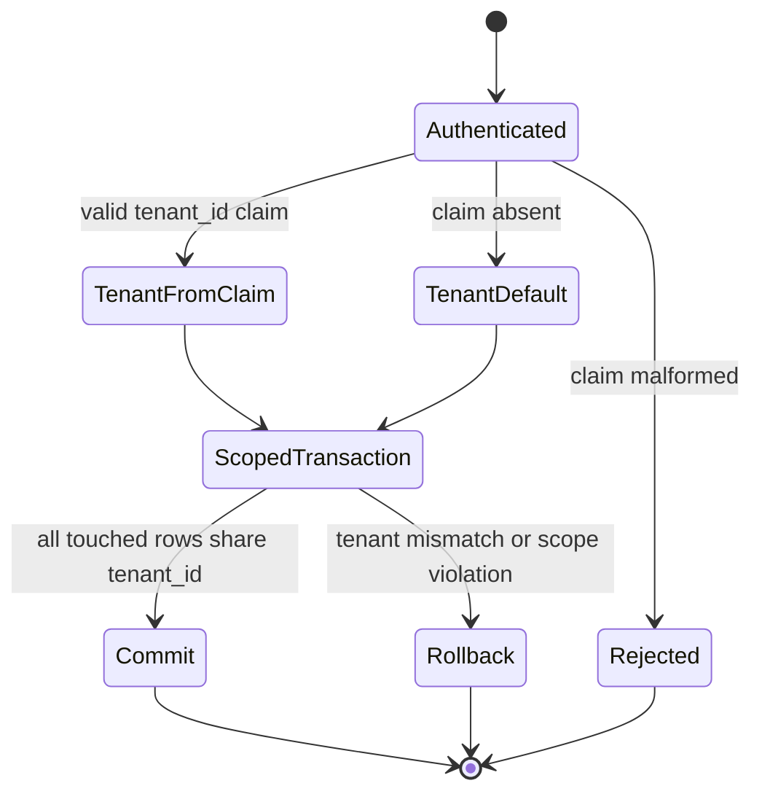
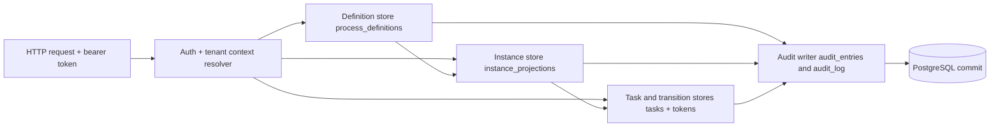

# Module: ADP-02 Tenant Columns on Definition, Instance, Task, Transition, and Audit Persistence

## Module purpose

This design defines the additive multi-tenant storage contract required by ADP-02 for definition, instance, task, transition, and audit persistence while preserving legacy default-tenant behavior. It introduces mandatory `tenant_id` partitioning at schema and query boundaries so every read and write is tenant-scoped by construction, and clients without explicit tenant context continue to operate against the reserved default tenant `00000000-0000-0000-0000-000000000000`.

## Scope and non-goals

- In scope: additive columns, index/uniqueness adjustments, tenant-scoped read/write contracts, deterministic missing-tenant behavior, and traceability to PD-01, PD-07, EE-01, OBS-03.
- In scope: mapping requirement wording to current physical tables.
- Out of scope: auth middleware implementation, token parsing implementation, OIDC provisioning flows, and API route implementation details.

## Table mapping (requirement term -> current schema object)

| Requirement term | Current table(s) in codebase | ADP-02 action |
|---|---|---|
| process definition table | `process_definitions` | add `tenant_id` + tenant-scoped uniqueness/indexing |
| process instance table | `instance_projections` | add `tenant_id` + tenant-scoped uniqueness/indexing |
| task table | `tasks` | add `tenant_id` + tenant-scoped inbox/indexing |
| transition table | `tokens` (execution transition carrier) | add `tenant_id` + tenant-scoped transition lookups |
| audit table | `audit_entries` (OBS-03 canonical), `audit_log` (legacy audit stream) | add `tenant_id` + tenant-scoped audit filters |

## Public interface

### Zig storage contract (design signatures only)

```zig
pub const TenantId = [16]u8; // UUID bytes

pub const TenantScope = struct {
    tenant_id: TenantId,
};

pub const DefinitionLookupArgs = struct {
    tenant_id: TenantId,
    definition_id: Uuid,
};

pub const DefinitionListArgs = struct {
    tenant_id: TenantId,
    status: ?[]const u8,
    name_prefix: ?[]const u8,
    cursor: ?Cursor,
    page_size: u32,
};

pub const StartInstanceArgs = struct {
    tenant_id: TenantId,
    definition_id: Uuid,
    correlation_key: ?[]const u8,
    initial_variables: JsonObject,
    actor_id: Uuid,
};

pub const TaskMutationArgs = struct {
    tenant_id: TenantId,
    task_id: Uuid,
    actor_id: Uuid,
    payload: JsonObject,
};

pub const AuditAppendArgs = struct {
    tenant_id: TenantId,
    actor_id: ?Uuid,
    action: []const u8,
    resource_type: []const u8,
    resource_id: Uuid,
    before_state: ?JsonValue,
    after_state: ?JsonValue,
};

pub fn createDefinition(allocator: std.mem.Allocator, pool: *db.Pool, args: CreateDefinitionArgs) DefinitionStoreError!DefinitionRecord;
pub fn getDefinitionById(allocator: std.mem.Allocator, pool: *db.Pool, args: DefinitionLookupArgs) DefinitionStoreError!?DefinitionRecord;
pub fn listDefinitions(allocator: std.mem.Allocator, pool: *db.Pool, args: DefinitionListArgs) DefinitionStoreError!Paged(DefinitionRecord);

pub fn startInstance(allocator: std.mem.Allocator, pool: *db.Pool, args: StartInstanceArgs) InstanceStoreError!InstanceRecord;
pub fn getInstanceById(allocator: std.mem.Allocator, pool: *db.Pool, tenant_id: TenantId, instance_id: Uuid) InstanceStoreError!?InstanceRecord;

pub fn completeTask(allocator: std.mem.Allocator, pool: *db.Pool, args: TaskMutationArgs) TaskStoreError!TaskRecord;
pub fn appendAuditEntry(allocator: std.mem.Allocator, tx: *db.Tx, args: AuditAppendArgs) AuditStoreError!void;
```

### API tenant-context assumptions to storage contract (no middleware implementation)

```typescript
interface ResolvedTenantContext {
  tenantId: string; // UUID
  source: 'token_claim' | 'default_fallback';
}

interface RequestSecurityContext {
  actorId: string;
  tenant: ResolvedTenantContext;
}
```

Rules:

- Storage entry points require `tenant_id` explicitly and never infer it.
- API/auth boundary resolves tenant before any definition/instance/task/token/audit call:
  - valid `tenant_id` claim -> use claim;
  - missing `tenant_id` claim -> use default tenant;
  - malformed `tenant_id` claim -> reject request before storage.

## Data types and invariants

### New invariants

- Every row in `process_definitions`, `instance_projections`, `tasks`, `tokens`, `audit_entries`, and `audit_log` has non-null `tenant_id`.
- Every tenant-scoped query includes `WHERE tenant_id = $tenant_id` as a mandatory predicate.
- All mutating transactions that touch multiple scoped tables assert a single tenant value across all touched rows.
- A task row and its parent token and instance rows always share the same `tenant_id`.

### Preserved invariants

- Default tenant behavior is unchanged for legacy clients.
- EE-01 correlation uniqueness remains enforced, but partitioned by tenant.
- OBS-03 atomic audit write requirement remains unchanged.

## Migration strategy

## Strategy decision

Chosen strategy: `NOT NULL + DEFAULT default-tenant UUID` on all ADP-02 tables, followed by tenant-aware indexes and uniqueness constraints.

Rationale:

- Additive and backward-compatible for existing data and code paths.
- Deterministic backfill via default value with no nullable tenant ambiguity.
- Supports phased application updates because old callers still read/write default tenant.

## Ordered migration steps (idempotent)

1. Add `tenant_id UUID NOT NULL DEFAULT '00000000-0000-0000-0000-000000000000'` to:
   - `process_definitions`
   - `instance_projections`
   - `tasks`
   - `tokens`
   - `audit_entries`
   - `audit_log`
2. Backfill verification: assert zero rows with null `tenant_id` (expected trivially true under non-null default).
3. Add tenant-aware indexes (see next section).
4. Add tenant-aware uniqueness constraints/indexes; keep old uniques temporarily during cutover where needed.
5. Drop superseded global uniqueness indexes only after tenant-aware read/write code is deployed and verified.

## Index and uniqueness adjustments

### process_definitions

- Replace uniqueness:
  - from `uq_definition_version (name, version)`
  - to `uq_definition_tenant_version (tenant_id, name, version)`
- Replace active-version uniqueness:
  - from `uq_active_definition ON (name) WHERE status = 'ACTIVE'`
  - to `uq_active_definition_tenant ON (tenant_id, name) WHERE status = 'ACTIVE'`
- Add retrieval indexes:
  - `idx_def_tenant_name_status ON process_definitions(tenant_id, name, status)`
  - `idx_def_tenant_created ON process_definitions(tenant_id, created_at DESC)`

### instance_projections

- Replace correlation uniqueness:
  - from `uq_instance_correlation (definition_id, correlation_key) WHERE correlation_key IS NOT NULL`
  - to `uq_instance_tenant_correlation (tenant_id, definition_id, correlation_key) WHERE correlation_key IS NOT NULL`
- Add indexes:
  - `idx_proj_tenant_status ON instance_projections(tenant_id, status)`
  - `idx_proj_tenant_definition ON instance_projections(tenant_id, definition_id)`
  - `idx_proj_tenant_instance ON instance_projections(tenant_id, instance_id)`

### tasks

- Add indexes:
  - `idx_task_tenant_instance ON tasks(tenant_id, instance_id)`
  - `idx_task_tenant_pending_assignee ON tasks(tenant_id, assignee_ref, status) WHERE status = 'PENDING'`
  - `idx_task_tenant_status ON tasks(tenant_id, status)`

### tokens (transition persistence)

- Add indexes:
  - `idx_token_tenant_instance ON tokens(tenant_id, instance_id)`
  - `idx_token_tenant_active ON tokens(tenant_id, instance_id, status) WHERE status = 'active'`
  - `idx_token_tenant_waiting ON tokens(tenant_id, instance_id, gateway_id) WHERE status = 'waiting'`

### audit_entries and audit_log

- Add indexes:
  - `idx_audit_entries_tenant_time ON audit_entries(tenant_id, timestamp DESC, audit_id DESC)`
  - `idx_audit_entries_tenant_resource_time ON audit_entries(tenant_id, resource_type, resource_id, timestamp DESC, audit_id DESC)`
  - `idx_audit_log_tenant_time ON audit_log(tenant_id, occurred_at DESC)`

## Read and filter semantics

### Definition reads (PD-07 extension boundary)

- All definition retrieval and listing queries include tenant predicate first.
- `GET /definitions?name=N&status=ACTIVE` resolves to at most one ACTIVE row per `(tenant_id, name)`.
- Cross-tenant name/version collisions are allowed and isolated.

### Instance start and reads (EE-01 extension boundary)

- Start uses tenant-scoped definition lookup; cannot start against another tenant's definition.
- Correlation-key conflict checks are scoped to `(tenant_id, definition_id, correlation_key)`.
- Instance fetch/list operations are tenant-filtered and return not-found semantics outside scope.

### Task and transition reads/writes

- Task completion/reassignment loads task by `(tenant_id, task_id)`.
- Transition carrier rows (`tokens`) are loaded/joined with the same tenant_id predicate as instance/task.
- Any mismatch between joined tenant IDs is treated as a storage integrity error and transaction is aborted.

### Audit reads/writes (OBS-03 extension boundary)

- Audit writes include `tenant_id` and execute in same transaction as business mutation.
- `GET /audit` filters by tenant before actor/resource/time filters.
- Read-only requests remain non-audited.

## Write-path invariants preventing cross-tenant access

For every state-changing API operation touching ADP-02 tables:

1. Resolve one `tenant_id` at request boundary.
2. Set transaction-local tenant context and pass explicit `tenant_id` to all stores.
3. All lookup predicates include same tenant value.
4. Any missing row under tenant scope yields not-found/forbidden semantics; no fallback to unscoped lookup.
5. If any joined row has differing tenant_id, abort transaction with integrity violation error.

This guarantees no cross-tenant read/write in a single request.

## Deterministic behavior for missing or invalid tenant context

| Case | Boundary | Error/result | Deterministic behavior |
|---|---|---|---|
| No auth token | API auth | 401 Unauthorized | Storage not called |
| Auth token without `tenant_id` | tenant resolver | default tenant fallback | Legacy behavior preserved |
| Auth token with malformed `tenant_id` | tenant resolver | 401/422 auth-validation failure | Storage not called |
| Storage API called without tenant (programming defect) | storage input guard | `MissingTenantContext` | Fail fast, no DB write |
| Scoped lookup misses row | repository/service | not found (404-equivalent) | No existence leak across tenants |
| Mixed-tenant join detected in transaction | repository integrity check | `CrossTenantIntegrityViolation` | Rollback whole transaction |

## Error taxonomy

```zig
pub const TenantScopeError = error{
    MissingTenantContext,
    InvalidTenantContext,
    TenantScopeRequired,
    CrossTenantAccessDenied,
    CrossTenantIntegrityViolation,
};

pub const DefinitionStoreError = TenantScopeError || error{
    DefinitionNotFound,
    DuplicateDefinitionVersion,
    DuplicateActiveDefinition,
    ValidationFailed,
    PoolExhausted,
    DatabaseError,
};

pub const InstanceStoreError = TenantScopeError || error{
    InstanceNotFound,
    DefinitionNotFound,
    CorrelationConflict,
    InvalidInput,
    PoolExhausted,
    DatabaseError,
};

pub const TaskStoreError = TenantScopeError || error{
    TaskNotFound,
    TaskAlreadyTerminal,
    TransitionFailed,
    PoolExhausted,
    DatabaseError,
};

pub const AuditStoreError = TenantScopeError || error{
    AuditWriteFailed,
    PoolExhausted,
    DatabaseError,
};
```

## State transitions (tenant context lifecycle)



## Data flow diagram



## Dependencies

### Calls into

- API auth context contract (tenant already resolved before storage call).
- Definition, instance, task/transition, and audit repositories.
- Migration runner for additive schema/index/constraint changes.

### Must not depend on

- OIDC provider SDK and protocol internals.
- Frontend tenant routing logic.
- Any privileged cross-tenant bypass path not explicitly specified by requirements.

## Traceability matrix

### ADP-02 acceptance mapping

| ADP-02 acceptance criterion | Design coverage |
|---|---|
| Additive `tenant_id` changes and indexing for required tables | Table mapping; Migration strategy; Index and uniqueness adjustments |
| Explicit read/write semantics with default-tenant compatibility | Read and filter semantics; Write-path invariants; deterministic missing-context behavior |
| Cross-tenant isolation invariants for storage/query paths | Write-path invariants; Error taxonomy; state transitions |
| Implementation-ready output with no interpretation gaps | Public interface; ordered migration steps; dependency boundaries |

### Impacted baseline requirements and regression obligations

| Baseline requirement | ADP-02 impact | Regression obligation |
|---|---|---|
| PD-01 Create definition | Definition writes become tenant-scoped; uniqueness changes to per-tenant name+version | Existing default-tenant create behavior and validation remain unchanged; duplicate detection still returns 409 within tenant |
| PD-07 Definition retrieval | Definition list/get/active lookup filtered by tenant_id | Default-tenant list/get outputs remain identical pre/post migration for same dataset |
| EE-01 Start instance | Start path uses tenant-scoped definition lookup and tenant-scoped correlation uniqueness | Default-tenant start and correlation conflict behavior remains unchanged |
| OBS-03 Audit log | Audit rows include tenant_id and are filtered tenant-first on reads | Audit immutability and atomic-write semantics unchanged; default-tenant audit queries return pre-migration-equivalent rows |

### Regression suite obligations (to be implemented later)

1. Default-tenant parity tests for definition CRUD/list and instance start paths.
2. Cross-tenant isolation tests for definition retrieval, task operations, and audit listing.
3. Correlation-key uniqueness tests proving tenant partitioning.
4. Transaction rollback tests proving mixed-tenant joins cannot commit.

## Open questions

1. Requirement text names a "transition table"; current schema stores transition runtime state in `tokens`. Confirm whether ADP-02 acceptance treats `tokens` as the transition table of record, or whether a dedicated transition history table is planned in a later adaptation.
2. Two audit tables currently exist (`audit_entries` and `audit_log`). Confirm whether both remain long-term or if one is scheduled for deprecation so indexing strategy can be narrowed.
3. Confirm final API error mapping for scoped misses (`404` vs `403`) to keep behavior consistent across routes.
