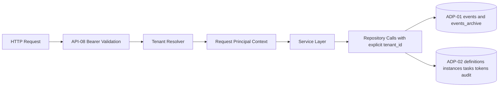
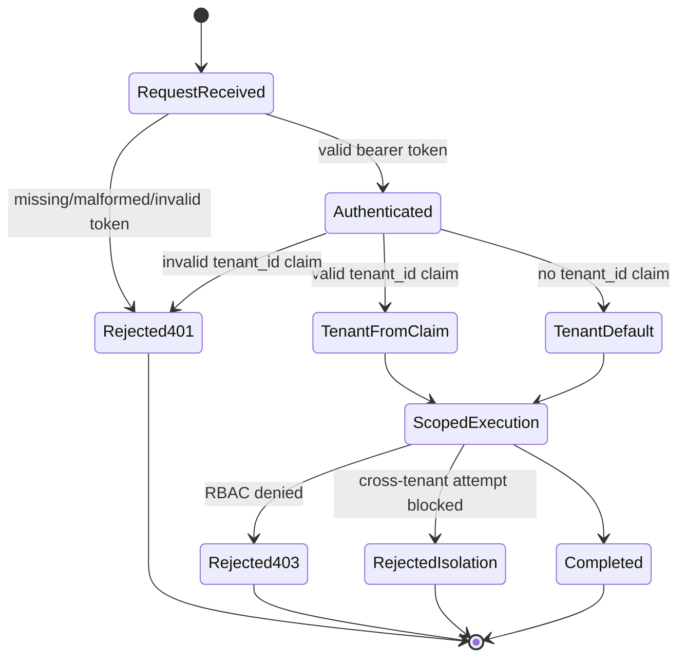

# Module: ADP-03 Tenant Context Resolution on API

## Module purpose

This module defines deterministic tenant context resolution for every authenticated API request, extending API-08 without changing token authentication semantics. It guarantees that tokens without a `tenant_id` claim resolve to the reserved default tenant (`00000000-0000-0000-0000-000000000000`), tokens with a valid `tenant_id` claim are strictly scoped to that tenant, and no request can read or mutate data across tenant boundaries. The design also formalizes how resolved tenant context propagates from middleware to service and persistence/query layers, aligned with ADP-01 and ADP-02 storage constraints.

## Scope and non-goals

- In scope: token-claim resolution semantics, middleware/service contracts, validation and error outcomes, request-lifecycle isolation invariants, and propagation to repositories.
- In scope: compatibility behavior for legacy tokens that do not carry `tenant_id`.
- Out of scope: OIDC provider implementation details, claim minting implementation, SQL/migration implementation, frontend behavior.

## Public interface

### Tenant context types

```zig
pub const TenantContextSource = enum {
    token_claim,
    default_fallback,
};

pub const TenantContext = struct {
    tenant_id: Uuid,
    source: TenantContextSource,
    subject_id: []const u8,
    token_id: []const u8,
};

pub const AuthPrincipal = struct {
    user_id: Uuid,
    roles: []const Role,
    tenant: TenantContext,
};
```

### Middleware boundary contract

```zig
pub const BearerTokenClaims = struct {
    sub: []const u8,
    roles: []const []const u8,
    tenant_id: ?[]const u8,
};

pub fn validateBearerToken(allocator: std.mem.Allocator, raw_header: []const u8) AuthError!BearerTokenClaims;
pub fn resolveTenantContext(claims: BearerTokenClaims) TenantResolutionError!TenantContext;
pub fn injectPrincipal(ctx: *RequestContext, principal: AuthPrincipal) void;
```

Boundary rules:

- `validateBearerToken` remains API-08 compliant and unchanged in auth semantics.
- `resolveTenantContext` is deterministic and side-effect free.
- `injectPrincipal` writes a fully resolved tenant context into request scope before route handlers execute.

### Service/repository boundary contract

```zig
pub const ServiceRequestContext = struct {
    trace_id: []const u8,
    principal: AuthPrincipal,
};

pub fn requireTenant(ctx: ServiceRequestContext) TenantResolutionError!Uuid;
```

Rules for all service/repository entry points:

- Service methods accept `ServiceRequestContext` and must pass `tenant_id` explicitly to repositories.
- Repository methods reject calls without explicit `tenant_id` (`error.MissingTenantContext`).
- No repository method may infer tenant from mutable global state.

## Deterministic tenant resolution semantics

1. Parse and validate bearer token per API-08.
2. Read optional `tenant_id` claim from validated claims.
3. If `tenant_id` claim is absent: resolve to default tenant UUID.
4. If `tenant_id` claim is present: validate UUID syntax and canonical form.
5. If claim is invalid: reject request before any service/repository call.
6. Attach resolved tenant context to request principal.
7. Every downstream lookup and write executes with that single tenant id.

Determinism invariant:

- For a fixed validated token, `resolveTenantContext` always returns the same tenant result.

## Validation and error outcomes

### Error taxonomy

```zig
pub const TenantResolutionError = error{
    MissingAuthorizationHeader,
    MalformedAuthorizationHeader,
    InvalidOrRevokedToken,
    MissingSubjectClaim,
    InvalidTenantClaimFormat,
    MissingTenantContext,
    CrossTenantOperationBlocked,
};
```

### HTTP mapping and boundaries

| Failure case | Detection boundary | HTTP result | Side-effect rule |
|---|---|---|---|
| Missing Authorization header | auth middleware | 401 + `WWW-Authenticate: Bearer` | no service call |
| Malformed bearer header | auth middleware | 401 | no service call |
| Unknown/revoked token | auth middleware | 401 | no service call |
| Valid token, insufficient role | RBAC middleware | 403 | no service call |
| Valid token, no `tenant_id` claim | tenant resolver | continue with default tenant | normal flow |
| Valid token, invalid `tenant_id` value | tenant resolver | 401 (token claim invalid) | no service call |
| Attempt to combine entities from different tenants in one request | service/repository guards | 404-equivalent not found or 409 domain integrity (implementation choice by route contract) | rollback / no cross-tenant commit |

Notes:

- Invalid tenant claim is treated as authentication failure because claim validation is part of token trust evaluation.
- Missing tenant claim is not an error by ADP-03 compatibility requirement; it maps to default tenant.

## Request lifecycle isolation invariants

1. A request has exactly one resolved `tenant_id`.
2. All repository predicates include `tenant_id` as a mandatory filter.
3. Any resource ID that exists in another tenant is non-observable to the current request scope.
4. Multi-step operations (read-modify-write) must use the same `tenant_id` for all touched rows.
5. A request cannot switch tenant context mid-flight.

## Propagation to persistence and query layers

### Required propagation path



### Storage constraints consumed from ADP-01 and ADP-02

- ADP-01: `events` and `events_archive` require `tenant_id UUID NOT NULL` with default-tenant backfill.
- ADP-02: `process_definitions`, `instance_projections`, `tasks`, `tokens`, `audit_entries`/`audit_log` require `tenant_id UUID NOT NULL` with default-tenant backfill.
- ADP-01 and ADP-02 tenant-aware indexes/uniqueness are assumed by this API design; API must always supply tenant context so those constraints are exercised predictably.

## State transitions



## Middleware and service boundary responsibilities

- Auth middleware:
  - validates bearer token and extracts claims.
  - rejects invalid token structures and signatures.
- Tenant resolver middleware:
  - resolves deterministic tenant context from claims.
  - applies default fallback when claim absent.
  - rejects malformed claim values.
- RBAC middleware:
  - enforces role permissions within resolved tenant scope.
- Service layer:
  - accepts resolved tenant context only from middleware.
  - enforces same-tenant invariants for composed operations.
- Repository layer:
  - requires explicit tenant argument in all methods.
  - executes tenant-filtered queries and tenant-consistent writes.

## Dependencies

### Calls into

- API authentication middleware defined by API-08.
- OIDC/Internal token claim provider contract (claim presence and trust model).
- Persistence modules constrained by ADP-01 and ADP-02.

### Must not depend on

- Client-supplied tenant parameters in request body/query/path for authoritative tenant selection.
- Frontend/session storage state for tenant resolution.
- Any cross-tenant super-query path not explicitly specified by a separate requirement.

## Open questions

1. When a cross-tenant resource ID is provided, should all routes uniformly return 404 (non-disclosure) or allow selected domain conflicts as 409 where existing API contracts already expose state conflicts? Current design permits either, but route-level standardization is still needed.
2. Should malformed `tenant_id` claim always map to 401, or can 422 be used when token is otherwise valid but claim format is wrong? ADP-03 and API-08 compatibility suggest 401, but explicit API error policy should confirm.

## Traceability matrix

### Primary requirement traceability

| Requirement | Design coverage |
|---|---|
| ADP-03: token without `tenant_id` resolves to default tenant | Deterministic tenant resolution semantics; Validation and error outcomes |
| ADP-03: token with `tenant_id` scopes all operations | Request lifecycle isolation invariants; Propagation to persistence/query layers |
| ADP-03: no cross-tenant operation within a request | Request lifecycle isolation invariants; State transitions |
| API-08: bearer auth semantics preserved | Middleware boundary contract; Validation and error outcomes |
| OIDC-13: `tenant_id` claim comes from IdP and is not client overrideable | Dependencies; Middleware/service boundary responsibilities |

### Impacted storage requirements traceability

| Requirement | Impact in this design | Regression obligations |
|---|---|---|
| ADP-01 | API always supplies resolved tenant for event append/read paths | Tenant-scoped event visibility tests and default-tenant parity tests |
| ADP-02 | API always supplies resolved tenant for definitions/instances/tasks/tokens/audit paths | Tenant isolation tests for all listed tables and default-tenant behavior parity |

### Handoff acceptance criteria mapping

| Handoff acceptance criterion | Covered section |
|---|---|
| Deterministic tenant resolution rules with and without claim | Deterministic tenant resolution semantics |
| Explicit and testable cross-tenant lifecycle invariants | Request lifecycle isolation invariants; State transitions |
| Validation and error boundaries for invalid tenant context | Validation and error outcomes |
| Explicit traceability to API-08, OIDC-13, ADP-01, ADP-02 | Traceability matrix |
| Implementation-ready design for BACKEND-DEV | Public interface; boundary responsibilities; propagation path |
