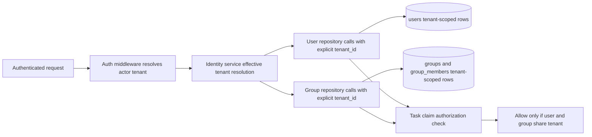
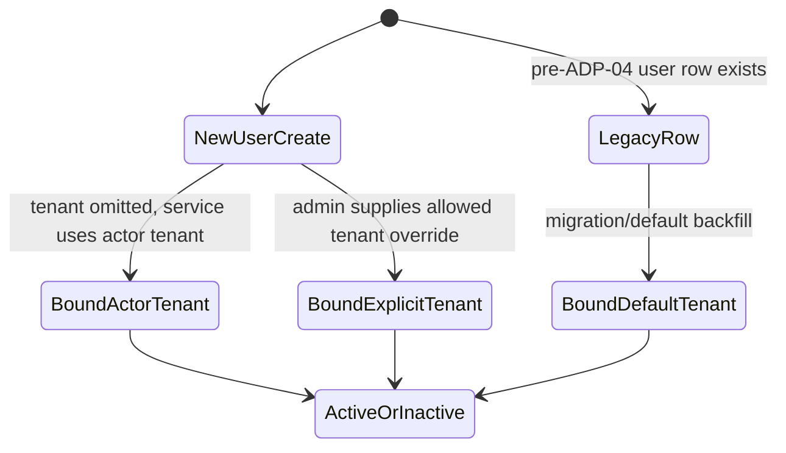
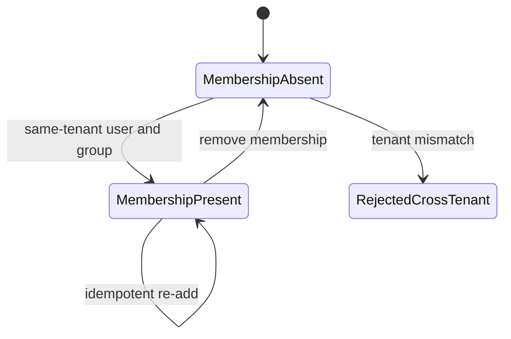

# Module: ADP-04 User Tenant Binding

## Module purpose

This design defines additive tenant binding for identity users so every user record is bound to exactly one tenant while preserving existing IDN-01 and IDN-02 behavior for legacy data. The module introduces `users.tenant_id UUID NOT NULL` with default-tenant backfill, formalizes single-tenant membership invariants, and updates identity service/repository contracts to make tenant-scoped reads and writes explicit and non-bypassable. The design also defines boundaries that prevent cross-tenant leakage in user and group operations.

## Scope and non-goals

- In scope: user schema adaptation semantics, backfill behavior, single-tenant user invariants, identity service/repository contract updates, and cross-tenant isolation boundaries for user/group flows.
- In scope: compatibility constraints for IDN-01 and IDN-02, and traceability alignment with ADP-02 tenant-column patterns.
- Out of scope: implementation code, SQL file content, OIDC runtime flows (covered by ADP-04a/ADP-04b and OIDC-* requirements), and frontend behavior.

## ADP-02 tenant column pattern traceability

ADP-04 uses the same additive storage pattern defined by ADP-02:

1. Add `tenant_id UUID NOT NULL DEFAULT '00000000-0000-0000-0000-000000000000'`.
2. Preserve default-tenant behavior for pre-existing rows.
3. Require explicit tenant context in repository/service boundaries.
4. Ensure tenant appears in mandatory predicates and uniqueness constraints where cross-tenant collisions are possible.

This keeps Stage 6.5 tenant isolation behavior consistent across identity and non-identity tables.

## Public interface

### Core types

```zig
pub const TenantId = [16]u8; // UUID bytes

pub const UserStatus = enum {
    ACTIVE,
    INACTIVE,
};

pub const AuthSource = enum {
    internal,
    oidc,
};

pub const User = struct {
    user_id: [16]u8,
    tenant_id: TenantId,
    username: []const u8,
    display_name: []const u8,
    email: []const u8,
    status: UserStatus,
    auth_source: AuthSource,
    external_id: ?[]const u8,
    external_realm: ?[]const u8,
    created_at_us: i64,
};

pub const Group = struct {
    group_id: [16]u8,
    tenant_id: TenantId,
    name: []const u8,
    created_at_us: i64,
};

pub const GroupMembership = struct {
    group_id: [16]u8,
    user_id: [16]u8,
    tenant_id: TenantId,
    added_at_us: i64,
};
```

### Service boundary contract

```zig
pub const IdentityRequestContext = struct {
    actor_user_id: [16]u8,
    actor_tenant_id: TenantId,
    actor_roles: []const Role,
    trace_id: []const u8,
};

pub const CreateUserInput = struct {
    tenant_id: ?TenantId, // optional at API edge, defaults to actor tenant in service
    username: []const u8,
    display_name: []const u8,
    email: []const u8,
    status: UserStatus,
};

pub const AddGroupMemberInput = struct {
    group_id: [16]u8,
    user_id: [16]u8,
};

pub fn createUser(
    allocator: std.mem.Allocator,
    ctx: IdentityRequestContext,
    input: CreateUserInput,
) IdentityError!User;

pub fn getUserById(
    allocator: std.mem.Allocator,
    ctx: IdentityRequestContext,
    user_id: [16]u8,
) IdentityError!?User;

pub fn listUsers(
    allocator: std.mem.Allocator,
    ctx: IdentityRequestContext,
    cursor: ?Cursor,
    page_size: u32,
) IdentityError!Paged(User);

pub fn addGroupMember(
    allocator: std.mem.Allocator,
    ctx: IdentityRequestContext,
    input: AddGroupMemberInput,
) IdentityError!struct { membership: GroupMembership, created: bool };

pub fn canClaimGroupTask(
    allocator: std.mem.Allocator,
    ctx: IdentityRequestContext,
    group_id: [16]u8,
    user_id: [16]u8,
) IdentityError!bool;
```

Service rules:

- The service resolves an effective tenant exactly once per request.
- If `CreateUserInput.tenant_id` is absent, the service uses `ctx.actor_tenant_id`.
- Non-platform-admin callers cannot override tenant assignment.
- All reads and writes are delegated with explicit tenant_id arguments.

### Repository boundary contract

```zig
pub const UserCreateRow = struct {
    tenant_id: TenantId,
    username: []const u8,
    display_name: []const u8,
    email: []const u8,
    status: UserStatus,
    auth_source: AuthSource,
};

pub fn insertUser(
    allocator: std.mem.Allocator,
    pool: *db.Pool,
    row: UserCreateRow,
) IdentityRepoError!User;

pub fn selectUserById(
    allocator: std.mem.Allocator,
    pool: *db.Pool,
    tenant_id: TenantId,
    user_id: [16]u8,
) IdentityRepoError!?User;

pub fn listUsersByTenant(
    allocator: std.mem.Allocator,
    pool: *db.Pool,
    tenant_id: TenantId,
    cursor: ?Cursor,
    page_size: u32,
) IdentityRepoError!Paged(User);

pub fn insertGroupMembership(
    allocator: std.mem.Allocator,
    pool: *db.Pool,
    tenant_id: TenantId,
    group_id: [16]u8,
    user_id: [16]u8,
) IdentityRepoError!struct { created: bool, row: GroupMembership };
```

Repository rules:

- Every function requires tenant context in parameters.
- Every identity query predicate includes tenant scope.
- Cross-tenant joins are forbidden; joins must include tenant equality in join clauses.

## Data model and migration/backfill semantics

### Additive schema requirement

- `users` gains `tenant_id UUID NOT NULL DEFAULT '00000000-0000-0000-0000-000000000000'`.
- Existing rows are backfilled automatically by default value semantics.
- New inserts must persist an explicit tenant_id at write time.

### Index and constraint guidance

- Add tenant-filter index for user lookup/list paths:
  - `idx_users_tenant_status_created` on `(tenant_id, status, created_at DESC)`.
- Preserve global username uniqueness for compatibility unless a separate requirement changes it.
- Enforce same-tenant membership semantics at join table level using tenant-aware constraints:
  - group-membership write path must assert `groups.tenant_id = users.tenant_id`.

### Pre-existing user compatibility behavior

- All users that existed before ADP-04 are assigned to default tenant.
- Their authentication and API behavior remains unchanged because requests without tenant claim still resolve to default tenant.
- Existing tokens continue to authenticate those users under default-tenant scope.

## Single-tenant membership semantics and invariants

1. Each user row has exactly one tenant binding (`users.tenant_id` non-null, singular).
2. A user cannot be associated with groups in another tenant.
3. Group membership rows must be same-tenant triads: `(group_id, user_id, tenant_id)` where tenant matches both parent entities.
4. Group-task claim eligibility is evaluated within one tenant context only.
5. If the same human needs access to multiple tenants, separate user rows are required (one user row per tenant).

These invariants are testable via repository-level and integration tests.

## Data flow diagram



## State transitions

### User tenant-binding lifecycle



### Group membership tenant integrity



## Error taxonomy

```zig
pub const IdentityError = error{
    MissingTenantContext,
    InvalidTenantContext,
    TenantOverrideForbidden,
    CrossTenantUserAccessDenied,
    CrossTenantGroupAccessDenied,
    CrossTenantMembershipDenied,
    UserNotFound,
    GroupNotFound,
    DuplicateUsername,
    ValidationFailed,
    PoolExhausted,
    DatabaseError,
};
```

### Error outcome mapping

| Condition | Error | Boundary outcome |
|---|---|---|
| request has no resolved tenant context | `MissingTenantContext` | fail before repository call |
| explicit tenant override by non-admin | `TenantOverrideForbidden` | reject write |
| user lookup outside tenant scope | `CrossTenantUserAccessDenied` or not-found semantics | no disclosure of foreign-tenant record |
| membership add where group/user tenant mismatch | `CrossTenantMembershipDenied` | no row written |
| group-task claim by user from different tenant | `CrossTenantGroupAccessDenied` | authorization denied |

## Compatibility constraints

### IDN-01 compatibility constraints

1. Existing user records remain valid and authenticatable after migration (default tenant binding).
2. Username uniqueness and existing status lifecycle behavior remain unchanged by ADP-04.
3. IDN-01 user CRUD remains additive; tenant scoping constrains visibility, not validity of legacy users.

### IDN-02 compatibility constraints

1. Group creation and membership semantics remain intact within a tenant.
2. Group assignment checks now require tenant consistency between actor, group, and candidate user.
3. Existing default-tenant groups/users continue to function unchanged post-migration.

## Cross-tenant leakage prevention boundaries

1. API/service layer never accepts tenant from untrusted payload for read scope; tenant source is authenticated context.
2. Repository layer requires explicit tenant parameter and uses tenant predicate in every identity query.
3. Membership joins and task-claim checks include tenant equality predicates, preventing accidental cross-tenant joins.
4. Not-found/non-disclosure semantics are used for foreign-tenant resource IDs where route contracts require secrecy.
5. No fallback to unscoped lookup is allowed after scoped lookup miss.

## Dependencies

### Calls into

- `src/api/middleware/auth.zig` for resolved actor tenant context.
- `src/identity/service.zig` for tenant-aware identity domain rules.
- `src/identity/registry.zig` for tenant-scoped persistence.
- `src/tasks/manager.zig` for group-task authorization checks that consume tenant-aware membership.

### Must not depend on

- Frontend-provided tenant selectors as authoritative source.
- Cross-tenant admin bypass logic not specified by a requirement.
- Any global, unscoped user/group query path.

## Traceability matrix

### Primary requirement mapping

| Requirement | Design coverage |
|---|---|
| ADP-04: `users.tenant_id` additive + default backfill | Data model and migration/backfill semantics |
| ADP-04: single-tenant user membership | Single-tenant membership semantics and invariants |
| ADP-04: pre-existing users remain valid in default tenant | Pre-existing user compatibility behavior; IDN-01 compatibility constraints |
| IDN-01 compatibility | Compatibility constraints (IDN-01); service/repository contracts |
| IDN-02 compatibility | Compatibility constraints (IDN-02); cross-tenant leakage boundaries |
| ADP-02 pattern alignment | ADP-02 tenant column pattern traceability |

### Handoff acceptance criteria mapping

| Handoff criterion | Covered section |
|---|---|
| Schema and migration semantics for `users.tenant_id` with default-tenant compatibility | Data model and migration/backfill semantics |
| Single-tenant membership invariants explicit and testable | Single-tenant membership semantics and invariants |
| Identity repository/service contract changes implementation-ready | Public interface |
| Cross-tenant isolation expectations clearly specified | Cross-tenant leakage prevention boundaries; Error taxonomy |
| Traceability to IDN-01, IDN-02, ADP-02 | Compatibility constraints; ADP-02 tenant column pattern traceability; traceability matrix |

## Open questions

1. Should username uniqueness remain global or become `(tenant_id, username)` scoped in a future adaptation? Current design preserves existing global uniqueness for strict backward compatibility.
2. For foreign-tenant resource probes, should all identity routes standardize on 404 non-disclosure, or allow 403 for some mutation endpoints? Route-level standardization is still needed.
3. Should group table itself gain a persisted `tenant_id` if not already present in current schema variant, or is tenant derivation from memberships currently relied on? This design assumes explicit group tenant binding for robust isolation.