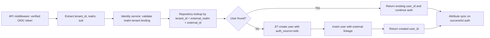
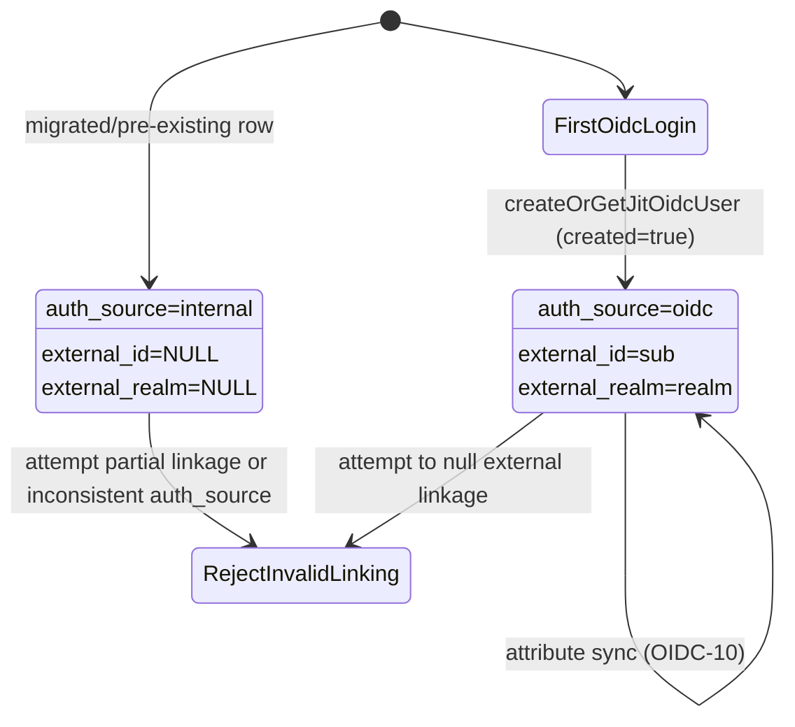

# Module: ADP-04a External Identity Linkage on User

## Module purpose

This design extends the IDN-01 user registry with additive external identity linkage fields so OIDC-authenticated users can be resolved by stable external identity while preserving existing internal-user behavior. It specifies schema semantics for `external_id`, `external_realm`, and `auth_source`, migration/backfill behavior for pre-existing users, and repository/service lookup contracts used by OIDC-09 JIT provisioning and OIDC-11 identity stability, with explicit boundaries that prevent cross-tenant identity collisions.

## Scope and non-goals

- In scope: additive user schema updates, uniqueness and NULL-handling semantics, migration/backfill behavior, and service/repository contracts for `(external_realm, external_id)` lookup.
- In scope: compatibility constraints that preserve IDN-01 internal-user flows and username-based administration.
- In scope: identity-collision boundaries across tenant and realm contexts.
- Out of scope: implementation code, SQL migration files, token verification logic, and frontend behavior.

## Public interface

### Core data types

```zig
pub const AuthSource = enum {
    internal,
    oidc,
};

pub const User = struct {
    user_id: [16]u8,
    tenant_id: [16]u8,
    username: []const u8,
    display_name: []const u8,
    email: []const u8,
    status: UserStatus,
    auth_source: AuthSource,
    external_id: ?[]const u8,
    external_realm: ?[]const u8,
    created_at_us: i64,
};

pub const ExternalIdentityRef = struct {
    tenant_id: [16]u8,
    external_realm: []const u8,
    external_id: []const u8,
};
```

### Service boundary contracts (identity + OIDC integration)

```zig
pub const ProvisionExternalUserInput = struct {
    tenant_id: [16]u8,
    external_realm: []const u8,
    external_id: []const u8, // OIDC sub
    preferred_username: []const u8,
    display_name: []const u8,
    email: []const u8,
};

pub const ResolveExternalUserInput = struct {
    tenant_id: [16]u8,
    external_realm: []const u8,
    external_id: []const u8,
};

pub fn resolveUserByExternalIdentity(
    allocator: std.mem.Allocator,
    input: ResolveExternalUserInput,
) IdentityServiceError!?User;

pub fn createOrGetJitOidcUser(
    allocator: std.mem.Allocator,
    input: ProvisionExternalUserInput,
) IdentityServiceError!struct {
    user: User,
    created: bool,
};

pub fn updateExternalUserAttributes(
    allocator: std.mem.Allocator,
    input: struct {
        user_id: [16]u8,
        tenant_id: [16]u8,
        display_name: []const u8,
        email: []const u8,
        status: UserStatus,
    },
) IdentityServiceError!User;
```

Service rules:

- `resolveUserByExternalIdentity` is the authoritative lookup for OIDC subjects and requires all three coordinates: `tenant_id`, `external_realm`, and `external_id`.
- `createOrGetJitOidcUser` is idempotent for the same `(external_realm, external_id)` and returns the existing user if already present.
- OIDC-created users must have `auth_source = .oidc` and non-NULL external linkage fields.
- IDN-01 internal users remain valid with `auth_source = .internal`, `external_id = null`, `external_realm = null`.

### Repository boundary contracts

```zig
pub fn selectUserByExternalIdentity(
    allocator: std.mem.Allocator,
    pool: *db.Pool,
    identity: ExternalIdentityRef,
) IdentityRepoError!?User;

pub fn insertOidcUser(
    allocator: std.mem.Allocator,
    pool: *db.Pool,
    row: struct {
        tenant_id: [16]u8,
        username: []const u8,
        display_name: []const u8,
        email: []const u8,
        status: UserStatus,
        auth_source: AuthSource,
        external_realm: []const u8,
        external_id: []const u8,
    },
) IdentityRepoError!User;

pub fn upsertOidcUserByExternalIdentity(
    allocator: std.mem.Allocator,
    pool: *db.Pool,
    row: struct {
        tenant_id: [16]u8,
        external_realm: []const u8,
        external_id: []const u8,
        username: []const u8,
        display_name: []const u8,
        email: []const u8,
        status: UserStatus,
    },
) IdentityRepoError!struct {
    user: User,
    created: bool,
};
```

Repository rules:

- All external-identity queries must include `tenant_id` predicate in addition to `(external_realm, external_id)`.
- Repository write paths enforce consistency between `auth_source` and external linkage:
  - `auth_source = oidc` -> `external_realm` and `external_id` are both non-NULL/non-empty.
  - `auth_source = internal` -> both external fields are NULL.
- Username uniqueness behavior remains as defined by IDN-01; ADP-04a does not change username semantics.

## Data model and migration/backfill semantics

### Additive schema updates

`users` gains:

- `external_id TEXT NULL` (OIDC `sub`)
- `external_realm TEXT NULL` (realm/issuer identifier)
- `auth_source TEXT NOT NULL DEFAULT 'internal'` with allowed values `internal | oidc`

### Unique index semantics

- Add unique index on `(external_realm, external_id)` for linked external identities.
- NULL behavior:
  - Multiple internal rows with `(NULL, NULL)` are allowed.
  - Rows with populated `external_id` must have populated `external_realm` and must be unique by pair.
- Recommended implementation form for uniqueness to avoid NULL-collision edge cases:
  - Unique index over `(external_realm, external_id)` filtered to rows where `external_id IS NOT NULL`.

### Backfill and compatibility behavior

- Existing rows remain valid without rewrite of existing IDN-01 fields.
- Existing users default to `auth_source = 'internal'` and retain `external_id = NULL`, `external_realm = NULL`.
- No existing internal user should be converted to OIDC source during migration.
- Post-migration invariants are testable:
  - Count of users before and after migration is unchanged.
  - All pre-existing users satisfy internal-source linkage shape.

## Cross-tenant collision boundaries

To prevent cross-tenant identity collisions and mis-binding:

1. Realm ownership is tenant-scoped by OIDC-12/ADP-04b (`tenant.idp_realm_id`), and external lookup must verify that `external_realm` maps to the current request tenant.
2. Identity resolution requires tenant context and does not allow global `(realm, sub)` lookup without tenant scoping.
3. Service contracts reject provisioning if the incoming token tenant context does not match the tenant bound to `external_realm`.
4. No fallback to username/email matching is allowed when `(external_realm, external_id)` lookup misses; this prevents accidental account takeover across tenants.

## Data flow diagram



## State transitions



## Error taxonomy

```zig
pub const IdentityServiceError = error{
    MissingTenantContext,
    MissingExternalRealm,
    MissingExternalId,
    ExternalIdentityLookupMismatch,
    RealmTenantBindingMismatch,
    ExternalIdentityAlreadyLinked,
    InvalidAuthSourceValue,
    InvalidExternalLinkageShape,
    UsernameConflict,
    PersistenceFailure,
};

pub const IdentityRepoError = error{
    DuplicateExternalIdentity,
    DuplicateUsername,
    ConstraintViolation,
    QueryFailed,
    TransactionFailed,
};
```

Error semantics:

- `DuplicateExternalIdentity`: unique index conflict on `(external_realm, external_id)`.
- `InvalidExternalLinkageShape`: invalid NULL/value combination for auth source.
- `RealmTenantBindingMismatch`: realm is known but does not belong to token tenant.
- `ExternalIdentityLookupMismatch`: lookup attempted without complete identity coordinates.

## Dependencies

Calls or relies on:

- `src/identity/registry.zig` for user repository and service orchestration.
- `migrations/` for additive schema update and index creation.
- Tenant-realm mapping introduced by ADP-04b / OIDC-12.
- OIDC identity extraction pipeline (OIDC-08) and JIT flow (OIDC-09).

Must not depend on:

- `src/engine/transition.zig` (pure execution engine boundary).
- Frontend modules under `web/src/`.
- API-token-only assumptions from IDN-04 for external user resolution.

## Key invariants

1. Internal users: `auth_source='internal'` and both external fields are NULL.
2. OIDC users: `auth_source='oidc'` and both external fields are present.
3. `(external_realm, external_id)` identifies at most one local user.
4. OIDC-11 stability: identity key is realm + sub; email/username changes do not change `user_id`.
5. IDN-01 compatibility: existing internal user CRUD and token checks remain valid.

## Traceability map

| Requirement | Designed behavior |
|---|---|
| ADP-04a | Additive columns, auth source enum semantics, unique external identity lookup |
| IDN-01 | Preserve internal user model and existing user operations |
| OIDC-09 | JIT create-or-get contract using `(external_realm, external_id)` |
| OIDC-11 | Stable identity key behavior independent of mutable profile claims |

## Open questions

- OQ-1: Should cross-tenant uniqueness be enforced solely via realm ownership (OIDC-12/ADP-04b), or should a tenant-scoped unique constraint variant also be introduced in a later adaptation for defense in depth?
- OQ-2: Should `external_realm` store provider issuer URL, realm slug, or an internal canonical realm ID when multiple OIDC providers are enabled?
- OQ-3: For coexistence period (OIDC-33), is conversion from internal to OIDC linkage ever allowed for existing users, or is it permanently prohibited?
