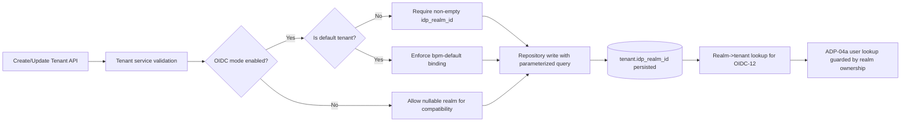
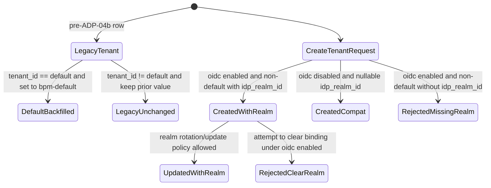

# Module: ADP-04b Tenant Realm Binding

## Module purpose

This design adds tenant-to-realm binding metadata to support OIDC tenant isolation without breaking existing default-tenant behavior. It defines additive schema semantics for `tenant.idp_realm_id`, migration/backfill behavior that assigns `bpm-default` only to the reserved default tenant, and tenant service/repository contracts that enforce realm presence for non-default tenant creation when OIDC mode is enabled. It also defines invariants connecting tenant realm ownership (OIDC-12/OIDC-14) to user external identity linkage (ADP-04a).

## Scope and non-goals

- In scope: ADP-04b schema semantics, backfill behavior, tenant create/update validation rules, service/repository contracts, and realm ownership invariants.
- In scope: traceability to ADP-04, ADP-04a, OIDC-12, and OIDC-14.
- Out of scope: SQL implementation, adapter implementation details, and frontend UX.

## Public interface

### Core types

```zig
pub const DEFAULT_TENANT_ID: [16]u8 = std.mem.bytesToValue([16]u8, [_]u8{
    0x00, 0x00, 0x00, 0x00,
    0x00, 0x00,
    0x00, 0x00,
    0x00, 0x00,
    0x00, 0x00, 0x00, 0x00, 0x00, 0x00,
});

pub const RealmBinding = struct {
    tenant_id: [16]u8,
    idp_realm_id: ?[]const u8,
};

pub const Tenant = struct {
    tenant_id: [16]u8,
    slug: []const u8,
    display_name: []const u8,
    status: TenantStatus,
    idp_realm_id: ?[]const u8,
    created_at_us: i64,
};

pub const CreateTenantInput = struct {
    slug: []const u8,
    display_name: []const u8,
    idp_realm_id: ?[]const u8,
};

pub const UpdateTenantInput = struct {
    tenant_id: [16]u8,
    display_name: ?[]const u8,
    idp_realm_id: ?[]const u8,
};

pub const OidcMode = enum {
    disabled,
    enabled,
};
```

### Service boundary contracts

```zig
pub fn createTenant(
    allocator: std.mem.Allocator,
    actor: AuthPrincipal,
    oidc_mode: OidcMode,
    input: CreateTenantInput,
) TenantServiceError!Tenant;

pub fn updateTenant(
    allocator: std.mem.Allocator,
    actor: AuthPrincipal,
    oidc_mode: OidcMode,
    input: UpdateTenantInput,
) TenantServiceError!Tenant;

pub fn getTenantByRealmId(
    allocator: std.mem.Allocator,
    actor: AuthPrincipal,
    realm_id: []const u8,
) TenantServiceError!?Tenant;

pub fn assertRealmOwnedByTenant(
    allocator: std.mem.Allocator,
    tenant_id: [16]u8,
    external_realm: []const u8,
) TenantServiceError!void;
```

Service rules:

- If `oidc_mode == .enabled` and `tenant_id != DEFAULT_TENANT_ID`, `idp_realm_id` is required at create time.
- Default tenant creation/bootstrap remains valid with `idp_realm_id = "bpm-default"`.
- `updateTenant` rejects clearing `idp_realm_id` for non-default tenants in OIDC-enabled mode.
- `assertRealmOwnedByTenant` is called by ADP-04a external identity resolution paths before `(external_realm, external_id)` user lookup.

### Repository boundary contracts

```zig
pub fn insertTenant(
    allocator: std.mem.Allocator,
    pool: *db.Pool,
    row: struct {
        tenant_id: [16]u8,
        slug: []const u8,
        display_name: []const u8,
        status: TenantStatus,
        idp_realm_id: ?[]const u8,
    },
) TenantRepoError!Tenant;

pub fn updateTenantRealmBinding(
    allocator: std.mem.Allocator,
    pool: *db.Pool,
    tenant_id: [16]u8,
    idp_realm_id: []const u8,
) TenantRepoError!Tenant;

pub fn selectTenantByRealmId(
    allocator: std.mem.Allocator,
    pool: *db.Pool,
    idp_realm_id: []const u8,
) TenantRepoError!?Tenant;

pub fn selectRealmBindingByTenantId(
    allocator: std.mem.Allocator,
    pool: *db.Pool,
    tenant_id: [16]u8,
) TenantRepoError!?RealmBinding;
```

Repository rules:

- Realm lookup is exact-match and case-sensitive for provider identifier fidelity.
- Realm-binding writes are parameterized and transactional with tenant create/update operations.
- Duplicate realm binding across tenants is rejected with a repository-level conflict error.

## Data model and migration/backfill semantics

### Additive schema requirement

- `tenant` gains `idp_realm_id TEXT NULL`.
- Existing rows are preserved; no row deletion or tenant_id rewrite.
- Backfill only the reserved default tenant row:
  - `tenant.id = '00000000-0000-0000-0000-000000000000'` -> `idp_realm_id = 'bpm-default'`.

### Backfill constraints

1. Backfill must be idempotent and safe to re-run.
2. Backfill must not overwrite non-null `idp_realm_id` values.
3. Backfill must not mutate non-default tenant rows.
4. Migration success criteria include row-count stability before/after update.

### Forward constraints (OIDC-enabled mode)

- Non-default tenant insert requires non-empty `idp_realm_id`.
- Non-default tenant update cannot set `idp_realm_id` to NULL/empty.
- Default tenant remains pinned to `bpm-default` unless explicit platform-admin realm migration policy is introduced in a separate requirement.

## Data flow diagram



## State transitions



## Error taxonomy

```zig
pub const TenantServiceError = error{
    MissingRealmBinding,
    InvalidRealmBinding,
    DefaultTenantRealmMismatch,
    RealmBindingImmutable,
    RealmAlreadyBound,
    RealmTenantLookupNotFound,
    RealmOwnershipMismatch,
    ValidationFailed,
    Unauthorized,
    PersistenceFailure,
};

pub const TenantRepoError = error{
    DuplicateRealmBinding,
    ConstraintViolation,
    NotFound,
    QueryFailed,
    TransactionFailed,
};
```

Error semantics:

- `MissingRealmBinding`: non-default tenant create/update in OIDC-enabled mode with null/empty `idp_realm_id`.
- `DefaultTenantRealmMismatch`: default tenant set to value other than `bpm-default` in normal operations.
- `RealmAlreadyBound`: attempted bind to realm already owned by another tenant (OIDC-12 one-to-one invariant).
- `RealmOwnershipMismatch`: ADP-04a flow receives token/user external realm that does not match the tenant's bound realm.

## Key invariants

1. OIDC-12 one-to-one binding: each tenant has at most one active `idp_realm_id`, each realm id maps to at most one tenant.
2. Default tenant invariant: `DEFAULT_TENANT_ID` is bound to `bpm-default` after migration.
3. OIDC-enabled non-default tenants must have non-null/non-empty `idp_realm_id`.
4. ADP-04a linkage safety: external identity lookup by `(external_realm, external_id)` is valid only if `external_realm == tenant.idp_realm_id` for request tenant.
5. OIDC-14 lifecycle alignment: tenant creation success requires that provider realm provisioning and local realm binding are committed consistently from API perspective.

## Dependencies

Calls or relies on:

- `src/identity/registry.zig` and ADP-04a service flows for external realm ownership checks.
- Tenant persistence module/repository (tenant create/update/get operations).
- OIDC adapter provisioning contract (OIDC-14) for realm creation and mapper setup.
- Configuration source that determines whether OIDC mode is enabled.

Must not depend on:

- Frontend state or client-provided realm ownership assertions.
- `src/engine/transition.zig` (no engine coupling).
- Non-parameterized SQL behavior.

## Concrete testability notes

1. Migration regression: after migration, default tenant row has `idp_realm_id='bpm-default'` and non-default rows are unchanged.
2. Migration idempotency: running migration twice leaves the same row values and count.
3. OIDC-enabled create rule: creating non-default tenant without `idp_realm_id` returns validation failure.
4. OIDC-disabled compatibility: creating tenant without `idp_realm_id` remains allowed before OIDC enablement.
5. Realm uniqueness: binding duplicate `idp_realm_id` across two tenants returns conflict.
6. ADP-04a guard: user lookup/provision flow fails when token realm does not equal bound tenant realm.
7. OIDC-14 coupling: tenant create flow fails atomically if provider realm provisioning fails before persistence commit.

## Traceability map

| Requirement | Designed behavior |
|---|---|
| ADP-04 | Builds on tenant table introduced by ADP-04 and preserves default-tenant continuity |
| ADP-04b | Adds `tenant.idp_realm_id`, migration backfill for default tenant, and OIDC-enabled create/update rules |
| ADP-04a | Enforces realm ownership precondition before `(external_realm, external_id)` identity flows |
| OIDC-12 | Realm-to-tenant binding and lookup-by-realm contract |
| OIDC-14 | Provisioning lifecycle coupling between tenant create and provider realm provisioning |

## Open questions

- OQ-1: Should realm-binding immutability for non-default tenants be strict (no updates) or allow controlled rotation via a dedicated admin operation?
- OQ-2: Should a unique index on `tenant.idp_realm_id` be partial (`WHERE idp_realm_id IS NOT NULL`) or full with CHECK constraints for empty strings?
- OQ-3: During OIDC rollout, what is the exact platform signal for `oidc_mode = enabled` (feature flag, provider configuration presence, or both)?
