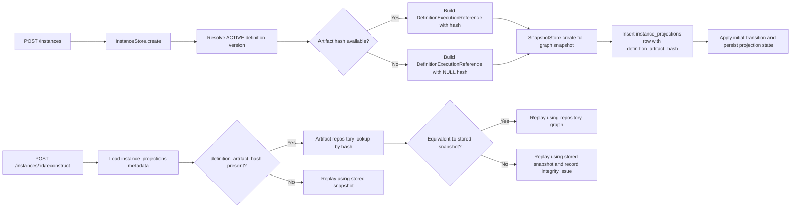
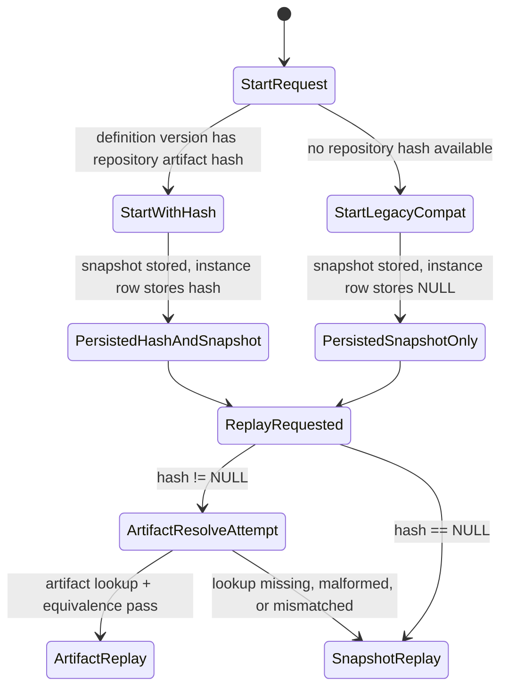

# Module: ADP-05 Instance Artifact Hash

## Module purpose

This design adds a repository-aware definition reference to each process instance without removing PD-08 snapshot storage. It defines additive persistence semantics for a nullable `definition_artifact_hash TEXT` field on the logical instance row, which is the `instance_projections` table in the current schema. New instances started from repository-backed definition versions persist both the full immutable snapshot and the content-addressed artifact hash for that version. Legacy and compatibility-path instances may still store `NULL`, and replay/state reconstruction remains correct by falling back to the PD-08 snapshot whenever no artifact hash is available or the artifact path cannot be used safely.

## Scope and non-goals

- In scope: additive instance persistence semantics for `definition_artifact_hash`, start-path persistence rules, replay/state-reconstruction selection rules, migration/nullability behavior, integrity invariants, and testability notes.
- In scope: traceability to PD-08, EE-01, REPO-01, and IR-02.
- Out of scope: repository implementation internals, canonicalization algorithm details beyond REPO-01/REPO-04 assumptions, frontend/API payload changes, and SQL bodies.

## Schema semantics and migration compatibility

### Logical storage target

- ADP-05 applies to the instance row that anchors execution metadata.
- In the current schema, that row is `instance_projections`, so the additive field is modeled as:
  - `instance_projections.definition_artifact_hash TEXT NULL`
- `instance_definition_snapshots` remains the PD-08 snapshot store and does not lose any existing responsibility.

### Nullability and backfill rules

1. The new column is nullable by design.
2. Existing rows are not backfilled during migration.
3. `NULL` is valid for all pre-repository instances and for any compatibility-path instance started when the resolved definition version has no repository artifact descriptor.
4. Migration success must not depend on artifact repository availability.
5. No destructive rewrite of existing snapshots is permitted.

### Why no historical backfill is required

- ADP-05 preserves PD-08; replay correctness already exists for historic rows.
- Retrofitting hashes for old instances would require re-canonicalizing stored snapshots and proving equivalence to repository artifacts that may not have existed when those rows were created.
- To avoid false provenance, the migration leaves historic rows unchanged and treats `NULL` as the explicit legacy marker.

## Public interface

### Core types

```zig
pub const DefinitionArtifactHash = []const u8;

pub const DefinitionExecutionReference = struct {
    definition_id: definition_store.Uuid,
    graph: definition_store.DefinitionGraph,
    definition_artifact_hash: ?DefinitionArtifactHash,
};

pub const InstanceArtifactReference = struct {
    instance_id: snapshot_mod.Uuid,
    definition_id: snapshot_mod.Uuid,
    definition_artifact_hash: ?DefinitionArtifactHash,
};

pub const ReplayDefinitionSource = enum {
    artifact_repository,
    snapshot_fallback,
};

pub const ReplayDefinitionReference = struct {
    graph: snapshot_mod.DefinitionGraph,
    source: ReplayDefinitionSource,
    definition_artifact_hash: ?DefinitionArtifactHash,
};
```

### Start-path contracts

```zig
pub fn resolveExecutionReferenceForStart(
    allocator: std.mem.Allocator,
    definition_id: definition_store.Uuid,
) DefinitionReferenceError!DefinitionExecutionReference;

pub fn create(
    self: *instance_mod.InstanceStore,
    allocator: std.mem.Allocator,
    definition_id: instance_mod.Uuid,
    correlation_key: ?[]const u8,
    initial_variables: []const u8,
) instance_mod.InstanceError!instance_mod.Instance;
```

Design rules:

- `resolveExecutionReferenceForStart()` loads the ACTIVE definition graph plus the optional artifact hash associated with that exact definition version.
- `InstanceStore.create()` keeps the same external signature so API-03 and EE-01 request semantics do not change.
- Internally, `InstanceStore.create()` must persist `definition_artifact_hash` in the same transaction that inserts the `instance_projections` row and writes the initial event-driven state.
- `SnapshotStore.create()` continues to persist the full definition graph snapshot regardless of whether the artifact hash is null or non-null.

### Replay and reconstruction contracts

```zig
pub fn getArtifactReferenceByInstanceId(
    self: *instance_mod.InstanceStore,
    allocator: std.mem.Allocator,
    instance_id: snapshot_mod.Uuid,
) instance_mod.InstanceError!InstanceArtifactReference;

pub fn resolveReplayDefinition(
    allocator: std.mem.Allocator,
    snapshot_store: *snapshot_mod.SnapshotStore,
    artifact_repo: *artifact_repo_mod.DefinitionArtifactRepository,
    instance_ref: InstanceArtifactReference,
) ReconstructionReferenceError!ReplayDefinitionReference;

pub fn reconstructInstance(
    allocator: std.mem.Allocator,
    pool: *db.Pool,
    snapshot_store: *snapshot_mod.SnapshotStore,
    artifact_repo: *artifact_repo_mod.DefinitionArtifactRepository,
    instance_id: snapshot_mod.Uuid,
    write_back: bool,
) reconstruction_mod.ReconstructionError!transition_mod.InstanceState;
```

Design rules:

- Reconstruction first loads the instance row metadata, including `definition_artifact_hash`.
- If `definition_artifact_hash != null`, reconstruction attempts repository resolution first.
- If repository resolution succeeds, the returned graph becomes the replay snapshot source.
- If the hash is `NULL`, reconstruction uses the PD-08 stored snapshot immediately.
- If repository resolution is unavailable, missing, malformed, or non-equivalent to the stored snapshot, reconstruction falls back to the stored snapshot and surfaces the integrity problem through typed errors, metrics, or audit hooks outside `transition.zig`.
- The replay loop remains pure after the graph is selected; `transition()` still receives a concrete `DefinitionGraph` and does not learn about repository I/O.

## Write-path semantics (EE-01 extension)

### Instance creation decision table

| Definition version state at start time | Stored snapshot | Stored `definition_artifact_hash` | Valid? | Reason |
|---|---|---|---|---|
| Repository-backed version with known artifact hash | Required | Required non-null hash | Yes | ADP-05 primary path |
| Legacy definition version with no repository descriptor | Required | `NULL` | Yes | IR-02 compatibility |
| Compatibility/test seed path where repository not yet wired | Required | `NULL` | Yes | Must preserve EE-01 startup |
| Repository-backed version but hash string malformed | Required | Start rejected | No | Non-null values must be valid REPO-01 hashes |

### Atomic persistence rule

For successful new-instance creation, the following must describe one logical start operation:

1. Resolve ACTIVE definition version.
2. Obtain the execution graph and optional artifact hash for that version.
3. Persist the PD-08 snapshot to `instance_definition_snapshots`.
4. Insert `instance_projections` with the same `definition_id` and the resolved `definition_artifact_hash` value.
5. Append/process the initial start transition and write resulting projection state.

The instance row and the snapshot must represent the same definition version. Persisting one without the other is invalid.

## Repository and replay semantics

### Artifact-hash-first reconstruction rule

When `definition_artifact_hash` is present, reconstruction prefers repository materialization in this order:

1. Load artifact bytes or canonical JSON by hash from the definition artifact repository.
2. Deserialize to `DefinitionGraph`.
3. Verify semantic equivalence against the stored PD-08 snapshot.
4. Use the repository-derived graph for replay.

### Snapshot fallback rule

Fallback to the PD-08 snapshot is mandatory when any of the following is true:

- `definition_artifact_hash` is `NULL`
- artifact repository is disabled for the environment
- artifact lookup by hash returns not found
- artifact payload fails deserialization
- artifact-derived graph is not equivalent to the stored snapshot

Fallback preserves operability, but non-legacy failures are integrity signals and must not be silent.

### Legacy-instance behavior

- A `NULL` hash on an older row is not corruption.
- Legacy instances reconstruct exactly as they do today: snapshot load, then event replay.
- No caller may infer that `NULL` means unknown current definition; it means the instance predates or bypassed repository-backed provenance.

## Data flow diagram



## State transitions



## Error taxonomy

```zig
pub const DefinitionReferenceError = error{
    DefinitionNotFound,
    DefinitionNotActive,
    ArtifactHashMalformed,
    DefinitionArtifactLookupFailed,
    PersistenceFailed,
};

pub const ReconstructionReferenceError = error{
    InstanceNotFound,
    SnapshotNotFound,
    ArtifactHashMalformed,
    ArtifactNotFound,
    ArtifactPayloadInvalid,
    ArtifactSnapshotMismatch,
    RepositoryUnavailable,
    PersistenceFailed,
};
```

Error semantics:

- `ArtifactHashMalformed`: non-null hash is not a canonical SHA-256 identifier accepted by REPO-01.
- `ArtifactNotFound`: instance row claims a repository-backed definition, but the artifact repository cannot resolve that hash.
- `ArtifactPayloadInvalid`: repository content exists but cannot deserialize into a valid `DefinitionGraph`.
- `ArtifactSnapshotMismatch`: repository graph and stored snapshot are not semantically equivalent; replay must fall back to the snapshot and record an integrity anomaly.
- `SnapshotNotFound`: neither hash-based nor snapshot-based reconstruction can proceed because the PD-08 safety net is missing.

## Key invariants

1. PD-08 remains mandatory: every instance still stores a full immutable definition snapshot.
2. When `definition_artifact_hash` is non-null, it identifies the exact definition version used at instance start, not a newer or latest artifact.
3. When `definition_artifact_hash` is non-null, the stored snapshot and the repository artifact must represent semantically equivalent definition graphs.
4. `NULL` is a compatibility value, not an error, for legacy or non-repository-backed instances.
5. Replay chooses at most one graph source per reconstruction attempt: repository-derived graph first when trustworthy, otherwise stored snapshot.
6. `transition.zig` remains I/O-free; all repository or snapshot selection happens before the replay loop begins.

## Dependencies

Calls or relies on:

- `src/definition/store.zig` for ACTIVE definition lookup at start time.
- `src/definition/snapshot.zig` for PD-08 snapshot persistence and retrieval.
- `src/engine/instance.zig` for instance creation and projection writes.
- `src/engine/reconstruction.zig` for replay/state reconstruction orchestration.
- Future artifact repository boundary implementing REPO-01 content-address lookup for definition-version artifacts.

Must not depend on:

- `src/engine/transition.zig` for repository access or integrity decisions.
- Latest-definition lookups during replay; replay must never substitute a newer definition version.
- Ad hoc hash derivation from mutable runtime state.

## Concrete testability notes

1. Migration compatibility: applying the migration to a database with existing instances leaves row counts unchanged and sets `definition_artifact_hash = NULL` for all pre-existing rows.
2. New-instance persistence: starting an instance from a repository-backed definition stores a non-null hash on `instance_projections` and still stores the full snapshot in `instance_definition_snapshots`.
3. Legacy compatibility: starting an instance from a definition version without repository metadata succeeds and stores `NULL` hash plus full snapshot.
4. Replay preference: reconstructing an instance with a valid hash uses repository materialization first and yields the same final `InstanceState` as replay from the stored snapshot.
5. Snapshot fallback: reconstructing an instance with `NULL` hash never calls repository lookup and succeeds via PD-08 snapshot replay.
6. Integrity anomaly fallback: if a non-null hash points to missing or mismatched artifact content, reconstruction still succeeds from the stored snapshot while surfacing a typed integrity issue.
7. Invariant check: for non-null hash instances, canonical hash of the stored snapshot graph equals `definition_artifact_hash` in test fixtures that exercise repository-backed starts.

## Traceability map

| Requirement | Designed behavior | Test focus |
|---|---|---|
| ADP-05 | Add nullable instance artifact hash with backward compatibility | Migration leaves historic rows NULL; new repository-backed rows store hash |
| PD-08 | Snapshot storage preserved as mandatory safety net | Snapshot always written on start and available for replay |
| EE-01 | Start path atomically persists instance metadata and snapshot | New instance stores snapshot plus optional hash without API changes |
| REPO-01 | Non-null hash points to content-addressed immutable definition artifact | Repository-backed starts and replay resolve exact artifact by hash |
| IR-02 | Snapshot and artifact hash coexist; NULL remains valid for legacy rows | Legacy replay via snapshot remains supported |

## Open questions

- None. The requirement text is specific enough to proceed with backend implementation using the contracts above.
