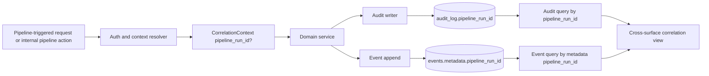
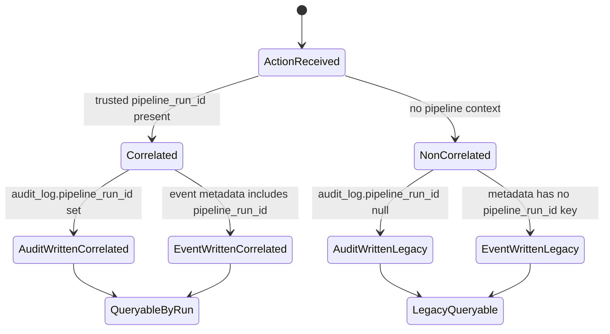

# Module: ADP-06 Pipeline Run Correlation

## Module purpose

This design introduces additive correlation semantics so pipeline-driven activity can be traced end-to-end across audit and event surfaces without changing existing behavior for non-pipeline traffic. ADP-06 adds a nullable audit field, `pipeline_run_id UUID`, and standardizes a metadata key, `pipeline_run_id`, for event records produced by pipeline-driven actions. The design preserves OBS-03 base audit guarantees and ES-08 metadata flexibility, while remaining compatible with ADP-09 tamper-evident audit chaining by treating `pipeline_run_id` as part of canonical audit content when present.

## Scope and non-goals

- In scope: additive schema semantics, write-path propagation contracts, read/query contracts, migration/backfill and nullability behavior, indexing and lookup considerations, compatibility constraints with OBS-03, ES-08, and ADP-09, and concrete testability notes.
- In scope: pipeline correlation propagation across API boundary, execution/service boundaries, audit writes, and event emission metadata.
- Out of scope: SQL implementation bodies, HTTP route implementation edits, and frontend UI changes.

## Public interface

### Core types (backend contracts)

```zig
pub const PipelineRunId = [16]u8;

pub const CorrelationContext = struct {
    pipeline_run_id: ?PipelineRunId,
};

pub const AuditWriteInput = struct {
    actor_id: []const u8,
    action: []const u8,
    resource_type: []const u8,
    resource_id: []const u8,
    before_state_json: ?[]const u8,
    after_state_json: ?[]const u8,
    correlation: CorrelationContext,
};

pub const EventAppendInput = struct {
    instance_id: [16]u8,
    event_type: []const u8,
    payload_json: []const u8,
    actor_id: []const u8,
    metadata_json: ?[]const u8,
    correlation: CorrelationContext,
};

pub const PipelineCorrelationFilters = struct {
    pipeline_run_id: ?PipelineRunId,
    from_ts_us: ?i64,
    to_ts_us: ?i64,
    cursor: ?[]const u8,
    page_size: u16,
};
```

### Service boundary contracts

```zig
pub fn resolveCorrelationContextFromRequest(
    request_ctx: *const api.RequestContext,
) CorrelationError!CorrelationContext;

pub fn writeAuditRecord(
    allocator: std.mem.Allocator,
    tx: *db.Tx,
    input: AuditWriteInput,
) AuditError!void;

pub fn appendEventWithCorrelation(
    allocator: std.mem.Allocator,
    tx: *db.Tx,
    input: EventAppendInput,
) EventStoreError!EventRecord;

pub fn listAuditByPipelineRun(
    allocator: std.mem.Allocator,
    pool: *db.Pool,
    filters: PipelineCorrelationFilters,
) AuditError!PaginatedAuditResult;

pub fn listEventsByPipelineRun(
    allocator: std.mem.Allocator,
    pool: *db.Pool,
    filters: PipelineCorrelationFilters,
) EventStoreError!PaginatedEventResult;
```

### Optional API-facing typing (query surface)

```typescript
export interface PipelineCorrelationQuery {
  pipeline_run_id?: string;
  from?: string;
  to?: string;
  cursor?: string;
  page_size?: number;
}
```

The API contract remains additive: existing endpoints and payloads stay valid when `pipeline_run_id` is absent.

## Data model semantics and migration compatibility

### Additive storage semantics

- Audit surface: add nullable `audit_log.pipeline_run_id UUID`.
- Event surface: no new fixed event column is required; use ES-08 metadata map key `pipeline_run_id` when present.

### Nullability and backfill rules

1. Historical audit rows remain unchanged with `pipeline_run_id = NULL`.
2. Historical event rows remain unchanged; metadata may not contain `pipeline_run_id`.
3. Non-pipeline runtime actions continue to write audit/event rows with no pipeline correlation (`NULL` in audit, missing key in metadata).
4. Backfill is not required for correctness and is intentionally omitted to avoid speculative attribution of historical records.

### Canonical representation rules

- Audit: when pipeline-caused, persist binary UUID value in `audit_log.pipeline_run_id`.
- Event metadata: when pipeline-caused, set key `pipeline_run_id` to canonical UUID string form.
- Non-pipeline: key absent is preferred; key present with null/empty is invalid on write.

## Write-path propagation rules

### Correlation source hierarchy

1. Explicit trusted request context (pipeline runtime principal carrying run id).
2. Internal execution context propagated by orchestration modules for pipeline-triggered actions.
3. Otherwise `pipeline_run_id = NULL` (non-pipeline path).

Client-provided arbitrary metadata cannot override trusted pipeline context.

### Propagation contract by boundary

- API middleware/auth boundary:
  - Resolve correlation context once per request.
  - Attach immutable `CorrelationContext` to request-scoped context object.
- Domain/engine boundary:
  - Service methods that emit audit or events accept `CorrelationContext`.
  - Pure transition logic remains unchanged and receives no I/O or request context.
- Audit write boundary:
  - Persist `pipeline_run_id` column when context is non-null.
  - Include the same value in ADP-09 canonical hashing input.
- Event append boundary:
  - Merge/augment metadata with `pipeline_run_id` when context is non-null.
  - Preserve other metadata keys under ES-08 limits and validation.

### Non-pipeline compatibility rule

If `CorrelationContext.pipeline_run_id == null`, OBS-03 and ES-08 semantics remain unchanged from pre-ADP-06 behavior.

## Queryability and lookup requirements

### Cross-surface query contract

- Audit records produced by pipeline runs must be filterable by `pipeline_run_id`.
- Event records produced by pipeline runs must be filterable by metadata key `pipeline_run_id`.
- Correlation checks must support joining audit and event sets for the same run id at application level (same canonical UUID string/value).

### Indexing considerations

- Audit table index: btree on `pipeline_run_id`, ideally with timestamp tie-break (`pipeline_run_id`, `timestamp`).
- Event metadata index: JSONB expression index for metadata key lookup of `pipeline_run_id` (or equivalent functional index supported by schema conventions).
- Keep existing indexes and pagination orderings unchanged; this is additive for lookup efficiency.

### Cursor and ordering behavior

- Existing API-06 cursor/pagination order semantics are preserved.
- Filtering by `pipeline_run_id` narrows result set only; it does not redefine ordering guarantees.

## Data flow diagram



## State transitions



## Error taxonomy

```zig
pub const CorrelationError = error{
    PipelineRunIdMalformed,
    PipelineRunIdUntrustedSource,
    CorrelationContextMissingForPipelinePrincipal,
};

pub const AuditError = error{
    InvalidPipelineRunId,
    InvalidAuditPayload,
    QueryFailed,
    TransactionFailed,
};

pub const EventStoreError = error{
    InvalidMetadata,
    MetadataLimitExceeded,
    PipelineRunIdMetadataConflict,
    QueryFailed,
    TransactionFailed,
};
```

Error semantics:

- `PipelineRunIdMalformed`: supplied/derived run id is not canonical UUID.
- `PipelineRunIdUntrustedSource`: caller attempts to inject a conflicting run id via mutable metadata.
- `CorrelationContextMissingForPipelinePrincipal`: pipeline principal/action expected a run id but none is resolvable.
- `PipelineRunIdMetadataConflict`: metadata already contains a different run id than trusted context.

## Key invariants

1. ADP-06 is additive and must not break existing OBS-03 or ES-08 flows.
2. Non-pipeline actions are valid with no correlation (`NULL` audit, absent metadata key).
3. Pipeline-driven action writes must set the same logical run id on both audit and event outputs.
4. Trusted context wins over caller metadata to prevent spoofed correlation.
5. ADP-09 hash chaining remains valid; pipeline_run_id participates in canonical content only when present.
6. No I/O or correlation sourcing logic is added to `src/engine/transition.zig`.

## Dependencies

Calls or relies on:

- `src/api/middleware/auth.zig` and/or request context middleware for trusted correlation sourcing.
- `src/obs/audit.zig` (or equivalent audit writer) for audit field persistence.
- `src/event_store/store.zig` for ES-08 metadata write/read behavior.
- `src/api/pagination.zig` and route query plumbing for filterable reads.

Must not depend on:

- `src/engine/transition.zig` for context propagation or persistence.
- Client-supplied untrusted metadata for authoritative pipeline correlation identity.
- Destructive schema rewrites or historical row mutation.

## Compatibility constraints

### OBS-03 compatibility

- Existing mandatory audit fields and immutability behavior remain unchanged.
- Audit write stays in the same transaction as state change.
- `pipeline_run_id` is an additional nullable field only.

### ES-08 compatibility

- Event metadata remains optional/free-form map under current key/value limits.
- `pipeline_run_id` is a reserved semantic key when present, but absence remains valid.

### ADP-09 compatibility

- Audit chain computation must account for `pipeline_run_id` as part of canonical row content.
- Pre-ADP-06 rows with null pipeline_run_id remain valid chain predecessors.

## Concrete testability notes

1. Correlated write path: pipeline-driven API action writes audit row with non-null `pipeline_run_id` and event metadata containing identical UUID string.
2. Non-pipeline write path: equivalent action outside pipeline context writes `pipeline_run_id = NULL` and omits metadata key.
3. Query parity: filtering audit by a given run id returns only correlated rows; same run id event filter returns matching event set.
4. Conflict guard: if incoming metadata carries a different `pipeline_run_id` than trusted context, write fails with typed validation/conflict error.
5. Backward compatibility: historical records created before ADP-06 remain readable and unaffected by new filters.
6. Pagination stability: applying run-id filters does not alter global ordering semantics or cursor contract.
7. ADP-09 chain integrity: correlated and non-correlated audit writes both produce valid chain progression.

## Traceability map

| Requirement | Designed behavior |
|---|---|
| ADP-06 | Nullable audit column plus event metadata propagation for pipeline-caused actions |
| OBS-03 | Same transactional audit guarantees; additive field only |
| ES-08 | Metadata key propagation without breaking optional metadata behavior |
| ADP-09 | Canonical chain compatibility with nullable/new field |

## Open questions

1. Should `GET /audit` and global event stream endpoints expose first-class query params for `pipeline_run_id`, or should this be initially limited to internal/admin routes?
2. Is pipeline correlation required for all agent-initiated writes, or only for writes tied to a workflow run that has a registered pipeline execution record?
3. For pipeline-triggered actions that do not append an event but do write audit, should a synthetic correlation event be emitted for cross-surface completeness, or is audit-only correlation acceptable?
