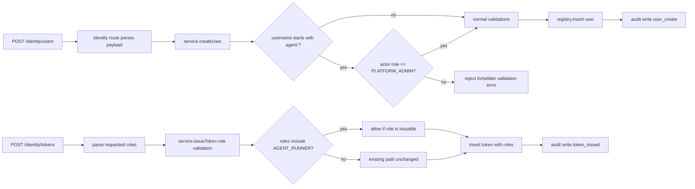
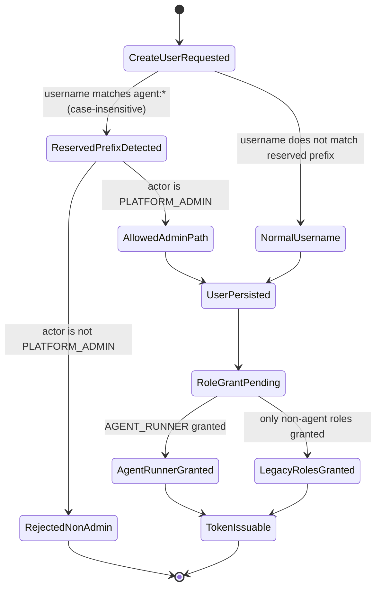

# Module: ADP-07 Agent Role and Reserved Usernames

## Module purpose

This design introduces additive identity semantics for agent execution accounts by adding `AGENT_RUNNER` as a grantable role and reserving usernames with prefix `agent:` for controlled creation. The module preserves existing identity behavior for all non-agent users, keeps existing role flows intact, and defines actor-based enforcement so only `PLATFORM_ADMIN` can create `agent:*` users while all other actors are rejected. It also defines role-assignment and token-issuance compatibility so agent identities can receive `AGENT_RUNNER` plus policy-required roles without changing existing role matrices.

## Scope and non-goals

- In scope: additive role model update, reserved-username validation policy, API/service/repository touchpoints, token and role-grant compatibility, auditability expectations, and acceptance-test mapping.
- In scope: compatibility constraints for IDN-01 and IDN-03, plus alignment to OIDC-20 service-account usage.
- Out of scope: implementation SQL or Zig code, frontend changes, and provider-side realm provisioning logic.

## Public interface

### Core role and validation types

```zig
pub const ReservedUsernamePrefix = "agent:";

pub const IdentityRole = enum {
    PLATFORM_ADMIN,
    PROCESS_DESIGNER,
    PROCESS_OPERATOR,
    TASK_WORKER,
    VIEWER,
    AGENT_RUNNER,
};

pub const ReservedUsernamePolicy = struct {
    prefix: []const u8 = ReservedUsernamePrefix,
    requires_creator_role: IdentityRole = .PLATFORM_ADMIN,
    case_insensitive_match: bool = true,
};

pub const CreateUserInput = struct {
    tenant_id: ?[]const u8,
    username: []const u8,
    display_name: []const u8,
    email: []const u8,
    status: registry_mod.UserStatus,
    caller_supplied_user_id: bool,
    caller_supplied_created_at: bool,
};

pub const CreateRoleGrantInput = struct {
    user_id: []const u8,
    roles: []const IdentityRole,
};
```

### Service boundary contracts

```zig
pub fn createUser(
    self: *Service,
    allocator: std.mem.Allocator,
    actor: auth.AuthContext,
    input: CreateUserInput,
) IdentityError!registry_mod.User;

pub fn validateReservedUsernamePolicy(
    actor: auth.AuthContext,
    username: []const u8,
) IdentityError!void;

pub fn grantRoles(
    self: *Service,
    allocator: std.mem.Allocator,
    actor: auth.AuthContext,
    input: CreateRoleGrantInput,
) IdentityError!void;

pub fn issueToken(
    self: *Service,
    allocator: std.mem.Allocator,
    actor: auth.AuthContext,
    input: CreateTokenInput,
) TokenError!IssuedToken;
```

### Repository boundary contracts

```zig
pub fn ensureRoleExists(
    self: *Registry,
    allocator: std.mem.Allocator,
    role_name: []const u8,
) RegistryError!void;

pub fn grantUserRole(
    self: *Registry,
    allocator: std.mem.Allocator,
    tenant_id: []const u8,
    user_id: []const u8,
    role_name: []const u8,
) RegistryError!void;

pub fn listUserRoles(
    self: *Registry,
    allocator: std.mem.Allocator,
    tenant_id: []const u8,
    user_id: []const u8,
) RegistryError![]const []const u8;
```

## Data model and compatibility semantics

### Additive role semantics

- Add `AGENT_RUNNER` to the role domain as a normal, grantable role.
- Do not remove or repurpose any existing role.
- Existing users keep current role assignments unchanged.
- Existing permission checks for `PLATFORM_ADMIN`, `PROCESS_DESIGNER`, `PROCESS_OPERATOR`, `TASK_WORKER`, and `VIEWER` remain backward-compatible.

### Reserved username semantics

- Reserved prefix is `agent:`.
- Prefix check is case-insensitive after trimming surrounding whitespace from the candidate username.
- Any creation request for usernames matching `agent:*` is rejected unless creator role is `PLATFORM_ADMIN`.
- `PLATFORM_ADMIN` path is explicitly allowed and must continue through normal uniqueness and email validation checks.

### Agent identity role semantics

- Agent users are expected to have `AGENT_RUNNER` plus additional policy-driven roles when needed.
- Granting `AGENT_RUNNER` follows the same role-grant mechanism as other roles.
- Token issuance role validation must accept `AGENT_RUNNER` when present in requested role set.
- Non-agent users are not required to include `AGENT_RUNNER`.

## Enforcement boundaries and integration touchpoints

### API route layer (`src/api/routes/identity.zig`)

- `handleCreateUser` remains the input validation entrypoint for username payload shape and basic required fields.
- `handleCreateToken` remains the role-list parsing entrypoint and must permit `AGENT_RUNNER` in parsed role arrays.

### Identity service layer (`src/identity/service.zig`)

- `createUser` enforces reserved-username actor policy via `validateReservedUsernamePolicy` before repository write.
- `createOrGetJitOidcUser` must not bypass reserved-prefix rules when creating local user rows from external identity.
- `issueToken` validates that each requested role is in the issuable role set including `AGENT_RUNNER`.
- Any role-grant operation must ensure the target role exists and assignment is tenant-scoped.

### Auth and RBAC layer (`src/api/middleware/auth.zig`)

- `Role` enum and parsing map include `AGENT_RUNNER`.
- Existing role-priority behavior remains stable for legacy roles.
- RBAC matrix extension for `AGENT_RUNNER` is additive and must not weaken prior route protections.

### Registry/repository layer (`src/identity/registry.zig`)

- `roles` seed data includes `AGENT_RUNNER`.
- `user_roles` continues to hold grants, including `AGENT_RUNNER`.
- Username uniqueness remains unchanged.
- Tenant predicates continue to apply to user and role assignment flows.

## Data flow diagram



## State transitions



## Error taxonomy

```zig
pub const IdentityError = error{
    Forbidden,
    ValidationFailed,
    DuplicateUsername,
    ReservedUsernameRequiresPlatformAdmin,
    ReservedUsernameInvalidFormat,
    UnknownRole,
    InvalidRoleSet,
    PoolExhausted,
    PersistenceFailed,
    OutOfMemory,
};

pub const TokenError = error{
    Forbidden,
    InvalidRoleSet,
    UserNotFound,
    ValidationFailed,
    PoolExhausted,
    PersistenceFailed,
    OutOfMemory,
};
```

Error semantics:

- `ReservedUsernameRequiresPlatformAdmin`: actor attempted to create `agent:*` username without `PLATFORM_ADMIN` role.
- `ReservedUsernameInvalidFormat`: malformed reserved username (for example `agent:` with no suffix).
- `UnknownRole`: role grant references a role not present in role domain.
- `InvalidRoleSet`: token issuance or grants include non-issuable/invalid roles.

## Key invariants

1. `AGENT_RUNNER` is additive and grantable; existing roles remain valid and unchanged.
2. `agent:*` usernames are creatable only by `PLATFORM_ADMIN`.
3. Non-agent username creation behavior is unchanged.
4. Existing non-agent users, tokens, and role grants remain valid after ADP-07.
5. Role assignment and token issuance remain tenant-scoped.
6. All reserved-username rejections and agent-role grants are auditable.

## Dependencies

Calls or relies on:

- `src/api/routes/identity.zig` for request payload parsing and HTTP mapping.
- `src/identity/service.zig` for policy enforcement and role/token rules.
- `src/identity/registry.zig` for user persistence and role grants.
- `src/api/middleware/auth.zig` for role enum parsing and request actor role.
- `src/obs/audit.zig` for audit event emission.

Must not depend on:

- Direct role checks in route handlers bypassing service policy.
- Client-provided claims to override actor role enforcement.
- Non-tenant-scoped role grants.

## Migration and regression constraints

- Role-domain update must be additive (seed or insert role row; no destructive change).
- Existing rows in `users`, `user_roles`, and `api_tokens` must remain valid without rewrite.
- Existing token validation for legacy roles must continue to succeed.
- Existing authorization outcomes for non-agent users must not regress.

## Acceptance mapping and testability guidance

| ADP-07 acceptance criterion | Design mapping | Testability guidance |
|---|---|---|
| AGENT_RUNNER is new and grantable | Additive role-domain + grantUserRole flow | Grant AGENT_RUNNER to an existing user and verify persistence + token issuance acceptance |
| Regular user cannot register `agent:foo` | Reserved-prefix enforcement in `createUser` requiring PLATFORM_ADMIN | Call create-user as non-admin with `agent:foo`; expect forbidden/validation failure and no persisted user |
| PLATFORM_ADMIN can register `agent:foo` | Explicit allowed admin path with normal validation | Call create-user as admin with `agent:foo`; expect 201 and persisted user row |
| Integration touchpoints are explicit and invariant-driven | Route, service, auth, registry boundaries documented | Unit tests at service layer plus integration tests through identity routes |
| Backward compatibility for existing users/roles | Additive-only migration and unchanged legacy role behavior | Replay existing IDN-01/IDN-03 regression suite and verify identical outcomes for non-agent identities |
| Auditability for creation and grants | Audit requirement for reserved-prefix rejects and successful agent role grants | Verify audit entries exist for reject and success paths with actor, action, and resource ids |

## Open questions

1. Should reserved-prefix matching normalize Unicode lookalikes beyond ASCII case-folding, or is ASCII-only matching sufficient for this stage?
2. Should `AGENT_RUNNER` participate in auth primary-role priority ordering, and if yes, at which priority relative to `VIEWER`?
3. For OIDC JIT creation, should any externally supplied username beginning with `agent:` be hard-rejected, or allowed only when the mapped actor is a platform-owned provisioning principal?
