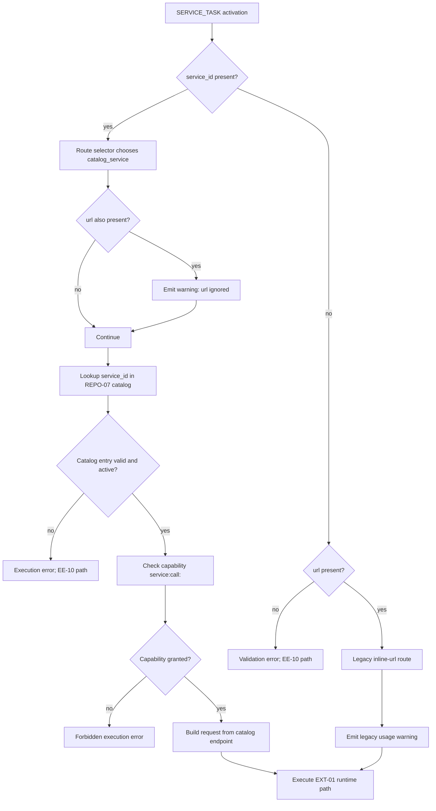
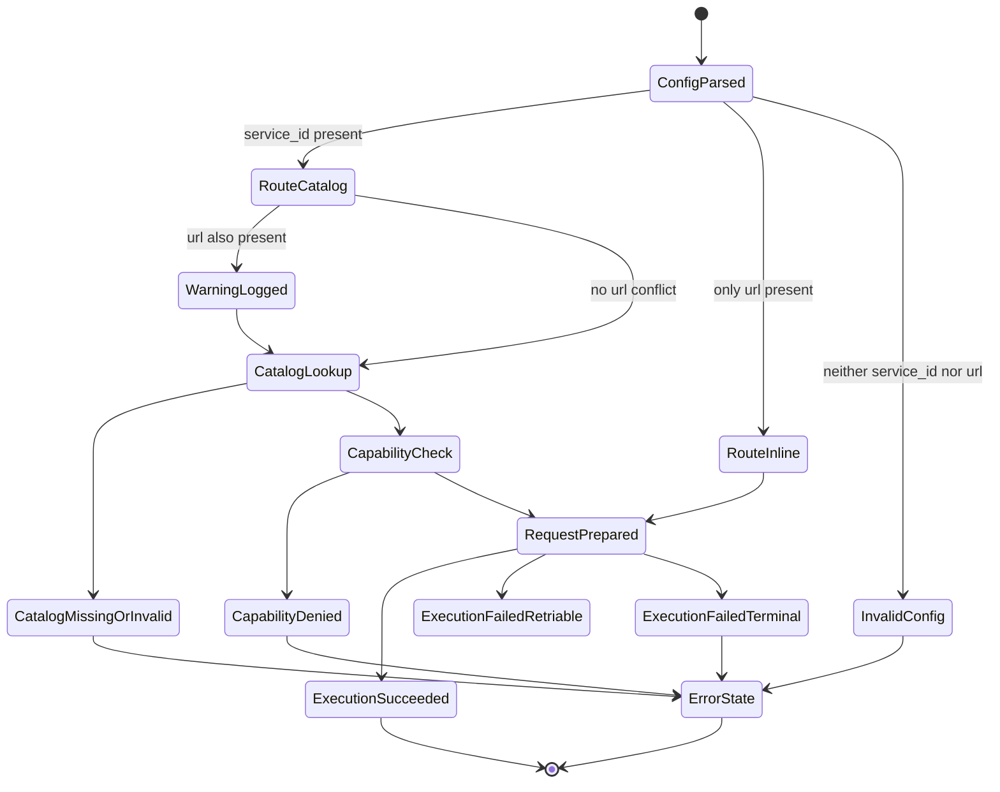

# Module: ADP-08 Service Task Catalog Reference

## Module purpose

This design extends SERVICE_TASK configuration semantics additively so definitions can use either legacy `url` execution (EXT-01 behavior unchanged) or new `service_id` execution via catalog reference. The module defines deterministic precedence when both fields are present (`service_id` wins, `url` ignored with warning), catalog-driven routing for `service_id`, capability enforcement using `service:call:<service_id>`, and failure handling for missing or invalid catalog entries without breaking previously shipped inline-URL definitions.

## Scope and non-goals

- In scope: additive node configuration contract, execution-path selection, warning behavior, capability and catalog lookup rules, compatibility constraints, and acceptance-to-test mapping for ADP-08.
- In scope: route and service-layer touchpoints for validation and execution dispatch.
- Out of scope: implementation code, migration SQL, and frontend changes.

## Public interface

### SERVICE_TASK configuration types

```zig
pub const ServiceTaskConfig = struct {
    // Legacy execution path (EXT-01).
    url: ?[]const u8,

    // New execution path (ADP-08, REPO-07).
    service_id: ?[]const u8,

    method: HttpMethod,
    headers_json: ?[]const u8,
    timeout_ms: ?u32,
    retry_limit: ?u8,
    body_template_json: ?[]const u8,
};

pub const ServiceTaskRouteKind = enum {
    inline_url,
    catalog_service,
};

pub const ServiceTaskRouteSelection = struct {
    kind: ServiceTaskRouteKind,
    resolved_service_id: ?[]const u8,
    resolved_url: []const u8,
    warning: ?ServiceTaskWarning,
};

pub const ServiceTaskWarning = enum {
    BothUrlAndServiceIdProvidedUrlIgnored,
};

pub const ServiceCatalogEntry = struct {
    service_id: []const u8,
    endpoint_url: []const u8,
    request_schema_json: []const u8,
    response_schema_json: []const u8,
    auth_method: []const u8,
    is_active: bool,
};
```

### Service boundary contracts

```zig
pub fn selectServiceTaskRoute(
    allocator: std.mem.Allocator,
    cfg: ServiceTaskConfig,
) ServiceTaskConfigError!ServiceTaskRouteSelection;

pub fn getServiceCatalogEntry(
    self: *ServiceCatalog,
    allocator: std.mem.Allocator,
    service_id: []const u8,
) ServiceCatalogError!ServiceCatalogEntry;

pub fn enforceServiceCapability(
    auth_ctx: auth.AuthContext,
    service_id: []const u8,
) CapabilityError!void;

pub fn buildExecutableRequestFromRoute(
    allocator: std.mem.Allocator,
    route: ServiceTaskRouteSelection,
    cfg: ServiceTaskConfig,
    variables: std.json.Value,
) ServiceTaskExecutionError!PreparedServiceTaskRequest;
```

### Deterministic precedence contract

1. If `service_id` is present and non-empty, route is `catalog_service`.
2. If `url` is also present in case (1), `url` is ignored and warning `BothUrlAndServiceIdProvidedUrlIgnored` is emitted.
3. If only `url` is present and non-empty, route is `inline_url` and EXT-01 behavior remains unchanged.
4. If neither `service_id` nor `url` is present (or both are empty after normalization), activation fails validation.

## Execution routing semantics

### Path A: `service_id` catalog route (new)

1. Validate `service_id` syntax and non-empty value.
2. Resolve catalog entry by `service_id` from REPO-07 service catalog.
3. Enforce capability `service:call:<service_id>` before dispatch.
4. Build outbound request from catalog endpoint and node-level method/headers/body template.
5. Execute with existing EXT-01 runtime behavior for timeout/retries/merge/DLQ.

### Path B: `url` inline route (legacy)

1. Preserve existing EXT-01 URL templating and invocation behavior.
2. Do not apply capability check for this path (per ADP-08 and IR-04).
3. Emit a warning that inline URL is legacy and catalog registration is preferred.

### Both fields present

1. Select Path A (`service_id`) deterministically.
2. Ignore `url` completely for request construction.
3. Emit warning event/log including instance id, node id, and both provided keys.

## Data flow diagram



## State transitions



## Error taxonomy

```zig
pub const ServiceTaskConfigError = error{
    MissingUrlAndServiceId,
    EmptyServiceId,
    EmptyUrl,
    InvalidServiceIdFormat,
    InvalidUrlFormat,
};

pub const ServiceCatalogError = error{
    ServiceNotFound,
    ServiceInactive,
    ServiceEntryInvalid,
    CatalogUnavailable,
    QueryFailed,
};

pub const CapabilityError = error{
    ServiceCapabilityRequired,
    Forbidden,
};

pub const ServiceTaskExecutionError = error{
    ActivationValidationFailed,
    CatalogLookupFailed,
    CapabilityDenied,
    RequestBuildFailed,
    Timeout,
    NetworkFailure,
    HttpNon2xx,
    RedirectRejected,
    Invalid2xxBody,
    RetryExhausted,
    DlqMoveFailed,
};
```

Error behavior requirements:

- `ServiceNotFound`, `ServiceInactive`, `ServiceEntryInvalid`: execution transitions to ERROR path with structured reason and no inline URL fallback when `service_id` selected.
- `CatalogUnavailable`: treated as execution failure for `service_id` route and surfaced as structured error; inline-URL definitions are unaffected.
- `ServiceCapabilityRequired`/`Forbidden`: request blocked before outbound call when `service_id` route is used.

## Key invariants

1. ADP-08 is additive and must not change behavior for existing definitions that use only `url`.
2. Route selection is deterministic for every SERVICE_TASK node instance.
3. If both keys are present, `service_id` always wins and `url` is never used.
4. Capability checks apply only to `service_id` route; legacy `url` route remains unchanged.
5. Missing or invalid catalog entries are explicit failures for `service_id` route and do not alter legacy route semantics.
6. EXT-01 runtime semantics (timeout/retry/merge/DLQ/error) are reused after route resolution.

## Dependencies

Calls or relies on:

- `src/engine/service_task.zig` for runtime execution and retry behavior.
- `src/definition/graph.zig` for node configuration validation shape.
- `src/api/middleware/auth.zig` for actor capabilities.
- Service catalog repository/service introduced for REPO-07 lookup.
- `src/obs/logger.zig` and/or `src/obs/audit.zig` for warning and structured error records.

Must not depend on:

- `src/engine/transition.zig` for I/O, catalog access, or capability lookup.
- Implicit fallback from `service_id` to `url` on catalog/capability failure.
- Schema-destructive migration behavior.

## Compatibility guarantees

1. Existing EXT-01 definitions with only `url` remain valid and execute identically.
2. Existing APIs that accept SERVICE_TASK configs remain backward-compatible with `url`.
3. New `service_id` support is additive; older definitions require no rewrite.
4. Warning emission for legacy or conflicting config is informational and non-breaking.

## Acceptance mapping and testability guidance

| ADP-08 acceptance criterion | Design mapping | Testability guidance |
|---|---|---|
| Backward-compatible schema extension for `url` or `service_id` | Public interface + deterministic precedence contract | Unit tests for config parse/validation with only `url`, only `service_id`, both, and neither |
| Explicit deterministic precedence when both provided | Deterministic precedence contract + both-fields route semantics | Unit test asserting selected route is `catalog_service`, `url` ignored, warning emitted |
| Capability + catalog lookup for `service_id` path | Execution routing Path A + dependencies + error taxonomy | Integration tests for catalog hit, missing catalog entry, inactive entry, and capability denied |
| Failure-mode behavior for invalid catalog references with non-breaking compatibility | Error behavior requirements + compatibility guarantees | Integration tests that `service_id` failures return structured execution errors while legacy `url` path still succeeds |
| Traceability and actionable test guidance | This acceptance matrix + invariants | Add test plan entries covering selector behavior, warning logging, capability enforcement, and EXT-01 regression reuse |

## Open questions

1. For `service:call:*`, should wildcard satisfy `service:call:<service_id>` for ADP-08 route enforcement, or should exact-match be mandatory in Stage 6.5?
2. Should `service_id` format be constrained to a strict character set (for example, `[a-z0-9_-]+`) or only non-empty string at this stage?
3. If REPO-07 catalog rollout lags ADP-08 in a deployment, should `service_id` validation fail fast at definition activation or only at runtime node execution?
