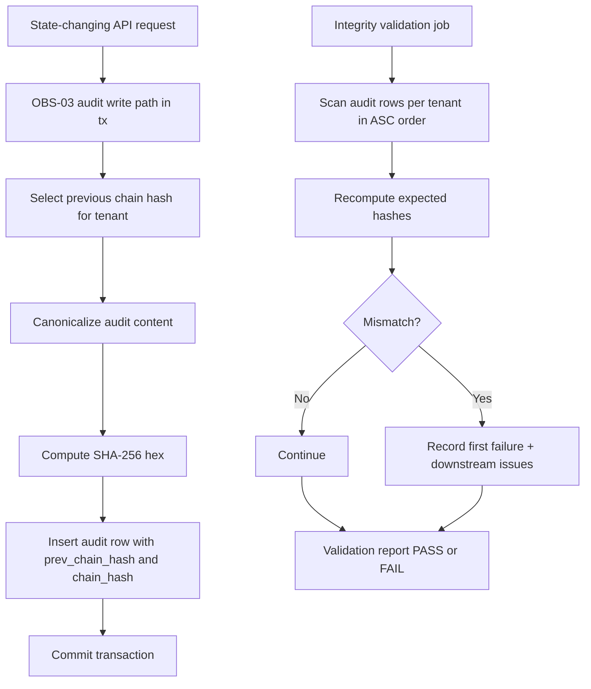
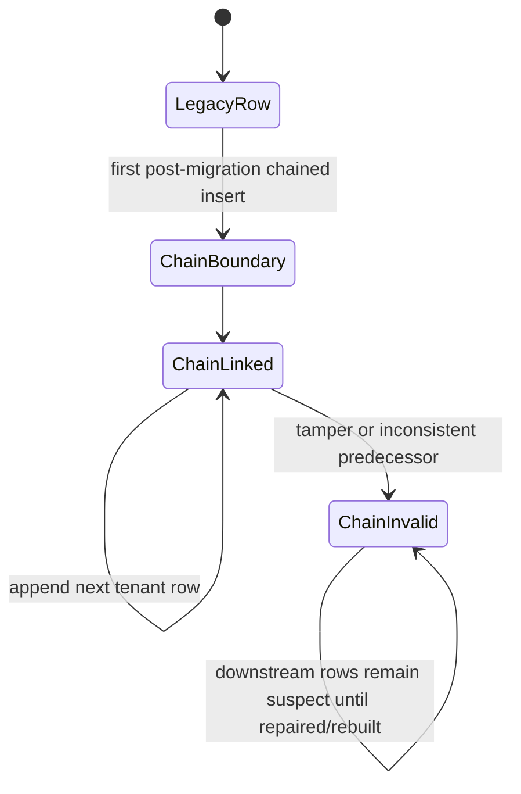

# Module: ADP-09 Tamper-Evident Audit Chain

## Module purpose

This design extends OBS-03 additively with tenant-scoped hash chaining for audit rows so post-migration tampering becomes detectable and attributable. The module defines deterministic canonicalization for hash input, insert-time predecessor selection per tenant, forward chain construction semantics, and validation traversal/error reporting behavior that preserves all existing OBS-03 fields, APIs, and query behavior.

## Scope and non-goals

- In scope: canonical hash input contract, chain linking semantics, validation traversal, compatibility with legacy rows, migration/index guidance, operational guidance, and testability mapping for ADP-09 acceptance.
- In scope: backend interfaces for audit write path and chain validation read path.
- Out of scope: implementation code, SQL migration implementation details, and any breaking change to OBS-03 response shapes.

## Public interface

### Zig data types

```zig
pub const AuditChainCanonicalInput = struct {
    tenant_id: [16]u8,
    audit_id: [16]u8,
    actor_id: ?[16]u8,
    action: []const u8,
    resource_type: []const u8,
    resource_id: [16]u8,
    trace_id: [16]u8,
    created_at_unix_us: i64,
    before_state_canonical_json: ?[]const u8,
    after_state_canonical_json: ?[]const u8,
    pipeline_run_id: ?[]const u8,
    payload_full_canonical_json: ?[]const u8,
    prev_chain_hash: ?[]const u8, // lowercase hex SHA-256, 64 chars
};

pub const AuditChainWriteInput = struct {
    tenant_id: [16]u8,
    actor_id: ?[16]u8,
    action: []const u8,
    resource_type: []const u8,
    resource_id: [16]u8,
    trace_id: [16]u8,
    created_at_unix_us: i64,
    before_state_json: ?[]const u8,
    after_state_json: ?[]const u8,
    pipeline_run_id: ?[]const u8,
    payload_full_json: ?[]const u8,
};

pub const AuditChainValidationFilter = struct {
    tenant_id: ?[16]u8, // null means validate all tenants independently
    from_created_at_unix_us: ?i64,
    to_created_at_unix_us: ?i64,
    stop_on_first_error: bool,
};

pub const AuditChainValidationIssue = struct {
    tenant_id: [16]u8,
    audit_id: [16]u8,
    sequence_no: u64,
    code: AuditChainValidationCode,
    detail: []const u8,
    expected_prev_chain_hash: ?[]const u8,
    observed_prev_chain_hash: ?[]const u8,
    expected_chain_hash: ?[]const u8,
    observed_chain_hash: ?[]const u8,
};

pub const AuditChainValidationCode = enum {
    InvalidHashFormat,
    LegacyGapAfterChainStart,
    PrevHashMismatch,
    ChainHashMismatch,
    DuplicateChainHash,
    OutOfOrderTraversal,
};

pub const AuditChainValidationReport = struct {
    status: ValidationStatus,
    tenants_scanned: u32,
    rows_scanned: u64,
    first_failure_at_audit_id: ?[16]u8,
    issues: []AuditChainValidationIssue,
};

pub const ValidationStatus = enum {
    pass,
    fail,
};
```

### Zig function contracts

```zig
pub fn normalizeAuditCanonicalInput(
    allocator: std.mem.Allocator,
    input: AuditChainWriteInput,
    prev_chain_hash: ?[]const u8,
) AuditChainError!AuditChainCanonicalInput;

pub fn encodeAuditCanonicalBytes(
    allocator: std.mem.Allocator,
    canonical: AuditChainCanonicalInput,
) AuditChainError![]const u8;

pub fn computeAuditChainHashHex(
    allocator: std.mem.Allocator,
    canonical_bytes: []const u8,
) AuditChainError![64]u8;

pub fn selectPreviousChainHashForTenant(
    tx: *db.Tx,
    tenant_id: [16]u8,
) AuditChainError!?[64]u8;

pub fn appendAuditRowWithChainInTx(
    allocator: std.mem.Allocator,
    tx: *db.Tx,
    write_input: AuditChainWriteInput,
) AuditChainError!AuditRecord;

pub fn validateAuditChain(
    allocator: std.mem.Allocator,
    pool: *db.Pool,
    filter: AuditChainValidationFilter,
) AuditChainError!AuditChainValidationReport;
```

### Error taxonomy

```zig
pub const AuditChainError = error{
    InvalidCanonicalInput,
    InvalidJsonCanonicalization,
    InvalidHashFormat,
    PredecessorLookupFailed,
    ConcurrentAppendConflict,
    ChainComputationFailed,
    ChainValidationFailed,
    DataAccessFailed,
    OutOfMemory,
};
```

## Canonical content rules for hash input

`chain_hash` is computed as SHA-256 over a deterministic UTF-8 byte payload derived from canonicalized audit content plus predecessor hash.

### Rule set

1. Encoding: UTF-8 bytes only.
2. Field order is fixed and positional, never map-iteration dependent.
3. UUID values are lowercase RFC-4122 strings.
4. Timestamps use integer Unix microseconds (`created_at_unix_us`) to avoid timezone/string drift.
5. JSON fields (`before_state`, `after_state`, `payload_full`) use canonical JSON serialization:
- Object keys sorted lexicographically.
- No insignificant whitespace.
- Numbers normalized to minimal decimal form.
- Boolean/null lower-case literals.
6. Missing optional fields are encoded as `~` sentinel, not empty string.
7. `prev_chain_hash` participates as `~` for boundary rows (first chained row), otherwise lowercase 64-char hex.
8. Hash output format is lowercase hex length 64.

### Canonical payload template

The canonical byte sequence is newline-delimited key-value lines in this exact order:

```text
tenant_id=<uuid>
audit_id=<uuid>
actor_id=<uuid|~>
action=<text>
resource_type=<text>
resource_id=<uuid>
trace_id=<uuid>
created_at_us=<int64>
before_state=<canonical_json|~>
after_state=<canonical_json|~>
pipeline_run_id=<text|~>
payload_full=<canonical_json|~>
prev_chain_hash=<hex64|~>
```

This template is normative for ADP-09 and must remain stable across versions unless versioned explicitly.

## Per-tenant predecessor selection and insert-time computation

### Predecessor selection

Predecessor for a new row is the latest chained row in the same tenant:

- Filter: same `tenant_id`, `chain_hash IS NOT NULL`
- Order: `created_at DESC, audit_id DESC`
- Pick first row only

Boundary behavior:

- If no chained predecessor exists for the tenant, `prev_chain_hash = NULL` and chain starts at this row.
- Legacy rows where both chain fields are null are not predecessors.

### Insert-time behavior

1. Start transaction for business mutation + audit append (same transaction boundary as OBS-03).
2. Resolve predecessor hash for tenant from chained rows only.
3. Build canonical payload from immutable write payload + predecessor hash.
4. Compute SHA-256 hex and set:
- `prev_chain_hash` to predecessor hash (or NULL for boundary)
- `chain_hash` to computed digest
5. Insert audit row with all existing OBS-03 fields unchanged plus new chain fields.
6. Commit transaction.

### Concurrency contract

To avoid tenant-chain forks (two concurrent rows pointing to same predecessor), append path must serialize per tenant at insert point. Acceptable implementation strategies (chosen by BACKEND-DEV) include tenant-scoped advisory lock or equivalent row-level serialization primitive. The design requires exactly one linear chain per tenant.

## Validation traversal and failure reporting

## Traversal algorithm

Validation runs independently per tenant.

1. Read rows ordered by `created_at ASC, audit_id ASC` within tenant and optional time window.
2. Skip leading legacy rows while `chain_hash IS NULL` and `prev_chain_hash IS NULL`.
3. First row with non-null `chain_hash` is chain start and must have `prev_chain_hash IS NULL`.
4. For each chained row:
- Verify hash format (`[0-9a-f]{64}`).
- Recompute expected `chain_hash` from canonical content and observed `prev_chain_hash`.
- Verify `prev_chain_hash` equals prior row's `chain_hash`.
- Verify observed `chain_hash` equals recomputed digest.
5. If a row after chain start has null `chain_hash`, emit `LegacyGapAfterChainStart`.
6. Continue traversal (unless `stop_on_first_error = true`) so report includes first failure and downstream impact.

## Failure semantics

- `PrevHashMismatch` or `ChainHashMismatch` at row N marks row N invalid and all descendants suspect for tampering propagation.
- Validation report status is `fail` if any issue exists.
- Acceptance criterion behavior: injected tampered row causes first mismatch at tampered row and downstream failures due to predecessor mismatch.

## Error report contract

Validation response/report must include:

- `tenant_id`, `audit_id`, `sequence_no`
- issue code and concise detail
- expected vs observed `prev_chain_hash`
- expected vs observed `chain_hash`
- first failing row pointer (`first_failure_at_audit_id`)

This supports deterministic incident triage and XC-02 audit immutability evidence.

## Compatibility and OBS-03 preservation

1. Existing OBS-03 columns, route contracts, filters, and ordering stay unchanged.
2. New columns are nullable and additive.
3. Historical pre-migration rows retain `chain_hash = NULL` and `prev_chain_hash = NULL`.
4. Chain validation begins at first non-null chained row per tenant; legacy rows before boundary are treated as pre-chain history, not failures.
5. `GET /audit` query behavior and response shape are preserved; chain fields are additive and optional in consumers.

## Migration and index guidance (design-level)

This section is guidance for BACKEND-DEV migration implementation, not executable SQL.

1. Add nullable columns to `audit_log`:
- `chain_hash TEXT NULL`
- `prev_chain_hash TEXT NULL`
2. Do not backfill historical rows in ADP-09 migration.
3. Add partial lookup index for chain traversal/append predecessor selection:
- `(tenant_id, created_at, audit_id)` filtered by `chain_hash IS NOT NULL`
4. Consider optional format checks at DB layer (length/hex) only if non-breaking and idempotent.
5. Preserve existing OBS-03 indexes and query plans.

## Operational implications

1. Chain validation can run as periodic integrity job and on-demand incident command.
2. Validation should be tenant-scoped for bounded blast radius and predictable runtime.
3. Bulk import/disaster recovery that inserts historical audit rows must rebuild chain in deterministic order per tenant before declaring integrity green.
4. Monitoring should track:
- validation pass/fail by tenant
- count of mismatches by code
- age of last successful full-chain validation
5. Rotating hash algorithm is out of current scope; ADP-09 standardizes SHA-256.

## Data flow diagram



## State transitions



## Dependencies and forbidden dependencies

Depends on:

- `src/obs/audit.zig` for append/list primitives
- `src/api/middleware/audit.zig` for write path context
- tenant context resolution from ADP-03
- audit table tenant column from ADP-02
- optional `pipeline_run_id` and `payload_full` fields from ADP-06/ADP-10 when present

Must not depend on:

- any mutation of existing OBS-03 semantics or required fields
- cross-tenant predecessor lookup
- non-deterministic serialization (map iteration order, locale-dependent formatting)
- I/O in pure engine transition layer (`src/engine/transition.zig`)

## Acceptance criteria mapping and testability guidance

| Handoff acceptance criterion | Design mapping | Actionable test guidance |
|---|---|---|
| Deterministic canonicalization and SHA-256 computation rules | Canonical content rules + payload template | Unit tests with fixed fixtures must assert identical canonical bytes and hash across repeated runs and key-order permutations |
| Per-tenant predecessor linkage and first-row boundary behavior | Predecessor selection + boundary behavior + concurrency contract | Integration tests: first chained row in tenant has null prev; second row links to first; different tenants do not cross-link |
| Validation algorithm and tampered-row failure semantics are concrete | Traversal algorithm + failure semantics + report contract | Integration test mutates one post-migration row and asserts first mismatch at tampered row, plus downstream mismatch issues |
| Compatibility with OBS-03 and legacy rows | Compatibility section + migration guidance | Regression tests for existing OBS-03 list/read queries unchanged; pre-migration rows with null chain fields are accepted as legacy |
| Traceability to ADP-09 tampering scenario | This mapping table + operational implications | Add targeted test case for ADP-09 acceptance text: inserted tampered row breaks validation at row and forward |

## Open questions

1. Should chain validation surface as a dedicated admin endpoint in Stage 6.5, or remain internal tooling until a later requirement explicitly exposes it?
2. For `payload_full` canonicalization, should redacted and non-redacted representations hash identically (hash pre-redaction) or follow stored value exactly (hash post-redaction)?
