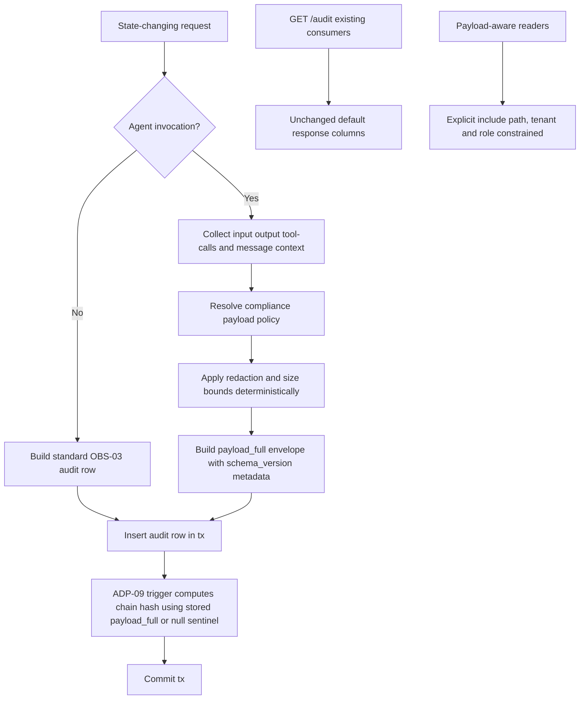
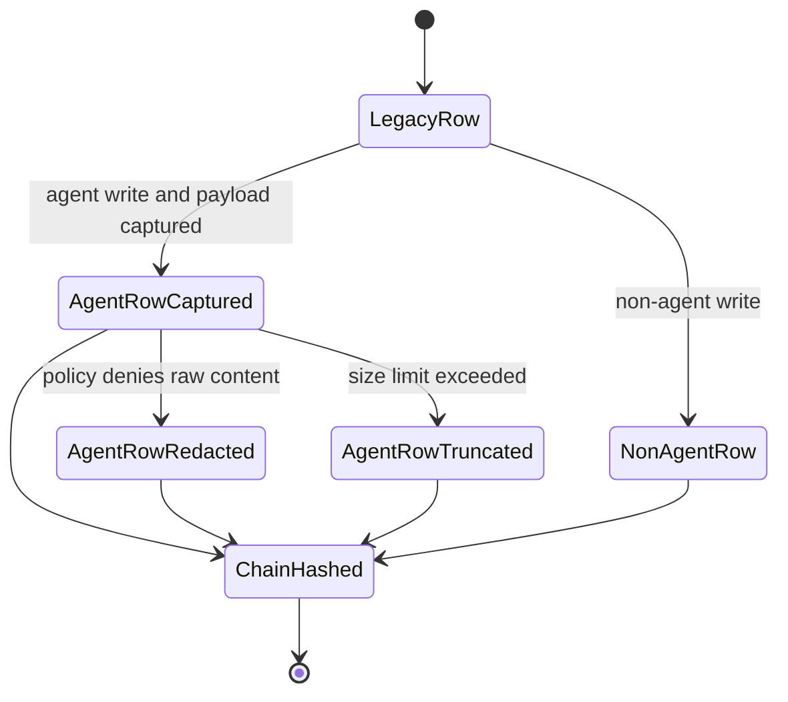

# Module: ADP-10 Agent I/O Capture in Audit

## Module purpose

This design extends OBS-03 audit entries with additive, nullable `payload_full JSONB` capture for agent-driven actions while preserving all existing OBS-03 fields, endpoint contracts, ordering, and query behavior for legacy and non-agent rows. The module defines deterministic capture semantics for agent input/output/tool-call payloads, compliance-policy hooks for raw LLM message handling, payload shape/versioning, size and redaction expectations, and deterministic interaction with ADP-09 chain hashing so hash verification remains stable and tamper-evident without invalidating historical rows.

## Scope and non-goals

In scope:
- Additive semantics for `payload_full` population for agent invocations.
- Explicit null behavior for non-agent and legacy rows.
- Payload schema/versioning contract and compatibility policy.
- Compliance hooks for raw-message retention/redaction.
- Deterministic hashing interaction with ADP-09 (`chain_hash`, `prev_chain_hash`).
- Migration/index/query guidance and acceptance-to-test traceability.

Out of scope:
- Implementation code changes in Zig or SQL.
- Any breaking change to OBS-03 response formats currently consumed by existing clients.
- Replacing ADP-09 canonicalization rules; only additive extension for populated `payload_full` values.

## Public interface

### Zig data types

```zig
pub const AgentInvocationAuditPayload = struct {
    schema_version: []const u8, // "adp10.v1"
    capture_mode: CaptureMode,
    agent: AgentIdentity,
    invocation: InvocationContext,
    input: JsonValue,
    output: ?JsonValue,
    tool_calls: []ToolCallRecord,
    llm_messages: ?LlmMessageEnvelope,
    redaction: RedactionMetadata,
    limits: PayloadLimits,
};

pub const CaptureMode = enum {
    full,         // full raw messages retained where policy allows
    redacted,     // raw messages retained with field/content redaction
    metadata_only // raw message content omitted; metadata only
};

pub const AgentIdentity = struct {
    actor_id: []const u8,        // audit actor_id mirror
    username: []const u8,        // expected format: "agent:<role>"
    role_set: []const []const u8,
};

pub const InvocationContext = struct {
    invocation_id: []const u8,   // UUID
    pipeline_run_id: ?[]const u8,
    trace_id: ?[]const u8,
    action: []const u8,
    resource_type: []const u8,
    resource_id: []const u8,
    started_at_unix_us: i64,
    completed_at_unix_us: ?i64,
    outcome: InvocationOutcome,
};

pub const InvocationOutcome = enum {
    success,
    failure,
    cancelled,
    timeout,
};

pub const ToolCallRecord = struct {
    ordinal: u32,
    tool_name: []const u8,
    tool_version: ?[]const u8,
    input: JsonValue,
    output: ?JsonValue,
    error: ?JsonValue,
    started_at_unix_us: ?i64,
    completed_at_unix_us: ?i64,
};

pub const LlmMessageEnvelope = struct {
    included: bool,
    reason: []const u8, // policy basis: allow, denied_by_policy, truncated, redacted
    messages: ?JsonValue,
};

pub const RedactionMetadata = struct {
    policy_id: []const u8,
    redaction_applied: bool,
    redaction_rules: []const []const u8,
};

pub const PayloadLimits = struct {
    max_bytes: usize,
    observed_bytes: usize,
    truncated: bool,
};

pub const AgentAuditCaptureInput = struct {
    is_agent_invocation: bool,
    actor_id: ?[]const u8,
    action: []const u8,
    resource_type: []const u8,
    resource_id: []const u8,
    pipeline_run_id: ?[]const u8,
    trace_id: ?[]const u8,
    invocation_payload: ?AgentInvocationAuditPayload,
};
```

### Zig function contracts

```zig
pub fn buildAgentAuditPayloadFull(
    allocator: std.mem.Allocator,
    input: AgentAuditCaptureInput,
    policy: *const CompliancePayloadPolicy,
) AgentAuditError!?[]const u8;

pub fn classifyAuditInvocationKind(input: AgentAuditCaptureInput) AgentInvocationKind;

pub fn validatePayloadFullEnvelope(
    allocator: std.mem.Allocator,
    payload_json: []const u8,
) AgentAuditError!void;

pub fn normalizePayloadForHash(
    allocator: std.mem.Allocator,
    payload_json: ?[]const u8,
) AgentAuditError!?[]const u8;

pub fn appendAuditEntryWithPayloadInTx(
    allocator: std.mem.Allocator,
    tx: *db.Tx,
    input: AgentAuditCaptureInput,
) AgentAuditError!AuditEntry;
```

### Policy interface contract

```zig
pub const CompliancePayloadPolicy = struct {
    policy_id: []const u8,
    allow_raw_messages: bool,
    max_payload_bytes: usize,
    redact_rules: []const []const u8,
    drop_raw_message_paths: []const []const u8,
};

pub fn resolveCompliancePayloadPolicy(
    allocator: std.mem.Allocator,
    tenant_id: []const u8,
    actor_id: ?[]const u8,
    action: []const u8,
) AgentAuditError!CompliancePayloadPolicy;
```

## Capture semantics and null behavior

### Invocation classification

`payload_full` population is determined by deterministic classification at audit-write time:

1. Agent invocation when all are true:
- `actor_id` resolves to an identity reserved by ADP-07 (`agent:*`), and
- action originates from a pipeline/agent-executed state change, and
- invocation payload context exists in request/session context.

2. Non-agent action for all other cases.

### Write behavior

1. Agent invocation:
- `payload_full` MUST be non-null.
- Stored JSON MUST include `schema_version`, `capture_mode`, `input`, `output`, `tool_calls`, and redaction/limit metadata.
- `llm_messages` content inclusion follows compliance policy hook outcome.

2. Non-agent action:
- `payload_full` MUST be null.
- Existing OBS-03 semantics remain unchanged.

3. Legacy rows (pre-ADP-10 migration):
- `payload_full` remains null and is valid.

4. If policy resolution fails on an agent invocation:
- audit write fails atomically with business transaction rollback (same OBS-03 atomicity contract).

## Payload shape and versioning

### Version contract

- Root key `schema_version` is mandatory.
- Initial version is `adp10.v1`.
- Version changes are additive-first:
  - Additive keys allowed without breaking consumers.
  - Removing or retyping existing keys requires version bump.
- Consumers MUST treat unknown keys as forward-compatible.

### Canonical root envelope

```json
{
  "schema_version": "adp10.v1",
  "capture_mode": "full|redacted|metadata_only",
  "agent": {
    "actor_id": "uuid",
    "username": "agent:developer",
    "role_set": ["AGENT_RUNNER"]
  },
  "invocation": {
    "invocation_id": "uuid",
    "pipeline_run_id": "uuid|null",
    "trace_id": "uuid|string|null",
    "action": "definition.update",
    "resource_type": "definition",
    "resource_id": "uuid",
    "started_at_unix_us": 0,
    "completed_at_unix_us": 0,
    "outcome": "success|failure|cancelled|timeout"
  },
  "input": {},
  "output": {},
  "tool_calls": [
    {
      "ordinal": 0,
      "tool_name": "name",
      "tool_version": "v1",
      "input": {},
      "output": {},
      "error": null,
      "started_at_unix_us": 0,
      "completed_at_unix_us": 0
    }
  ],
  "llm_messages": {
    "included": true,
    "reason": "allow|denied_by_policy|truncated|redacted",
    "messages": []
  },
  "redaction": {
    "policy_id": "policy-ref",
    "redaction_applied": true,
    "redaction_rules": ["rule-id"]
  },
  "limits": {
    "max_bytes": 1048576,
    "observed_bytes": 12544,
    "truncated": false
  }
}
```

## Compliance-sensitive raw-message handling policy hooks

### Policy hook requirements

1. Policy lookup MUST occur before persisting `payload_full`.
2. Policy outcome MUST be represented in payload metadata (`capture_mode`, `llm_messages.reason`, `redaction.policy_id`).
3. If raw messages are disallowed:
- raw content is removed or replaced with redacted representation,
- metadata remains for audit traceability,
- `capture_mode` is `redacted` or `metadata_only`.
4. Redaction is deterministic:
- same input + same policy version produces identical redacted output.
5. Policy identity must be persisted to support later forensic review.

### Security/privacy invariants

- Secrets/tokens must never be persisted in plaintext if denied by policy.
- Redaction paths and rule IDs must be machine-verifiable.
- Payload truncation must be explicit (`limits.truncated = true`) and bounded by configured max bytes.

## Size bounds and truncation semantics

1. `max_payload_bytes` is policy-driven and required for every agent invocation.
2. If serialized payload exceeds limit:
- truncate deterministic sections first in this order:
  1. `llm_messages.messages` body content,
  2. large tool output blobs,
  3. non-critical derived diagnostics,
- never remove required root keys.
3. Truncation metadata is mandatory (`observed_bytes`, `max_bytes`, `truncated`).
4. Same source payload and same limit must produce same stored payload (deterministic truncation order).

## ADP-09 chain hashing interaction

### Deterministic participation rule

1. For agent rows with non-null `payload_full`, ADP-09 canonical hash input MUST include the stored `payload_full` value exactly as persisted.
2. For non-agent or legacy rows with null `payload_full`, canonical input uses null sentinel (`~`) exactly as ADP-09 currently defines.
3. Chain computation must always use post-policy, post-redaction, post-truncation stored representation.
4. No dual representation is allowed (hashing unstored raw form is forbidden).

### Backward compatibility with existing chained rows

- Existing rows whose chain hashes were computed before ADP-10 remain valid.
- Legacy rows with `payload_full = NULL` continue to hash with sentinel and remain chain-compatible.
- Enabling ADP-10 does not require backfilling old rows and must not rewrite historical hashes.

### Trigger/function guidance

Implementation should ensure ADP-09 chain trigger/function consumes `NEW.payload_full` in canonical payload construction for new rows, while retaining unchanged semantics for rows where `payload_full` is null.

## Read/query compatibility guarantees with OBS-03 consumers

1. Existing OBS-03 read path behavior is preserved:
- existing fields, sort order, cursor behavior, filters, and response contract remain unchanged.
2. Existing consumers that do not read `payload_full` must continue to work without modification.
3. Optional additive read support for `payload_full` should be gated:
- either by explicit query flag (example: `include_payload_full=true`), or
- by separate admin/debug endpoint,
- default behavior keeps responses unchanged for current clients.
4. Null behavior in reads:
- non-agent and legacy rows return `payload_full = null` when field is included.

## Migration, index, and query guidance

This section is design guidance only.

1. Schema migration:
- add nullable `payload_full JSONB` to `audit_entries`.
- no backfill required.

2. Index guidance:
- keep existing OBS-03 and ADP-09 indexes unchanged.
- add optional partial GIN index for payload search use-cases if query demand exists:
  - `USING GIN (payload_full)` filtered by `payload_full IS NOT NULL`.
- avoid mandatory payload index in first rollout if workload is read-light to reduce write amplification.

3. Query guidance:
- default list queries should not select `payload_full` unless requested to avoid payload-heavy scans.
- payload-based filters (if introduced) must be tenant-scoped and role-protected.

4. Constraints:
- JSON shape validation should be performed at write path (service layer) first.
- optional DB-level check can validate root type is object when non-null.

## Data flow diagram



## State transitions



## Error taxonomy

```zig
pub const AgentAuditError = error{
    InvalidInvocationClassification,
    MissingAgentPayload,
    InvalidPayloadSchemaVersion,
    InvalidPayloadEnvelope,
    CompliancePolicyUnavailable,
    CompliancePolicyViolation,
    RedactionFailed,
    PayloadTooLarge,
    DeterministicTruncationFailed,
    CanonicalizationFailed,
    HashIntegrationMismatch,
    PersistenceFailed,
    OutOfMemory,
};
```

## Dependencies and forbidden dependencies

Depends on:
- `src/obs/audit.zig` (audit read/write service boundary).
- `src/api/middleware/auth.zig` and request context for actor/pipeline identity.
- ADP-07 identity conventions (`agent:*`, `AGENT_RUNNER`).
- ADP-06 `pipeline_run_id` propagation.
- ADP-09 chain canonicalization and trigger/hash verification model.

Must not depend on:
- any change to existing OBS-03 mandatory columns or semantics.
- non-deterministic redaction/truncation behavior.
- cross-tenant policy or payload lookup.
- pure engine transition module (`src/engine/transition.zig`).

## Acceptance-to-test traceability

| ADP-10 acceptance/hand-off criterion | Design section | Actionable test guidance |
|---|---|---|
| Deterministic capture semantics for agent payload and null behavior for non-agent | Capture semantics and null behavior | Integration tests: agent actor writes non-null `payload_full`; human actor writes null. Verify same input generates byte-equivalent canonical JSON after normalization. |
| Existing audit fields and OBS-03 behavior remain compatible | Read/query compatibility guarantees | Regression tests for `GET /audit` existing response contract and cursor ordering with mixed legacy/non-agent/agent rows. |
| Compliance hooks and redaction/bounds are explicit and testable | Compliance hooks + size bounds | Unit and integration tests for policy allow/deny modes, deterministic redaction rules, and truncation metadata correctness. |
| ADP-09 chain inclusion/exclusion deterministic and verifiable | ADP-09 chain hashing interaction | Integration tests recompute expected chain hashes for rows with payload present and null; verify validation passes and tamper flips failure deterministically. |
| Traceability with actionable tests | This mapping table + payload/version sections | Add targeted test matrix covering capture_mode x raw-message policy x truncation x chain validation outcomes. |

## Test matrix guidance

Minimum matrix:
- agent + full capture + under size limit
- agent + redacted capture + raw denied by policy
- agent + metadata-only capture
- agent + truncation path
- non-agent action with null payload
- legacy row compatibility in mixed chain segment

Each matrix row should assert:
- stored `payload_full` shape/version,
- expected null/non-null behavior,
- deterministic ADP-09 hash recomputation,
- unchanged OBS-03 consumer behavior.

## Open questions

1. Should payload-aware read access be introduced as an explicit query flag on existing `GET /audit`, or as a dedicated privileged endpoint to avoid accidental high-volume payload transfer?
2. What is the default `max_payload_bytes` per tenant if no explicit compliance profile exists (for example: fail closed vs conservative metadata-only capture)?
3. Is raw `llm_messages` retention policy centrally versioned in a dedicated table, or derived from existing environment/config sources during Stage 6.5 rollout?
