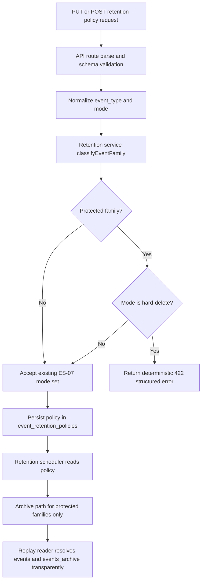
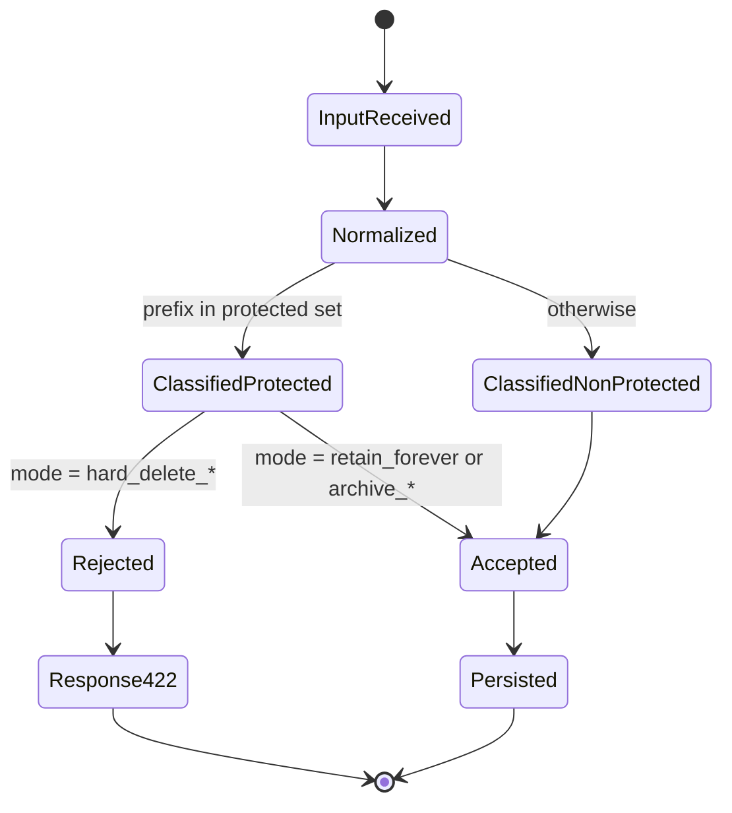

# Module: ADP-11 Replay-Safe Retention Policy

## Module purpose

This module design constrains ES-07 retention configuration so deterministic replay remains possible for process-critical event families while preserving ES-07 configurability for all non-protected event families. The policy enforces configuration-time rejection of hard-delete retention for protected families `{INSTANCE_*, TASK_*, GATEWAY_*, EXECUTION_*}`, guarantees that archived events remain queryable for replay paths (IR-07), and defines deterministic, structured error semantics so API and service behavior is stable and testable across retries and environments.

## Scope and non-goals

In scope:
- Deterministic validation semantics for retention policy upserts.
- Structured error contract for prohibited hard-delete on protected families.
- Compatibility contract with ES-07, IR-07, and XC-05.
- Additive migration/constraint guidance for storage-level guardrails.
- API/service/storage touchpoints and acceptance-to-test traceability.

Out of scope:
- Implementation edits in Zig/SQL.
- Changing replay algorithm semantics beyond transparent live+archive sourcing already required by IR-07.
- Breaking or removing existing ES-07 policy modes for non-protected families.

## Public interface

### Domain model and enums

```zig
pub const RetentionMode = enum {
    retain_forever,
    archive_keep_days,
    archive_keep_count,
    hard_delete_keep_days,
    hard_delete_keep_count,
};

pub const EventFamilyClass = enum {
    protected_replay_critical,
    non_protected,
};

pub const RetentionPolicyUpsert = struct {
    event_type: []const u8,
    mode: RetentionMode,
    value: ?u32,
    actor_id: []const u8,
    trace_id: ?[]const u8,
};

pub const RetentionPolicyDecision = struct {
    accepted: bool,
    normalized_event_type: []const u8,
    family_class: EventFamilyClass,
    normalized_mode: RetentionMode,
    reason_code: ?[]const u8,
};
```

### Service contracts

```zig
pub fn classifyEventFamily(event_type: []const u8) EventFamilyClass;

pub fn validateRetentionPolicyUpsert(
    allocator: std.mem.Allocator,
    input: RetentionPolicyUpsert,
) RetentionPolicyError!RetentionPolicyDecision;

pub fn upsertRetentionPolicy(
    allocator: std.mem.Allocator,
    tx: *db.Tx,
    input: RetentionPolicyUpsert,
) RetentionPolicyError!void;
```

### API error envelope contract (deterministic)

```json
{
  "type": "https://bpm.platform/errors/retention-policy-invalid",
  "title": "Retention policy rejected",
  "status": 422,
  "code": "RETENTION_POLICY_PROTECTED_FAMILY_HARD_DELETE_FORBIDDEN",
  "detail": "Hard-delete retention is forbidden for protected replay-critical event families.",
  "trace_id": "<trace-id>",
  "errors": [
    {
      "field": "mode",
      "reason": "HARD_DELETE_NOT_ALLOWED_FOR_PROTECTED_FAMILY",
      "event_type": "INSTANCE_STARTED",
      "event_family": "INSTANCE_*",
      "allowed_modes": ["retain_forever", "archive_keep_days", "archive_keep_count"],
      "requested_mode": "hard_delete_keep_days"
    }
  ]
}
```

Determinism rules:
1. `event_type` normalization is uppercase ASCII trim before classification.
2. Family matching uses prefix rules only: `INSTANCE_`, `TASK_`, `GATEWAY_`, `EXECUTION_`.
3. On rejection, `code`, `title`, `reason`, and `allowed_modes` ordering are fixed.
4. Validation is pure and side-effect free before DB write.

## Policy semantics

### Protected event families

Protected families are all event types whose normalized name starts with one of:
- `INSTANCE_`
- `TASK_`
- `GATEWAY_`
- `EXECUTION_`

For protected families:
- Allowed: `retain_forever`, `archive_keep_days`, `archive_keep_count`
- Prohibited: `hard_delete_keep_days`, `hard_delete_keep_count`

Explicit acceptance requirement mapping:
- `INSTANCE_STARTED + hard_delete_*` MUST be rejected with structured error envelope above.

### Non-protected event families (ES-07 configurability preserved)

For non-protected families, all ES-07 modes remain configurable, including hard-delete variants where currently supported. ADP-11 introduces no narrowing for non-protected event types.

## Data flow diagram



## State transitions



## Error taxonomy

```zig
pub const RetentionPolicyError = error{
    InvalidEventType,
    InvalidMode,
    InvalidPolicyValue,
    ProtectedFamilyHardDeleteForbidden,
    PolicyConstraintViolation,
    PersistenceFailed,
    OutOfMemory,
};
```

### Deterministic mapping

- `ProtectedFamilyHardDeleteForbidden` -> HTTP 422 -> code `RETENTION_POLICY_PROTECTED_FAMILY_HARD_DELETE_FORBIDDEN`
- `InvalidEventType` or `InvalidMode` -> HTTP 422 -> code `RETENTION_POLICY_INPUT_INVALID`
- `PolicyConstraintViolation` (DB-level safety net) -> HTTP 422 -> same protected-family code when violation reason matches guard
- `PersistenceFailed` -> HTTP 500 -> code `RETENTION_POLICY_PERSISTENCE_FAILED`

## Migration and constraint strategy (additive)

Primary enforcement remains service-layer validation for deterministic API semantics. Storage-level checks are additive guardrails:

1. Keep existing `event_retention_policies` table contract from ES-07.
2. Add CHECK constraint (or equivalent trigger) that rejects hard-delete for protected prefixes.
3. Constraint must only apply to protected prefixes; non-protected rows preserve existing ES-07 configurability.
4. Migration is additive and backward compatible: no column drops/renames, no behavior change for valid existing rows.
5. If legacy invalid rows exist before guard deployment, migration strategy should be:
- fail-fast with explicit remediation report, or
- staged `NOT VALID` constraint then cleanup then `VALIDATE CONSTRAINT`.

Recommended SQL shape (design guidance only):

```sql
CHECK (
  NOT (
    event_type LIKE 'INSTANCE_%' OR
    event_type LIKE 'TASK_%' OR
    event_type LIKE 'GATEWAY_%' OR
    event_type LIKE 'EXECUTION_%'
  )
  OR policy_type IN ('FOREVER', 'KEEP_DAYS', 'KEEP_COUNT')
)
```

Application layer must additionally prohibit any hard-delete action mode for protected families if such mode is represented outside `policy_type`.

## Archive queryability and replay determinism guarantees

To satisfy IR-07 and XC-05:

1. Protected-family events are never hard-deleted via retention policy.
2. When aged out of live table, protected-family events move to archive, remain queryable, and preserve sequence ordering semantics.
3. Replay reader must use transparent union of `events` and `events_archive` in deterministic `sequence_num` order.
4. Reconstruction across mixed live/archive boundaries must be observationally equivalent to pre-archival reconstruction.
5. Missing protected events are treated as replay integrity defects, not silently skipped.

## API, service, and storage touchpoints

API touchpoints:
- Retention policy create/update endpoint (existing ES-07 route).
- RFC 9457 error mapping in API error builder.

Service touchpoints:
- Retention policy validation service in event-store retention module.
- Retention scheduler decisioning path (archive vs prohibited hard-delete for protected).

Storage touchpoints:
- `event_retention_policies` policy rows.
- `events` and `events_archive` replay read path compatibility.
- Optional DB CHECK/trigger as defense-in-depth.

## Key invariants

1. No accepted protected-family policy can produce hard deletion.
2. Non-protected family policy freedom remains as in ES-07.
3. Validation outcome is deterministic for identical input.
4. Rejected requests never mutate policy state.
5. Replay over live+archive remains deterministic and complete for protected families.

## Acceptance-to-test traceability (ADP-11)

| ADP-11 / related acceptance target | Design section | Test guidance |
|---|---|---|
| Protected families allow only retain-forever or archive-queryable modes | Policy semantics; key invariants | Unit matrix: each protected prefix x allowed modes -> accept; hard-delete modes -> reject |
| `INSTANCE_STARTED` hard-delete rejection returns structured error | API error envelope contract; deterministic mapping | Integration test: update `INSTANCE_STARTED` to hard-delete, assert HTTP 422 + fixed code + stable error fields |
| Error behavior deterministic and testable | Determinism rules; error taxonomy | Repeated identical request yields byte-equivalent problem details excluding trace_id |
| Archive queryability preserves replay determinism (XC-05/IR-07) | Archive queryability and replay guarantees | Integration replay test where timeline spans `events` + `events_archive`; state hash equals pre-archive baseline |
| Additive backward-compatible migration/validation placement | Migration and constraint strategy | Migration test: existing non-protected policies unchanged; protected invalid policy blocked by validation/constraint |
| ES-07 configurability preserved for non-protected families | Non-protected event families section | Unit/integration tests: non-protected event type accepts hard-delete modes where ES-07 supports them |

## Open questions

1. Should protection matching remain strict prefix-only forever, or should a registry-level boolean (for example `replay_critical`) eventually replace prefix heuristics for future event families?
2. If both service-layer and DB-layer validation reject the same request, should the API always surface the service-layer error shape (preferred) even when DB raises first under race conditions?
