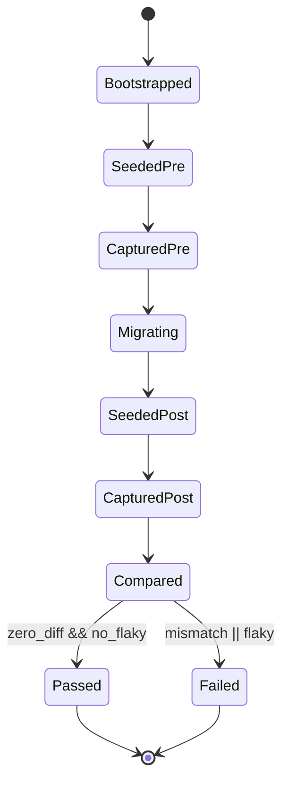

# Module: ADP-12 Default-Tenant Regression Suite

## Module purpose

This module defines an automated, deterministic regression suite that proves ADP-01 through ADP-11 schema adaptations preserve shipped Stage 1-6 behavior for the default tenant (`00000000-0000-0000-0000-000000000000`). The suite executes the same endpoint scenarios immediately before and after migration, canonicalizes responses under strict rules, and enforces zero-diff invariants for status code, response body, and response headers (except an explicitly bounded informational allowlist).

## Scope and non-goals

In scope:
- Deterministic pre-migration and post-migration orchestration.
- Full Stage 1-6 endpoint coverage matrix for default-tenant paths.
- Capture and canonicalization contract for response comparison.
- Flaky-signal controls and repeatability gates.
- Fixture/seeding assumptions and migration boundary orchestration.
- CI output and report artifact formats.
- Acceptance-to-test traceability for ADP-12.

Out of scope:
- Runtime feature implementation for ADP-01..ADP-11.
- New API behavior for non-default tenants.
- Performance benchmark pass/fail (handled by NFR/Release validation).

## Public interface

### Zig suite contracts (design signatures)

```zig
pub const RegressionPhase = enum {
    pre_migration,
    post_migration,
};

pub const ResponseSnapshot = struct {
    case_id: []const u8,
    phase: RegressionPhase,
    status_code: u16,
    headers_canonical_json: []const u8,
    body_canonical_bytes: []const u8,
    body_sha256_hex: [64]u8,
    content_type: []const u8,
};

pub const InformationalAllowlist = struct {
    header_names: []const []const u8,
    json_pointer_paths: []const []const u8,
};

pub const RegressionCase = struct {
    case_id: []const u8,
    stage: u8,
    requirement_refs: []const []const u8,
    route: []const u8,
    method: []const u8,
    setup_fixture: []const u8,
    request_builder_id: []const u8,
    expected_status: u16,
};

pub const RegressionDiff = struct {
    case_id: []const u8,
    status_equal: bool,
    headers_equal: bool,
    body_equal: bool,
    mismatch_fields: []const []const u8,
};

pub const RegressionRunReport = struct {
    run_id: []const u8,
    migration_id: []const u8,
    default_tenant_id: []const u8,
    pre_case_count: usize,
    post_case_count: usize,
    pair_count: usize,
    zero_diff_pass: bool,
    flaky_signals_detected: bool,
};

pub fn loadStageCoverageMatrix(allocator: std.mem.Allocator) ![]RegressionCase;

pub fn executePhase(
    allocator: std.mem.Allocator,
    phase: RegressionPhase,
    matrix: []const RegressionCase,
    allowlist: InformationalAllowlist,
) ![]ResponseSnapshot;

pub fn canonicalizeResponse(
    allocator: std.mem.Allocator,
    raw_status_code: u16,
    raw_headers: []const HeaderPair,
    raw_body: []const u8,
    content_type: []const u8,
    allowlist: InformationalAllowlist,
) !ResponseSnapshot;

pub fn compareSnapshots(
    allocator: std.mem.Allocator,
    pre: []const ResponseSnapshot,
    post: []const ResponseSnapshot,
) ![]RegressionDiff;

pub fn generateAdp12Report(
    allocator: std.mem.Allocator,
    diffs: []const RegressionDiff,
    flaky: FlakySignals,
) !RegressionRunReport;
```

### CI interface

```text
zig build test-adp12-regression
zig build test-adp12-regression -Dphase=pre
zig build test-adp12-regression -Dphase=post
```

### Report contract (JSON)

```json
{
  "run_id": "WF02-adp12-20260526",
  "requirement_id": "ADP-12",
  "default_tenant_id": "00000000-0000-0000-0000-000000000000",
  "migration_window": {
    "pre_schema_version": "before-adp-migrations",
    "post_schema_version": "after-adp-migrations"
  },
  "summary": {
    "cases_total": 0,
    "pairs_compared": 0,
    "zero_diff": true,
    "mismatches": 0,
    "flaky_signals": 0
  },
  "allowlist": {
    "headers": ["date", "server", "x-trace-id", "x-request-id", "content-length", "transfer-encoding", "connection", "keep-alive"],
    "json_pointers": ["/trace_id", "/timestamp", "/now", "/generated_at", "/uptime_ms", "/duration_ms"]
  },
  "cases": [
    {
      "case_id": "S4-API-03-start-instance-default",
      "status_equal": true,
      "headers_equal": true,
      "body_equal": true,
      "diffs": []
    }
  ]
}
```

## Deterministic orchestration across migration boundary

### Execution phases

1. Phase A (pre-migration baseline):
- Initialize isolated test DB from clean fixture set.
- Seed deterministic default-tenant data.
- Execute full Stage 1-6 matrix and persist canonical snapshots (`pre`).

2. Migration boundary:
- Apply adaptation migration set (ADP-01..ADP-11 migration files only).
- Re-run deterministic seed reconciliation for non-schema fixture tables only.
- Verify migration checksum list matches expected set before continuing.

3. Phase B (post-migration validation):
- Execute the same matrix with identical request builders and fixture IDs.
- Persist canonical snapshots (`post`).
- Pair by `case_id` and compare with strict zero-diff policy.

4. Verdict:
- PASS only if every pair has equal status/body/headers after canonicalization.
- Any mismatch or flaky signal => FAIL.

### Phase state transitions



## Data flow diagram

```mermaid
flowchart LR
    A[Coverage matrix loader] --> B[Request executor]
    B --> C[Raw HTTP response capture]
    C --> D[Canonicalizer]
    D --> E[(Snapshot store pre)]

    E --> F[Migration orchestrator ADP-01..11]
    F --> G[Request executor post]
    G --> H[Raw HTTP response capture]
    H --> I[Canonicalizer]
    I --> J[(Snapshot store post)]

    J --> K[Deterministic comparator]
    E --> K
    K --> L[ADP-12 report generator]
    L --> M[CI artifacts + pass/fail exit]
```



## Canonicalization and comparison rules

### Header comparison

Compared headers:
- All response headers except explicit informational allowlist.

Excluded header allowlist (case-insensitive):
- `date`
- `server`
- `x-trace-id`
- `x-request-id`
- `content-length`
- `transfer-encoding`
- `connection`
- `keep-alive`

Header canonicalization rules:
1. Lowercase header names.
2. Trim outer whitespace from values.
3. Preserve internal value bytes.
4. Sort by `name`, then `value`.
5. Join repeated headers as ordered arrays (no lossy merge).

### Body comparison

By `content-type`:
- `application/json`: canonical JSON serialization (stable key order, UTF-8, no insignificant whitespace) after removal of allowed informational JSON pointers.
- `text/*`: compare UTF-8 bytes exactly after `CRLF -> LF` normalization.
- binary/other: compare exact decoded entity bytes and SHA-256.

Allowed informational JSON pointers removed before compare:
- `/trace_id`
- `/timestamp`
- `/now`
- `/generated_at`
- `/uptime_ms`
- `/duration_ms`

No other fields may be excluded. Any new exclusion must be explicitly added to this design and reviewed.

### Status comparison

- Status code must be exactly equal.
- No equivalence classes (for example 200 vs 204) are permitted.

### Deterministic pairing

- Pair key is `case_id` only.
- Pre and post runs must produce identical `case_id` set and count.
- Missing or extra case in either phase is an immediate failure.

## Flaky-signal controls

1. Baseline stability gate:
- Run Phase A twice back-to-back.
- If canonical outputs differ between the two pre-migration runs, abort as `FLAKY_BASELINE` before migration.

2. Deterministic inputs:
- Fixed fixture IDs/UUIDs and correlation keys.
- Fixed payload values for time-sensitive fields.
- Default-tenant token source fixed to the same principal/role set.

3. Async stabilization:
- For webhook/scheduler-observable cases, poll deterministic read endpoints until terminal expected state or bounded timeout.
- Timeout is a hard failure, not skip.

4. Environment guards:
- Execute against isolated DB and single test server instance.
- Scheduler jitter-sensitive assertions rely on final observable API state only, not internal timing.

## Fixture and seeding assumptions

1. Default tenant row exists with id `00000000-0000-0000-0000-000000000000`.
2. Default-tenant users, groups, roles, and tokens are pre-seeded and stable.
3. Deterministic seed pack includes:
- event types and schemas used by Stage 1/3/6 flows,
- definitions with fixed IDs for Stage 2/3/4/6 execution paths,
- task ownership fixtures for Stage 5 role/identity checks,
- webhook/DLQ fixtures for Stage 6 behavior validation.
4. Seed reconciliation after migration may add missing adaptation columns, but cannot mutate semantic fixture values used by comparisons.

## Coverage matrix: Stage 1-6 default-tenant endpoint paths

All cases run with default-tenant context (no explicit tenant claim or claim resolving to default tenant).

| Case ID | Stage | Requirement focus | Method | Endpoint path | Default-tenant execution path |
|---|---:|---|---|---|---|
| S1-ES01-append | 1 | ES-01 | POST | /events | append event on default-tenant instance |
| S1-ES02-read-ordered | 1 | ES-02 | GET | /instances/{id}/events | ordered read for default-tenant instance |
| S1-ES03-idempotency | 1 | ES-03 | POST | /events | duplicate idempotency key dedupe |
| S1-ES04-global | 1 | ES-04 | GET | /events/global | default-tenant global stream slice |
| S1-ES05-registry-upsert | 1 | ES-05 | POST | /event-types | register event type schema |
| S1-ES05-registry-validate | 1 | ES-05 | POST | /events | schema-invalid payload returns 422 |
| S1-ES06-point-in-time | 1 | ES-06 | GET | /instances/{id}/events?up_to_sequence=K | point-in-time ordered read |
| S1-ES07-archive-read | 1 | ES-07 | GET | /archive/events | archived events remain queryable |
| S2-PD01-create | 2 | PD-01 | POST | /definitions | create definition |
| S2-PD02-validate | 2 | PD-02 | POST | /definitions/validate | graph validation endpoint behavior |
| S2-PD03-version | 2 | PD-03 | POST | /definitions/{name}/versions | version creation semantics |
| S2-PD04-lifecycle | 2 | PD-04 | POST | /definitions/{id}/lifecycle | lifecycle transition |
| S2-PD07-get | 2 | PD-07 | GET | /definitions/{id} | retrieve persisted definition |
| S2-PD09-export | 2 | PD-09 | GET | /definitions/{id}/export | deterministic export payload |
| S3-EE01-start | 3 | EE-01 | POST | /instances | start instance |
| S3-EE03-task-activate | 3 | EE-03 | GET | /instances/{id} | first active task/token observable |
| S3-EE04-complete-task | 3 | EE-04 | POST | /tasks/{id}/complete | complete task and advance |
| S3-EE05-exclusive | 3 | EE-05 | POST | /tasks/{id}/complete | exclusive branch resolution |
| S3-EE06-07-parallel | 3 | EE-06/EE-07 | POST | /tasks/{id}/complete | split and join behavior observable |
| S3-EE08-cancel | 3 | EE-08 | POST | /instances/{id}/cancel | cancellation contract |
| S3-EE09-vars | 3 | EE-09 | GET | /instances/{id} | variable merge/scoping result |
| S3-EE11-reconstruct | 3 | EE-11 | GET | /instances/{id}/history | reconstruction-visible timeline |
| S4-API02-def-crud | 4 | API-02 | GET | /definitions | list definitions |
| S4-API03-instance-mgmt | 4 | API-03 | GET | /instances | list/filter instances |
| S4-API04-task-ops | 4 | API-04 | GET | /tasks | task query path |
| S4-API05-history | 4 | API-05 | GET | /instances/{id}/history | history response shape |
| S4-API06-pagination | 4 | API-06 | GET | /instances?cursor=... | cursor pagination contract |
| S4-API07-validation | 4 | API-07 | POST | /instances | invalid body -> structured 422 |
| S4-API08-auth | 4 | API-08 | GET | /instances | bearer auth success/fail path |
| S4-API09-tracing | 4 | API-09 | GET | /health/live | trace header propagation behavior |
| S4-API12-health | 4 | API-12 | GET | /health/ready | DB-backed health response |
| S5-SCH01-create-timer | 5 | SCH-01 | POST | /tasks/{id}/complete | escalation/next timer creation side-effect |
| S5-SCH02-fire-observable | 5 | SCH-02 | GET | /instances/{id}/history | timer-fired event observable |
| S5-SCH03-cancel-timer | 5 | SCH-03 | POST | /instances/{id}/cancel | timer cancellation side-effect |
| S5-IDN01-users | 5 | IDN-01 | GET | /users | default-tenant user registry reads |
| S5-IDN02-groups | 5 | IDN-02 | GET | /groups | default-tenant group reads |
| S5-IDN03-rbac | 5 | IDN-03 | GET | /admin/audit | role-gated access behavior |
| S5-IDN04-tokens | 5 | IDN-04 | POST | /tokens | token issue/validation flow |
| S6-OBS01-logging-proxy | 6 | OBS-01 | GET | /health/live | request/trace observability headers stable |
| S6-OBS02-metrics | 6 | OBS-02 | GET | /metrics | prometheus payload stability under canonicalization |
| S6-OBS03-audit | 6 | OBS-03 | GET | /admin/audit | audit list response contract |
| S6-OBS04-timeline | 6 | OBS-04 | GET | /instances/{id}/timeline | timeline response contract |
| S6-OBS05-dlq-list | 6 | OBS-05 | GET | /dlq | DLQ listing response |
| S6-EXT01-service-task | 6 | EXT-01 | POST | /tasks/{id}/complete | service task execution path |
| S6-EXT02-webhook-subscribe | 6 | EXT-02 | POST | /webhooks/subscriptions | webhook subscription contract |
| S6-EXT02-webhook-list | 6 | EXT-02 | GET | /webhooks/subscriptions | subscription read path |

## Report artifacts and CI output format

Required artifacts:
- `tests/reports/adp12/adp12-regression-summary.json`
- `tests/reports/adp12/pre-snapshots.ndjson`
- `tests/reports/adp12/post-snapshots.ndjson`
- `tests/reports/adp12/diffs.ndjson`
- `tests/reports/adp12/flaky-signals.json`

CI pass/fail criteria:
1. Pre and post case counts are equal and match matrix cardinality.
2. All paired cases satisfy `status_equal && headers_equal && body_equal`.
3. `flaky_signals_detected == false`.
4. Exit code is non-zero on any mismatch, missing case, or flaky gate breach.

## Error taxonomy

```zig
pub const Adp12RegressionError = error{
    MatrixLoadFailed,
    FixtureSeedFailed,
    MigrationApplyFailed,
    PhaseExecutionFailed,
    SnapshotCanonicalizationFailed,
    SnapshotPairingMismatch,
    ResponseDiffDetected,
    FlakyBaselineDetected,
    AsyncStabilizationTimeout,
    ReportWriteFailed,
    OutOfMemory,
};
```

Error classification:
- Deterministic suite failures (`ResponseDiffDetected`, `SnapshotPairingMismatch`) => requirement FAIL.
- Harness/environment failures (`FixtureSeedFailed`, `MigrationApplyFailed`, `AsyncStabilizationTimeout`) => infrastructure FAIL.
- Flake detection (`FlakyBaselineDetected`) => explicit flaky FAIL, never silently retried in CI.

## Backend touchpoints required for implementation

Test harness modules:
- `tests/integration/adp12_default_tenant_regression_test.zig`
- `tests/integration/support/regression_matrix.zig`
- `tests/integration/support/response_canonicalizer.zig`
- `tests/integration/support/migration_window_orchestrator.zig`
- `tests/integration/support/report_writer.zig`

Existing backend modules consumed (read-only behavior validation):
- API route modules under `src/api/routes/`
- Auth and trace middleware under `src/api/middleware/`
- Event/definition/engine/task/scheduler/identity/obs services currently backing Stage 1-6 routes
- Migration runner under `src/db/migrations.zig`

Build wiring touchpoints:
- `build.zig` target for `test-adp12-regression`
- optional helper target for phase-split execution (`-Dphase=pre|post`)

## Acceptance-to-test traceability (ADP-12)

| ADP-12 acceptance criterion | Executable test design | Evidence artifact |
|---|---|---|
| Design defines pre-migration and post-migration execution phases with deterministic orchestration | Phase machine test: `pre -> migrate -> post` with enforced ordering and checksum gate | `adp12-regression-summary.json.migration_window` |
| Canonical diff rules specify exactly what is compared and what is excluded | Canonicalizer contract tests for headers/body/status and allowlist behavior | `diffs.ndjson` + canonicalizer unit output |
| Coverage matrix maps Stage 1-6 endpoints and default-tenant execution paths | Matrix completeness test asserting required case IDs and stage coverage counts | `adp12-regression-summary.json.cases_total` + matrix manifest |
| Design includes report format and pass/fail criteria for byte-equal response validation | Report schema validation test and strict comparator assertion on `zero_diff` | `adp12-regression-summary.json` |
| Design provides acceptance-to-test traceability for ADP-12 | Traceability table and test ID mapping check in suite metadata | `adp12-regression-summary.json.requirement_id` + mapping manifest |
| Regression suite passes pre/post with zero diff for default tenant | End-to-end ADP-12 integration run over migration window | `adp12-regression-summary.json.zero_diff=true` and empty mismatch list |

## Dependencies

Depends on:
- Existing Stage 1-6 API implementation as baseline under test.
- Adaptation migration set ADP-01..ADP-11.
- Deterministic default-tenant auth/token fixture source.
- Migration runner and isolated test PostgreSQL.

Must not depend on:
- Non-deterministic wall-clock comparison semantics in assertions.
- External network services beyond the local BPM test environment.
- Any tenant other than default tenant for ADP-12 verdict.
- Internal DB row ordering not exposed by API contracts.

## Open questions

1. Should `/metrics` comparison remain strict text canonicalization, or should metric sample values be excluded to avoid unavoidable runtime drift?
2. For `Retry-After` and similar protocol headers, do we treat them as informational allowlist entries globally or only for specific negative test cases?
3. Are any Stage 6 webhook endpoints intentionally non-deterministic in body fields beyond the current JSON pointer allowlist?
4. Should OIDC-30 token helper be mandatory for this suite in all environments, or can legacy internal token issuance remain a fallback during coexistence?
