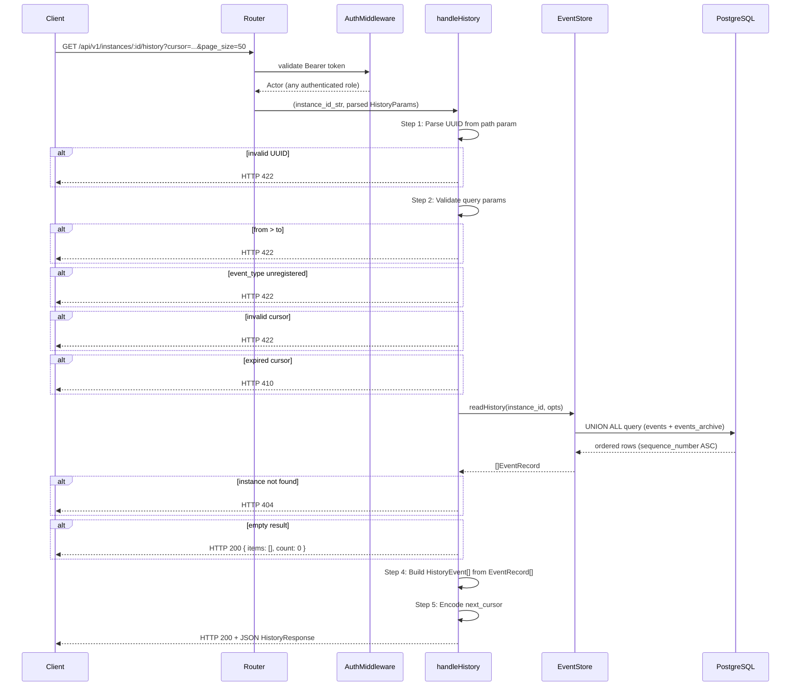

# Module: api-05-history-endpoint

**Covers:** API-05 (GET /instances/:id/history), API-06 (pagination)
**Files:** `src/api/routes/instances.zig` (extend existing)
**Depends on:** `src/event_store/store.zig`, `src/design/event_store.md`, `src/design/api_conventions.md`, `src/design/api-03-instance-management.md`, `src/design/api-04-task-operations.md`

---

## Module purpose

This module designs the `GET /instances/:id/history` endpoint required by API-05. The endpoint returns the full ordered event log for a given process instance in ascending sequence order, with optional filtering by `event_type` and ISO 8601 timestamp range (`from` / `to`). Results are paginated via cursor-based pagination per API-06. The endpoint MUST include archived events (from `events_archive`) in their correct sequence position alongside live events (from `events`).

This extends the existing `src/api/routes/instances.zig` handler file, following the same `HandlerResult{status_code, body}` pattern used by `handleGetById`, `handleList`, `handleCreate`, `handleCancel`, and `handleReconstruct`.

---

## Public interface

### 1. Query parameter types

```zig
/// Parsed query parameters for GET /api/v1/instances/:id/history.
pub const HistoryParams = struct {
    /// Optional: filter to a specific event_type name.
    /// Null means return events of all types.
    /// Validated against event_type_registry — unregistered types → HTTP 422.
    event_type: ?[]const u8,

    /// Optional: return events with created_at >= this point.
    /// ISO 8601 string, parsed to i64 (UTC epoch microseconds).
    /// Null means no lower bound.
    from: ?[]const u8,

    /// Optional: return events with created_at <= this point.
    /// ISO 8601 string, parsed to i64 (UTC epoch microseconds).
    /// Null means no upper bound.
    to: ?[]const u8,

    /// Cursor for continuation pagination (opaque base64url string).
    /// Null means start from the beginning (sequence_number 1).
    cursor: ?[]const u8,

    /// Page size; default 50, max 200.
    page_size: u16,
};
```

### 2. Response types

```zig
/// A single event in the history response.
/// Mirrors the EventRecord from event_store.zig but with all fields
/// serialised for JSON output. Includes archived events identically.
pub const HistoryEvent = struct {
    /// UUID formatted as lowercase hex with hyphens.
    event_id: []const u8,
    /// UUID of the owning process instance (redundant but included for completeness).
    instance_id: []const u8,
    /// Registered event type name (e.g. "INSTANCE_STARTED", "TASK_COMPLETED").
    event_type: []const u8,
    /// JSON object payload as a string.
    payload: []const u8,
    /// UUID of the actor who produced this event.
    actor_id: []const u8,
    /// UTC epoch microseconds since Unix epoch.
    created_at: i64,
    /// Per-instance monotonically increasing sequence number (ES-02).
    sequence_number: i64,
    /// Globally unique idempotency key, 1..255 chars.
    idempotency_key: []const u8,
    /// JSON bytes; string→string metadata map (defaults to "{}").
    metadata: []const u8,
    /// Cross-instance monotonic global sequence number (ES-04).
    global_seq: i64,
};

/// Paginated response body for GET /api/v1/instances/:id/history.
pub const HistoryResponse = struct {
    /// Events on this page, in ascending sequence_number order.
    /// May be empty for an instance with no events or a filtered range with no matches.
    items: []HistoryEvent,
    /// Opaque cursor for the next page; null if this is the last page.
    /// Format: base64url_no_pad("H:" || decimal_string(last_item.sequence_number))
    next_cursor: ?[]const u8,
    /// Number of items on this page.
    count: usize,
};
```

### 3. Handler signature

```zig
/// GET /api/v1/instances/:id/history
///
/// Returns the full ordered event log for an instance in ascending sequence order.
/// Includes archived events (events_archive) merged by sequence_number with live events.
///
/// Query parameters:
///   event_type — optional filter to a specific event type name
///   from       — optional ISO 8601 timestamp (inclusive lower bound on created_at)
///   to         — optional ISO 8601 timestamp (inclusive upper bound on created_at)
///   cursor     — optional opaque continuation cursor
///   page_size  — validated integer, default 50, max 200
///
/// Authorisation: any authenticated role (API-05 AC).
///
/// Success:              HTTP 200 + JSON HistoryResponse.
/// Instance not found:   HTTP 404 + Problem Details.
/// Invalid instance_id:  HTTP 422 + Problem Details.
/// from > to:            HTTP 422 + Problem Details.
/// Unknown event_type:   HTTP 422 + Problem Details.
/// Invalid cursor:       HTTP 422 + Problem Details.
/// Expired cursor:       HTTP 410 + Problem Details.
/// Invalid page_size:    HTTP 422 + Problem Details.
/// Pool exhausted:       HTTP 503 + Problem Details.
/// Server error:         HTTP 500 + Problem Details.
pub fn handleHistory(
    store: *event_store.Store,
    allocator: std.mem.Allocator,
    instance_id_str: []const u8,
    params: HistoryParams,
) HandlerResult;
```

### 4. Route registration

The history endpoint is registered **after** `/:id/cancel`, `/:id/reconstruct`, and `/:id` (GET) so the router does not consume `"history"` as a UUID path parameter:

| Method | Path                                   | Handler               | Role required        | Req body |
|--------|----------------------------------------|-----------------------|----------------------|----------|
| `GET`  | `/api/v1/instances/:id/history`        | `handleHistory` (NEW) | Any authenticated    | none     |

The router maps `/api/v1/instances/:id/history` before the generic `/:id` pattern. The literal segment `"history"` must not match the `/:id` UUID parser.

---

## Data flow diagram



---

## Archived event inclusion strategy

### Problem

The existing `Store.read()` queries only the `events` table. API-05 requires that archived events (in `events_archive`) be returned in their correct sequence position alongside live events.

### Strategy: UNION ALL with wrapped ORDER BY

A **new method** `Store.readHistory()` is required. It queries both tables and merges results by sequence_number:

```sql
SELECT event_id, instance_id, event_type, payload, actor_id,
       (EXTRACT(EPOCH FROM created_at) * 1000000)::bigint AS created_at_us,
       sequence_number, idempotency_key, metadata, global_seq
FROM (
    SELECT * FROM events
    WHERE instance_id = $1
      AND ($2::text IS NULL OR event_type = $2)
      AND ($3::bigint IS NULL OR (EXTRACT(EPOCH FROM created_at) * 1000000)::bigint >= $3)
      AND ($4::bigint IS NULL OR (EXTRACT(EPOCH FROM created_at) * 1000000)::bigint <= $4)
    UNION ALL
    SELECT event_id, instance_id, event_type, payload, actor_id,
           created_at, sequence_number, idempotency_key, metadata, global_seq
    FROM events_archive
    WHERE instance_id = $1
      AND ($2::text IS NULL OR event_type = $2)
      AND ($3::bigint IS NULL OR (EXTRACT(EPOCH FROM created_at) * 1000000)::bigint >= $3)
      AND ($4::bigint IS NULL OR (EXTRACT(EPOCH FROM created_at) * 1000000)::bigint <= $4)
) AS combined
ORDER BY sequence_number ASC
LIMIT $5
OFFSET 0  -- cursor handled via sequence_number > $cursor_seq
```

**Key properties:**
- `UNION ALL` (not `UNION`) — events and archive are disjoint sets (archival moves rows atomically), no deduplication needed.
- The ORDER BY is on the outer query so sequence ordering is correct across both sources.
- All filter values are bound as `$N` positional parameters — no SQL string interpolation.
- The `events_archive` table has the identical column schema as `events` (plus `archived_at`, which is excluded from SELECT).

### Cursor pagination with UNION

The cursor encodes only the last seen `sequence_number`. When a cursor is provided:

```sql
-- Additional WHERE clause on the outer query:
AND sequence_number > $cursor_seq
```

Since `sequence_number` is monotonic per instance and the ORDER BY is `sequence_number ASC`, keyset pagination is trivial and correct.

### New Store method signature

```zig
/// Read history for an instance, spanning both `events` and `events_archive`.
/// Returns events in ascending sequence_number order.
///
/// Covers: API-05 (history endpoint), ES-07 (archived event inclusion).
///
/// Returns InstanceNotFound if instance_id does not exist in instance_projections.
/// Returns empty list if instance exists but has no events.
pub fn readHistory(
    self: *Store,
    allocator: std.mem.Allocator,
    instance_id: Uuid,
    opts: HistoryReadOpts,
) StoreError![]EventRecord;

/// Options for Store.readHistory().
pub const HistoryReadOpts = struct {
    /// Optional: filter to a specific event_type. Null = all types.
    event_type: ?[]const u8,
    /// Optional: inclusive lower bound on created_at (UTC µs). Null = no lower bound.
    from: ?i64,
    /// Optional: inclusive upper bound on created_at (UTC µs). Null = no upper bound.
    to: ?i64,
    /// Cursor: only return events with sequence_number > this value. Null = from start.
    after_sequence: ?i64,
    /// Maximum number of events to return. 1..200.
    limit: u16,
};
```

**Important:** `readHistory()` does NOT extend the existing `ReadOpts` or `read()`. It is a separate method because:
1. `read()` only queries `events` — changing it would break EE-11 reconstruction semantics (reconstruction should read only `events` since `events_archive` events have already been incorporated into the projection).
2. `readHistory()` uses different filter semantics (from/to are inclusive bounds, not just `up_to`).
3. `readHistory()` supports `after_sequence` cursor, while `read()` has `up_to_sequence` (upper bound).

### Consistency guarantee

Because archival moves rows from `events` to `events_archive` in a single transaction (DB-03, ES-07), and the `UNION ALL` spans both tables, a concurrent read during archival sees:
- **Pre-archival commit:** all events in `events`, none in `events_archive` → correct.
- **Post-archival commit:** archived events in `events_archive`, remaining in `events` → correct, ordered by sequence_number.
- **During archival transaction** (snapshot isolation): the reader sees the pre-archival state, consistent.

No event is ever duplicated or missing.

---

## Pagination design (API-06 compliance)

### Cursor format

Following the pattern established in API-03 (instances) and API-04 (tasks), the history cursor uses a 1-byte endpoint discriminator prefix to prevent cross-endpoint cursor reuse:

```
Raw cursor:  "H:" || decimal_string(sequence_number)
Encoded:     base64url_no_pad(raw_cursor)
```

**Example:**
- Last event on page has `sequence_number = 42`
- Raw: `"H:42"`
- Encoded (base64url, no padding): `"SDo0Mg"`

**Decoding:**
1. Base64url-decode the cursor string.
2. Reject if the raw does not start with `"H:"` → HTTP 422 (cross-endpoint cursor).
3. Split on `":"`, parse the suffix as `i64` → that is `after_sequence`.
4. If `after_sequence` is outside 24-hour window (see expiry), return HTTP 410.

### Cursor expiry (24 hours)

The cursor expiry check for history differs from instances/tasks. Since the cursor encodes only a `sequence_number` (not a timestamp), expiry cannot be detected from the cursor alone.

**Strategy:** BACKEND-DEV MUST add a lightweight timestamp lookup:
```sql
SELECT (EXTRACT(EPOCH FROM created_at) * 1000000)::bigint
FROM events WHERE instance_id = $1 AND sequence_number = $2
```
If not found in `events`, check `events_archive`:
```sql
SELECT (EXTRACT(EPOCH FROM created_at) * 1000000)::bigint
FROM events_archive WHERE instance_id = $1 AND sequence_number = $2
```
If neither finds the event (the cursor's reference event has been archived beyond the retention window or never existed), return HTTP 410.

If found, compute `now_us - cursor_event_created_at_us`. If > 86,400,000,000 (24 hours in µs), return HTTP 410.

**Alternative (simpler, recommended):** The cursor is based on `sequence_number`, which is a logical position, not a timestamp. The 24-hour expiry conceptually applies to "how old is the cursor" rather than "how old is the event at that position." Since cursors are opaque and the backend controls them, BACKEND-DEV MAY choose to embed the cursor creation time:

```
Raw cursor:  "H:" || decimal_string(now_us) || ":" || decimal_string(sequence_number)
```

This is the **recommended approach** — it is consistent with the pattern from API-03 and API-04 where cursors embed both a timestamp and a position. The `now_us` is the server's current time when the cursor is encoded (not the event's `created_at`).

With this approach:
- **Encoding:** `base64url_no_pad("H:" || decimal_string(now_us) || ":" || decimal_string(last_event.sequence_number))`
- **Decoding:** split on `":"`, expect 3 parts: `"H"`, `now_us` (i64), `sequence_number` (i64). If `now_us` is older than 24 hours → HTTP 410.
- This eliminates the need for a DB lookup for expiry checking.

### Page size

- Default: 50
- Maximum: 200
- Values ≤ 0 → HTTP 422
- Values > 200 → HTTP 422
- Internal: `limit = page_size + 1` (fetch one extra to determine if there's a next page)

### Pagination SQL pattern (with cursor)

```sql
SELECT ... FROM (
    SELECT * FROM events WHERE instance_id = $1 AND ...
    UNION ALL
    SELECT ... FROM events_archive WHERE instance_id = $1 AND ...
) AS combined
WHERE sequence_number > $cursor_seq
ORDER BY sequence_number ASC
LIMIT $page_size + 1
```

**Without cursor:** omit `WHERE sequence_number > $cursor_seq`.

After fetching `page_size + 1` rows:
- If ≤ `page_size` rows returned → last page, `next_cursor = null`.
- If `page_size + 1` rows returned → more pages exist. Use row at index `page_size` (0-based) as the cursor reference, return first `page_size` rows.

---

## Request and response JSON shapes

### GET /api/v1/instances/:id/history — success response (HTTP 200)

```json
{
  "items": [
    {
      "event_id":         "xxxxxxxx-xxxx-xxxx-xxxx-xxxxxxxxxxxx",
      "instance_id":      "xxxxxxxx-xxxx-xxxx-xxxx-xxxxxxxxxxxx",
      "event_type":       "INSTANCE_STARTED",
      "payload":          "{\"initial_variables\":{\"amount\":5000}}",
      "actor_id":         "xxxxxxxx-xxxx-xxxx-xxxx-xxxxxxxxxxxx",
      "created_at":       1716220800000000,
      "sequence_number":  1,
      "idempotency_key":  "req-abc123",
      "metadata":         "{\"trace_id\":\"trace-xyz\"}",
      "global_seq":       42
    },
    {
      "event_id":         "yyyyyyyy-yyyy-yyyy-yyyy-yyyyyyyyyyyy",
      "instance_id":      "xxxxxxxx-xxxx-xxxx-xxxx-xxxxxxxxxxxx",
      "event_type":       "TASK_CREATED",
      "payload":          "{\"task_id\":\"...\",\"node_id\":\"approve-step\"}",
      "actor_id":         "xxxxxxxx-xxxx-xxxx-xxxx-xxxxxxxxxxxx",
      "created_at":       1716220801000000,
      "sequence_number":  2,
      "idempotency_key":  "req-def456",
      "metadata":         "{}",
      "global_seq":       43
    }
  ],
  "next_cursor": "SDo0Mg",
  "count": 2
}
```

### Empty result (instance exists but no events, or filtered range has no matches)

```json
{
  "items": [],
  "next_cursor": null,
  "count": 0
}
```
HTTP 200.

### Query parameter examples

| Scenario | Query string |
|---|---|
| All events, default page size | `GET /api/v1/instances/:id/history` |
| Filter by event type | `GET /api/v1/instances/:id/history?event_type=TASK_COMPLETED` |
| Filter by time range | `GET /api/v1/instances/:id/history?from=2026-01-01T00:00:00Z&to=2026-06-01T00:00:00Z` |
| With pagination | `GET /api/v1/instances/:id/history?page_size=100&cursor=SDo0Mg` |
| Combined filters | `GET /api/v1/instances/:id/history?event_type=INSTANCE_STARTED&from=2026-01-01T00:00:00Z&to=2026-06-01T00:00:00Z&page_size=50` |

---

## Error taxonomy

| HTTP status | Problem type slug | Condition |
|---|---|---|
| `404` | `not-found` | `instance_id` does not exist in `instance_projections` |
| `410` | `gone` | Cursor has expired (>24 hours since the cursor was issued) |
| `422` | `unprocessable-entity` | `instance_id` path parameter is not a valid UUID |
| `422` | `unprocessable-entity` | `from` timestamp > `to` timestamp |
| `422` | `unprocessable-entity` | `event_type` is not registered in `event_type_registry` |
| `422` | `unprocessable-entity` | `from` or `to` is not a valid ISO 8601 timestamp |
| `422` | `unprocessable-entity` | `cursor` is malformed (not valid base64url, wrong prefix, or cross-endpoint) |
| `422` | `unprocessable-entity` | `page_size` ≤ 0 or > 200 |
| `503` | `service-unavailable` | Connection pool exhausted |
| `500` | `internal-error` | Unexpected persistence failure, serialisation error, or out of memory |

### Edge cases covered

| Edge case | Behaviour | HTTP |
|---|---|---|
| Instance has no events | Empty `items` array | 200 |
| Instance not found | Problem Details | 404 |
| `from` > `to` | Problem Details: "from timestamp must not be after to timestamp" | 422 |
| `from` is in the future (beyond all events) | Empty `items` array | 200 |
| `to` is before the first event's `created_at` | Empty `items` array | 200 |
| `event_type` not in registry | Problem Details: "unknown event_type '<value>'" | 422 |
| Cursor from a different endpoint (e.g., `/tasks`) | Problem Details: "cursor is not valid for this endpoint" | 422 |
| Cursor expired (>24 hours) | Problem Details: "cursor has expired; re-query without a cursor" | 410 |
| `page_size` = 0 | Problem Details | 422 |
| `page_size` = 201 | Problem Details | 422 |
| All events are archived (instance exists, all events in `events_archive`) | Returns all events from archive, correctly ordered | 200 |
| Mixed live + archived events | Merged by `sequence_number ASC` via `UNION ALL` | 200 |
| Concurrent archival during read | Snapshot isolation ensures consistent view | 200 |

---

## State transitions (not applicable)

This is a read-only endpoint. No state is modified. The instance's status is checked only for existence (404 if not found); the endpoint works for instances of any status (ACTIVE, COMPLETED, CANCELLED, ERROR).

---

## Dependencies

| Dependency | Usage | Must NOT depend on |
|---|---|---|
| `src/event_store/store.zig` | New `readHistory()` method with `UNION ALL` across `events` + `events_archive` | — |
| `src/event_store/registry.zig` | Validate `event_type` query parameter against registered types | — |
| `src/api/errors.zig` | Build RFC 9457 Problem Details for all error responses | Any route file |
| `src/api/routes/instances.zig` | The `handleHistory` handler is added to this file; follows existing `HandlerResult` pattern | — |
| `migrations/001_event_store.sql` | `events` table schema (no migration needed — reads existing columns) | — |
| `migrations/003_event_archive.sql` | `events_archive` table schema (identical to `events`) | — |
| `migrations/002_event_type_registry.sql` | Validates `event_type` filter against registered types | — |

**What this module does NOT depend on:**
- It does NOT depend on `instance_projections` for data (only for existence check).
- It does NOT depend on `engine/transition.zig` (pure read operation, no state transition).
- It does NOT depend on `tasks/` or `definition/` modules.
- It does NOT write to any table.

---

## Open questions

1. **ISO 8601 timestamp parsing precision:** The `from`/`to` parameters are ISO 8601 strings. Should the parser accept date-only strings (e.g. `2026-01-01` → start of day UTC)? **Recommendation:** Accept full ISO 8601 with timezone; reject ambiguous formats. BACKEND-DEV to implement a `parseIso8601ToMicros()` helper.

2. **event_type validation granularity:** When `event_type` is provided, should validation be a lightweight check (SELECT 1 FROM event_type_registry) or full schema validation? **Recommendation:** Lightweight existence check only. The `event_type` filter is for query narrowing, not payload validation. If the event_type does not exist in the registry, return 422.

3. **Cursor expiry lookup overhead:** The recommended approach embeds `now_us` in the cursor to avoid DB lookups. This means cursor expiry is based on when the cursor was issued, not when the referenced event was created. Is this acceptable per API-06? **Recommendation:** Yes. API-06 states "Cursors expire 24 hours after creation." The `now_us` at cursor encoding time is exactly the creation time of the cursor.
