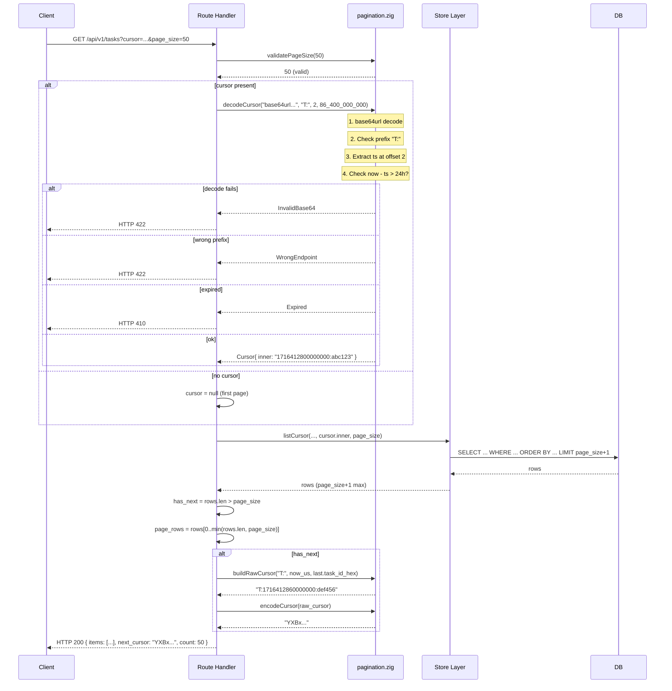
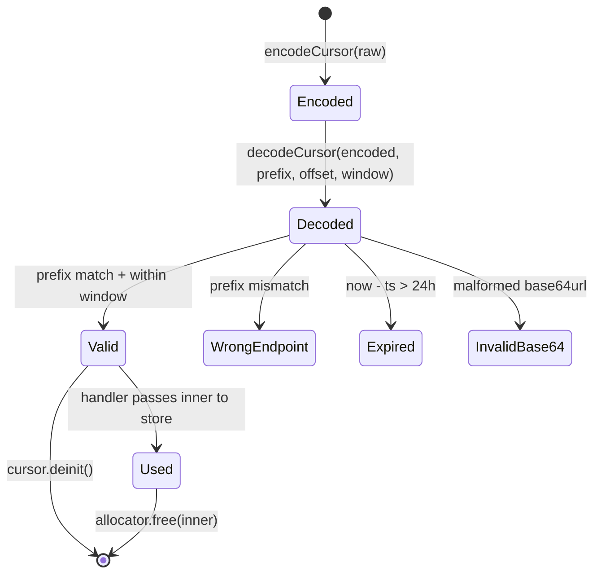

# Module: api-06-pagination

**Covers:** API-06 (shared cursor-based pagination)
**Files:** `src/api/pagination.zig` (new)
**Depends on:** `std.base64.url_safe_no_pad`, `std.time` / OS clock (permitted in handler layer only)
**Design artefact for:** `src/api/pagination.zig`

---

## Module purpose

This module centralises cursor-based pagination logic currently duplicated across four endpoint handlers (`tasks.zig`, `instances.zig` handleList, `instances.zig` handleHistory, `definitions.zig`). It provides a single source of truth for cursor encoding/decoding, prefix validation, expiry checking, page size validation, and a standardised `PageResponse(T)` struct. All list endpoints SHALL delegate pagination concerns to this module, eliminating duplicated encode/decode/expiry code and ensuring consistent behaviour across every endpoint.

---

## Public interface

### 1. Core types

```zig
/// A decoded, validated pagination cursor.
///
/// After successful decode+expiry check, handlers use the opaque `inner` value
/// directly as the store-layer continuation parameter.
pub const Cursor = struct {
    /// The raw decoded inner value (format depends on endpoint).
    /// Callers do not interpret this — they pass it to their store/list function.
    inner: []const u8,
    /// The allocator that owns `inner`; caller must free via `cursor.deinit()`.
    allocator: std.mem.Allocator,

    /// Release the decoded inner buffer.
    pub fn deinit(self: *const Cursor) void;
};

/// Standard page response envelope for all paginated list endpoints.
///
/// Serialised as:
///   { "items": [...], "next_cursor": "<base64url>" | null, "count": N }
pub fn PageResponse(comptime T: type) type {
    return struct {
        /// Items on this page. May be empty (len=0) for an empty result set.
        items: []T,
        /// Opaque cursor for the next page; null if this is the last page.
        next_cursor: ?[]const u8,
        /// Number of items on this page.
        count: usize,
    };
}
```

### 2. Page size validation

```zig
/// Maximum allowed page size for any list endpoint.
pub const MAX_PAGE_SIZE: u16 = 200;

/// Default page size when not specified by the caller.
pub const DEFAULT_PAGE_SIZE: u16 = 50;

/// Minimum allowed page size.
pub const MIN_PAGE_SIZE: u16 = 1;

/// Validate a raw page_size parameter.
///
/// Returns the validated u16 value, or an error.
///   - null or 0 → returns DEFAULT_PAGE_SIZE
///   - 1..200   → returns the value
///   - >200     → error.PageSizeTooLarge
pub fn validatePageSize(raw: ?u16) PageSizeError!u16;

pub const PageSizeError = error{
    PageSizeTooLarge,
};
```

### 3. Cursor encoding

```zig
/// Encode a raw cursor payload into an opaque base64url (no-padding) string.
///
/// `raw` is the endpoint-specific cursor payload, e.g. "T:1716412800000000:abc123...def".
/// Caller owns the returned string — free with `allocator.free(encoded)`.
pub fn encodeCursor(allocator: std.mem.Allocator, raw: []const u8) error{OutOfMemory}![]u8;
```

### 4. Cursor decoding with prefix and expiry validation

```zig
/// Decode and validate a cursor string.
///
/// Performs three checks:
///   1. Base64url decode — invalid encoding → error.InvalidBase64.
///   2. Prefix match — `prefix` must be a non-null literal like "T:", "H:", "I:", "D:".
///      If the decoded value does not start with `prefix`, returns error.WrongEndpoint.
///   3. Expiry check — the decoded cursor must contain an embedded creation timestamp
///      at the position indicated by `expiry_ts_offset`.  The offset is the byte index
///      (after the prefix) at which the decimal-encoded microsecond timestamp begins.
///      Cursors older than `expiry_window_us` (default 24h) return error.Expired.
///
/// Returns a Cursor with the decoded inner value; caller owns the inner buffer.
pub fn decodeCursor(
    allocator: std.mem.Allocator,
    encoded: []const u8,
    prefix: []const u8,
    expiry_ts_offset: usize,
    expiry_window_us: i64,
) CursorError!Cursor;

pub const CursorError = error{
    /// The base64url string is malformed.
    InvalidBase64,
    /// The cursor prefix does not match this endpoint.
    WrongEndpoint,
    /// The cursor has expired (> expiry_window_us old).
    Expired,
    /// Out of memory during decode.
    OutOfMemory,
};
```

### 5. Convenience helpers

```zig
/// Standard expiry window: 24 hours in microseconds.
pub const CURSOR_EXPIRY_US: i64 = 86_400_000_000;

/// Build a raw cursor payload for endpoints using the standard `PREFIX:ts_us:key` format.
///
/// `prefix` — literal such as "T:", "I:", "H:", "D:".
/// `timestamp_us` — current wall-clock time in microseconds (for expiry checking).
/// `key` — the sort-key value for this cursor position (e.g. task_id_hex, sequence_number).
///
/// Returns an allocator-owned string like "T:1716412800000000:abc123".
pub fn buildRawCursor(
    allocator: std.mem.Allocator,
    prefix: []const u8,
    timestamp_us: i64,
    key: []const u8,
) error{OutOfMemory}![]u8;

/// Build a raw cursor payload for endpoints whose sort key is also a timestamp.
///
/// `prefix` — literal.
/// `sort_timestamp_us` — the sort position (e.g. started_at of last item).
/// `key` — additional discriminator after the sort timestamp (e.g. instance_id_hex).
/// `cursor_created_at_us` — current time for expiry checking.
///
/// Returns: "I:1716412800000000:abc123:1716412860000000"
pub fn buildRawCursorTimestampKey(
    allocator: std.mem.Allocator,
    prefix: []const u8,
    sort_timestamp_us: i64,
    key: []const u8,
    cursor_created_at_us: i64,
) error{OutOfMemory}![]u8;

/// Extract a decimal i64 from `decoded` at byte range [offset..offset+len).
/// The range must contain only ASCII decimal digits (and optionally a leading '-'
/// if negative timestamps are possible, though they should not be).
pub fn parseIntFromCursor(
    decoded: []const u8,
    offset: usize,
    len: usize,
) error{InvalidCursor}!i64;

/// Locate the n-th colon (':') separator in a slice.
/// Returns the byte index of that colon, or null if fewer than `n` colons exist.
pub fn findNthColon(slice: []const u8, n: usize) ?usize;
```

---

## Data flow diagram



### Cursor lifecycle



---

## Cursor format specification

### Standardised prefix convention

Every endpoint cursor SHALL use a single-character alphabetic prefix followed by a colon (`:`). This prefix serves as the endpoint discriminator — a cursor from endpoint X MUST NOT be usable on endpoint Y (API-06 AC).

| Endpoint | Prefix | Cursor raw format | Sort order |
|---|---|---|---|
| `GET /tasks` | `T:` | `T:{created_at_us}:{task_id_hex}` | `created_at DESC, task_id DESC` |
| `GET /instances` | `I:` | `I:{started_at_us}:{instance_id_hex}:{cursor_created_at_us}` | `started_at DESC, instance_id DESC` |
| `GET /instances/:id/history` | `H:` | `H:{cursor_created_at_us}:{sequence_number}` | `sequence_number ASC` |
| `GET /definitions` | `D:` | `D:{cursor_created_at_us}:{created_at_us}` | `created_at DESC, definition_id DESC` |

### Design rationale for the three-segment `I:` cursor

The instances list uses a three-segment format (`I:{started_at_us}:{instance_id_hex}:{cursor_created_at_us}`) because:
- The sort key is `started_at`, which can be far in the past (a long-running instance).
- Embedding `started_at` alone in the cursor would make expiry meaningless — the timestamp of the *last item on the page* says nothing about when the cursor was issued.
- Therefore a third segment (`cursor_created_at_us` = `now()` at cursor creation time) is added solely for expiry checking.

Other endpoints use the simpler two-segment format because their sort key (`created_at`) is always close to the current time (tasks, definitions) or the expiry timestamp itself is the first segment (history).

### Encoding

All cursors are encoded with **base64url without padding** (`std.base64.url_safe_no_pad`):
```
raw     = "T:1716412800000000:a1b2c3d4e5f6a7b8b9c0d1e2f3a4b5c6"
encoded = "VDoxNzE2NDEyODAwMDAwMDA6YTFiMmMzZDRlNWY2YTdiOGI5YzBkMWUyZjNhNGI1YzY"
```

### Expiry mechanism

Every cursor embeds a creation timestamp as an ASCII decimal i64 (microseconds since Unix epoch). On decode:
1. The prefix is stripped (e.g. `T:` → 2 bytes).
2. The timestamp starts at `expiry_ts_offset` bytes after the prefix.
3. The timestamp is extracted up to the next `:` separator.
4. `now_us - cursor_ts_us > CURSOR_EXPIRY_US` (24h) → HTTP 410.

No server-side cursor storage is required. This is a stateless design — the cursor itself carries its own expiry information.

---

## Page size validation strategy

```zig
fn validatePageSize(raw: ?u16) PageSizeError!u16 {
    const v = raw orelse return DEFAULT_PAGE_SIZE;
    if (v == 0) return DEFAULT_PAGE_SIZE;
    if (v > MAX_PAGE_SIZE) return error.PageSizeTooLarge;
    return v;
}
```

The store layer receives `page_size + 1` as the SQL LIMIT. Fetching one extra row detects whether a next page exists without a separate `COUNT(*)` query:

```
if rows.len > page_size:
    next_cursor = encode(derive_from(rows[page_size - 1]))
    return rows[0..page_size]
else:
    next_cursor = null
    return rows
```

This is the cursor-based equivalent of the "has next page" pattern already used in all four handlers.

---

## Error taxonomy

| Error | HTTP status | RFC 9457 `type` | When |
|---|---|---|---|
| `InvalidBase64` | 422 | `INVALID_CURSOR` | Cursor string is not valid base64url |
| `WrongEndpoint` | 422 | `INVALID_CURSOR` | Cursor prefix doesn't match this endpoint |
| `Expired` | 410 | `CURSOR_EXPIRED` | Cursor is older than 24 hours |
| `PageSizeTooLarge` | 422 | `INVALID_PAGE_SIZE` | `page_size > 200` |
| `OutOfMemory` | 500 | `INTERNAL_ERROR` | Allocation failure |

The handlers map these to the appropriate RFC 9457 Problem Details response via the existing `errorResult()` pattern.

---

## Dependencies

### This module depends on

| Dependency | Reason |
|---|---|
| `std.base64.url_safe_no_pad` | Base64url encode/decode |
| `std.mem.Allocator` | All allocations explicit, no global state |
| `std.fmt` | Integer formatting/parsing for timestamps |
| OS clock (via `std.time` or direct syscall) | `currentMicrosecondTimestamp()` for expiry check |

### This module MUST NOT depend on

| Forbidden dependency | Reason |
|---|---|
| `src/engine/*` | Pagination is an API concern, not an engine concern |
| `src/db/*` | No database access; cursors are stateless |
| Any route handler | This is a library module, not a consumer of routes |
| `src/config.zig` | No configuration dependency; constants are self-contained |

### Who depends on this module

| Consumer | Usage |
|---|---|
| `src/api/routes/tasks.zig` | `handleList` — replaces inline cursor code |
| `src/api/routes/instances.zig` | `handleList`, `handleHistory` — replaces inline cursor code |
| `src/api/routes/definitions.zig` | `handleList` — replaces inline cursor code |
| `src/api/routes/events.zig` | Any future `GET /events` list endpoint |
| `src/api/routes/webhooks.zig` | Any future `GET /webhooks` list endpoint |
| `src/api/routes/identity.zig` | Any future `GET /users`, `GET /groups` list endpoints |
| `src/api/routes/dlq.zig` | Any future `GET /dlq` list endpoint |

---

## Migration plan

### Phase 1: Create shared module (this design)

`src/api/pagination.zig` is created with all the functions and types above. No existing code is changed yet.

### Phase 2: Refactor tasks.zig (BACKEND-DEV)

Replace the inline cursor logic in `handleList`:

**Before (remove):**
- Lines that base64url-decode the cursor string
- Lines that check `"T:"` prefix
- Lines that parse the `:` separator to extract `created_at_us` and `task_id_hex`
- Lines that check 24h expiry with `currentMicrosecondTimestamp()`
- Lines that build the raw next-cursor string
- Lines that base64url-encode the next cursor

**After (add):**
```zig
// Decode cursor
var cursor_created_at: ?i64 = null;
var cursor_task_id_opt: ?[]u8 = null;
if (params.cursor) |cursor_str| {
    const decoded = try pagination.decodeCursor(allocator, cursor_str, "T:", 2, pagination.CURSOR_EXPIRY_US);
    defer decoded.deinit();
    // Split decoded.inner on ":" → timestamp, task_id_hex
    const colon = pagination.findNthColon(decoded.inner, 0).?;
    cursor_created_at = try pagination.parseIntFromCursor(decoded.inner, 0, colon);
    cursor_task_id_opt = try allocator.dupe(u8, decoded.inner[colon + 1 ..]);
}

// Build next cursor
const raw = try pagination.buildRawCursor(sa, "T:", now_us, last_id_hex);
const encoded = try pagination.encodeCursor(sa, raw);
```

### Phase 3: Refactor instances.zig handleList (BACKEND-DEV)

Replace the three-segment cursor logic:

**Before (remove):**
- The loop to find two colon separators
- Manual parse of `ts_part`, `id_part`, `age_part`
- Manual 24h expiry check
- Manual raw cursor construction with `{d}:{s}:{d}`

**After (add):**
```zig
if (params.cursor) |cursor_str| {
    const decoded = try pagination.decodeCursor(allocator, cursor_str, "I:", 2, pagination.CURSOR_EXPIRY_US);
    defer decoded.deinit();
    // Split "started_at_us:instance_id_hex:cursor_created_at_us"
    const c1 = pagination.findNthColon(decoded.inner, 0).?;
    const c2 = pagination.findNthColon(decoded.inner, 1).?;
    cursor_started_at = try pagination.parseIntFromCursor(decoded.inner, 0, c1);
    cursor_instance_id = try allocator.dupe(u8, decoded.inner[c1 + 1 .. c2]);
    // cursor_created_at_us (third segment) was already expiry-checked by decodeCursor
}

// Build next cursor
const raw = try pagination.buildRawCursorTimestampKey(sa, "I:", last.started_at, last_id_hex, now_us);
const encoded = try pagination.encodeCursor(sa, raw);
```

### Phase 4: Refactor instances.zig handleHistory (BACKEND-DEV)

Replace the `"H:"` prefix cursor logic:

**Before (remove):**
- Manual `startsWith(u8, decoded, "H:")` check
- Manual loop to find colon separator
- Manual parse of `now_us_str` and `seq_str`
- Manual 24h expiry check

**After (add):**
```zig
if (params.cursor) |cursor_str| {
    const decoded = try pagination.decodeCursor(allocator, cursor_str, "H:", 2, pagination.CURSOR_EXPIRY_US);
    defer decoded.deinit();
    const colon = pagination.findNthColon(decoded.inner, 0).?;
    // now_us was already expiry-checked; extract sequence_number
    after_sequence = try pagination.parseIntFromCursor(decoded.inner, colon + 1, decoded.inner.len - colon - 1);
}

// Build next cursor
const raw = try pagination.buildRawCursor(sa, "H:", now_us, buf_str(seq));
const encoded = try pagination.encodeCursor(sa, raw);
```

### Phase 5: Refactor definitions.zig handleList (BACKEND-DEV)

This is the largest change because definitions.zig currently has:
- No prefix on cursors — change to `"D:"`
- No expiry check — add 24h expiry
- Response field name `cursor` instead of `next_cursor`

**After:**
```zig
// Decode cursor with D: prefix and expiry
var after_created: ?i64 = null;
if (params.cursor) |cursor_str| {
    const decoded = try pagination.decodeCursor(allocator, cursor_str, "D:", 2, pagination.CURSOR_EXPIRY_US);
    defer decoded.deinit();
    const colon = pagination.findNthColon(decoded.inner, 0).?;
    after_created = try pagination.parseIntFromCursor(decoded.inner, 0, colon);
}

// Build next cursor
const raw = try pagination.buildRawCursor(allocator, "D:", now_us, decimal_str);
const encoded = try pagination.encodeCursor(allocator, raw);
```

The response field SHALL be renamed from `cursor` to `next_cursor` to match API-06 AC ("Response includes a `cursor` field" — but consistent naming with tasks/instances/history is preferable; open question below).

### Phase 6: Remove per-file base64url helpers

After all handlers have migrated, remove the private `base64urlEncode`/`base64urlDecode` from `instances.zig` and `decodeCursor`/`encodeCursor` from `definitions.zig`. Keep `currentMicrosecondTimestamp()` in instances.zig (or move it to pagination.zig as a shared helper — BACKEND-DEV decision).

### Breaking change analysis

| Change | Breaking? | Mitigation |
|---|---|---|
| Add `D:` prefix to definition cursors | **Yes** | Old cursors (already issued to clients) will fail the `WrongEndpoint` check → HTTP 422. Acceptable because cursors are ephemeral (24h max). After 24h from deploy, zero old-format cursors remain in circulation. |
| Rename `cursor` → `next_cursor` in definition response | **Yes** | Clients parsing `response.cursor` will break. This is the correct API-06 field name. Document in CHANGELOG. |
| Add expiry to definition cursors | **No** | New behaviour: old cursors now expire. This is a bug fix, not a break. |
| All other cursor format changes | **No** | Prefix/format is already present in tasks, instances, history. The shared module preserves the same wire format. |

---

## Key invariants

1. **Opaqueness:** Clients MUST NOT parse cursor strings. The encoding is an implementation detail; any format change in the shared module is transparent to clients as long as base64url output remains.
2. **Endpoint isolation:** `decodeCursor` enforces prefix matching. A `T:` cursor passed to the instances endpoint returns `WrongEndpoint` → 422.
3. **Stateless expiry:** No server-side cursor storage. Expiry is validated from the embedded timestamp on each decode.
4. **No allocations in encode path:** `encodeCursor` performs one allocation (the output buffer). `decodeCursor` performs two (decoded buffer + inner copy into Cursor). Both are freed by the caller immediately after use.
5. **Sort stability:** Cursors use the same sort columns as the underlying query. If the sort order changes, old cursors become invalid (returning unpredictable results) — this is acceptable per API-06 edge case: "Data changes between pages: new records after cursor creation may not appear."

---

## Open questions

### OQ-1: Response field name — `cursor` vs `next_cursor`

API-06 states: _"All list endpoints return a `cursor` field in the response body when more pages are available."_

Currently:
- `tasks.zig` uses `next_cursor`
- `instances.zig` handleList uses `next_cursor`
- `instances.zig` handleHistory uses `next_cursor`
- `definitions.zig` uses `cursor`

The name `next_cursor` is more descriptive (distinguishes "the cursor you send back" from "the cursor you received"). However, API-06 specifies `cursor`. 

**Recommendation:** Use `next_cursor` consistently across all endpoints and file a spec clarification against API-06 to align the AC wording. The semantic meaning is identical; clients following the opaque-cursor contract do not parse field names.

### OQ-2: Should `currentMicrosecondTimestamp()` live in `pagination.zig`?

Currently it's a private function in `instances.zig`. Moving it to `pagination.zig` would make it the single implementation. However, it uses OS-specific syscalls (`RtlGetSystemTimePrecise` on Windows, `clock_gettime` on POSIX).

**Recommendation:** Move to `pagination.zig` as a pub function. This is permitted in the handler layer (not the engine). All four handlers already need it for expiry checks; centralising avoids three copies.

### OQ-3: Maximum segment count in cursors

The three-segment `I:` format (for instances list) is the most complex. Should the module hardcode support for up to N segments, or expose generic helpers?

**Recommendation:** Expose `findNthColon` and `parseIntFromCursor` as generic building blocks. Each handler assembles its own extraction logic. This keeps `pagination.zig` simple (no per-endpoint knowledge) while eliminating the duplicated encode/decode/expiry boilerplate.

### OQ-4: Event store global stream pagination

The event store has `readGlobal` with `after_global_seq` (no cursor prefix, no expiry). Should this be migrated to use the pagination module too?

**Recommendation:** Not in this phase. The global event stream is an internal concern (used by the scheduler for catch-up), not a public API endpoint. If `GET /events` is added as a public endpoint in a future stage, apply the pagination module then with prefix `E:`.
