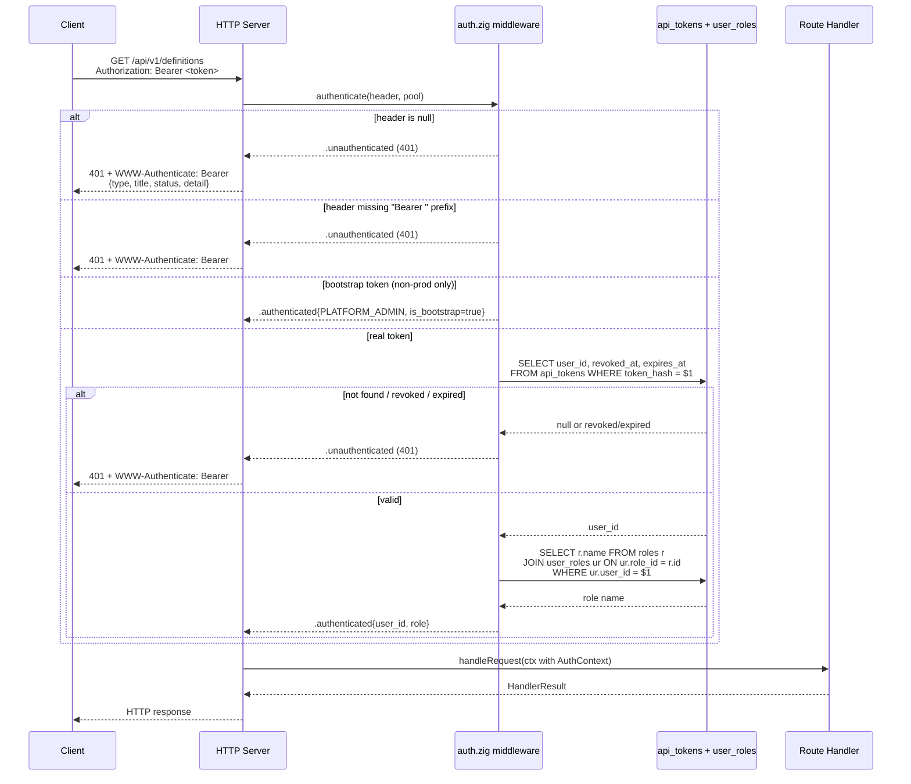

# Module: api-auth

**Covers:** API-08 (Bearer token auth)
**Files:** `src/api/middleware/auth.zig` (new), `src/api/errors.zig` (extend with 401/403 constructors)
**Depends on:** `src/api/errors.zig`, `src/api/response.zig`, `src/api/api_mod.zig`, `migrations/008_identity.sql` (api_tokens, users, roles, user_roles tables), `src/config.zig` (BPM_BOOTSTRAP_TOKEN, BPM_ENV)

---

## Module purpose

This module implements the Bearer token authentication middleware required by API-08. Every API request must carry a valid Bearer token in the `Authorization` header. The middleware extracts the token, validates it against the `api_tokens` table (or the bootstrap token in non-production environments), resolves the caller's role, and either passes through an `AuthContext` to downstream handlers or returns an RFC 9457 Problem Details HTTP 401/403 response. The module also enforces the production safety invariant: the platform must refuse to start if `BPM_BOOTSTRAP_TOKEN` is set when `BPM_ENV=production`.

---

## Public types

### AuthToken

Represents a validated Bearer token after successful lookup. This is an internal type used during validation; route handlers receive the derived `AuthContext`.

```zig
/// A validated token from the Authorization header.
/// Internal to the auth middleware; not exposed to route handlers.
pub const AuthToken = struct {
    /// The raw token string extracted from the header (used for hashing/lookup).
    /// MUST NOT be logged at INFO or above; DEBUG-only.
    raw: []const u8,
    /// SHA-256 hex hash of the raw token, used for DB lookup.
    hash: []const u8,
};
```

### Role

Mirrors the four seeded system roles from migration `008_identity.sql`. This enum is defined here because the auth middleware must resolve a role on every request before the RBAC middleware can run. If `src/identity/` later defines a canonical `Role` type, this module should re-export or alias it rather than duplicating.

```zig
/// Platform roles seeded by 008_identity.sql.
/// Maps to the `roles.name` column.
pub const Role = enum {
    PLATFORM_ADMIN,
    PROCESS_DESIGNER,
    PROCESS_OPERATOR,
    VIEWER,

    /// Parse from the database text value.
    /// Returns null for unrecognised role names.
    pub fn fromString(s: []const u8) ?Role {
        const mapping = std.StaticStringMap(Role).initComptime(.{
            .{ "PLATFORM_ADMIN", .PLATFORM_ADMIN },
            .{ "PROCESS_DESIGNER", .PROCESS_DESIGNER },
            .{ "PROCESS_OPERATOR", .PROCESS_OPERATOR },
            .{ "VIEWER", .VIEWER },
        });
        return mapping.get(s);
    }
};
```

### AuthContext

The output of successful authentication. Passed to route handlers and the downstream RBAC middleware. Contains everything needed to make authorisation decisions and populate audit log `actor_id`.

```zig
/// The authenticated caller's identity and permissions.
/// Route handlers receive this via the request context.
pub const AuthContext = struct {
    /// UUID of the user row in the `users` table.
    user_id: []const u8,
    /// The highest-privilege role assigned to this user.
    /// Resolved from `user_roles` + `role_permissions` at auth time.
    role: Role,
    /// True if this request used the bootstrap token.
    /// Bootstrap-authenticated requests run as PLATFORM_ADMIN.
    is_bootstrap: bool,
};
```

### AuthResult

The return type of `authenticate()`. A tagged union with three outcomes:

```zig
/// Result of the auth middleware check.
/// The HTTP server switches on this to either proceed or return an error response.
pub const AuthResult = union(enum) {
    /// Token is valid; the caller is authenticated.
    /// The AuthContext is attached to the request and passed downstream.
    authenticated: AuthContext,

    /// Authentication failed (missing header, malformed header, unknown/revoked/expired token).
    /// The HandlerResult is a pre-built HTTP 401 response with RFC 9457 body
    /// and `WWW-Authenticate: Bearer` header instruction.
    unauthenticated: HandlerResult,

    /// Token is valid but the resolved role does not have permission for the requested operation.
    /// This outcome is produced when the auth middleware performs a basic role gate;
    /// more granular RBAC checks are handled by the downstream `rbac.zig` middleware.
    /// The HandlerResult is a pre-built HTTP 403 response with RFC 9457 body.
    forbidden: HandlerResult,
};
```

---

## Public functions

### `init` — startup initialisation

```zig
/// Initialise the auth module. MUST be called once at startup, before the HTTP
/// server begins accepting connections, and before any call to `authenticate()`.
///
/// Behaviour:
///   1. Reads `BPM_ENV` and `BPM_BOOTSTRAP_TOKEN` from the process environment.
///   2. If `BPM_ENV=production` AND `BPM_BOOTSTRAP_TOKEN` is set to a non-empty
///      value → returns `AuthError.BootstrapTokenInProduction` (fatal).
///   3. If `BPM_BOOTSTRAP_TOKEN` is set and non-empty → stores a SHA-256 hash
///      of the token for constant-time comparison during `authenticate()`.
///   4. If `BPM_BOOTSTRAP_TOKEN` is unset or empty → bootstrap auth is disabled;
///      all requests must carry a real database-backed token.
///
/// Parameters:
///   allocator — for duplicating the bootstrap token hash into module-owned memory.
///
/// Errors:
///   AuthError.BootstrapTokenInProduction — fatal startup error.
///   error.OutOfMemory — allocator exhausted.
pub fn init(allocator: std.mem.Allocator) !void;
```

### `authenticate` — per-request auth check

```zig
/// Authenticate a single HTTP request. Called by the HTTP server in the
/// middleware chain BEFORE any route handler is dispatched.
///
/// Decision flow:
///   1. If `authorization_header` is null → return `.unauthenticated` (401).
///   2. Strip leading/trailing whitespace from the header value.
///   3. Check for the `Bearer ` prefix (case-sensitive, per RFC 6750 §2.1).
///      If absent → return `.unauthenticated` (401, malformed header).
///   4. Extract `<token>` (the substring after `Bearer `).
///      If `<token>` is empty → return `.unauthenticated` (401).
///   5. If bootstrap auth is enabled (non-empty bootstrap hash set during `init`):
///      a. Hash `<token>` with SHA-256.
///      b. Compare against stored bootstrap hash in constant time.
///      c. If match → return `.authenticated{ user_id=BOOTSTRAP_USER_ID,
///         role=PLATFORM_ADMIN, is_bootstrap=true }`.
///   6. Hash `<token>` with SHA-256.
///   7. Query `api_tokens` table: `SELECT user_id, revoked_at, expires_at
///      FROM api_tokens WHERE token_hash = $1`.
///      a. No row → return `.unauthenticated` (401, unknown token).
///      b. `revoked_at IS NOT NULL` → return `.unauthenticated` (401, revoked).
///      c. `expires_at < NOW()` → return `.unauthenticated` (401, expired).
///   8. Look up the user's highest-privilege role:
///      ```
///      SELECT r.name FROM roles r
///      JOIN user_roles ur ON ur.role_id = r.id
///      WHERE ur.user_id = $1
///      ORDER BY CASE r.name
///        WHEN 'PLATFORM_ADMIN'   THEN 0
///        WHEN 'PROCESS_DESIGNER' THEN 1
///        WHEN 'PROCESS_OPERATOR' THEN 2
///        WHEN 'VIEWER'           THEN 3
///      END
///      LIMIT 1
///      ```
///      If no role row → treat as VIEWER (safe default; every user has at least VIEWER).
///   9. Update `api_tokens.last_used_at = NOW()` (best-effort; failure logged, not fatal).
///   10. Return `.authenticated{ user_id, role, is_bootstrap=false }`.
///
/// Parameters:
///   allocator       — for serialising Problem Details JSON on error paths.
///   authorization_header — value of the HTTP `Authorization` header, or null if absent.
///   db_pool         — database connection pool for token/role lookup.
///
/// Returns:
///   AuthResult — `.authenticated`, `.unauthenticated`, or `.forbidden`.
///
/// Security properties:
///   - Token hash comparison is constant-time (using `std.crypto.utils.timingSafeEql`).
///   - No token raw value is logged at INFO or above.
///   - DB queries use prepared statements ($1, $2 placeholders) — no string interpolation.
///   - A database outage on the `last_used_at` update does NOT fail the request;
///     the authentication result is returned regardless.
pub fn authenticate(
    allocator: std.mem.Allocator,
    authorization_header: ?[]const u8,
    db_pool: *Pool,
) AuthResult;
```

### `deinit` — cleanup

```zig
/// Free module-owned memory (the stored bootstrap token hash).
/// Safe to call multiple times.
pub fn deinit() void;
```

---

## Error taxonomy

Every authentication failure maps to a specific HTTP response. All error bodies use RFC 9457 Problem Details format (per API-01), built via `src/api/errors.zig`.

| # | Condition | HTTP | Problem `type` slug | `title` | `WWW-Authenticate` header | `detail` example |
|---|---|---|---|---|---|---|
| 1 | `Authorization` header absent | 401 | `unauthorized` | "Unauthorized" | `Bearer` | "Authorization header is required" |
| 2 | Header present but does not start with `Bearer ` | 401 | `unauthorized` | "Unauthorized" | `Bearer` | "Authorization header must use Bearer scheme" |
| 3 | `Bearer ` prefix present but token substring is empty | 401 | `unauthorized` | "Unauthorized" | `Bearer` | "Bearer token must not be empty" |
| 4 | Token hash not found in `api_tokens` (and not bootstrap) | 401 | `unauthorized` | "Unauthorized" | `Bearer` | "Unknown or invalid token" |
| 5 | Token found but `revoked_at IS NOT NULL` | 401 | `unauthorized` | "Unauthorized" | `Bearer` | "Token has been revoked" |
| 6 | Token found but `expires_at < NOW()` | 401 | `unauthorized` | "Unauthorized" | `Bearer` | "Token has expired" |
| 7 | Valid token but caller's role does not meet the route's minimum role | 403 | `forbidden` | "Forbidden" | *(none)* | "Insufficient permissions for this operation" |
| F | `BPM_BOOTSTRAP_TOKEN` set in production | *(fatal)* | *(startup panic)* | — | — | "BPM_BOOTSTRAP_TOKEN must not be set in production" |

**Notes:**
- Conditions 1–6 return `WWW-Authenticate: Bearer` per RFC 6750 §3. The HTTP server layer is responsible for attaching this header when it sees a 401 status from the auth middleware.
- Condition 7 (403) does NOT include `WWW-Authenticate` because the caller is already authenticated but lacks permission.
- Condition F is a startup-time fatal error, not a per-request response. The process exits with a clear log message and exit code 1.

---

## New error constructors for `src/api/errors.zig`

The existing `errors.zig` does not define 401 or 403 constructors. Two new constructors are needed:

```zig
/// HTTP 401 — Unauthorized.
/// Used by the auth middleware for missing/invalid/expired/revoked tokens.
pub fn problemUnauthorized(detail: []const u8) ProblemDetails {
    return .{
        .type = BASE ++ "unauthorized",
        .title = "Unauthorized",
        .status = 401,
        .detail = detail,
    };
}

/// HTTP 403 — Forbidden.
/// Used by the auth/RBAC middleware for valid tokens with insufficient permissions.
pub fn problemForbidden(detail: []const u8) ProblemDetails {
    return .{
        .type = BASE ++ "forbidden",
        .title = "Forbidden",
        .status = 403,
        .detail = detail,
    };
}
```

These follow the exact same pattern as the existing constructors (`problemBadRequest`, `problemNotFound`, etc.) and are added to the same file.

---

## Data flow



---

## Key invariants

1. **No request reaches a route handler without authentication.** The auth middleware MUST run before every route dispatch. The HTTP server's middleware chain enforces this — auth is the second middleware (after trace), and all routes are registered behind it.
2. **Bootstrap token never works in production.** The `init()` function checks `BPM_ENV` and refuses to start if `BPM_BOOTSTRAP_TOKEN` is set when `BPM_ENV=production`. This is a fatal error, not a warning.
3. **Bootstrap empty string = disabled.** If `BPM_BOOTSTRAP_TOKEN` is set to `""` (empty string), it is treated as unset. Bootstrap auth is disabled and all requests require a real database-backed token.
4. **Token hash comparison is constant-time.** The stored bootstrap hash is compared using `std.crypto.utils.timingSafeEql` to prevent timing side-channel attacks.
5. **Auth decisions are not cached.** Per API-08 AC: "Token validation MUST be performed on every request; no caching of authorisation decisions beyond the request lifetime." The `authenticate()` function runs a fresh DB lookup on every call.
6. **No token values in logs.** The raw token string is never passed to the logger at INFO level or above. The token hash is safe to log (one-way).
7. **DB unavailability on `last_used_at` update is non-fatal.** If the `UPDATE api_tokens SET last_used_at = NOW()` query fails (e.g. pool exhaustion), the request proceeds with the already-resolved `AuthContext`. The failure is logged at WARN level.
8. **Every authenticated user resolves to a role.** If the `user_roles` join yields zero rows (should not happen for a valid user), the role defaults to `VIEWER`. This is a safe default that grants read-only access.

---

## Middleware chain integration

The auth middleware runs in a specific position within the HTTP server's middleware chain:

```
Request → trace (trace_id injection)
       → auth (Bearer token validation)        ← THIS MODULE
       → rbac (role-based permission check)
       → content_type (Content-Type enforcement)
       → validate (request body validation)
       → route handler
       → Response
```

**Rationale for position:**
- **After trace:** Auth error responses (401/403) must include a `trace_id` for observability (per API-09). The trace middleware injects `trace_id` first, so auth errors already carry it.
- **Before rbac:** Auth resolves the `AuthContext` (user_id + role). The RBAC middleware consumes this context to check permissions. Auth must run before RBAC.
- **Before content_type/validate/route:** Auth rejects unauthenticated requests before any body parsing or business logic executes. This avoids wasted work and prevents information leakage from validation error messages.

---

## External dependencies

| Dependency | Kind | Used for |
|---|---|---|
| `src/api/errors.zig` | Module import | `ProblemDetails`, `problemUnauthorized()`, `problemForbidden()`, `serialise()` |
| `src/api/response.zig` | Module import | `HandlerResult` type, `problemResponse()` |
| `src/config.zig` | Module import | Reading `BPM_ENV`, `BPM_BOOTSTRAP_TOKEN` (or direct `std.process.getEnvVarOwned`) |
| `migrations/008_identity.sql` — `api_tokens` | DB table | Token lookup: `token_hash`, `user_id`, `revoked_at`, `expires_at`, `last_used_at` |
| `migrations/008_identity.sql` — `users` | DB table | User existence (implicit via FK from api_tokens) |
| `migrations/008_identity.sql` — `roles` + `user_roles` | DB tables | Role resolution for the authenticated user |
| `std.crypto.hash.sha2.Sha256` | stdlib | Hashing the raw token for DB lookup and bootstrap comparison |
| `std.crypto.utils.timingSafeEql` | stdlib | Constant-time comparison of stored vs computed bootstrap hash |
| `src/db/pool.zig` | Module import | `Pool` type for DB queries |

**What this module MUST NOT depend on:**
- `src/engine/` — no engine types or logic in auth
- `src/definition/` — no definition types or logic in auth
- `src/identity/registry.zig` — the identity module is not yet implemented; auth queries the DB directly. When `identity/` is built in a later stage, the DB queries here can be refactored to call identity functions, but that is NOT in scope for API-08.

---

## Open questions

1. **Canonical `Role` enum location.** The `Role` enum is defined in this module for now. When `src/identity/registry.zig` is implemented (IDN-01–IDN-07), a canonical `Role` type should live there. This module should re-export or alias it. Marked as a forward-compatibility note; does not block API-08 implementation.

2. **`BOOTSTRAP_USER_ID` constant.** The bootstrap-authenticated requests need a `user_id`. Options:
   - A) Use a well-known UUID like `00000000-0000-0000-0000-000000000000`.
   - B) Create a `bootstrap` user row in the `users` table at migration time.
   - **Recommendation:** Option A (well-known UUID). Simpler, no migration change needed, and the `is_bootstrap` flag on `AuthContext` lets downstream code distinguish bootstrap from real users. The well-known UUID never appears in `users` table, so audit log queries that JOIN users will show NULL for bootstrap actions — which is acceptable for dev/test only.

3. **RBAC granularity boundary.** The auth middleware resolves the user's *highest* role. Individual route-level permission checks (e.g. "PROCESS_DESIGNER can write definitions but not manage users") belong in the downstream `rbac.zig` middleware, not here. This module only answers "who are you?" — "what can you do?" is RBAC's responsibility. Confirmed this is the correct separation of concerns.

4. **Token prefix case sensitivity.** RFC 6750 §2.1 specifies the `Bearer` scheme is case-sensitive. The design enforces `Bearer ` (capital B, trailing space). `bearer`, `BEARER`, `Bearer:` (no space) are all rejected as malformed. This matches the API-08 edge case specification.
