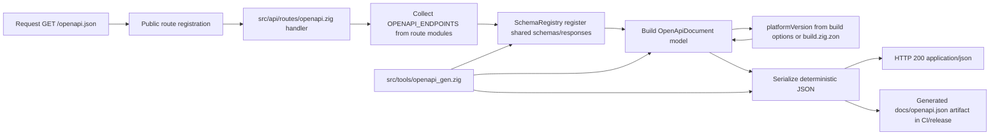

# Module: api-openapi

**Covers:** API-11 (OpenAPI 3.1 publication), foundation for API-12+ endpoint documentation

## Module purpose

Provide a code-generated OpenAPI 3.1 document at `GET /openapi.json` that is derived from typed Zig route/schema descriptors rather than a manually maintained static JSON file. The design ensures a single source of truth for endpoints, request/response bodies, and shared error shapes while keeping the endpoint public (no auth required) and synchronizing `info.version` with the platform release version.

## Zig source files

- `src/api/openapi/mod.zig`
  - Re-export root for all OpenAPI builder submodules.
- `src/api/openapi/model.zig`
  - OpenAPI 3.1 document model types (Info, Paths, Components, Operation, Schema, etc.).
- `src/api/openapi/schema_registry.zig`
  - Registry for reusable component schemas and shared response definitions.
- `src/api/openapi/path_registry.zig`
  - Registry for path + operation descriptors gathered from route modules.
- `src/api/openapi/builder.zig`
  - High-level assembly: combine registries + metadata into final `OpenApiDocument`.
- `src/api/openapi/serialize.zig`
  - Deterministic JSON serialization for OpenAPI model.
- `src/api/openapi/version_source.zig`
  - Canonical source of platform release version for `info.version`.
- `src/api/routes/openapi.zig`
  - Handler for `GET /openapi.json` (public endpoint).
- `src/tools/openapi_gen.zig`
  - Build/CI generator entrypoint that emits a document from the same builder API.

## Public types

### `src/api/openapi/model.zig`

```zig
pub const OpenApiDocument = struct {
    openapi: []const u8, // "3.1.0"
    info: Info,
    servers: []Server,
    paths: std.StringArrayHashMap(PathItem),
    components: Components,
    tags: []Tag,
};

pub const Info = struct {
    title: []const u8,
    version: []const u8,
    description: ?[]const u8,
};

pub const Components = struct {
    schemas: std.StringArrayHashMap(Schema),
    responses: std.StringArrayHashMap(Response),
    parameters: std.StringArrayHashMap(Parameter),
    security_schemes: std.StringArrayHashMap(SecurityScheme),
};

pub const PathItem = struct {
    get: ?Operation = null,
    post: ?Operation = null,
    put: ?Operation = null,
    patch: ?Operation = null,
    delete: ?Operation = null,
};

pub const Operation = struct {
    operation_id: []const u8,
    summary: []const u8,
    description: ?[]const u8,
    tags: []const []const u8,
    parameters: []Parameter,
    request_body: ?RequestBody,
    responses: std.StringArrayHashMap(ResponseRef),
    security: ?[]SecurityRequirement,
};

pub const Schema = union(enum) {
    object: ObjectSchema,
    array: ArraySchema,
    string: StringSchema,
    integer: IntegerSchema,
    number: NumberSchema,
    boolean: void,
    one_of: []SchemaRef,
    any_of: []SchemaRef,
    all_of: []SchemaRef,
    ref: []const u8,
};
```

### `src/api/openapi/path_registry.zig`

```zig
pub const HttpMethod = enum { GET, POST, PUT, PATCH, DELETE };

pub const EndpointDescriptor = struct {
    method: HttpMethod,
    path: []const u8, // runtime route path, e.g. "/api/v1/instances/{id}"
    operation: model.Operation,
    auth_required: bool,
    rate_limited: bool,
};

pub const RouteModuleDescriptor = struct {
    module_name: []const u8,
    endpoints: []const EndpointDescriptor,
};

pub const PathRegistry = struct {
    // internal: map[path]PathItem under construction
};
```

### `src/api/openapi/schema_registry.zig`

```zig
pub const ComponentSchemaId = enum {
    ProblemDetails,
    ValidationProblem,
    Definition,
    DefinitionList,
    DefinitionCreateRequest,
    Instance,
    InstanceList,
    Task,
    TaskList,
    TaskCompleteRequest,
    TaskAssignRequest,
    TaskReassignRequest,
    EventHistoryPage,
    // expandable for API-12+ and future requirements
};

pub const SharedResponseId = enum {
    BadRequest400,
    Unauthorized401,
    Forbidden403,
    NotFound404,
    Conflict409,
    UnsupportedMediaType415,
    UnprocessableEntity422,
    TooManyRequests429,
    InternalServerError500,
    ServiceUnavailable503,
};

pub const SchemaRegistry = struct {
    // internal: component schema/response maps
};
```

### `src/api/openapi/version_source.zig`

```zig
pub const VersionSource = enum {
    BuildOptions,
    ZonVersion,
};
```

## Public functions

### `src/api/openapi/mod.zig`

```zig
pub const model = @import("model.zig");
pub const schema_registry = @import("schema_registry.zig");
pub const path_registry = @import("path_registry.zig");
pub const builder = @import("builder.zig");
pub const serialize = @import("serialize.zig");
pub const version_source = @import("version_source.zig");
```

### `src/api/openapi/schema_registry.zig`

```zig
pub fn init(allocator: std.mem.Allocator) SchemaRegistry;
pub fn deinit(self: *SchemaRegistry) void;

pub fn registerStandardProblemSchemas(self: *SchemaRegistry) !void;
pub fn registerStandardProblemResponses(self: *SchemaRegistry) !void;

pub fn registerSchema(self: *SchemaRegistry, name: []const u8, schema: model.Schema) !void;
pub fn registerResponse(self: *SchemaRegistry, name: []const u8, response: model.Response) !void;

pub fn schemaRef(name: []const u8) model.Schema;
pub fn responseRef(name: []const u8) model.ResponseRef;
```

### `src/api/openapi/path_registry.zig`

```zig
pub fn init(allocator: std.mem.Allocator) PathRegistry;
pub fn deinit(self: *PathRegistry) void;

pub fn addEndpoint(self: *PathRegistry, endpoint: EndpointDescriptor) !void;
pub fn addModule(self: *PathRegistry, module_desc: RouteModuleDescriptor) !void;

pub fn intoPaths(self: *PathRegistry, allocator: std.mem.Allocator) !std.StringArrayHashMap(model.PathItem);
```

### `src/api/openapi/version_source.zig`

```zig
pub fn platformVersion(allocator: std.mem.Allocator) ![]const u8;
```

**Version strategy:**
- Primary: `build.zig` defines an options module containing `platform_version` sourced from `build.zig.zon` (`.version = "0.1.0"`).
- Fallback (tooling context): parse `build.zig.zon` to keep `src/tools/openapi_gen.zig` aligned when invoked outside runtime server startup.
- Result: both runtime endpoint and generator use the same function, ensuring `info.version` matches release version.

### `src/api/openapi/builder.zig`

```zig
pub const BuildInput = struct {
    title: []const u8,
    description: []const u8,
    server_urls: []const []const u8,
    route_modules: []const path_registry.RouteModuleDescriptor,
};

pub fn buildOpenApiDocument(
    allocator: std.mem.Allocator,
    input: BuildInput,
) !model.OpenApiDocument;
```

### `src/api/openapi/serialize.zig`

```zig
pub fn toJson(
    allocator: std.mem.Allocator,
    doc: model.OpenApiDocument,
) error{OutOfMemory}![]const u8;
```

### `src/api/routes/openapi.zig`

```zig
pub const HandlerResult = @import("../response.zig").HandlerResult;

pub fn handleGetOpenApi(
    allocator: std.mem.Allocator,
) HandlerResult;
```

**Behavior:**
- Build doc via `buildOpenApiDocument`.
- Serialize to JSON and return HTTP 200.
- Content-Type: `application/json`.
- No auth context parameter by design (public route).

## Public interface (route and module contracts)

### Route descriptor contract per route module

Each route module exports endpoint descriptors for OpenAPI registration:

```zig
pub const OPENAPI_ENDPOINTS: []const openapi.path_registry.EndpointDescriptor = &.{
    // example shape; filled in definitions.zig, instances.zig, tasks.zig, health routes, etc.
};
```

This keeps endpoint metadata colocated with handlers and avoids a static manually curated OpenAPI document.

### Aggregation contract in API module root

`src/api/api_mod.zig` re-exports `openapi` and route modules. The OpenAPI builder receives a list of route descriptors by importing module-level constants, for example:
- `definitions.OPENAPI_ENDPOINTS`
- `instances.OPENAPI_ENDPOINTS`
- `tasks.OPENAPI_ENDPOINTS`
- health endpoint descriptors (API-12)

## Data flow diagram



## Error taxonomy

```zig
pub const OpenApiError = error{
    OutOfMemory,
    DuplicatePathOperation,
    InvalidSchemaReference,
    InvalidResponseReference,
    VersionUnavailable,
    SerializationFailed,
};
```

Mapping notes:
- `OutOfMemory`, `SerializationFailed`, `VersionUnavailable` in runtime handler map to RFC 9457 500 (`problemInternalError`).
- `DuplicatePathOperation` and invalid references are design-time/regression defects; fail fast in tests and generator command.

## State transitions

OpenAPI generation is pure build-from-descriptor logic with optional in-memory caching at server layer.

```text
UNINITIALIZED
  -> BUILDING           (request enters handler)
  -> READY              (document built + serialized)
  -> FAILED             (builder/serializer/version error)
READY
  -> READY              (subsequent requests reuse cached bytes, if cache enabled)
READY
  -> INVALIDATED        (new deploy/version or route set changes)
INVALIDATED
  -> BUILDING
FAILED
  -> BUILDING           (next request retries)
```

Cache policy (optional for initial implementation):
- Store serialized bytes in process memory after first success.
- Invalidate on process restart (sufficient for current architecture).
- Deterministic output allows snapshot tests.

## Dependencies

### Required runtime dependencies

- `src/api/response.zig`
  - Reuse `HandlerResult` and response conventions.
- `src/api/errors.zig`
  - Shared RFC 9457 error shape and problem constructors.
- `src/api/routes/definitions.zig`
- `src/api/routes/instances.zig`
- `src/api/routes/tasks.zig`
  - Route metadata source for currently implemented endpoints.
- `src/main.zig`
  - Route wiring and middleware ordering integration point.
- `build.zig` + `build.zig.zon`
  - Authoritative version source for `info.version`.

### Must not depend on

- Database access modules (`src/db/*`, `src/event_store/*`, etc.)
  - OpenAPI endpoint must not require DB availability.
- Runtime request auth context for `GET /openapi.json`
  - Endpoint must stay public by requirement.
- Static hand-maintained OpenAPI JSON checked into source as canonical data
  - Generated output may be emitted for docs, but source of truth is code descriptors.

## Integration notes

### 1. Public routing for `GET /openapi.json`

Add route registration before auth-enforced API groups, or mark route with `auth_required = false` and branch in middleware gate:

- path: `/openapi.json`
- method: `GET`
- handler: `openapi_routes.handleGetOpenApi`
- auth: bypass
- rate limit: optional bypass (recommended bypass for docs discoverability)

This guarantees HTTP 200 without `Authorization` header.

### 2. Existing endpoint coverage strategy

Initial descriptor set should include all currently implemented route handlers:

- Definitions: `GET /api/v1/definitions`, `GET /api/v1/definitions/{id}`, `GET /api/v1/definitions/active/{name}`, `GET /api/v1/definitions/search`, `POST /api/v1/definitions`, `PUT /api/v1/definitions/{id}`, `PATCH /api/v1/definitions/{id}`, `DELETE /api/v1/definitions/{id}`, `POST /api/v1/definitions/{id}/activate`, `POST /api/v1/definitions/{id}/deprecate`, `POST /api/v1/definitions/{id}/archive`, `GET /api/v1/definitions/{id}/export`, `POST /api/v1/definitions/import`
- Instances: `POST /api/v1/instances`, `GET /api/v1/instances`, `GET /api/v1/instances/{id}`, `GET /api/v1/instances/{id}/history`, `POST /api/v1/instances/{id}/cancel`, `POST /api/v1/instances/{id}/reconstruct`
- Tasks: `GET /api/v1/tasks`, `GET /api/v1/tasks/{id}`, `POST /api/v1/tasks/{id}/complete`, `POST /api/v1/tasks/{id}/assign`, `POST /api/v1/tasks/{id}/reassign`
- Public docs route: `GET /openapi.json`

### 3. Standard problem details and shared components

Register once in `SchemaRegistry`:
- `components.schemas.ProblemDetails`
- `components.schemas.ValidationProblem` (extends ProblemDetails with validation fields if needed)
- `components.responses.Error400`, `Error401`, `Error403`, `Error404`, `Error409`, `Error415`, `Error422`, `Error429`, `Error500`, `Error503`

Each operation references shared responses by `$ref`, ensuring consistency with `src/api/errors.zig`.

### 4. Security modeling

Define global security scheme:
- `components.securitySchemes.BearerAuth` with `type=http`, `scheme=bearer`

Apply `security: [{ BearerAuth: [] }]` only where `auth_required = true`.
For `/openapi.json`, use `security: []` at operation level.

### 5. API-12 and future extensibility

Incremental registration model:
- New route modules add local `OPENAPI_ENDPOINTS` constants.
- New schema types register through `SchemaRegistry.registerSchema`.
- Builder performs deterministic merge and duplicate detection.

No central handwritten path table is required; this prevents drift and satisfies code-generation requirement for future APIs.

## Key invariants

- OpenAPI document `openapi` field is exactly `3.1.0`.
- `info.version` equals platform release version source.
- `/openapi.json` remains unauthenticated and available when DB is unavailable.
- Every documented error response shape aligns with RFC 9457 structure used by `src/api/errors.zig`.
- Path+method pairs are unique across all module descriptors.

## Open questions

- API-11 says spec should describe existing endpoints; should endpoints that are declared in route files but not yet fully wired in server startup still be included, or only actively routed endpoints at runtime?
- Should `GET /openapi.json` be excluded from API-10 rate limiting to maximize client/tool compatibility, or rate-limited with a high ceiling?
- Should generated output include environment-specific server URLs, or a stable default plus runtime override?

If these remain unresolved, BACKEND-DEV can implement with conservative defaults:
- include currently implemented route handlers from route modules,
- bypass auth and rate limit for `/openapi.json`,
- expose one default server URL (`/`) with optional config override.
