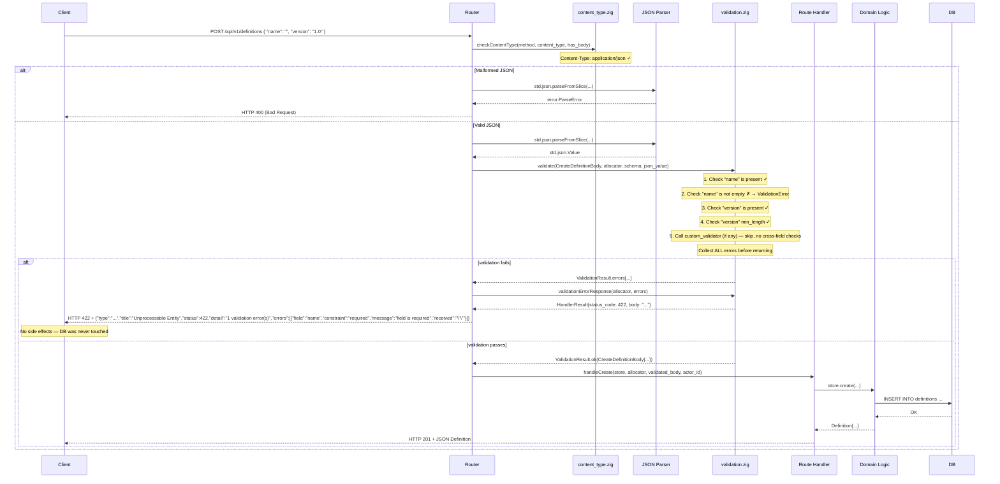
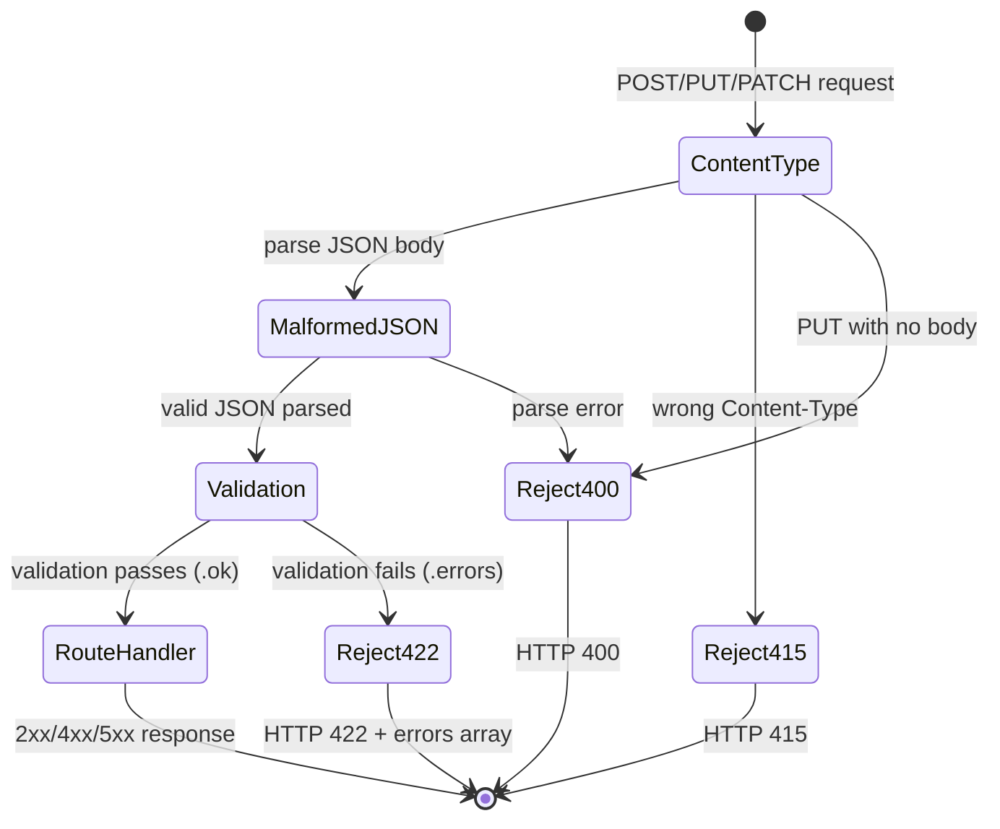

# Module: api-validation

**Covers:** API-07 (Input validation)
**Files:** `src/api/validation.zig` (new), `src/api/errors.zig` (extend), `src/api/middleware/validate.zig` (new)
**Depends on:** `src/api/errors.zig` (ProblemDetails extension), `src/api/response.zig` (HandlerResult), `src/api/middleware/content_type.zig` (pipeline ordering)
**Design artefact for:** `src/api/validation.zig`

---

## Module purpose

This module implements the general input validation layer required by API-07. It validates all incoming request payloads against defined schemas BEFORE any business logic executes, ensuring no side effects (writes) occur for invalid requests. Validation errors are returned as HTTP 422 with an RFC 9457 Problem Details body extended with an `errors` array, where each entry identifies the field path, constraint violated, and actual value received. ALL validation errors are reported in a single response — not just the first. Malformed JSON is handled upstream (HTTP 400); this module only deals with structurally valid JSON that violates schema constraints.

---

## Public interface

### 1. Core data types — `src/api/validation.zig`

```zig
const std = @import("std");

// ── Validation error entry ───────────────────────────────────────────────────

/// A single field-level validation error, serialised into the RFC 9457
/// `errors` array extension.  Mirrors the structure required by API-07 AC.
pub const ValidationError = struct {
    /// Dot-separated JSON path to the offending field.
    /// Examples: "name", "graph.nodes[0].id", "output_variables.amount".
    field: []const u8,

    /// Machine-readable constraint identifier.
    /// Examples: "required", "type.string", "type.uuid", "min_length",
    ///           "max_length", "pattern", "not_null", "not_empty",
    ///           "type.integer", "type.boolean", "type.object", "type.array".
    constraint: []const u8,

    /// Human-readable description of what went wrong.
    /// Examples: "field is required", "expected string, got number",
    ///           "must be a valid UUID", "length must be ≤ 255".
    message: []const u8,

    /// The actual value received, serialised as a JSON fragment.
    /// null if the field was absent.  For type errors this is the raw
    /// JSON value; for constraint errors this is the value that failed.
    /// Examples: "null", "42", "\"\"", "\"not-a-uuid\"", "[1,2,3]".
    received: ?[]const u8,
};

// ── Validation result ────────────────────────────────────────────────────────

/// Result of schema validation.  Two outcomes:
///   .ok    — the parsed and validated value of type T, ready for the handler.
///   .errors — one or more validation errors; the request must be rejected.
///
/// If .errors is returned, `errors.len > 0` is guaranteed.
pub fn ValidationResult(comptime T: type) type {
    return union(enum) {
        ok: T,
        errors: []ValidationError,
    };
}

// ── Field schema ─────────────────────────────────────────────────────────────

/// Describes a single field constraint within a schema definition.
/// Used by validateField() to check one field at a time.
pub const FieldConstraint = struct {
    /// The JSON key name for this field (e.g. "name", "event_type").
    name: []const u8,

    /// Whether the field must be present and non-null in the JSON object.
    required: bool = false,

    /// The expected JSON type.  When set, the field value is checked
    /// against this type BEFORE any further constraints.
    /// null means "any type accepted" (useful for polymorphic fields).
    expected_type: ?JsonType = null,

    /// If true, an empty string "" is treated as a missing value and
    /// reported with constraint="required" when the field is required.
    /// Per API-07 AC: empty required fields MUST be treated as missing.
    reject_empty_string: bool = false,

    /// Minimum string length (inclusive).  Only checked when expected_type is .string.
    min_length: ?usize = null,

    /// Maximum string length (inclusive).  Only checked when expected_type is .string.
    max_length: ?usize = null,

    /// Regex pattern the string must match (Zig std.regex).
    /// Only checked when expected_type is .string.
    pattern: ?[]const u8 = null,

    /// Minimum numeric value (inclusive).  Only checked when expected_type is .number.
    min_value: ?f64 = null,

    /// Maximum numeric value (inclusive).  Only checked when expected_type is .number.
    max_value: ?f64 = null,

    /// Minimum array length.  Only checked when expected_type is .array.
    min_items: ?usize = null,

    /// Maximum array length.  Only checked when expected_type is .array.
    max_items: ?usize = null,
};

/// JSON types recognised by the validator.  Matches the JSON type system:
/// string, number (integer or float), boolean, object, array, null.
pub const JsonType = enum {
    string,
    number,
    integer,
    boolean,
    object,
    array,
    null_value,
};

// ── Schema definition ────────────────────────────────────────────────────────

/// Validation schema for a request body type T.
/// A schema is a list of field constraints plus an optional custom validator
/// for cross-field or business-rule checks that go beyond per-field validation.
///
/// Usage:
///   const createDefSchema = Schema(CreateDefinitionBody){
///       .fields = &[_]FieldConstraint{ ... },
///       .custom_validator = null,  // no cross-field checks for this type
///   };
pub fn Schema(comptime T: type) type {
    return struct {
        /// Ordered list of field constraints.  Fields are validated in order;
        /// ALL errors are collected before returning.
        fields: []const FieldConstraint,

        /// Optional custom validation function for cross-field checks.
        /// Called AFTER all per-field checks pass.  Returns additional
        /// ValidationError entries or an empty slice.
        /// Accepts the fully-parsed T value (all fields present).
        custom_validator: ?*const fn (allocator: std.mem.Allocator, value: T) anyerror![]ValidationError,
    };
}
```

### 2. Public functions — `src/api/validation.zig`

```zig
// ── Schema-based validation ──────────────────────────────────────────────────

/// Validate a parsed JSON object against a schema, returning either the
/// validated value of type T or a list of ALL validation errors found.
///
/// Parameters:
///   allocator  — for allocating ValidationError slices and message strings
///   schema     — the Schema(T) definition to validate against
///   json_value — a parsed std.json.Value representing the request body
///
/// Returns:
///   .ok(T)    — all checks passed; the value is fully parsed and valid
///   .errors   — one or more violations; HTTP 422 must be returned
///
/// This function is pure (no I/O).  It allocates only on the error path
/// (ValidationError messages).  On the success path it returns T without
/// additional allocation beyond what the caller's JSON parser already did.
pub fn validate(
    comptime T: type,
    allocator: std.mem.Allocator,
    schema: Schema(T),
    json_value: std.json.Value,
) error{OutOfMemory}!ValidationResult(T);

// ── Single-field validation ──────────────────────────────────────────────────

/// Validate a single JSON value against a FieldConstraint.
///
/// Returns null if the field passes all checks, or a ValidationError if
/// any constraint is violated.  Empty required strings are reported as
/// "required" when reject_empty_string is true (per API-07).
///
/// This function is pure (no allocation).  The returned ValidationError
/// references the input slices directly.
pub fn validateField(
    constraint: FieldConstraint,
    json_value: ?std.json.Value,
) ?ValidationError;

// ── RFC 9457 extension: problem details with errors array ────────────────────

/// Problem Details with the RFC 9457 `errors` extension array.
/// Extends the base ProblemDetails from errors.zig with the field-level
/// error entries required by API-07.
pub const ValidationProblemDetails = struct {
    /// Base RFC 9457 fields (type, title, status, detail).
    base: errors.ProblemDetails,

    /// Array of field-level validation errors.
    /// Required by API-07 for HTTP 422 responses.
    errors: []const ValidationError,
};

/// Construct a ValidationProblemDetails for an HTTP 422 response.
/// The `detail` field is set to a summary like "N validation error(s)".
///
/// `errors_slice` — the list of validation errors; caller retains ownership.
pub fn problemValidation(
    detail: []const u8,
    errors_slice: []const ValidationError,
) ValidationProblemDetails;

/// Serialise a ValidationProblemDetails to a JSON []u8.
/// Output format:
///   {"type":"...","title":"Unprocessable Entity","status":422,
///    "detail":"N validation error(s)",
///    "errors":[{"field":"name","constraint":"required",
///               "message":"field is required","received":null},
///              {"field":"event_type","constraint":"not_empty",
///               "message":"must not be empty","received":"\"\""}]}
///
/// Caller owns the returned slice and must free it with the same allocator.
pub fn serialiseValidationProblem(
    allocator: std.mem.Allocator,
    vp: ValidationProblemDetails,
) error{OutOfMemory}![]const u8;

// ── Utility ──────────────────────────────────────────────────────────────────

/// Check whether a std.json.Value matches an expected JSON type.
/// Returns null on match, or a ValidationError describing the mismatch.
/// Pure function, no allocation.
pub fn checkType(
    field_name: []const u8,
    value: std.json.Value,
    expected: JsonType,
) ?ValidationError;

/// Build the RFC 9457 error response for a validation failure.
/// Convenience wrapper: serialises ValidationProblemDetails and wraps
/// in a HandlerResult with status 422.
///
/// On serialisation failure (OutOfMemory), falls back to a static
/// HTTP 500 with an inline JSON body.
pub fn validationErrorResponse(
    allocator: std.mem.Allocator,
    errors_slice: []const ValidationError,
) response.HandlerResult;
```

### 3. Middleware — `src/api/middleware/validate.zig`

```zig
const std = @import("std");
const validation = @import("../validation.zig");
const errors = @import("../errors.zig");
const response = @import("../response.zig");

/// Result of the validation middleware check.
pub const ValidationCheckResult = union(enum) {
    /// Request body is valid; the parsed and validated value is available
    /// in this field.  The route handler receives this pre-validated value
    /// and can skip its own validation.
    ok: void,  // validated value passed via request context (see Integration)

    /// Validation failed; return this HandlerResult to the client immediately
    /// with HTTP 422 and the full errors array.
    reject: response.HandlerResult,
};

/// Validate a request body against a schema.
///
/// Called AFTER content_type.zig has confirmed Content-Type: application/json
/// and AFTER the JSON parser has produced a std.json.Value (malformed JSON
/// is caught before this function and returns HTTP 400).
///
/// Parameters:
///   allocator  — for serialising error bodies
///   comptime T — the expected body type
///   schema     — the Schema(T) to validate against
///   json_value — the parsed request body (std.json.Value)
///
/// Returns:
///   .ok        — validation passed
///   .reject    — HTTP 422 with field-level errors; caller must return this
///                HandlerResult immediately
///
/// This function does NOT own json_value or its contents. The allocator is
/// only used for serialising the error response on the reject path.
pub fn enforceValidation(
    comptime T: type,
    allocator: std.mem.Allocator,
    schema: validation.Schema(T),
    json_value: std.json.Value,
) error{OutOfMemory}!ValidationCheckResult;
```

---

## Data flow diagram



### Middleware pipeline ordering



---

## Error taxonomy

All errors produced by this module and their HTTP mappings:

| Error condition | HTTP status | Problem type URI | `errors` array? |
|---|---|---|---|
| Malformed JSON (parse error) | 400 | `bad-request` | No (handled by JSON parser, not this module) |
| Required field missing or null | 422 | `unprocessable-entity` | Yes, entry per missing field |
| Required field empty string (`""`) | 422 | `unprocessable-entity` | Yes, `constraint: "required"` |
| Wrong JSON type (e.g. string where number expected) | 422 | `unprocessable-entity` | Yes, `constraint: "type.<expected>"` |
| String too short (< min_length) | 422 | `unprocessable-entity` | Yes, `constraint: "min_length"` |
| String too long (> max_length) | 422 | `unprocessable-entity` | Yes, `constraint: "max_length"` |
| String does not match pattern | 422 | `unprocessable-entity` | Yes, `constraint: "pattern"` |
| Number outside [min_value, max_value] | 422 | `unprocessable-entity` | Yes, `constraint: "min_value"/"max_value"` |
| Array too short (< min_items) | 422 | `unprocessable-entity` | Yes, `constraint: "min_items"` |
| Array too long (> max_items) | 422 | `unprocessable-entity` | Yes, `constraint: "max_items"` |
| Custom validator error | 422 | `unprocessable-entity` | Yes, entry per custom violation |
| Allocator exhaustion during error serialisation | 500 | `internal-error` | No (fallback inline body) |

### Error response structure (HTTP 422)

```json
{
  "type": "https://bpm.example.com/problems/unprocessable-entity",
  "title": "Unprocessable Entity",
  "status": 422,
  "detail": "3 validation error(s)",
  "errors": [
    {
      "field": "name",
      "constraint": "required",
      "message": "field is required",
      "received": null
    },
    {
      "field": "event_type",
      "constraint": "not_empty",
      "message": "must not be empty",
      "received": "\"\""
    },
    {
      "field": "graph.nodes",
      "constraint": "min_items",
      "message": "must have at least 1 item(s)",
      "received": "[]"
    }
  ]
}
```

---

## Schema definitions for existing endpoints

The following schemas must be defined for each request body type across all routes. These are NOT exhaustive — BACKEND-DEV adds schemas for every `POST`/`PUT`/`PATCH` body type.

### Event append (`POST /api/v1/events`)

```zig
pub const eventAppendSchema = Schema(EventAppendBody){
    .fields = &[_]FieldConstraint{
        .{ .name = "instance_id",     .required = true, .expected_type = JsonType.string,  .reject_empty_string = true },
        .{ .name = "event_type",      .required = true, .expected_type = JsonType.string,  .reject_empty_string = true },
        .{ .name = "payload",         .required = true, .expected_type = JsonType.object },
        .{ .name = "actor_id",        .required = true, .expected_type = JsonType.string,  .reject_empty_string = true },
        .{ .name = "idempotency_key", .required = true, .expected_type = JsonType.string,  .reject_empty_string = true },
        .{ .name = "metadata",        .required = false, .expected_type = JsonType.object },
    },
    .custom_validator = null, // no cross-field checks for event append
};
```

### Definition create (`POST /api/v1/definitions`)

```zig
pub const createDefinitionSchema = Schema(CreateDefinitionBody){
    .fields = &[_]FieldConstraint{
        .{ .name = "name",        .required = true, .expected_type = JsonType.string,  .reject_empty_string = true, .max_length = 255 },
        .{ .name = "version",     .required = true, .expected_type = JsonType.string,  .reject_empty_string = true },
        .{ .name = "description", .required = false, .expected_type = JsonType.string },
        .{ .name = "graph",       .required = true, .expected_type = JsonType.object },
        .{ .name = "stage",       .required = false, .expected_type = JsonType.string },
    },
    .custom_validator = null,
};
```

### Instance start (`POST /api/v1/instances`)

```zig
pub const startInstanceSchema = Schema(StartInstanceBody){
    .fields = &[_]FieldConstraint{
        .{ .name = "definition_id",    .required = true, .expected_type = JsonType.string, .reject_empty_string = true },
        .{ .name = "correlation_key",  .required = false, .expected_type = JsonType.string },
        .{ .name = "variables",        .required = false, .expected_type = JsonType.object },
    },
    .custom_validator = null,
};
```

### Task complete (`POST /api/v1/tasks/:id/complete`)

```zig
pub const completeTaskSchema = Schema(CompleteTaskBody){
    .fields = &[_]FieldConstraint{
        .{ .name = "output_variables", .required = true, .expected_type = JsonType.object },
    },
    .custom_validator = null,
};
```

---

## Key invariants

1. **Validation precedes all business logic.** The validator runs before the route handler is invoked. If validation fails, no domain function is called and no database writes occur. Per API-07 AC: "Validation MUST run before any business logic; no side effects (writes) occur for invalid requests."

2. **All errors are collected.** If field A and field B both fail, BOTH are reported. The validator never short-circuits after the first error. Per API-07 AC: "All 422 responses MUST list ALL validation errors found, not just the first."

3. **Empty strings on required fields are treated as missing.** A required string field with value `""` produces the same error as a missing field: `constraint: "required"`. Per API-07 AC: "An empty required field MUST be treated as missing and reported with HTTP 422."

4. **Malformed JSON is not this module's concern.** JSON parse errors produce HTTP 400 from the parser/framework layer. The validator only sees successfully parsed `std.json.Value` trees. Per API-07 edge case: "Malformed JSON body: HTTP 400 (bad request), not HTTP 422."

5. **The validator is pure (no I/O).** `validate()` and `validateField()` perform no database calls, no logging, no HTTP calls. They only inspect the in-memory `std.json.Value` tree against the schema definition. This aligns with the pure-transition-function architectural principle.

6. **Schema definitions are compile-time constants.** Every `Schema(T)` is defined as a `const` at module scope. No runtime schema parsing or dynamic validation rules. This keeps the validation hot path allocation-free on success.

---

## Integration notes

### 1. Extension of `src/api/errors.zig`

The existing `errors.zig` defines `ProblemDetails` with four fields: `type`, `title`, `status`, `detail`. API-07 requires extending this with an `errors` array.

Two approaches considered:

| Approach | Description | Verdict |
|---|---|---|
| **A. Add `errors` field to `ProblemDetails`** | Modifies the existing struct; all callers must adjust. | ❌ Breaking change; serialise() must be rewritten. |
| **B. New `ValidationProblemDetails` wrapper** | Separate struct embedding `ProblemDetails` plus `errors`. | ✅ Non-breaking; existing constructors unchanged; new `serialiseValidationProblem()` for validation responses only. |

**Chosen: Approach B.** `ValidationProblemDetails` is a new struct in `src/api/validation.zig` that wraps `ProblemDetails` (no modification to `errors.zig`). The existing `problemUnprocessable()` constructor and `serialise()` function are untouched. A new `serialiseValidationProblem()` function handles the extended format.

### 2. Middleware pipeline integration

The existing middleware chain is (conceptually):

```
TLS → trace_id → auth → rbac → rate_limit → content_type → [validation] → route handler → audit
```

API-07's validation middleware (`validate.zig`) is inserted AFTER `content_type.zig` and BEFORE the route handler. This ensures:

- Content-Type is already confirmed as `application/json` (HTTP 415 if not).
- JSON parsing has already succeeded (HTTP 400 if malformed).
- The validator receives a clean `std.json.Value` and only checks field-level constraints.

### 3. Route handler changes

Route handlers currently parse and validate bodies inline. After API-07 is implemented, handlers receive pre-validated data. The pattern changes from:

```zig
// BEFORE (current pattern):
pub fn handleCreate(store: *Store, allocator: std.mem.Allocator, body_json: []const u8) HandlerResult {
    const parsed = std.json.parseFromSlice(...) catch return errorResult(400);
    // inline validation here...
    const result = store.create(allocator, parsed.value) catch ...
}

// AFTER (with validation middleware):
pub fn handleCreate(store: *Store, allocator: std.mem.Allocator, body: CreateDefinitionBody) HandlerResult {
    // body is already parsed and validated — no checks needed here
    const result = store.create(allocator, body) catch ...
}
```

This is a non-breaking migration — BACKEND-DEV updates handlers incrementally.

### 4. Relationship to ES-05 domain validation

API-07 (this module) validates at the **transport/schema level**: "is `event_type` present and a non-empty string?" ES-05 validates at the **domain level**: "does `event_type` exist in the event type registry, and does the payload match its JSON Schema?"

These are distinct layers:
- API-07 runs first (middleware) — catches missing fields, wrong types, empty strings.
- ES-05 runs inside the domain logic (event_store.zig) — catches unknown event types, payload schema mismatches.
- Both produce HTTP 422, but with different `constraint` values and `type` URIs.

### 5. No database dependencies

The validation module has **zero database dependencies**. It never touches PostgreSQL, never needs a connection pool, and never reads schema information from any table. This is intentional: validation is a pure computation on the request body, and it must complete before any database resources are acquired.

---

## External dependencies

| Dependency | Module | Purpose |
|---|---|---|
| `std.json` | Zig stdlib | JSON value parsing and type inspection |
| `std.mem.Allocator` | Zig stdlib | Memory for error messages and serialised responses |
| `errors.zig` | `src/api/errors.zig` | `ProblemDetails` struct (embedded in `ValidationProblemDetails`) |
| `response.zig` | `src/api/response.zig` | `HandlerResult` type for reject responses |
| `content_type.zig` | `src/api/middleware/content_type.zig` | Pipeline ordering guarantee (validates before this module) |

---

## Open questions

1. **Schema registration mechanism:** Where are the per-endpoint `Schema(T)` constants defined? Options:
   - (a) In each route file (e.g. `definitions.zig` defines `createDefinitionSchema`).
   - (b) In a central `src/api/schemas.zig` registry.
   - **Recommendation: (a)** — keeps each route's concerns co-located; avoids a monolithic schema file. BACKEND-DEV decides at implementation time.

2. **How does the middleware pass the validated value to the route handler?** The current `http.zig` framework may not support typed context propagation natively. Options:
   - (a) The middleware stores the validated value in a request-scoped arena, and the handler extracts it by type.
   - (b) The middleware returns `.ok` and the handler re-validates (defeating the purpose).
   - **Recommendation: (a)** — BACKEND-DEV should confirm `http.zig` supports a `context` map or similar mechanism. If not, the validated value is placed in a well-known key and the handler casts it.

3. **Nested field paths:** The `field` property uses dot-separated paths (e.g. `graph.nodes[0].id`). Does the current implementation need recursive validation for nested objects/arrays?
   - For this stage (Stage 4 API Layer), only top-level field validation is required. Nested validation (e.g. validating each node in `graph.nodes[]`) is a Stage 5 concern when definition graph validation (PD-02) is revisited.
   - **Decision: defer nested validation to Stage 5.** Top-level field checks satisfy all API-07 acceptance criteria.

4. **type URI for validation errors:** Should validation errors use a distinct `type` URI from generic 422 responses?
   - API-07 does not specify a separate URI. The current design uses `unprocessable-entity` (the same as generic 422) since the `errors` array already distinguishes field-level validation failures.
   - **Recommendation: keep `unprocessable-entity`.** BACKEND-DEV can add a `validation-error` sub-type later if needed.

---

## Acceptance criteria mapping

| API-07 AC | Design coverage |
|---|---|
| Missing required field → HTTP 422 with `errors` array | `validateField()` checks `required`, returns `ValidationError` with `field`, `constraint`, `received`. `serialiseValidationProblem()` includes `errors` array in JSON body. |
| Wrong type field → HTTP 422 with field-level detail | `checkType()` compares `std.json.Value` type against `expected_type`; returns `ValidationError` with `constraint: "type.<expected>"`. |
| Validation runs before business logic → no writes for invalid requests | Middleware (`enforceValidation()`) runs in pipeline BEFORE route handler. Route handler only invoked on `.ok`. No domain function or DB call occurs on `.reject`. |
| Empty required string → HTTP 422 (treated as missing) | `FieldConstraint.reject_empty_string = true` on required fields causes `""` to produce `constraint: "required"`. |
| All validation errors listed, not just first | `validate()` collects ALL `FieldConstraint` violations into a single `[]ValidationError` before returning. No early return on first error. |
| Malformed JSON → HTTP 400 (not 422) | JSON parsing is upstream of this module; parse errors produce HTTP 400 before the validator is invoked. |
| All fields empty with all required → all listed in errors | Schema with N required fields, all empty → N entries in `errors` array, one per field. |
