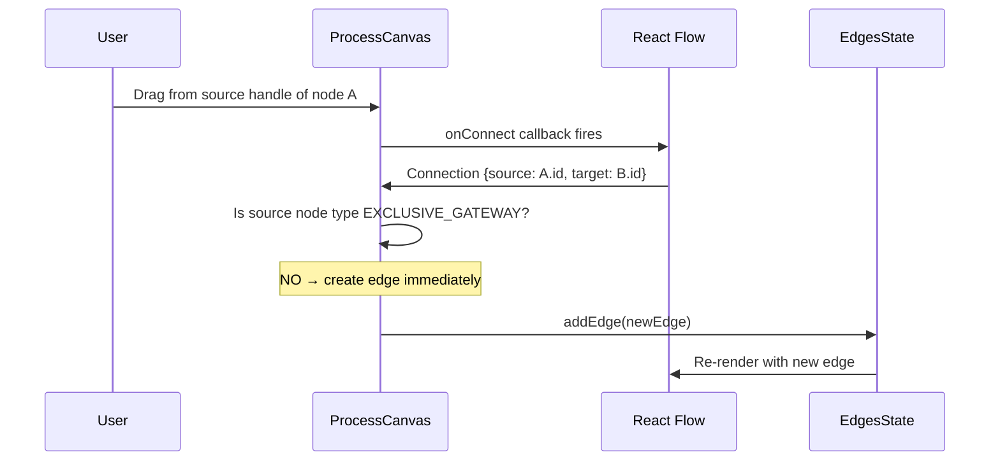
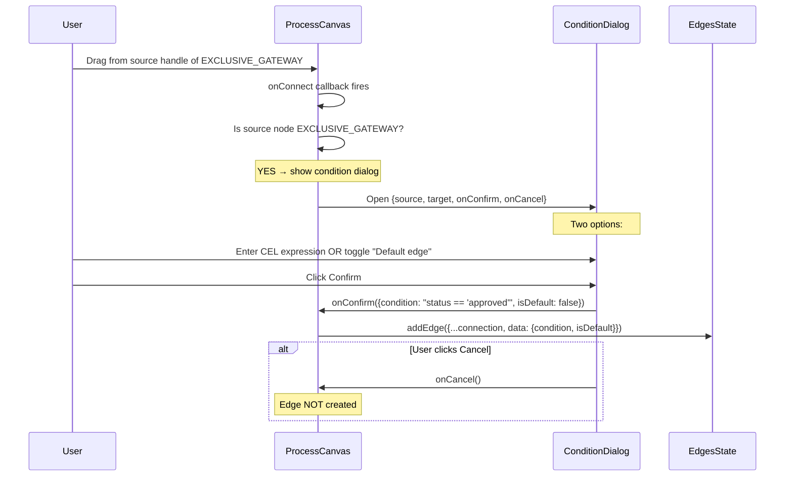
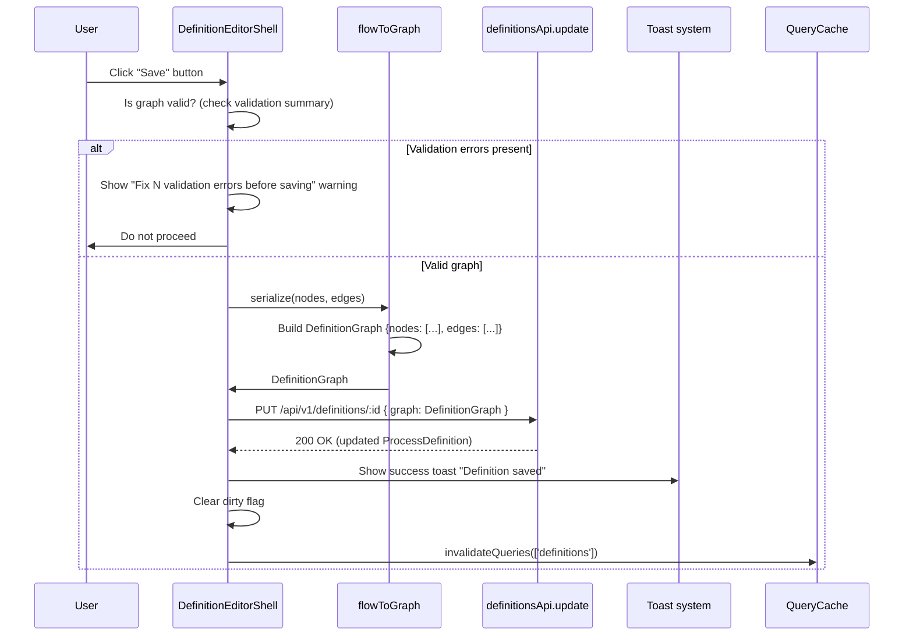
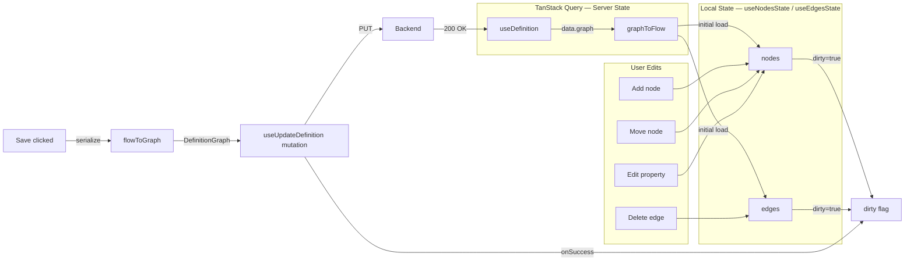

# Process Designer Canvas — Component Architecture Design

**Module:** Visual Canvas (React Flow)  
**Stage:** F2 Batch 1 — Canvas Foundation  
**Requirements:** PD-UI-03 (Visual graph canvas), PD-UI-04 (Node palette + drag-and-drop), PD-UI-05 (Node property panel), PD-UI-06 (Edge creation with CEL condition)  
**Date:** 2026-05-28  
**Designer:** CODE-DESIGNER

---

## 1. Module Purpose

The Process Designer Canvas is the primary authoring surface for PROCESS_DESIGNER and PLATFORM_ADMIN users to create and edit process definition graphs. It replaces the current JSON textarea fallback in `DefinitionEditorPage.tsx` with a visual drag-and-drop editor built on React Flow. The canvas renders the process graph as labelled cards (nodes) connected by directed arrows (edges) with optional CEL condition labels. It provides a node palette sidebar for adding elements, an inline properties panel for editing node attributes, and drag-from-handle edge creation with a condition prompt for EXCLUSIVE_GATEWAY outputs. The canvas operates in interactive mode for DRAFT definitions and read-only mode for ACTIVE/DEPRECATED/ARCHIVED definitions.

---

## 2. React Flow Integration Approach

### Library selection

| Concern | Decision |
|---|---|
| **Library** | `@xyflow/react` v12.x (the modern successor to `reactflow`, maintained by the same team under the "xyflow" umbrella) |
| **Package** | `@xyflow/react` — install via `npm install @xyflow/react` |
| **TypeScript types** | Bundled with the package (`Node`, `Edge`, `NodeProps`, `EdgeProps`, etc.) |
| **Background plugin** | `@xyflow/react` built-in `<Background />` component — dot-grid pattern, no extra dependency |
| **Minimap plugin** | `@xyflow/react` built-in `<MiniMap />` component (PD-UI-17, deferred to Batch 2) |
| **Controls plugin** | `@xyflow/react` built-in `<Controls />` component — zoom in/out, fit-to-screen (PD-UI-17, deferred to Batch 2) |
| **Auto-layout** | `dagre` (npm: `@dagrejs/dagre`) — used in a "Re-layout" utility function, not a plugin (PD-UI-18, deferred to Batch 2) |

### Version rationale

`@xyflow/react` v12.x is the actively maintained version as of Q2 2026. It offers:
- Stable React 19 compatibility
- Built-in TypeScript generics for custom node/edge data types (`NodeProps<CustomNodeData>`)
- The `useNodesState` / `useEdgesState` hooks for local state management
- The `useReactFlow` hook for imperative operations (fitView, getNodes, setNodes)
- `nodeTypes` map pattern (declared outside component to prevent re-render loops)

### No additional plugins for Batch 1

Batch 1 uses only the core `@xyflow/react` library. The following are deferred:
- **Minimap + Controls** → Batch 2 (PD-UI-17)
- **Auto-layout via dagre** → Batch 2 (PD-UI-18)
- **Undo/redo history** → Batch 2 (PD-UI-19, but the Zustand store schema is designed now)

---

## 3. Component Tree

```
DefinitionEditorPage                      [page layer — loads definition, routes to canvas]
 └── DefinitionEditorShell                [layout: sidebar toggle, toolbar, save button]
      ├── NodePalette                     [left sidebar — draggable node type list]
      │    ├── PaletteItem                [single draggable type entry, one per NodeType]
      │    └── PaletteSection             [grouped section: "Gateways", "Tasks", etc.]
      ├── ProcessCanvas                   [center — React Flow instance]
      │    ├── <ReactFlow>                [core canvas from @xyflow/react]
      │    │    ├── custom nodes/         [registered via nodeTypes map]
      │    │    │    ├── StartNode
      │    │    │    ├── EndNode
      │    │    │    ├── HumanTaskNode
      │    │    │    ├── ServiceTaskNode
      │    │    │    ├── ExclusiveGatewayNode
      │    │    │    ├── ParallelGatewayNode
      │    │    │    ├── TimerNode
      │    │    │    └── SubProcessNode
      │    │    └── custom edges/
      │    │         └── ConditionEdge    [custom edge renderer with label bubble]
      │    ├── <Background />             [dot-grid pattern]
      │    └── <Controls />               [zoom controls — Batch 2]
      ├── ValidationSummaryBar            [bottom bar — inline validation errors]
      └── PropertyPanel                   [right slide-over panel — opens on node click]
           ├── NodeTypeHeader             [icon + type label + node name input]
           ├── CommonAttributes           [fields shared across all node types]
           ├── TypeSpecificAttributes     [conditional fields per NodeType]
           └── EdgeConditionEditor        [CEL expression input for gateway edges]
```

### Component responsibilities

| Component | Responsibility |
|---|---|
| `DefinitionEditorPage` | Route handler; loads `ProcessDefinition` via `useDefinition(id)`; determines read-only vs edit mode based on `definition.status`; manages `ReactFlowProvider` wrapper |
| `DefinitionEditorShell` | Composes the three-column layout (palette | canvas | property panel); houses the toolbar (Save button, read-only banner, unsaved-changes guard) |
| `NodePalette` | Lists all supported `NodeType` values as draggable items; handles the HTML5 `dragstart` event with a serialised node descriptor in `dataTransfer` |
| `ProcessCanvas` | Creates the `<ReactFlow>` instance; registers `nodeTypes` and `edgeTypes` maps; connects to canvas state via `useNodesState` / `useEdgesState`; handles `onConnect` (edge creation), `onDrop` (node from palette), `onNodeClick` (open property panel), `onNodesChange` / `onEdgesChange` |
| `PropertyPanel` | Slide-over panel (right side, `--panel-width: 400px`); reads the selected node's `data` attributes; renders editable fields; writes changes back to local node state via `setNodes` |
| `ValidationSummaryBar` | Subscribes to the current graph; runs client-side validation rules (mirroring PD-02); displays error count in a collapsible bottom bar; nodes with errors get `data.validationError` set |

---

## 4. Data Flow: DefinitionGraph ↔ React Flow

### 4.1 API graph → canvas nodes/edges

```mermaid
flowchart LR
    A[GET /api/v1/definitions/:id] --> B[ProcessDefinition.graph]
    B --> C{graphToFlow<br/>converter}
    C --> D[React Flow nodes[]]
    C --> E[React Flow edges[]]
    D --> F[useNodesState]
    E --> G[useEdgesState]
    F --> H[<ReactFlow>]
    G --> H
```

**Conversion logic (`graphToFlow`):**

```typescript
// Design: src/utils/canvas/graphToFlow.ts
// Input: DefinitionGraph (from API)
// Output: { nodes: Node<CanvasNodeData>[], edges: Edge<CanvasEdgeData>[] }

// GraphNode → React Flow Node mapping:
interface CanvasNodeData {
  nodeType: NodeType                // the BPM node type
  name: string                      // human-readable label
  attributes: Record<string, unknown>  // all type-specific attributes
  validationError?: string          // set by client-side validator
}

// GraphEdge → React Flow Edge mapping:
interface CanvasEdgeData {
  condition?: string                // CEL expression (for EXCLUSIVE_GATEWAY)
  isDefault?: boolean               // default edge flag
}
```

**Positioning on initial load:**
- If graph has persisted positions in `GraphNode.attributes.position` (stored during save): restore them
- If no positions (e.g. imported definition): run Dagre auto-layout to assign initial `{x, y}` coordinates
- Each `GraphNode.id` maps 1:1 to React Flow `node.id`
- Each `GraphEdge` maps 1:1 to React Flow `edge.id` with `source` and `target` matching node IDs

### 4.2 Canvas nodes/edges → API graph (on save)

```mermaid
flowchart LR
    A[React Flow nodes[]] --> B{flowToGraph<br/>converter}
    C[React Flow edges[]] --> B
    B --> D[DefinitionGraph]
    D --> E[PUT /api/v1/definitions/:id]
    E --> F[Success toast]
```

**Conversion logic (`flowToGraph`):**

```typescript
// Design: src/utils/canvas/flowToGraph.ts
// Input: Node<CanvasNodeData>[], Edge<CanvasEdgeData>[]
// Output: DefinitionGraph

// For each React Flow node:
//   node.id → GraphNode.id
//   node.data.nodeType → GraphNode.type
//   node.data.name → GraphNode.name
//   node.data.attributes → GraphNode.attributes (merged with position: {x, y})
//   node.position → stored as attributes.position for round-trip persistence

// For each React Flow edge:
//   edge.id → GraphEdge.id
//   edge.source → GraphEdge.source
//   edge.target → GraphEdge.target
//   edge.data?.condition → GraphEdge.condition
//   edge.data?.isDefault → GraphEdge.is_default
```

### 4.3 Data flow diagram (complete round trip)

```mermaid
flowchart TD
    API[Backend API] -->|GET /definitions/:id| Fetch[useDefinition hook]
    Fetch -->|ProcessDefinition.graph| GraphToFlow[graphToFlow converter]
    GraphToFlow -->|Node[] + Edge[]| CanvasState
    
    subgraph CanvasState [Client State — Zustand]
        Nodes[useNodesState]
        Edges[useEdgesState]
        Selected[selectedNodeId]
        History[(Undo/Redo Stack — Batch 2)]
    end
    
    CanvasState -->|render| RF[<ReactFlow>]
    RF -->|onNodesChange| Nodes
    RF -->|onEdgesChange| Edges
    RF -->|onConnect| Edges
    RF -->|onNodeClick| Selected
    
    Palette[NodePalette] -->|drag & drop| RF
    PP[PropertyPanel] -->|edit attributes| Nodes
    
    Save[Save button] -->|serialize| FlowToGraph[flowToGraph converter]
    FlowToGraph -->|DefinitionGraph| Mutate[useUpdateDefinition mutation]
    Mutate -->|PUT /definitions/:id| API
```

---

## 5. Custom Node Renderers

All node components are registered in a static `nodeTypes` map (defined outside the React component to prevent re-renders):

```typescript
// Design — file: src/components/canvas/ProcessCanvas.tsx
const nodeTypes: NodeTypes = {
  START: StartNode,
  END: EndNode,
  HUMAN_TASK: HumanTaskNode,
  SERVICE_TASK: ServiceTaskNode,
  EXCLUSIVE_GATEWAY: ExclusiveGatewayNode,
  PARALLEL_GATEWAY: ParallelGatewayNode,
  TIMER: TimerNode,
  SUB_PROCESS: SubProcessNode,
}
```

### 5.1 START node

| Property | Value |
|---|---|
| **Shape** | Circle, 48×48 px |
| **Border** | 2 px solid `--color-brand-600` |
| **Fill** | White (`--color-neutral-0`) |
| **Icon** | Play/triangle icon (right-facing) in brand colour |
| **Label** | Text "Start" below the circle or inside |
| **Handles** | 1 source handle (bottom center) — `type="source"` |
| **Interaction** | Read-only in edit mode; no draggable handles, no attribute editing |
| **Data attributes** | None (START has no configurable attributes) |

### 5.2 END node

| Property | Value |
|---|---|
| **Shape** | Circle, 48×48 px, double border (outer 3 px, inner 2 px) |
| **Border** | Outer `--color-neutral-500`, inner `--color-error-dark` |
| **Fill** | `--color-neutral-50` |
| **Icon** | Stop/square icon in error-dark colour |
| **Handles** | 1 target handle (top center) — `type="target"` |
| **Interaction** | Read-only |
| **Data attributes** | None |

### 5.3 HUMAN_TASK node

| Property | Value |
|---|---|
| **Shape** | Rounded rectangle, 180×72 px |
| **Border** | 1.5 px solid `--color-brand-500` |
| **Fill** | White (`--color-neutral-0`) |
| **Icon** | User/person icon in brand colour |
| **Label** | Node `name` (top-left, bold, truncated) |
| **Sub-label** | "Human Task" in `--text-xs`, `--text-secondary` |
| **Handles** | 1 target (top center), 1 source (bottom center) |
| **Data attributes** | `assignee_type`, `assignee_ref`, `form_schema`, `escalation_timer_duration`, `escalation_actions` |

### 5.4 SERVICE_TASK node

| Property | Value |
|---|---|
| **Shape** | Rounded rectangle, 180×72 px |
| **Border** | 1.5 px solid `--color-info` |
| **Fill** | White (`--color-neutral-0`) |
| **Icon** | Gear/cog icon in info colour |
| **Label** | Node `name` (top-left, bold, truncated) |
| **Sub-label** | "Service Task" or the configured `service_type` |
| **Handles** | 1 target (top center), 1 source (bottom center) |
| **Data attributes** | `service_type`, `service_config`, `input_mapping`, `output_mapping` |

### 5.5 EXCLUSIVE_GATEWAY node

| Property | Value |
|---|---|
| **Shape** | Rotated square (diamond), 56×56 px |
| **Border** | 2 px solid `--color-warning-dark` |
| **Fill** | White (`--color-neutral-0`) |
| **Icon** | "X" mark or cross inside diamond |
| **Label** | "Exclusive" in `--text-xs` below the diamond |
| **Handles** | 1 target (top center), multiple source handles (bottom, left, right — one per outgoing edge) |
| **Interaction** | Source handles visible on hover; dragging creates edge with CEL prompt (see §6) |
| **Data attributes** | None (no configurable node attributes; edge conditions carry the logic) |
| **Edge count validation** | Must have ≥2 outgoing edges; exactly one may be `is_default=true` |

### 5.6 PARALLEL_GATEWAY node

| Property | Value |
|---|---|
| **Shape** | Rotated square (diamond), 56×56 px |
| **Border** | 2 px solid `--color-success-dark` |
| **Fill** | White (`--color-neutral-0`) |
| **Icon** | "+" plus sign inside diamond |
| **Label** | "Parallel" in `--text-xs` below the diamond |
| **Handles** | 1 target (top center), multiple source handles (bottom for split / join) |
| **Interaction** | Standard source handles; no condition prompt on edge creation |
| **Data attributes** | None |

### 5.7 TIMER node

| Property | Value |
|---|---|
| **Shape** | Circle, 56×56 px |
| **Border** | 2 px solid `--color-warning` |
| **Fill** | White (`--color-neutral-0`) |
| **Icon** | Clock icon in warning colour |
| **Label** | "Timer" below the circle |
| **Handles** | 1 target (top center), 1 source (bottom center) |
| **Data attributes** | `timer_duration` (ISO 8601 duration string), `timer_type` ("duration" / "cron" / "date") |

### 5.8 SUB_PROCESS node

| Property | Value |
|---|---|
| **Shape** | Rounded rectangle, 200×80 px |
| **Border** | 2 px dashed `--color-brand-400` |
| **Fill** | White (`--color-neutral-0`) |
| **Icon** | Stacked-layers icon in brand colour |
| **Label** | Node `name` (top-left, bold, truncated) |
| **Sub-label** | "Sub-process" with referenced definition name |
| **Handles** | 1 target (top center), 1 source (bottom center) |
| **Data attributes** | `sub_definition_name`, `sub_definition_version`, `input_mapping`, `output_mapping` |

### 5.9 Node visual states (all types)

| State | Treatment |
|---|---|
| **Default** | As specified above per type |
| **Selected** | `2px solid --color-brand-500` + subtle shadow (`0 0 0 3px rgba(34,139,230,0.2)`) |
| **Validation error** | Red border (`--color-error`) + small error icon in top-right corner |
| **Read-only** | No hover effects; `cursor: default`; no handle drag indicators |
| **Drag-over (palette)** | Translucent blue highlight at drop zone |

---

## 6. Edge Creation Workflow

### 6.1 Standard edge creation (non-EXCLUSIVE_GATEWAY source)



- Edge is created with `type: 'condition'` (references the custom `ConditionEdge` component)
- Edge `data` is `{ condition: undefined, isDefault: false }` by default
- Edge inherits `id = `rf-edge-${source}-${target}`` (React Flow auto-generated)

### 6.2 EXCLUSIVE_GATEWAY edge creation (with CEL condition prompt)



**ConditionDialog component specification:**

| Property | Description |
|---|---|
| **Title** | "Edge Condition" |
| **CEL input** | Code/monospace text field (`<textarea>` with monospace font; Monaco/CodeMirror deferred to PD-UI-16 Batch 2) |
| **CEL placeholder** | `e.g. status == 'approved'` |
| **Default edge toggle** | Checkbox labelled "Default edge (no condition)" — when checked, the CEL input is hidden/disabled |
| **Validation** | Client-side: basic syntax check (non-empty CEL or default checked); server-side: PD-06 validation on save |
| **Buttons** | Cancel | Confirm |
| **Escaping** | Pressing Escape cancels (no edge created) |

### 6.3 Edge deletion

- Click edge → edge is selected (visual highlight)
- Press `Delete` or `Backspace` key → edge is removed (via `onEdgesChange` or explicit `setEdges`)
- Edge deletion does NOT require confirmation

### 6.4 Custom edge renderer: ConditionEdge

| Property | Value |
|---|---|
| **Type** | `'condition'` |
| **Style** | Solid line, arrow marker, `--color-neutral-500` |
| **Label** | If `data.condition`: label bubble showing truncated expression (max 30 chars + "…") with `--color-warning-light` background |
| **Default edge** | If `data.isDefault`: dashed line, "D" marker bubble with `--color-info-light` background |
| **Animated** | Not animated in design mode (may be animated in instance view for active tokens) |

---

## 7. Property Panel

### 7.1 Panel layout

- **Position:** Right-side slide-over panel, `width: 400px` (`--panel-width`)
- **Visibility:** Hidden when no node is selected; slides in when a node is clicked
- **Dismiss:** Click outside panel OR press Escape OR click the panel's X button
- **Scroll:** Content scrolls vertically if taller than viewport

### 7.2 Panel sections

#### Header section
- Node type icon + label (e.g. person icon + "Human Task")
- Node name text input (editable, updates `node.data.name` on change)

#### Common attributes section (all node types except START/END)
- **Name** — text input, updates `node.data.name` (required, 1-200 chars)
- **Description** — textarea (optional, shown only if node has description in schema)

#### Type-specific attributes section

| NodeType | Attributes | Input type |
|---|---|---|
| `HUMAN_TASK` | `assignee_type` | Select: "user" / "group" / "role" / "unassigned" |
| | `assignee_ref` | Text input (user/group/role ID or name) |
| | `form_schema` | JSON editor (JSON Schema object) |
| | `escalation_timer_duration` | Text input (ISO 8601 duration, e.g. `PT1H`) |
| | `escalation_actions` | JSON editor (array of action objects) |
| `SERVICE_TASK` | `service_type` | Text input (e.g. "http", "lambda") |
| | `service_config` | JSON editor |
| | `input_mapping` | JSON editor (CEL variable mappings) |
| | `output_mapping` | JSON editor |
| `TIMER` | `timer_type` | Select: "duration" / "cron" / "date" |
| | `timer_duration` | Text input (depends on type: ISO 8601 / cron expr / RFC 3339) |
| `SUB_PROCESS` | `sub_definition_name` | Text input (autocomplete from existing definitions — Batch 2) |
| | `sub_definition_version` | Text input |
| | `input_mapping` | JSON editor |
| | `output_mapping` | JSON editor |
| `EXCLUSIVE_GATEWAY` | *No node-level attributes* | — (edge conditions managed via edge creation/edge click) |
| `PARALLEL_GATEWAY` | *No node-level attributes* | — |
| `START` | *No attributes* | — |
| `END` | *No attributes* | — |

### 7.3 Edge property panel (when edge is selected)

If a `ConditionEdge` is selected, the property panel shows:
- **Source** → **Target** (readable node names, read-only)
- **CEL expression** — text input (editable)
- **Default edge** — checkbox toggle
- **Delete edge** — danger button (with confirmation via `ConfirmDialog`)

### 7.4 Save-to-local-state flow

```
User edits a field in PropertyPanel
  → onChange handler calls setNodes(nds => nds.map(n =>
      n.id === selectedId
        ? { ...n, data: { ...n.data, attributes: { ...n.data.attributes, [field]: value } } }
        : n
    ))
  → React Flow re-renders the node with updated visual
  → No API call on individual field edits
  → Dirty flag is set (unsaved-changes guard activates)
```

---

## 8. Save Workflow

### 8.1 Save button



### 8.2 Serialization details (`flowToGraph`)

The converter extracts from React Flow state:

```typescript
// Design sketch — flowToGraph conversion
// For each Node<CanvasNodeData>:
{
  id: node.id,
  type: node.data.nodeType,         // GraphNode.type = NodeType enum
  name: node.data.name,
  attributes: {
    ...node.data.attributes,
    position: { x: node.position.x, y: node.position.y },  // persist layout
  }
}

// For each Edge<CanvasEdgeData>:
{
  id: edge.id,
  source: edge.source,
  target: edge.target,
  condition: edge.data?.condition,
  is_default: edge.data?.isDefault ?? false,
}
```

### 8.3 Unsaved changes guard

- A `dirty` boolean state is kept in the canvas shell (`DefinitionEditorShell`)
- `dirty = true` after any `onNodesChange`, `onEdgesChange`, or `onConnect` event
- `dirty` resets to `false` after a successful save
- Before navigating away (`useBlocker` from React Router v7): if `dirty`, show confirmation dialog: "You have unsaved changes. Discard them?"
- Before closing the tab: `beforeunload` event handler shows browser-native prompt

---

## 9. JSON Textarea Fallback Coexistence

### 9.1 Coexistence strategy

The current `DefinitionEditorPage.tsx` has a full-page JSON textarea with a hint: *"Visual canvas (React Flow) will replace this editor in a future iteration."*

For Batch 1, the canvas replaces the textarea as the **primary editor**. The JSON textarea is preserved as a **read-only debug view** accessible via a "Show raw JSON" toggle button in the toolbar.

### 9.2 UI treatment

```
┌─────────────────────────────────────────────────────────┐
│  ┌──────┐  ┌──────────────────────────┐ ┌────────────┐ │
│  │Palette│  │                          │ │Properties  │ │
│  │       │  │      ProcessCanvas       │ │Panel       │ │
│  │START  │  │    (React Flow)          │ │            │ │
│  │END    │  │                          │ │Name: ___   │ │
│  │HUMAN  │  │   [Node]──→[Node]       │ │Assignee:   │ │
│  │GATEWAY│  │                          │ │            │ │
│  │ ...   │  │                          │ │            │ │
│  └──────┘  └──────────────────────────┘ └────────────┘ │
│  ┌──────────────────────────────────────────────────────┐│
│  │ Toolbar: [Save] [Show Raw JSON ▼] [Re-layout]       ││
│  └──────────────────────────────────────────────────────┘│
└─────────────────────────────────────────────────────────┘
```

### 9.3 "Show Raw JSON" drawer

- Clicking "Show Raw JSON" toggles a collapsible drawer **at the bottom** of the canvas area
- The drawer shows the current `DefinitionGraph` as pretty-printed JSON in a `<textarea readonly rows={10}>`
- The JSON in this drawer is **live-updated** as the user edits the canvas (not a stale snapshot)
- This serves as a developer/debug tool and as a migration bridge while the canvas reaches feature parity

### 9.4 Removal path

The JSON textarea fallback drawer is removed entirely when all of the following are true:
- PD-UI-13 (Inline validation feedback) is implemented
- PD-UI-14 (Save) is implemented
- PD-UI-12 (Node properties panel) covers all NodeType attributes
- **Decision:** ORCH removes the fallback in a follow-up batch after validating all canvas features work end-to-end

---

## 10. State Management

### 10.1 State ownership

| State | Owner | Persistence |
|---|---|---|
| React Flow nodes | `useNodesState` (local to `ProcessCanvas`) | In-memory only; saved via `flowToGraph` → API |
| React Flow edges | `useEdgesState` (local to `ProcessCanvas`) | In-memory only |
| Selected node ID | `useState` in `DefinitionEditorShell` | In-memory only |
| Dirty flag | `useState` in `DefinitionEditorShell` | In-memory only |
| Definition metadata | TanStack Query cache (`useDefinition`) | React Query cache |
| Undo/redo history | Zustand store (`canvasHistoryStore`) — Batch 2 | In-memory only |
| Palette collapsed state | `useState` (local to `NodePalette`) | In-memory only |

### 10.2 Local graph state vs API sync pattern



**Key design decisions:**

1. **No auto-sync.** Changes are local until the user explicitly clicks Save. This avoids partial graph states being persisted during editing.
2. **React Flow hooks** (`useNodesState`, `useEdgesState`) manage local state — not Zustand. Zustand is reserved for undo/redo history (Batch 2).
3. **On successful save**, the TanStack Query cache is invalidated so the next `useDefinition` refetch pulls the canonical server state.
4. **On save failure** (network error, validation error from server), the local state is preserved — the user can fix and retry.
5. **On initial load from API**, the `graphToFlow` converter runs once. Subsequent canvas operations work purely on local state.

### 10.3 Read-only mode

When `definition.status !== 'DRAFT'`:
- `ProcessCanvas` receives `nodesDraggable={false}`, `nodesConnectable={false}`, `elementsSelectable={true}`
- Nodes are still clickable → property panel opens in **read-only** mode (all fields `disabled` or plain text)
- Node palette is hidden entirely
- Save button is hidden
- A banner at top: "This definition is {status}. Open a DRAFT version to edit."

---

## 11. Error Taxonomy

| Error case | Where caught | User impact |
|---|---|---|
| API fetch fails (definition load) | TanStack Query error boundary | "Failed to load definition" error state with retry button |
| Invalid graph JSON on save (server 422) | `useUpdateDefinition` mutation error | Inline error above Save button with server message |
| Network error on save | `useUpdateDefinition` mutation error | Toast: "Failed to save. Check your connection and try again." |
| Client-side validation error | `ValidationSummaryBar` | Blocked save; user must fix errors first |
| React Flow internal error | `ErrorBoundary` wrapping `<ReactFlow>` | "Canvas error — reload view" with recovery action |
| Drag-and-drop of unsupported type | `onDrop` handler | Silently ignored (noop) |
| EXCLUSIVE_GATEWAY with <2 outgoing edges | Validation rule | Warning in validation summary |
| EXCLUSIVE_GATEWAY with >1 default edge | Validation rule | Error in validation summary |

---

## 12. Dependencies

### Direct dependencies (npm packages to install)

| Package | Version | Purpose |
|---|---|---|
| `@xyflow/react` | ^12.x | React Flow canvas library |
| `@dagrejs/dagre` | ^1.x | DAG auto-layout (Batch 2, but planned dependency) |

### Internal module dependencies

| This module depends on | For |
|---|---|
| `@/api/definitions` (definitionsApi) | `get`, `update` API calls |
| `@/hooks/useDefinitions` | `useDefinition`, `useUpdateDefinition` TanStack Query hooks |
| `@/types/api` | `DefinitionGraph`, `GraphNode`, `GraphEdge`, `NodeType`, `ProcessDefinition` types |
| `@/components/ui/Dialog` | Confirmation dialogs (unsaved changes, edge condition, delete confirmation) |
| `@/components/ui/Toast` | Save success/failure notifications |
| `@/components/ui/JsonEditor` | JSON editor fields in property panel (form_schema, service_config, etc.) |
| `@/auth/useAuth` | Role check (PROCESS_DESIGNER or PLATFORM_ADMIN can edit) |

### Must NOT depend on

- Any backend module or database layer
- MSW or HTTP mocking libraries
- `react-router-dom`'s data loading (uses TanStack Query instead)

---

## 13. File Manifest (to be created by FRONTEND-DEV)

```
web/src/
├── components/
│   └── canvas/
│       ├── ProcessCanvas.tsx              # Main React Flow wrapper + nodeTypes/edgeTypes registration
│       ├── NodePalette.tsx                # Left sidebar draggable node type list
│       ├── PropertyPanel.tsx              # Right slide-over node/edge property editor
│       ├── ValidationSummaryBar.tsx       # Bottom validation error list
│       ├── ConditionDialog.tsx            # CEL condition prompt for EXCLUSIVE_GATEWAY edges
│       ├── nodes/
│       │   ├── StartNode.tsx
│       │   ├── EndNode.tsx
│       │   ├── HumanTaskNode.tsx
│       │   ├── ServiceTaskNode.tsx
│       │   ├── ExclusiveGatewayNode.tsx
│       │   ├── ParallelGatewayNode.tsx
│       │   ├── TimerNode.tsx
│       │   └── SubProcessNode.tsx
│       └── edges/
│           └── ConditionEdge.tsx
├── utils/
│   └── canvas/
│       ├── graphToFlow.ts                 # DefinitionGraph → React Flow nodes/edges
│       ├── flowToGraph.ts                 # React Flow nodes/edges → DefinitionGraph
│       └── layout.ts                      # Dagre auto-layout (Batch 2 stub)
├── stores/
│   └── canvasHistoryStore.ts              # Zustand undo/redo store (schema only, Batch 2)
└── pages/
    └── definitions/
        └── DefinitionEditorPage.tsx       # *** REWORK *** integrate canvas, palette, property panel
```

---

## 14. Open Questions

1. **Requirement ID mismatch:** The handoff references `PD-UI-03` through `PD-UI-06` for the canvas features, but the requirements doc assigns those IDs to F2-A (Definition List View). The canvas requirements are `PD-UI-09` (Visual graph canvas), `PD-UI-10` (Node palette), `PD-UI-11` (Edge creation), and `PD-UI-12` (Node properties panel). **Clarification needed:** Should the requirement IDs in the status tracker be updated to `PD-UI-09`–`PD-UI-12`, or should the requirements doc be renumbered?

2. **Node positioning on first load:** When a definition is created via `POST /definitions` with an auto-generated empty graph (START → END), should the canvas auto-layout immediately, or should the two initial nodes appear at hardcoded positions (e.g., START at `{x: 250, y: 150}`, END at `{x: 250, y: 350}`)? The design assumes auto-layout via Dagre on first load, but this adds a dependency on `@dagrejs/dagre` in Batch 1. **Alternative:** Use hardcoded fallback positions for the two-node starter graph and defer Dagre to Batch 2 (PD-UI-18).

3. **Edge condition editing:** When a user clicks an existing edge (not during creation), should the property panel show the CEL editor inline, or should it open a separate edit dialog? The current design assumes the property panel shows it inline (§7.3). If edge-selection UX conflicts with node-selection UX, a separate dialog may be cleaner.

4. **Batch 2 dependency:** The undo/redo store (`canvasHistoryStore.ts`) is referenced in the file manifest but is empty (schema only). The Zustand store definition should be created in Batch 1 as a shallow stub to avoid import errors, but the undo/redo logic is fully implemented in Batch 2.

5. **Mobile responsiveness:** The canvas view is not available on mobile (per design system §9). Should the canvas route redirect to a "Canvas unavailable on mobile" info page, or should the definition list page detect viewport and require a desktop-width screen before showing the "Edit" action? The current assumption: the definition list hides the "Edit" button on viewports < 1024 px (per FNFR-07).
