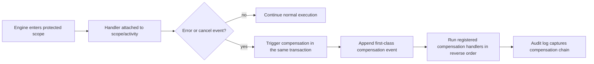
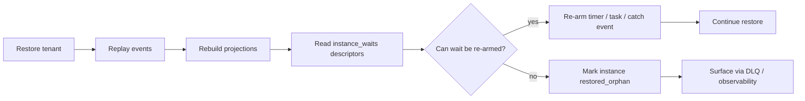

# Design: Compensation and Restore Reconciliation

**Requirements:** EXP-401, EXP-402
**Run ID:** WF02-exp4-compensation-20260613
**Status:** DESIGN — no implementation code

---

## 1. Module Purpose

This design covers two related engine capabilities that sit at the boundary between
process execution, graph validation, and restore-time recovery.

- **EXP-401** makes compensation declarative and auditable. A scope or activity can
  register a compensation handler, and an error-boundary event can trigger that handler
  when the protected work fails or is cancelled. The engine must record compensation as a
  first-class event so the compensation chain is visible in replay and audit trails.
- **EXP-402** makes restore reconciliation deterministic. During tenant restore, the
  system must replay events, rebuild projections, and then re-arm waits from the durable
  `instance_waits` descriptors added by EXP-103. Any instance that cannot be safely
  re-armed must be marked `restored_orphan` and surfaced through DLQ/observability so
  operators can see that restore completed with a recovery gap rather than silently
  hanging.

The two requirements are coupled by dependency and execution order: restore only has a
complete wait picture if compensation and wait-descriptor semantics are both understood
by the engine and the restore flow.

---

## 2. Public Interface

The design intentionally keeps the public surface narrow. The engine and validator need
only a small set of additional types and entry points.

### 2.1 Engine data types — `src/engine/*`

```zig
pub const CompensationHandlerRef = struct {
    scope_id: []const u8,
    handler_node_id: []const u8,
    reverse_order: bool,
};

pub const ErrorBoundaryNode = struct {
    node_id: []const u8,
    attached_to_node_id: []const u8,
    on_error_event: []const u8,
    on_cancel_event: []const u8,
};

pub const CompensationRecord = struct {
    instance_id: [16]u8,
    scope_id: []const u8,
    handler_node_id: []const u8,
    triggered_by_node_id: []const u8,
    trigger_reason: CompensationTriggerReason,
};

pub const CompensationTriggerReason = enum {
    error,
    cancel,
};

pub const RestoreReconciliationResult = struct {
    restored_instances: u32,
    rearmed_waits: u32,
    orphaned_instances: u32,
};
```

### 2.2 Engine operations — `src/engine/instance.zig` or adjacent engine module

```zig
pub fn triggerCompensationInTx(
    allocator: std.mem.Allocator,
    conn: *db.Conn,
    instance_id: [16]u8,
    scope_id: []const u8,
    handler_node_id: []const u8,
    trigger_reason: CompensationTriggerReason,
    triggered_by_node_id: []const u8,
) CompensationError!CompensationRecord;

pub fn recordCompensationEventInTx(
    allocator: std.mem.Allocator,
    conn: *db.Conn,
    record: CompensationRecord,
) CompensationError!void;

pub fn restoreTenantWithWaitReconciliation(
    allocator: std.mem.Allocator,
    pool: *db.Pool,
    tenant_id: [16]u8,
) RestoreError!RestoreReconciliationResult;

pub fn rearmWaitsFromDescriptorsInTx(
    allocator: std.mem.Allocator,
    conn: *db.Conn,
    instance_id: [16]u8,
) RestoreError!u32;

pub fn markRestoredOrphanInTx(
    allocator: std.mem.Allocator,
    conn: *db.Conn,
    instance_id: [16]u8,
    reason: []const u8,
) RestoreError!void;
```

### 2.3 Graph validation hooks — `src/definition/graph.zig`

```zig
pub fn validateCompensationHandlers(
    allocator: std.mem.Allocator,
    definition: *const DefinitionGraph,
) GraphValidationError!void;

pub fn validateErrorBoundaryReachability(
    allocator: std.mem.Allocator,
    definition: *const DefinitionGraph,
) GraphValidationError!void;

pub fn validateReversibility(
    allocator: std.mem.Allocator,
    definition: *const DefinitionGraph,
) GraphValidationError!void;
```

### 2.4 Restore dependencies on EXP-103 descriptors

EXP-402 must consume the `instance_waits` rows introduced by EXP-103. It does not infer
wait state from timers/tasks directly during restore. The restore flow reads the durable
descriptor rows, decides whether each wait can be re-armed, and then either re-arms it or
marks the instance as an orphan.

---

## 3. Data Flow

### 3.1 Compensation flow



The engine must preserve the order in which handlers were registered so that a cancel path
replays them in reverse order. That reverse execution order is part of the process semantics,
not just a logging detail.

### 3.2 Restore reconciliation flow



Restore reconciliation is intentionally two-phase:

1. Reconstruct the durable state from events and projections.
2. Reconcile live waits from the descriptor table after that state is known.

This keeps restore deterministic and avoids mixing replay-time state reconstruction with
wait-arming side effects.

---

## 4. Error Taxonomy

### 4.1 Compensation errors

```zig
pub const CompensationError = error{
    PoolExhausted,
    TransactionFailed,
    OutOfMemory,
    DefinitionNotFound,
    ScopeNotFound,
    HandlerNotReachable,
    HandlerNotReversible,
    ErrorBoundaryMissing,
    CompensationAlreadyRecorded,
    InvalidCompensationTopology,
};
```

### 4.2 Restore errors

```zig
pub const RestoreError = error{
    PoolExhausted,
    TransactionFailed,
    OutOfMemory,
    ReplayFailed,
    ProjectionRebuildFailed,
    DescriptorReadFailed,
    WaitRearmFailed,
    RestoredOrphanMarked,
    InstanceNotFound,
};
```

### 4.3 Graph validation errors

```zig
pub const GraphValidationError = error{
    MissingCompensationHandler,
    CompensatesUnknownNode,
    ErrorBoundaryNotAttached,
    NonReversibleActivity,
    CyclicCompensationChain,
    InvalidHandlerReachability,
};
```

The validator should fail fast on structural defects before the definition reaches
activation. Restore should tolerate old or partially migrated rows by marking
un-re-armable instances as orphans instead of crashing the entire tenant restore.

---

## 5. State Transitions

### 5.1 Compensation state

`normal -> error_boundary_triggered -> compensation_running -> compensation_recorded -> resumed_or_failed`

Meaning:

- `normal`: activity is executing without an active fault.
- `error_boundary_triggered`: a boundary event has fired because the protected activity failed or was cancelled.
- `compensation_running`: the handler chain is executing in reverse registration order.
- `compensation_recorded`: the first-class compensation event has been appended and is visible to replay/audit.
- `resumed_or_failed`: the scope either resumes normal execution after compensation or fails if the handler chain cannot complete.

### 5.2 Restore reconciliation state

`replayed -> projections_rebuilt -> waits_rearmed | restored_orphan`

Meaning:

- `replayed`: all tenant events have been restored.
- `projections_rebuilt`: read models are synchronized with the restored event stream.
- `waits_rearmed`: descriptor rows were successfully converted back into live waits.
- `restored_orphan`: one or more waits could not be safely restored, so the instance is intentionally surfaced as incomplete.

---

## 6. Dependencies

### Required dependencies

- `src/engine/*` for execution, compensation recording, and restore orchestration.
- `src/definition/graph.zig` for compensation topology validation and reachability checks.
- `src/db/*` for transactional restore and event/projection repair.
- `src/tasks/*` and `src/scheduler/*` indirectly, because restore must re-arm task and timer waits from `instance_waits`.
- `src/dlq/*` and observability hooks for orphan surfacing.
- EXP-103 wait descriptors, which are the restore source of truth for live waits.

### Must not depend on

- Direct I/O inside the pure transition layer.
- Ad hoc inspection of `timers` or `tasks` as the restore source of truth.
- Any restore path that silently skips un-re-armable instances.

---

## 7. Open Questions

1. Whether `restored_orphan` is a new instance status, a restore-only flag, or a DLQ record type is not fully specified in the backlog. The design assumes the restore flow must surface the condition in at least one persistent operator-visible channel.
2. The exact mapping between compensation scope, activity node, and nested subgraph boundaries is not spelled out. The validator should treat a handler as reachable only when the attached scope dominates the protected node in the definition graph.
3. The restore flow must re-arm timers, human tasks, and catch events from `instance_waits`, but the catch-event re-arm mechanics are only partially specified by EXP-103. This design assumes restore uses the descriptor row as the contract and delegates protocol-specific re-arm work to the owning subsystem.
