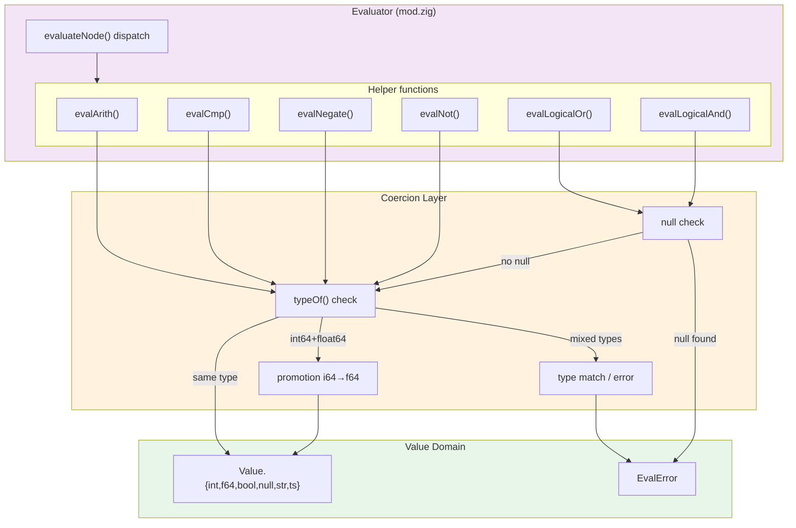

# Module: dsl-05-coercion — Type Coercion Rules for the Expression DSL Evaluator

**Stage:** Stage 7 — Expression DSL  
**Requirement:** DSL-05 — Type coercion rules  
**Depends on:** `src/design/expr.md` (module layout), `src/design/expr-types.md` (Value/TypeTag definitions)  
**Status:** Final

---

## 1. Purpose

Define the complete coercion behaviour between the six DSL runtime types (`null`, `bool`, `int64`, `float64`, `string`, `timestamp`) across all operator categories. This design is consumed by `BACKEND-DEV` when implementing the evaluator in `src/expr/mod.zig`.

---

## 2. Coercion Table — 6×6 × 4 Operator Categories

### Legend

| Symbol | Meaning |
|--------|---------|
| `→ T` | Evaluates to type T |
| `↑ L` | Promote left operand |
| `↑ R` | Promote right operand |
| `ERR` | `EvalError` — incompatible types |
| `∅→∅` | null in → null out (three-valued) |
| `∅→ERR` | null in → `EvalError` |
| `—` | Same type; no coercion needed |

Column/row headers represent the `TypeTag` of each operand after both have been evaluated to a `Value` but before the operation is performed.

---

### 2.1 Arithmetic operators (`+`, `-`, `*`, `/`, `%`)

| L \ R | `null` | `bool` | `int64` | `float64` | `string` | `timestamp` |
|-------|--------|--------|---------|-----------|----------|-------------|
| **`null`** | `∅→ERR` | `∅→ERR` | `∅→ERR` | `∅→ERR` | `∅→ERR` | `∅→ERR` |
| **`bool`** | `∅→ERR` | `ERR` | `ERR` | `ERR` | `ERR` | `ERR` |
| **`int64`** | `∅→ERR` | `ERR` | `— → int64` | `↑R → float64` | `ERR` | `ERR` |
| **`float64`** | `∅→ERR` | `ERR` | `↑L → float64` | `— → float64` | `ERR` | `ERR` |
| **`string`** | `∅→ERR` | `ERR` | `ERR` | `ERR` | `ERR` | `ERR` |
| **`timestamp`** | `∅→ERR` | `ERR` | `ERR` | `ERR` | `ERR` | `ERR` |

**Rules:**

1. `int64` + `int64` → `int64`. No coercion.
2. If one operand is `int64` and the other `float64`: promote the `int64` to `float64` via `@floatFromInt(i64)`, result is `float64`.
3. If either operand is `null` → `EvalError` with message `"arithmetic on null operand"`.
4. All other type pairs → `EvalError` with message `"type mismatch: cannot apply arithmetic operator to <L> and <R>"`.

**Edge cases:**
- Division by zero: `/` on a `float64` produces IEEE 754 infinity (not an error). `/` on `int64` with a zero divisor produces `EvalError` with message `"division by zero"`.
- `%` with a zero divisor on `int64`: `EvalError` with message `"modulo by zero"`.
- `%` on `float64`: `EvalError` with message `"modulo requires integer operands"`.

---

### 2.2 Comparison operators (`==`, `!=`, `<`, `<=`, `>`, `>=`)

| L \ R | `null` | `bool` | `int64` | `float64` | `string` | `timestamp` |
|-------|--------|--------|---------|-----------|----------|-------------|
| **`null`** | `— → bool` | `∅→∅` | `∅→∅` | `∅→∅` | `∅→∅` | `∅→∅` |
| **`bool`** | `∅→∅` | `— → bool` | `ERR` | `ERR` | `ERR` | `ERR` |
| **`int64`** | `∅→∅` | `ERR` | `— → bool` | `ERR` | `ERR` | `ERR` |
| **`float64`** | `∅→∅` | `ERR` | `ERR` | `— → bool` | `ERR` | `ERR` |
| **`string`** | `∅→∅` | `ERR` | `ERR` | `ERR` | `— → bool` | `ERR` |
| **`timestamp`** | `∅→∅` | `ERR` | `ERR` | `ERR` | `ERR` | `— → bool` |

**Rules:**

1. **Same-type comparisons**: no coercion. `==` / `!=` compare values; `<` / `<=` / `>` / `>=` compare by the type's natural order.
2. **null vs null**: `null == null` → `true`; `null != null` → `false`. Ordering comparisons (`<`, `<=`, `>`, `>=`) between two nulls always return `null` (not an error, but semantically meaningless; implement for completeness).
3. **null vs non-null** (any type): `==` → `null`; `!=` → `null`; ordering → `null`. All return `null` (three-valued logic — DSL-05 §3).
4. **int64 vs float64**: `ERR` — **never silent coercion in comparisons**. This is a hard requirement from DSL-05. Callers must use an explicit cast built-in if they intend cross-type comparison.
5. **Mixed types** (other than null above): `ERR` with message `"type mismatch: cannot compare <L> with <R>"`.

**Natural ordering rules:**

| Type | Ordering method |
|------|----------------|
| `bool` | `false < true` |
| `int64` | Numeric `i64` order |
| `float64` | IEEE 754 `f64` order (NaN never occurs — not a DSL value) |
| `string` | Lexicographic byte order (`std.mem.order(u8, ...)`) |
| `timestamp` | Numeric `i64` (milliseconds since epoch) |
| `null` | Not orderable; ordering ops return null |

---

### 2.3 Boolean logic (`and`, `or`)

| L \ R | `null` | `bool` | `int64` | `float64` | `string` | `timestamp` |
|-------|--------|--------|---------|-----------|----------|-------------|
| **`null`** | `→ null` | `→ null`/`→ bool` | `ERR` | `ERR` | `ERR` | `ERR` |
| **`bool`** | `→ null`/`→ bool` | `— → bool` | `ERR` | `ERR` | `ERR` | `ERR` |
| **`int64`** | `ERR` | `ERR` | `ERR` | `ERR` | `ERR` | `ERR` |
| **`float64`** | `ERR` | `ERR` | `ERR` | `ERR` | `ERR` | `ERR` |
| **`string`** | `ERR` | `ERR` | `ERR` | `ERR` | `ERR` | `ERR` |
| **`timestamp`** | `ERR` | `ERR` | `ERR` | `ERR` | `ERR` | `ERR` |

**Rules:**

1. Both operands must be `bool` or `null`. Any operand of another type → `EvalError` with message `"type mismatch: boolean operator requires boolean operands"`.
2. See §3 below for the full three-valued logic table.
3. Non-null, non-bool operands → `ERR`.

---

### 2.4 Unary negation (`-expr`)

| Operand type | Result | Notes |
|-------------|--------|-------|
| `null` | `ERR` | Message: `"cannot negate null"` |
| `bool` | `ERR` | Message: `"type mismatch: cannot negate bool"` |
| `int64` | `int64` | `std.math.negate` or `-operand` (overflow wraps per Zig two's complement) |
| `float64` | `float64` | `-operand` |
| `string` | `ERR` | Message: `"type mismatch: cannot negate string"` |
| `timestamp` | `ERR` | Message: `"type mismatch: cannot negate timestamp"` |

### 2.5 Unary not (`not expr`)

| Operand type | Result | Notes |
|-------------|--------|-------|
| `null` | `null` | Three-valued: NOT null → null |
| `bool` | `bool` | `!operand` |
| `int64` | `ERR` | Message: `"type mismatch: not requires boolean operand"` |
| `float64` | `ERR` | Message: `"type mismatch: not requires boolean operand"` |
| `string` | `ERR` | Message: `"type mismatch: not requires boolean operand"` |
| `timestamp` | `ERR` | Message: `"type mismatch: not requires boolean operand"` |

---

## 3. Three-Valued Logic for Null Propagation

### 3.1 Definition

The DSL implements **three-valued (Kleene K3) logic** for null — a variant where `null` represents "unknown" and propagates through boolean operators in a specific pattern.

### 3.2 Logical AND (`and`) — full truth table

| L | R | L `and` R |
|---|---|---|
| `false` | *(anything, unevaluated)* | `false` (short-circuit) |
| `true` | `true` | `true` |
| `true` | `false` | `false` |
| `true` | `null` | `null` |
| `null` | `true` | `null` |
| `null` | `false` | `null` |
| `null` | `null` | `null` |

**Short-circuit optimisation:** If L is `false`, return `false` immediately without evaluating R.

### 3.3 Logical OR (`or`) — full truth table

| L | R | L `or` R |
|---|---|---|
| `true` | *(anything, unevaluated)* | `true` (short-circuit) |
| `false` | `true` | `true` |
| `false` | `false` | `false` |
| `false` | `null` | `null` |
| `null` | `true` | `true` |
| `null` | `false` | `null` |
| `null` | `null` | `null` |

**Short-circuit optimisation:** If L is `true`, return `true` immediately without evaluating R.

### 3.4 NOT — truth table

| Operand | `not` operand |
|---------|--------------|
| `true` | `false` |
| `false` | `true` |
| `null` | `null` |

### 3.5 Null in comparisons

| Expression pattern | Result | Rationale |
|---|---|---|
| `null == null` | `true` | Two unknown values are indistinguishable |
| `null != null` | `false` | Negation of `null == null` |
| `null <oper> <non-null>` | `null` | `<oper>` is any of `==`, `!=`, `<`, `<=`, `>`, `>=` |
| `<non-null> <oper> null` | `null` | Same — null propagates |
| `null < <null>` | `null` | Ordering of unknowns is unknown |

### 3.6 Null in arithmetic

Any arithmetic operation (`+`, `-`, `*`, `/`, `%`) where either operand is `null` produces an `EvalError`. Null is not a numeric value and arithmetic on unknown is a domain error.

### 3.7 Null in unary negation

Negating `null` produces an `EvalError`. Null is not a numeric value.

---

## 4. Evaluation Strategy per Node Variant

Each `Node` tag has a dedicated evaluation strategy. Coercion is applied after operands are evaluated to `Value`.

### 4.1 Literals (`.int_literal`, `.float_literal`, `.string_literal`, `.bool_literal`, `.null_literal`)

No coercion needed. Return the corresponding `Value` variant directly.

### 4.2 `.dot_path`

Resolve the path from `Context`. If any segment resolves to `null`, return `null` (null propagation per DSL-11). If the path is missing entirely, return `null` (DSL-10). No coercion needed.

### 4.3 `.func_call`

Dispatch to the named built-in (DSL-07). Argument coercion (if any) is handled by the built-in implementation, not by generic coercion. Built-ins validate their own argument types.

### 4.4 `.unary_neg`

```
evaluate(operand, ctx, alloc) → Value V
switch typeOf(V):
  .null     → return EvalError("cannot negate null")
  .int64    → return ok(-V.int_val)        // Zig wrapping negation
  .float64  → return ok(-V.float_val)
  else      → return EvalError("type mismatch: cannot negate <type>")
```

### 4.5 `.not_expr`

```
evaluate(operand, ctx, alloc) → Value V
switch typeOf(V):
  .null     → return ok(null)
  .bool     → return ok(!V.bool_val)
  else      → return EvalError("type mismatch: not requires boolean operand")
```

### 4.6 `.add_expr` and `.mul_expr` (arithmetic)

```
evaluate(left, ctx, alloc)  → Value L
evaluate(right, ctx, alloc) → Value R

// Null check (both operands evaluated first)
if L == .null_val or R == .null_val:
  return EvalError("arithmetic on null operand")

// Type validation
if typeOf(L) != .int64 and typeOf(L) != .float64:
  return EvalError("type mismatch: ...")
if typeOf(R) != .int64 and typeOf(R) != .float64:
  return EvalError("type mismatch: ...")

// Coercion: promote int64 → float64 when mixed
switch (pair(typeOf(L), typeOf(R))):
  (.int64,   .int64)   → perform int64 arithmetic
  (.int64,   .float64) → promote L to f64, perform float64 arithmetic
  (.float64, .int64)   → promote R to f64, perform float64 arithmetic
  (.float64, .float64) → perform float64 arithmetic
```

**Division by zero checks:**
- `int64 / int64` where R == 0 → `EvalError("division by zero")`
- `int64 % int64` where R == 0 → `EvalError("modulo by zero")`
- `float64 % float64` → `EvalError("modulo requires integer operands")`
- `float64 / float64` where divisor is 0.0 → `±inf` (IEEE 754, not an error)

### 4.7 `.cmp_expr` (comparison)

```
evaluate(left, ctx, alloc)  → Value L
evaluate(right, ctx, alloc) → Value R

// Null handling (three-valued)
if L == .null_val and R == .null_val:
  switch op:
    .eq  → return ok(true)
    .neq → return ok(false)
    else → return ok(null)    // ordering of null vs null → null

if L == .null_val or R == .null_val:
  return ok(null)              // three-valued: null vs non-null → null

// Same-type check — NO silent coercion across types
if typeOf(L) != typeOf(R):
  return EvalError("type mismatch: cannot compare <L> with <R>")

// Same-type comparison
switch typeOf(L):
  .bool     → compare bool values
  .int64    → compare i64 values
  .float64  → compare f64 values
  .string   → std.mem.order(u8, L.str_val, R.str_val)
  .timestamp → compare i64 values
  .null     → unreachable (handled above)
```

### 4.8 `.or_expr` (logical OR)

```
evaluate(left, ctx, alloc) → Value L

// Short-circuit: true OR anything → true
if L == .bool_val and L.bool_val == true:
  return ok(true)

// If left is not bool and not null → error
if L != .bool_val and L != .null_val:
  return EvalError("boolean operator requires boolean operands")

// Evaluate right only when necessary
evaluate(right, ctx, alloc) → Value R

if R != .bool_val and R != .null_val:
  return EvalError("boolean operator requires boolean operands")

// Three-valued OR
switch (pair(L, R)):
  (false,  true)   → ok(true)
  (false,  false)  → ok(false)
  (false,  null)   → ok(null)
  (null,   true)   → ok(true)
  (null,   false)  → ok(null)
  (null,   null)   → ok(null)
```

### 4.9 `.and_expr` (logical AND)

```
evaluate(left, ctx, alloc) → Value L

// Short-circuit: false AND anything → false
if L == .bool_val and L.bool_val == false:
  return ok(false)

// If left is not bool and not null → error
if L != .bool_val and L != .null_val:
  return EvalError("boolean operator requires boolean operands")

evaluate(right, ctx, alloc) → Value R

if R != .bool_val and R != .null_val:
  return EvalError("boolean operator requires boolean operands")

// Three-valued AND
switch (pair(L, R)):
  (true,  true)   → ok(true)
  (true,  false)  → ok(false)
  (true,  null)   → ok(null)
  (null,  true)   → ok(null)
  (null,  false)  → ok(null)
  (null,  null)   → ok(null)
```

---

## 5. Updated `evaluateNode()` Signature and Dispatch Table

### 5.1 Signature (unchanged from `expr.md` §5)

```zig
pub fn evaluateNode(
    node:      *const Node,
    ctx:       *const Context,
    allocator: std.mem.Allocator,
) EvalResult
```

### 5.2 Full dispatch table (replacing the current stub)

```zig
pub fn evaluateNode(node: *const Node, ctx: *const Context, allocator: std.mem.Allocator) EvalResult {
    switch (node.*) {
        // ---- Literals (DSL-04) ----
        .null_literal    => return ok(valueNull()),
        .bool_literal    => |v| return ok(valueBool(v)),
        .int_literal     => |v| return ok(valueInt(v)),
        .float_literal   => |v| return ok(valueFloat(v)),
        .string_literal  => |v| return ok(valueStr(v)),

        // ---- Variable path ----
        .dot_path        => return evalDotPath(node.dot_path, ctx, allocator),

        // ---- Function call ----
        .func_call       => return evalFuncCall(node.func_call, ctx, allocator),

        // ---- Unary operators ----
        .unary_neg       => return evalNegate(node.unary_neg.operand, ctx, allocator),
        .not_expr        => return evalNot(node.not_expr.operand, ctx, allocator),

        // ---- Binary arithmetic ----
        .add_expr        => return evalArith(node.add_expr.op, node.add_expr.left, node.add_expr.right, ctx, allocator),
        .mul_expr        => return evalArith(node.mul_expr.op, node.mul_expr.left, node.mul_expr.right, ctx, allocator),

        // ---- Comparison ----
        .cmp_expr        => return evalCmp(node.cmp_expr.op, node.cmp_expr.left, node.cmp_expr.right, ctx, allocator),

        // ---- Boolean logic ----
        .or_expr         => return evalLogicalOr(node.or_expr.left, node.or_expr.right, ctx, allocator),
        .and_expr        => return evalLogicalAnd(node.and_expr.left, node.and_expr.right, ctx, allocator),
    }
}
```

### 5.3 Helper function stubs (one per operator category)

```zig
/// Evaluate a unary negation (-expr).
fn evalNegate(operand: *const Node, ctx: *const Context, allocator: std.mem.Allocator) EvalResult;

/// Evaluate a logical NOT (not expr).
fn evalNot(operand: *const Node, ctx: *const Context, allocator: std.mem.Allocator) EvalResult;

/// Evaluate a binary arithmetic expression (+, -, *, /, %).
fn evalArith(op: anytype, left: *const Node, right: *const Node, ctx: *const Context, allocator: std.mem.Allocator) EvalResult;

/// Evaluate a comparison (==, !=, <, <=, >, >=).
fn evalCmp(op: CmpOp, left: *const Node, right: *const Node, ctx: *const Context, allocator: std.mem.Allocator) EvalResult;

/// Evaluate a logical OR with three-valued null semantics.
fn evalLogicalOr(left: *const Node, right: *const Node, ctx: *const Context, allocator: std.mem.Allocator) EvalResult;

/// Evaluate a logical AND with three-valued null semantics.
fn evalLogicalAnd(left: *const Node, right: *const Node, ctx: *const Context, allocator: std.mem.Allocator) EvalResult;

/// Resolve a dot path against context; null propagation on missing/mid-path null.
fn evalDotPath(segments: [][]const u8, ctx: *const Context, allocator: std.mem.Allocator) EvalResult;

/// Dispatch a built-in function call.
fn evalFuncCall(call: Node.func_call, ctx: *const Context, allocator: std.mem.Allocator) EvalResult;
```

### 5.4 Additions to `error.zig`

New `EvalError` message constants (all static string literals):

| Constant | Value | Produced by |
|----------|-------|-------------|
| `ERR_NEGATE_NULL` | `"cannot negate null"` | `evalNegate` |
| `ERR_NEGATE_TYPE` | `"type mismatch: cannot negate <type>"` | `evalNegate` |
| `ERR_NOT_TYPE` | `"type mismatch: not requires boolean operand"` | `evalNot` |
| `ERR_ARITH_NULL` | `"arithmetic on null operand"` | `evalArith` |
| `ERR_ARITH_TYPE` | `"type mismatch: cannot apply arithmetic operator to <type> and <type>"` | `evalArith` |
| `ERR_DIV_ZERO` | `"division by zero"` | `evalArith` (`/` on int64) |
| `ERR_MOD_ZERO` | `"modulo by zero"` | `evalArith` (`%` on int64) |
| `ERR_MOD_FLOAT` | `"modulo requires integer operands"` | `evalArith` (`%` on float64) |
| `ERR_CMP_TYPE` | `"type mismatch: cannot compare <type> with <type>"` | `evalCmp` |
| `ERR_BOOL_TYPE` | `"type mismatch: boolean operator requires boolean operands"` | `evalLogicalOr`, `evalLogicalAnd` |

---

## 6. Coercion Test Matrix

### 6.1 Test structure

A matrix test for every cell in the 6×6 coercion table across all 4 operator categories.

```
tests/
  expr/
    coercion_test.zig      # Pure unit tests (no DB)
```

### 6.2 Test cases

#### Arithmetic coercion tests (18 pairs × 5 operators = 90 cases)

| # | Test name | Expression | Expected result | Rationale |
|---|-----------|-----------|----------------|-----------|
| A01 | int64 + int64 | `1 + 2` | `.int_val = 3` | Same type |
| A02 | int64 + float64 | `1 + 2.5` | `.float_val = 3.5` | int64 promoted to float64 |
| A03 | float64 + int64 | `2.5 + 1` | `.float_val = 3.5` | int64 promoted to float64 |
| A04 | float64 + float64 | `1.5 + 2.5` | `.float_val = 4.0` | Same type |
| A05 | int64 - int64 | `5 - 3` | `.int_val = 2` | Same type |
| A06 | int64 - float64 | `5 - 2.5` | `.float_val = 2.5` | int64 promoted |
| A07 | int64 * int64 | `3 * 4` | `.int_val = 12` | Same type |
| A08 | int64 * float64 | `3 * 1.5` | `.float_val = 4.5` | int64 promoted |
| A09 | int64 / int64 | `10 / 3` | `.int_val = 3` | Integer truncation |
| A10 | int64 / float64 | `10 / 4.0` | `.float_val = 2.5` | int64 promoted |
| A11 | int64 % int64 | `10 % 3` | `.int_val = 1` | Same type |
| A12 | null + 1 | `null + 1` | `EvalError` | Null in arithmetic |
| A13 | 1 + null | `1 + null` | `EvalError` | Null in arithmetic |
| A14 | true + 1 | `true + 1` | `EvalError` | Bool in arithmetic |
| A15 | "a" + "b" | `"a" + "b"` | `EvalError` | String concatenation not automatic |
| A16 | int64 / 0 | `5 / 0` | `EvalError("division by zero")` | Division by zero |
| A17 | int64 % 0 | `5 % 0` | `EvalError("modulo by zero")` | Modulo by zero |
| A18 | float64 % 1.5 | `5.0 % 1.5` | `EvalError("modulo requires integer operands")` | Float modulo |

#### Comparison coercion tests (all 36 type pairs × 6 operators)

| # | Test name | Expression | Expected result | Rationale |
|---|-----------|-----------|----------------|-----------|
| C01 | null == null | `null == null` | `.bool_val = true` | Null identity |
| C02 | null != null | `null != null` | `.bool_val = false` | Null non-identity |
| C03 | null < null | `null < null` | `.null_val` | Ordering unknown |
| C04 | null == 5 | `null == 5` | `.null_val` | Three-valued |
| C05 | 5 != null | `5 != null` | `.null_val` | Three-valued |
| C06 | 5 < null | `5 < null` | `.null_val` | Three-valued |
| C07 | true == true | `true == true` | `.bool_val = true` | Same type bool |
| C08 | true == false | `true == false` | `.bool_val = false` | Same type bool |
| C09 | 5 == 5 | `5 == 5` | `.bool_val = true` | Same type int64 |
| C10 | 5 < 10 | `5 < 10` | `.bool_val = true` | Same type int64 |
| C11 | 1.5 == 1.5 | `1.5 == 1.5` | `.bool_val = true` | Same type float64 |
| C12 | 1.5 < 2.5 | `1.5 < 2.5` | `.bool_val = true` | Same type float64 |
| C13 | "abc" == "abc" | `"abc" == "abc"` | `.bool_val = true` | Same type string |
| C14 | "abc" < "def" | `"abc" < "def"` | `.bool_val = true` | Lexicographic |
| C15 | **int64 == float64** | `5 == 5.0` | **`EvalError`** | **No silent coercion in comparison** |
| C16 | int64 != float64 | `5 != 5.0` | `EvalError` | No silent coercion |
| C17 | int64 < float64 | `5 < 5.5` | `EvalError` | No silent coercion |
| C18 | bool == int64 | `true == 1` | `EvalError` | Cross-type comparison |
| C19 | string == int64 | `"5" == 5` | `EvalError` | Cross-type comparison |
| C20 | timestamp == int64 | `ts(0) == 0` | `EvalError` | Cross-type comparison |

#### Boolean logic tests (null semantics)

| # | Test name | Expression | Expected result | Rationale |
|---|-----------|-----------|----------------|-----------|
| B01 | true and true | `true and true` | `.bool_val = true` | Standard AND |
| B02 | true and false | `true and false` | `.bool_val = false` | Standard AND |
| B03 | false and true | `false and true` | `.bool_val = false` | Short-circuit |
| B04 | true or false | `true or false` | `.bool_val = true` | Short-circuit |
| B05 | false or true | `false or true` | `.bool_val = true` | Standard OR |
| B06 | false or false | `false or false` | `.bool_val = false` | Standard OR |
| B07 | null and true | `null and true` | `.null_val` | Three-valued AND |
| B08 | null and false | `null and false` | `.null_val` | Three-valued AND |
| B09 | true and null | `true and null` | `.null_val` | Three-valued AND |
| B10 | false and null | `false and null` | `.bool_val = false` | Short-circuit (false AND anything) |
| B11 | null or true | `null or true` | `.bool_val = true` | Three-valued OR |
| B12 | null or false | `null or false` | `.null_val` | Three-valued OR |
| B13 | true or null | `true or null` | `.bool_val = true` | Short-circuit (true OR anything) |
| B14 | false or null | `false or null` | `.null_val` | Three-valued OR |
| B15 | null and null | `null and null` | `.null_val` | Three-valued AND |
| B16 | null or null | `null or null` | `.null_val` | Three-valued OR |
| B17 | not true | `not true` | `.bool_val = false` | Standard NOT |
| B18 | not false | `not false` | `.bool_val = true` | Standard NOT |
| B19 | not null | `not null` | `.null_val` | Three-valued NOT |
| B20 | 5 and true | `5 and true` | `EvalError` | Non-bool in boolean |
| B21 | not 5 | `not 5` | `EvalError` | Non-bool in NOT |

#### Unary negation tests

| # | Test name | Expression | Expected result | Rationale |
|---|-----------|-----------|----------------|-----------|
| N01 | -42 | `-42` | `.int_val = -42` | Int negation |
| N02 | -(-5) | `--5` | `.int_val = 5` | Double negation |
| N03 | -3.14 | `-3.14` | `.float_val = -3.14` | Float negation |
| N04 | -null | `-null` | `EvalError` | Cannot negate null |
| N05 | -true | `-true` | `EvalError` | Cannot negate bool |
| N06 | -"x" | `-"x"` | `EvalError` | Cannot negate string |

#### Full-coverage matrix test (programmatic)

A programmatic test enumerates every `(TypeTag, TypeTag, OpCategory)` triple and verifies:
- The coercion outcome matches §2
- No `catch unreachable` / panic occurs
- No test returns a wrong `Value` tag

```zig
test "DSL-05: full coercion matrix coverage" {
    // For every pair of TypeTags (L, R) in [null, bool, int64, float64, string, timestamp]:
    //   For every operator category (arithmetic, comparison, boolean):
    //     Construct an expression with those types
    //     Verify outcome matches the coercion table
    //     Verify no crash or panic
}
```

#### No-silent-coercion-in-comparison verification

```zig
test "DSL-05: no silent coercion in comparisons" {
    // For every pair of different numeric types (int64, float64):
    //   For every comparison operator:
    //     Verify EvalError, not a silent bool
}
```

---

## 7. Error Taxonomy

### 7.1 New EvalError codes (DSL-05 specific)

| Error condition | Message | Raised by |
|----------------|---------|-----------|
| Null operand in arithmetic | `"arithmetic on null operand"` | `evalArith` |
| Division by zero (int64) | `"division by zero"` | `evalArith` |
| Modulo by zero (int64) | `"modulo by zero"` | `evalArith` |
| Modulo on float64 | `"modulo requires integer operands"` | `evalArith` |
| Cross-type comparison (incl. int64 vs float64) | `"type mismatch: cannot compare <L> with <R>"` | `evalCmp` |
| Non-bool operand in boolean logic | `"type mismatch: boolean operator requires boolean operands"` | `evalLogicalOr`, `evalLogicalAnd` |
| Negation of null | `"cannot negate null"` | `evalNegate` |
| Negation of non-numeric | `"type mismatch: cannot negate <type>"` | `evalNegate` |
| NOT on non-bool, non-null | `"type mismatch: not requires boolean operand"` | `evalNot` |

All error messages are static string literals (zero allocation). Type names in messages can use helper:

```zig
fn typeTagName(tag: TypeTag) []const u8 {
    return switch (tag) {
        .null      => "null",
        .bool      => "bool",
        .int64     => "int64",
        .float64   => "float64",
        .string    => "string",
        .timestamp => "timestamp",
    };
}
```

### 7.2 Error sets per operator category

```
pub const ArithmeticError = error{
    NullOperand,
    DivisionByZero,
    ModuloByZero,
    ModuloOnFloat,
    // Type mismatch covered by EvalError struct
};
```

(For internal helper functions within the evaluator; the public API always returns `EvalResult`.)

---

## 8. Dependencies

### 8.1 Modules this design calls

| Module | Usage |
|--------|-------|
| `src/expr/ast.zig` | `Value`, `TypeTag`, `typeOf()`, `Node`, `Context` |
| `src/expr/error.zig` | `EvalError` (extended with new message constants) |
| `src/expr/mod.zig` | `evaluateNode()` dispatch table, all `eval*` helpers |

### 8.2 Modules that must NOT be modified

| Module | Reason |
|--------|--------|
| `src/expr/lexer.zig` | No lexer changes needed for coercion |
| `src/expr/parser.zig` | No parser changes needed for coercion |
| `src/expr/ast.zig` (Node type) | No new Node variants needed; existing 12 variants cover all operators |
| Any file outside `src/expr/` | Coercion is purely a DSL evaluator concern |

---

## 9. Key Invariants

1. **Same-type comparison only** — except where null participates (three-valued). `int64` vs `float64` in comparison is always an error.
2. **Arithmetic on null is always an error** — never silent null propagation.
3. **Boolean logic short-circuits** — `false AND anything` returns `false` without evaluating R. `true OR anything` returns `true` without evaluating R.
4. **No automatic string conversion** — string ↔ other types only via explicit built-in functions.
5. **No automatic bool conversion** — `5` is not truthy; `0` is not falsy. Only `bool` values are valid in boolean logic.
6. **All error messages are static strings** — using the `typeTagName()` helper for type names ensures zero allocation.
7. **Division by zero is an error for int64** — float64 division by zero produces IEEE 754 infinity (acceptable behaviour per IEEE 754).

---

## 10. Open Questions

None. The DSL-05 requirement is fully specified. All coercion behaviours are documented in the matrix above.

---

## 11. Data Flow Diagram (Coercion Layer)


