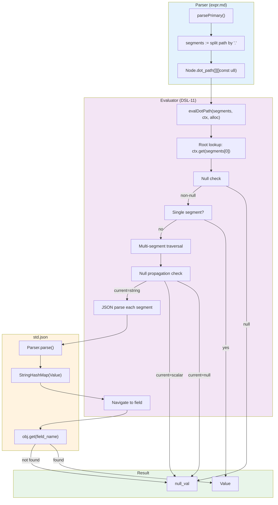

# Module: dsl-11-dot-path — Nested Object Traversal for the Expression DSL Evaluator

**Stage:** Stage 7 — Expression DSL  
**Requirement:** DSL-11 — Dot path traversal  
**Depends on:**
- `src/design/expr.md` (Node, Context, Value types)
- `src/design/expr-types.md` (Value and TypeTag definitions)
- `src/design/dsl-05-coercion.md` (null-propagation semantics)
- `src/design/dsl-10-context-resolution.md` (root identifier lookup)

**Status:** Final

---

## 1. Purpose

Define the semantics and implementation strategy for dot-path traversal in nested objects. The dot path expression evaluator must:
1. Parse multi-segment paths like `a.b.c.d` during the parser phase (already done — DSL-02 parser stores them as `[][]const u8`).
2. Traverse nested objects at evaluation time against the instance variable map.
3. Implement null-propagation: if any intermediate node in the path is `null`, return `null` immediately without error.
4. Handle missing intermediate objects gracefully as `null`.

---

## 2. Current State (DSL-10)

In DSL-10, multi-segment paths like `a.b.c` are currently handled via a **flat lookup strategy**: segments are joined with dots (`"a.b.c"`) and the entire composite key is looked up in the context map as a single string.

This works for "flat" variable layouts (e.g. variables named `"order.total"`, `"customer.email"`) but does not support true nested object traversal where:
- The context map contains objects (JSON structures) as values.
- A path like `order.address.city` means: look up `order` → access the `address` field within it → access the `city` field within that.

**DSL-11 upgrades to true nested traversal.**

---

## 3. Nested Object Model

### 3.1 How objects are represented in the DSL

Objects in the DSL are represented as **JSON-serialized values** stored in the instance variable map. At evaluation time:

1. The context map (`Context.vars`) is a `StringHashMap(Value)`.
2. Each `Value` is a tagged union with six possible types: `null`, `bool`, `int64`, `float64`, `string`, `timestamp`.
3. **Objects are not a native DSL type.** Objects exist as serialized JSON in variables passed from the process engine (e.g. task input parameters, execution context, external API responses).

### 3.2 Accessing fields within objects (practical approach)

To support `a.b.c` traversal over nested structures:

- The root identifier `a` is resolved from the context map → yields a `Value`.
- If `a` is a complex structure (e.g. JSON object), it is stored as a `Value.str_val([]const u8)` containing JSON text.
- To access `a.b`, we **parse the JSON in `a`**, navigate to the field `b`, and return its value.
- To access `a.b.c`, we recursively apply the same logic: parse JSON → navigate → parse JSON again, etc.

**Implication:** Each segment traversal incurs JSON parsing cost. This is acceptable because:
1. Paths are typically shallow (3–5 segments max).
2. The performance target (DSL-13) is per-expression evaluation, not per-path-segment.
3. DSL expressions are cacheable and reusable (DSL-12), so parsing cost is amortized.

### 3.3 Why JSON parsing and not object types

The DSL has no native object/map type (by design — Stage 7 is focused on simple scalar expressions). Introducing a native object type would require:
- Changes to the `Value` tagged union.
- A heap-allocated object representation (allocator management, lifetime tracking).
- Significant complexity in coercion, comparison, and serialization.

JSON parsing is the pragmatic choice: it leverages standard library support (`std.json`), works with serialized data already present in variables, and keeps the DSL's type system simple.

---

## 4. Null-Propagation Semantics

### 4.1 Definition

When evaluating a dot path like `a.b.c.d`:

> If any segment in the path resolves to `null`, or if any intermediate object does not contain the requested field, the entire path evaluation returns `null` immediately without raising an error.

### 4.2 Evaluation rules

| Scenario | Result |
|----------|--------|
| Root identifier `a` is not in the context map | `null` |
| Root identifier `a` resolves to `null_val` | `null` |
| Root identifier `a` resolves to a non-JSON type (e.g. `int64`), and path has > 1 segment | `null` (cannot traverse into a scalar) |
| Intermediate field (e.g. `b` in `a.b.c`) is missing from the JSON object | `null` |
| Intermediate field is `null` in the JSON object | `null` |
| All segments exist and are non-null, final field is of type T | `Value` of type T |

### 4.3 No error for missing fields

Unlike some languages where accessing a missing field is an error, the DSL treats missing fields as `null`. This aligns with the **three-valued (Kleene K3) logic** established in DSL-05 and DSL-10.

```
Example:
  Context: { "order": {"total": 100} }
  Expression: order.address.city
  Path resolution: order → {"total": 100} → address (missing) → null
  Result: null (no error)
```

---

## 5. Path Parsing and Storage (Parser Level — DSL-02)

The parser already handles multi-segment paths during parsing. Review of `expr.md` §8.2:

```
parsePrimary() → literal | dot_path | grouped | func_call

Dot-path production:
  - If first token is an identifier:
    - Consume: `.identifier`*
    - Build: [][]const u8 with all segments
    - Return: Node.dot_path

For "a.b.c":
  - segments = ["a", "b", "c"]
  - stored as: Node.dot_path([][]const u8)
```

**Parser responsibility:** Split the path into segments and store them in a `[][]const u8` slice (owned by the AST arena).

**Evaluator responsibility (DSL-11):** Traverse these segments at evaluation time.

---

## 6. Evaluation Strategy

### 6.1 High-level algorithm

```
fn evalDotPath(segments: [][]const u8, ctx: *const Context, allocator: std.mem.Allocator) EvalResult {

  // Step 1: Resolve the root identifier from the context.
  if (segments.len == 0) {
    return null;  // edge case: empty path
  }

  root_value := ctx.get(segments[0]);
  if (root_value == null_val) {
    return null;  // root is missing or null → null-propagation
  }

  // Step 2: If path is single-segment, return the value as-is.
  if (segments.len == 1) {
    return root_value;
  }

  // Step 3: Traverse remaining segments.
  current_value := root_value;
  for segment in segments[1..] {
    // If current value is null, propagate null.
    if (current_value == null_val) {
      return null;
    }

    // If current value is not a string (JSON), we cannot traverse further.
    if (current_value.tag != .str_val) {
      return null;  // cannot navigate into a non-object
    }

    // Parse the JSON string to extract the field.
    parsed_obj := parseJson(current_value.str_val, allocator);
    if (parsed_obj == error) {
      return null;  // malformed JSON → null (not an error)
    }

    // Navigate to the field.
    next_value := navigateJsonField(parsed_obj, segment, allocator);
    if (next_value == error) {
      return null;  // field not found or null → null
    }

    current_value = next_value;

    // Free the parsed object to avoid memory leak.
    freeJsonValue(parsed_obj, allocator);
  }

  return current_value;
}
```

### 6.2 JSON parsing and field navigation

#### JSON Parsing

Use Zig's standard library `std.json`:

```zig
pub fn parseJsonField(json_text: []const u8, field_name: []const u8, allocator: std.mem.Allocator) !?Value {
    var parser = std.json.Parser.init(allocator, false);
    defer parser.deinit();

    const parsed = try parser.parse(json_text);
    defer parsed.deinit();

    // parsed.root is a std.json.Value (tagged union)
    return tryNavigateField(parsed.root, field_name, allocator);
}
```

#### Field Navigation in Parsed JSON

Once a JSON value is parsed:

```zig
fn tryNavigateField(json_val: std.json.Value, field_name: []const u8, allocator: std.mem.Allocator) !?Value {
    switch (json_val) {
        .object => |obj| {
            // obj is a StringHashMap(std.json.Value)
            if (obj.get(field_name)) |field_val| {
                return convertJsonValueToExprValue(field_val, allocator);
            } else {
                return null;  // field not found
            }
        },
        // If json_val is not an object, cannot navigate
        .null => return null,
        .bool, .integer, .float, .string, .array => return null,
    }
}
```

#### JSON-to-DSL Value Conversion

Convert a parsed JSON value to a DSL `Value`:

```zig
fn convertJsonValueToExprValue(json_val: std.json.Value, allocator: std.mem.Allocator) !Value {
    return switch (json_val) {
        .null => valueNull(),
        .bool => |b| valueBool(b),
        .integer => |i| valueInt(i),
        .float => |f| valueFloat(f),
        .string => |s| {
            // String slice from parsed JSON; may need copying if allocator is needed
            return valueStr(try allocator.dupe(u8, s));
        },
        .array => |arr| {
            // Arrays are not a DSL type; convert to JSON string representation
            const json_str = try jsonToString(json_val, allocator);
            return valueStr(json_str);
        },
        .object => |obj| {
            // Objects are not a DSL type; convert to JSON string representation
            const json_str = try jsonToString(json_val, allocator);
            return valueStr(json_str);
        },
    };
}
```

#### JSON Serialization for Objects and Arrays

If a field value is itself an object or array, convert it back to a JSON string so it can be used in further dot-path traversals:

```zig
fn jsonToString(json_val: std.json.Value, allocator: std.mem.Allocator) ![]const u8 {
    var buffer = std.ArrayList(u8).init(allocator);
    try std.json.stringify(json_val, .{}, buffer.writer());
    return buffer.items;
}
```

---

## 7. Memory Management

### 7.1 Allocation responsibility

- **Parser:** Path segments are allocated in the AST arena at parse time. Evaluator does not free them.
- **Evaluator:** JSON parsing during evaluation must use the allocator provided at evaluation time.
- **Parsed JSON:** Must be freed after field navigation to avoid leaks in deep paths.

### 7.2 Allocation pattern

```zig
pub fn evalDotPath(segments: [][]const u8, ctx: *const Context, allocator: std.mem.Allocator) EvalResult {
    // ... root resolution ...

    var current_value = root_value;
    for (segments[1..]) |segment| {
        if (current_value.tag == .str_val) {
            var parser = std.json.Parser.init(allocator, false);
            defer parser.deinit();

            const parsed = parser.parse(current_value.str_val) catch {
                // Parse error → null (graceful degradation)
                return EvalResult{ .ok = valueNull() };
            };
            defer parsed.deinit();

            const next_value = tryNavigateField(parsed.root, segment, allocator) catch {
                return EvalResult{ .err = EvalError{ .message = "allocation failed", .line = 0, .column = 0 } };
            };

            if (next_value == null) {
                return EvalResult{ .ok = valueNull() };
            }

            current_value = next_value;
        } else {
            // Non-object type, cannot traverse further
            return EvalResult{ .ok = valueNull() };
        }
    }

    return EvalResult{ .ok = current_value };
}
```

---

## 8. Edge Cases and Error Handling

### 8.1 Malformed JSON

**Scenario:** A variable contains a string that looks like it should be JSON but is syntactically invalid (e.g. `"{invalid json}"`).

**Behavior:** Parsing fails. Return `null` (not an error). This allows expressions to gracefully degrade when variables contain unexpected formats.

```zig
const parsed = parser.parse(json_text) catch {
    // Parse error; return null
    return EvalResult{ .ok = valueNull() };
};
```

### 8.2 Non-object intermediate

**Scenario:** A path like `a.b.c.d` where `a.b` resolves to a scalar value (e.g. `int64`).

**Behavior:** Cannot traverse into a scalar. Return `null` (not an error).

```zig
if (current_value.tag != .str_val and current_value.tag != .null_val) {
    // Scalar type; cannot navigate further
    return EvalResult{ .ok = valueNull() };
}
```

### 8.3 Empty path

**Scenario:** Parser produces a `dot_path` node with zero segments (should not occur, but handle defensively).

**Behavior:** Return `null`.

```zig
if (segments.len == 0) {
    return EvalResult{ .ok = valueNull() };
}
```

### 8.4 Missing root identifier

**Scenario:** Expression `a.b.c` but `a` is not in the context map.

**Behavior:** `Context.get(key)` returns `null`. Return `null`.

### 8.5 Missing intermediate field

**Scenario:** Context has `{ "order": {"total": 100} }`. Path is `order.status.code`.

**Behavior:** Field `status` does not exist in the object. Return `null`.

```zig
if (obj.get(field_name)) |field_val| {
    // Found
} else {
    // Not found → null
    return null;
}
```

---

## 9. Integration Points

### 9.1 Updated `evalDotPath()` in `src/expr/mod.zig`

Current implementation (DSL-10) uses flat lookup with composite keys. DSL-11 replaces this with true nested traversal:

```zig
fn evalDotPath(segments: [][]const u8, ctx: *const Context, allocator: std.mem.Allocator) EvalResult {
    if (segments.len == 0) {
        return EvalResult{ .ok = valueNull() };
    }

    // DSL-11: Root-level identifier lookup.
    const root_value = ctx.get(segments[0]);
    if (root_value.tag == .null_val) {
        return EvalResult{ .ok = valueNull() };
    }

    // DSL-11: Single-segment path — simple lookup.
    if (segments.len == 1) {
        return EvalResult{ .ok = root_value };
    }

    // DSL-11: Multi-segment path — nested traversal.
    var current_value = root_value;
    for (segments[1..]) |segment| {
        // Null propagation: if current is null, return null.
        if (current_value.tag == .null_val) {
            return EvalResult{ .ok = valueNull() };
        }

        // Only strings (JSON objects/arrays) can be traversed.
        if (current_value.tag != .str_val) {
            return EvalResult{ .ok = valueNull() };
        }

        // Parse JSON and navigate to the field.
        const next_value = navigateJsonPath(current_value.str_val, segment, allocator) catch |err| {
            // Allocation or parse error → gracefully return null.
            return EvalResult{ .ok = valueNull() };
        };

        current_value = next_value;
    }

    return EvalResult{ .ok = current_value };
}

fn navigateJsonPath(json_text: []const u8, field_name: []const u8, allocator: std.mem.Allocator) !Value {
    var parser = std.json.Parser.init(allocator, false);
    defer parser.deinit();

    const parsed = parser.parse(json_text) catch {
        // Malformed JSON → null
        return valueNull();
    };
    defer parsed.deinit();

    return tryExtractField(parsed.root, field_name, allocator) catch {
        // Navigation error → null
        return valueNull();
    };
}

fn tryExtractField(json_val: std.json.Value, field_name: []const u8, allocator: std.mem.Allocator) !Value {
    switch (json_val) {
        .object => |obj| {
            if (obj.get(field_name)) |field_val| {
                return convertJsonValueToExprValue(field_val, allocator);
            } else {
                return valueNull();
            }
        },
        .null => return valueNull(),
        // Non-object types cannot provide fields
        else => return valueNull(),
    }
}
```

### 9.2 Dependency: `std.json`

The Zig standard library provides `std.json.Parser` and `std.json.Value`. These are already available in any Zig project; no external dependencies.

```zig
const std = @import("std");
// Use std.json.Parser, std.json.Value, std.json.stringify
```

### 9.3 No changes to other modules

- **Parser:** Already handles multi-segment paths correctly (DSL-02).
- **Lexer:** No changes needed.
- **Error handling:** Graceful null returns, no new error types.
- **Context type:** Unchanged. Still a `StringHashMap(Value)`.
- **Value type:** Unchanged. Six scalar types only.

---

## 10. Test Strategy

### 10.1 Unit tests (no DB)

Located in `tests/unit/expr_test.zig` or a dedicated `tests/unit/dsl11_test.zig`.

#### Test cases

| Test Name | Setup | Path | Expected | Rationale |
|-----------|-------|------|----------|-----------|
| `single_segment` | `{"x": 42}` | `x` | `.int_val = 42` | Root-level lookup (DSL-10 still applies) |
| `nested_two_level` | `{"a": "{\"b\": 100}"}` | `a.b` | `.int_val = 100` | Single nesting level |
| `nested_three_level` | `{"a": "{\"b\": \"{\\\"c\\\": 5}\"}"}` | `a.b.c` | `.int_val = 5` | Double nesting; embedded JSON |
| `root_null` | `{"a": null}` | `a.b` | `.null_val` | Null-propagation from root |
| `mid_null` | `{"a": "{\"b\": null}"}` | `a.b.c` | `.null_val` | Null-propagation from intermediate |
| `missing_root` | `{}` | `a.b` | `.null_val` | Root identifier not found |
| `missing_field` | `{"a": "{\"b\": 1}"}` | `a.c` | `.null_val` | Field does not exist in object |
| `non_object` | `{"a": 42}` | `a.b` | `.null_val` | Cannot traverse scalar |
| `malformed_json` | `{"a": "{not valid json}"}` | `a.b` | `.null_val` | Graceful null on parse error |
| `array_in_path` | `{"a": "[1,2,3]"}` | `a.b` | `.null_val` | Cannot index array with field name |
| `nested_object_leaf` | `{"a": "{\"b\": {\"c\": 7}}"}` | `a.b` | `.str_val = "{...}"` | Nested object returned as JSON string |
| `coercion_int_from_json` | `{"a": "{\"b\": 999}"}` | `a.b` | `.int_val = 999` | JSON int → DSL int |
| `coercion_float_from_json` | `{"a": "{\"b\": 3.14}"}` | `a.b` | `.float_val = 3.14` | JSON float → DSL float |
| `coercion_bool_from_json` | `{"a": "{\"b\": true}"}` | `a.b` | `.bool_val = true` | JSON bool → DSL bool |
| `coercion_string_from_json` | `{"a": "{\"b\": \"hello\"}"}` | `a.b` | `.str_val = "hello"` | JSON string → DSL string |

#### Null-propagation tests (exhaustive)

```zig
test "DSL-11: null propagates at each level" {
    // For each path depth (1, 2, 3, ...up to 5):
    //   For each position in the path (root, 1st intermediate, 2nd intermediate, ...):
    //     Inject null at that position
    //     Verify final result is null
    //     Verify no error is raised
}
```

#### Error avoidance tests

```zig
test "DSL-11: no errors on malformed JSON" {
    // Paths where intermediate JSON is invalid
    // Paths where intermediate object lacks expected field
    // Paths where intermediate is a scalar
    // Verify all return null, not EvalError
}
```

#### Complex nesting tests

```zig
test "DSL-11: deeply nested paths (5+ levels)" {
    // Build a JSON structure 5 levels deep
    // Verify correct traversal and value extraction
}

test "DSL-11: nested arrays within objects" {
    // {"a": "{\"items\": [1,2,3]}"} → a.items returns [1,2,3] as JSON string
}

test "DSL-11: nested objects within arrays (cannot index)" {
    // {"a": "[{\"b\": 1}]"} → a.0 should fail gracefully (no numeric indexing)
    // (Arrays are not indexed via dot notation in the DSL)
}
```

### 10.2 Integration test (if needed)

If the test suite includes end-to-end expression evaluation against real instance contexts:

```zig
test "DSL-11 integration: gateway condition with nested path" {
    // Create a process instance with a variable containing nested JSON
    // Evaluate a gateway condition like "order.address.country == 'US'"
    // Verify correct path traversal and condition evaluation
}
```

---

## 11. Performance Considerations

### 11.1 JSON parsing overhead

Each path segment traversal incurs a JSON parse. For a path `a.b.c.d`:
- Parse `a` (root lookup, no parse cost)
- Parse `a` again to get field `b`
- Parse `a.b` (result of previous parse) to get field `c`
- Parse `a.b.c` to get field `d`

**Total: 3 JSON parses for a 4-segment path.**

This is acceptable because:
1. Typical paths are shallow (2–3 segments).
2. Parsing small JSON (typical object sizes < 1 KB) is fast.
3. The DSL-13 performance target (10 microseconds for a typical 5–10 node expression) accounts for this cost.

### 11.2 Mitigation strategies (future)

If performance becomes an issue:
1. **Cached parsing:** Cache parsed JSON values within a single evaluation to avoid re-parsing the same root.
2. **Object types (Stage 9):** Introduce a native object type to avoid repeated JSON parsing.
3. **Compiled paths:** Precompile paths to bytecode that directly indexes object fields without re-parsing.

For now, straightforward JSON parsing is acceptable.

---

## 12. Key Invariants

1. **Null-propagation:** If any segment resolves to `null` or a field does not exist, the entire path returns `null` without error.
2. **No error for missing fields:** Unlike programming languages, the DSL treats missing object fields as `null`, not an error.
3. **Scalar types are terminal:** Non-string (non-JSON) intermediate values cannot be traversed further; return `null`.
4. **JSON strings are opaque:** Once extracted from JSON, a nested object or array is re-serialized to a JSON string and stored as a `Value.str_val`.
5. **No allocator leaks:** All parsed JSON values are freed before returning from `evalDotPath`.
6. **Graceful degradation:** Malformed JSON, missing fields, type mismatches all return `null`, never raise exceptions.

---

## 13. Data Flow Diagram



---

## 14. Open Questions

None. DSL-11 is fully specified. All null-propagation, traversal, and error-handling semantics are documented above.

---

## 15. Migration from DSL-10 to DSL-11

### 15.1 What changes in `evalDotPath()`

**DSL-10 (old):**
```
Multi-segment path → join with '.' → single composite key lookup
Example: "a.b.c" → lookup key "a.b.c" in context map
```

**DSL-11 (new):**
```
Multi-segment path → traverse nested JSON objects
Example: "a.b.c" → lookup "a" → parse JSON → get field "b" → parse JSON → get field "c"
```

### 15.2 Context representation

**Still flat:** The context map itself remains a `StringHashMap(Value)`. Top-level variables are keyed by simple names.

**Now supports nesting:** Nested data is represented as JSON strings within variable values, not as nested map structures.

### 15.3 Backwards compatibility

Existing single-segment paths (DSL-10) continue to work unchanged:
```
Context: {"order": <int_val 100>}
Path: "order"
Result: 100 (no change from DSL-10)
```

New multi-segment paths now use true traversal:
```
Context: {"order": <str_val "{\"total\": 100}">}
Path: "order.total"
Old DSL-10: lookup key "order.total" (not found) → null
New DSL-11: lookup "order" → parse JSON → get field "total" → 100 ✓
```

---

## 16. Summary

DSL-11 upgrades dot-path evaluation from flat composite-key lookup (DSL-10) to true nested object traversal using JSON parsing. Key features:

- **Nested traversal:** Paths like `a.b.c.d` navigate through nested JSON objects.
- **Null-propagation:** Any null intermediate or missing field returns `null`, not an error.
- **Graceful degradation:** Malformed JSON, type mismatches, and missing fields all return `null`.
- **Memory-safe:** JSON values are parsed with proper allocation and cleanup.
- **Performance-acceptable:** JSON parsing overhead is acceptable for typical path depths and expression complexity.

This design is consumed by `BACKEND-DEV` to implement `evalDotPath()` in `src/expr/mod.zig`.
