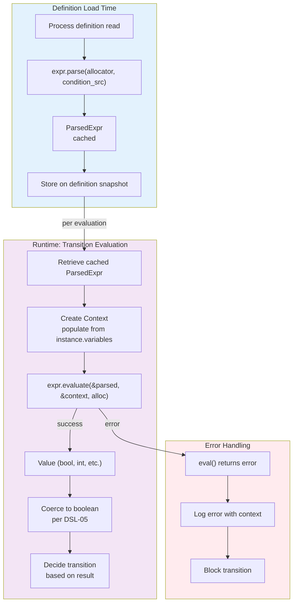

# Module: dsl-12-engine-api — Expression DSL Public API

**Stage:** Stage 7 — Expression DSL  
**Requirement:** DSL-12 — Engine API  
**Depends on:**
- `src/design/expr.md` (module layout, parser interface)
- `src/design/expr-types.md` (Value and TypeTag definitions)
- `src/design/dsl_context.md` (Context struct)
- `src/design/dsl-05-coercion.md` (null-propagation semantics)
- `src/design/dsl-11-dot-path.md` (nested traversal)

**Status:** Final

---

## 1. Purpose

Define the public API that the execution engine (EE-05), gateway condition evaluator, and variable transformers (EXT-04) use to:
1. Parse and cache expression source code.
2. Evaluate cached expressions against different runtime contexts.
3. Manage the lifecycle of parsed expressions.

The API decouples expression parsing (a one-time cost per unique expression string) from evaluation (a per-evaluation cost), enabling:
- **Definition-time parsing:** When a process definition is loaded, all expression strings are parsed once.
- **Runtime evaluation:** Each time a transition is evaluated, the cached parsed expression is evaluated against the current instance context.
- **Reusability:** The same parsed expression can be evaluated against different contexts without re-parsing.

---

## 2. Public API Signature

### 2.1 `parse()` function

```zig
pub fn parse(allocator: std.mem.Allocator, source: []const u8) !ParsedExpr
```

**Purpose:** Parse an expression source string into an immutable, reusable `ParsedExpr` object.

**Parameters:**
- `allocator: std.mem.Allocator` — memory allocator for the parsed expression (owns AST, tokens, etc.)
- `source: []const u8` — the expression source code (e.g., `"order.total > 100"`)

**Returns:** 
- `!ParsedExpr` — on success, a parsed expression ready for evaluation
- Error on failure (parse error, out of memory, etc.)

**Behaviour:**
1. Tokenises `source` using the lexer (lexer produces tokens from source; no string copies).
2. Parses tokens using recursive-descent parser (DSL-02: deterministic AST structure).
3. On success: returns a `ParsedExpr` struct containing the AST and metadata.
4. On parse error: returns a detailed error list (DSL-03: error recovery).
5. The returned `ParsedExpr` owns a heap allocation (its internal arena). Caller must call `parsed_expr.deinit(allocator)` when done.

**Semantics:**
- Parsing is deterministic: `parse(alloc, src1) == parse(alloc, src1)` (structurally identical AST per DSL-02).
- The result is immutable after construction.
- The result is safe to cache and reuse indefinitely.

**Memory contract:**
- The arena allocator embedded in `ParsedExpr` owns all AST nodes and slices.
- Lexeme slices in parse errors point into the original `source` buffer; caller must keep `source` alive while reading error details.
- Recommended: pass an `ArenaAllocator` wrapping a page allocator for efficient bulk deallocation.

### 2.2 `evaluate()` function

```zig
pub fn evaluate(
    expr:      *const ParsedExpr,
    ctx:       *const Context,
    allocator: std.mem.Allocator,
) !Value
```

**Purpose:** Evaluate a parsed expression against a runtime context.

**Parameters:**
- `expr: *const ParsedExpr` — a parsed expression (immutable reference)
- `ctx: *const Context` — the evaluation context, mapping variable names to values (immutable reference)
- `allocator: std.mem.Allocator` — allocator for temporary allocations during evaluation (e.g., JSON parsing in DSL-11 dot-path traversal)

**Returns:**
- `!Value` — on success, the result value (one of the six DSL types: null, bool, int64, float64, string, timestamp)
- Error on failure (type error, division by zero, etc.)

**Behaviour:**
1. Traverses the AST in the parsed expression.
2. Evaluates each node, respecting operator precedence and semantics from DSL-05 (coercion), DSL-06 (total evaluation), DSL-11 (dot-path), etc.
3. Returns the result `Value`.
4. On type error or unsupported operation: returns an error (DSL-06 total evaluation).

**Semantics:**
- Evaluation is deterministic: same `(expr, ctx)` pair always produces the same result.
- The parsed expression is not modified (read-only reference).
- The context is not modified (read-only reference).
- Memory allocated during evaluation is freed before the function returns.

**Memory contract:**
- The allocator parameter is used for temporary allocations only (e.g., JSON parsing buffers, intermediate string copies).
- All allocations are freed before the function returns; the caller does not need to free anything.
- Do NOT use an arena allocator for this parameter unless its lifetime extends beyond the `evaluate()` call; prefer a temporary scratch allocator.

---

## 3. `ParsedExpr` Structure

### 3.1 Definition

```zig
pub const ParsedExpr = struct {
    /// The root node of the abstract syntax tree.
    root: *Node,

    /// The arena allocator that owns all nodes, slices, and metadata for this expression.
    /// Freed when ParsedExpr.deinit(allocator) is called.
    arena: std.heap.ArenaAllocator,

    /// Metadata about the parsed expression for caching and optimization.
    metadata: ExprMetadata,

    /// Deallocate the arena and all owned memory.
    /// Must be called exactly once per ParsedExpr.
    pub fn deinit(self: *ParsedExpr, allocator: std.mem.Allocator) void {
        self.arena.deinit();
    }
};
```

### 3.2 Immutability Guarantees

**After construction, a `ParsedExpr` is immutable.** Specifically:

1. **AST structure:** The root node and all descendant nodes are not modified after parsing.
2. **Slices:** All string slices (identifiers, literals, etc.) in the AST are immutable pointers into either the arena or the original source.
3. **Metadata:** Cache statistics and optimization hints are only written internally by the evaluator (see §4.1).

**Implication:** A single `ParsedExpr` can be safely shared across multiple concurrent evaluations (each with its own context and allocator), as long as the evaluations are read-only.

### 3.3 Structural Equality

Two `ParsedExpr` instances are structurally equal if:
1. Their AST roots have the same node structure (recursively).
2. Their metadata is identical.

**Test for DSL-02 acceptance:** After parsing the same source twice, compare the two AST roots structurally. They must match exactly.

---

## 4. Caching Strategy

### 4.1 Cache Key

The cache key is the **normalized source string**.

**Normalization rules:**
- Trim leading and trailing whitespace.
- Collapse internal whitespace sequences to single spaces (for layout flexibility).
- Keep string literal escapes and quotation marks as-is.
- Preserve operator spacing and identifier names exactly.

**Example:**
```
Input:  "  order.total   >   100  "
Normalized: "order.total > 100"
```

**Rationale:** Most expression strings in process definitions are manually authored; minor formatting differences should map to the same cache entry. Normalization is applied at cache-insertion time.

### 4.2 Invalidation Rules

**A `ParsedExpr` is valid indefinitely.** Cache entries are never invalidated due to the immutability guarantee above. The only way to remove a cached expression is:
1. Explicit removal when the definition is unloaded or the process is deleted.
2. Natural cleanup when the allocator owning the `ParsedExpr` is freed.

**Rationale:** Since `ParsedExpr` is immutable and evaluation is deterministic, there is no stale-cache risk. A cached expression remains correct regardless of system time, execution context, or other external state changes.

**Exception (future):** If the DSL gains introspection or reflection features that depend on runtime state (e.g., a `getVariable()` function), caching must be re-evaluated. For now (DSL-12 through DSL-13), caching is safe.

### 4.3 Cache Statistics

`ExprMetadata` tracks optional cache statistics:

```zig
pub const ExprMetadata = struct {
    /// Number of times this expression has been evaluated.
    eval_count: u64 = 0,

    /// Total evaluation time (microseconds) across all evaluations.
    /// Used for performance monitoring against DSL-13 target.
    total_eval_time_us: u64 = 0,

    /// AST complexity (node count). Used for optimization hints.
    ast_node_count: u32 = 0,

    /// Hash of the normalized source string (for debugging).
    source_hash: u64 = 0,
};
```

**Updating statistics:** The evaluator updates `eval_count` and `total_eval_time_us` after each `evaluate()` call. **Important:** Since `ParsedExpr` is returned as `*const ParsedExpr` to the caller, statistics updates must use `@constCast()` internally. This is acceptable because:
1. The stats are internal bookkeeping, not observable from outside the evaluator.
2. Multiple evaluations of the same expression can race on stats updates; this is benign (worst case: undercounting).

---

## 5. Integration with EE-05 (Gateway Condition Evaluation)

### 5.1 Engine workflow

**At definition load time:**
1. The engine reads a process definition from the database.
2. For each gateway condition expression, the engine calls `expr.parse(allocator, condition_source)`.
3. The returned `ParsedExpr` is stored on the definition snapshot (or a separate expression cache).
4. The `ParsedExpr` remains cached for the lifetime of the definition snapshot.

**At runtime (transition evaluation):**
1. The engine evaluates a transition. If the transition has a gateway condition, the engine:
   - Retrieves the cached `ParsedExpr` from the definition snapshot.
   - Creates a `Context` and populates it from the instance's current variable map.
   - Calls `expr.evaluate(&parsed_expr, &context, allocator)`.
   - The result is a `Value`.
2. Per DSL-05 coercion rules, the engine converts the result to a boolean:
   - `null` → error (condition cannot be evaluated).
   - `bool` → as-is.
   - Numeric → non-zero is true, zero is false.
   - String → non-empty is true, empty is false.
3. The engine uses the boolean result to decide which transition to take.

### 5.2 Error handling in EE-05

If `expr.evaluate()` returns an error (type mismatch, division by zero, etc.):
1. The engine logs the error (with the condition expression and instance ID).
2. The engine treats the transition as blocked (no automatic transition; wait for manual intervention).
3. The instance remains in the current state; the error is recorded in the execution log.

---

## 6. Integration with EXT-04 (Variable Transformers)

### 6.1 Transformer workflow

**At definition load time:**
1. A variable transformer definition includes one or more transformation expressions.
2. For each expression, the engine calls `expr.parse()` and caches the result.

**At runtime (transformation):**
1. When a task produces output, the engine applies transformers.
2. For each transformer, the engine:
   - Retrieves the cached `ParsedExpr`.
   - Builds a `Context` with the raw task output and other available variables.
   - Calls `expr.evaluate()`.
   - The result is assigned to a new instance variable.

**Example:**
```
Transformer definition:
  if task output is "user_age": 25
  expression: "user_age + 5"

At runtime:
  context = { "user_age": 25 }
  result = expr.evaluate(&parsed_expr, &context, alloc)
  result = Value.int_val(30)
  instance.variables["adjusted_age"] = result
```

### 6.2 Transformer error handling

Same as EE-05: if evaluation fails, the transformation is skipped, and an error is logged. The output variable is not created.

---

## 7. Error Handling and Type Signatures

### 7.1 Parse errors

`parse()` returns an error set that includes:
- `ParseError` — syntax error in the source (propagated from the parser)
- `OutOfMemory` — arena allocation failed
- `InvalidUnicode` — malformed UTF-8 in source (if applicable)

**Example:**
```zig
const result = expr.parse(allocator, "order.total >> 100");
// Error: unexpected token '>>' at line 1, column 15
```

### 7.2 Evaluation errors

`evaluate()` returns an error set that includes:
- `TypeError` — operation applied to incompatible types (e.g., `"string" + 5`)
- `DivideByZero` — division or modulo by zero
- `OutOfMemory` — temporary allocation failed during evaluation
- `EvalError` — other runtime errors

**Example:**
```zig
const result = expr.evaluate(&parsed_expr, &context, allocator);
// Error: cannot add string and integer at line 1, column 10
```

### 7.3 Error messages

Parse and evaluation errors include:
- Human-readable message
- Line and column number (1-based)
- The offending token or expression fragment (for parse errors)

**Rationale:** When a definition is invalid or an instance's variables are malformed, operators need clear diagnostic information to fix the problem.

---

## 8. Memory Management and Lifetime Rules

### 8.1 `ParsedExpr` lifetime

```zig
var parsed = try expr.parse(arena.allocator(), source);
defer parsed.deinit(arena.allocator());

// Use parsed expression in evaluations
var result = try expr.evaluate(&parsed, &context, temp_allocator);
```

**Ownership rules:**
- The `ParsedExpr` owns an arena allocator (via `std.heap.ArenaAllocator`).
- The arena allocates all AST nodes, slices, and metadata.
- When `deinit()` is called, all allocations are freed in bulk.
- The lifetime of `ParsedExpr` must extend across all `evaluate()` calls that use it.

### 8.2 Context lifetime

```zig
var context = Context.init(allocator);
defer context.deinit();

try context.put("order", Value.valueInt(100));
// ... populate context ...

var result = try expr.evaluate(&parsed, &context, temp_allocator);
```

**Ownership rules:**
- The `Context` struct owns the variable map (a `StringHashMap`).
- The caller allocates and deallocates the context.
- The context is immutable during evaluation (no concurrent modifications).
- The allocator used to initialize the context must remain valid for the context's lifetime.

### 8.3 Temporary allocator for evaluation

```zig
// Recommended: a scratch allocator for each evaluation
var scratch_buffer: [4096]u8 = undefined;
var fba = std.heap.FixedBufferAllocator.init(&scratch_buffer);
defer fba.reset();

var result = try expr.evaluate(&parsed, &context, fba.allocator());
```

**Rules:**
- The allocator passed to `evaluate()` is used only for temporary allocations within that call.
- At return time, all allocations are freed; the caller's allocator is not held past the return.
- Use a temporary/scratch allocator; do NOT use an arena allocator unless its lifetime extends beyond the `evaluate()` call.
- For performance, use a fixed-size buffer allocator if you know the scratch space needed; fall back to a general-purpose allocator otherwise.

### 8.4 Source string lifetime (parse errors)

```zig
const source = "order.total >> 100";  // Must remain valid
const result = expr.parse(allocator, source);
if (result) |_| {
    // ...
} else |err| {
    // err contains ParseError slices that point into source
    // source must remain valid while err is in use
}
```

**Rule:** ParseError token slices point into the original `source` buffer. Do not free `source` until error details are no longer needed.

---

## 9. Data Flow Diagram



---

## 10. Caching in the Engine

### 10.1 Definition-level cache

The engine maintains a cache on each loaded definition snapshot:

```zig
pub const DefinitionSnapshot = struct {
    // ...existing fields...

    /// Cache of parsed gateway condition expressions.
    /// Key: normalized condition source; Value: ParsedExpr
    condition_cache: std.StringHashMap(ParsedExpr),
};
```

**Initialization:**
When a definition is loaded, all gateway conditions are pre-parsed and stored in the cache.

**Lookup:**
When evaluating a transition, the engine looks up the condition source in the cache. If found, the cached `ParsedExpr` is used directly; otherwise, the condition is parsed on-the-fly and cached.

### 10.2 Transformer expression cache

Similarly, variable transformers are cached:

```zig
pub const VariableTransformerSnapshot = struct {
    // ...
    expression_cache: std.StringHashMap(ParsedExpr),
};
```

### 10.3 Cache cleanup

When a definition snapshot is destroyed (definition unloaded, process deleted), all cached `ParsedExpr` values are deallocated:

```zig
pub fn deinit(self: *DefinitionSnapshot, allocator: std.mem.Allocator) void {
    var it = self.condition_cache.iterator();
    while (it.next()) |entry| {
        var expr = entry.value_ptr.*;
        expr.deinit(allocator);
    }
    self.condition_cache.deinit();
    // ... other cleanup ...
}
```

---

## 11. Public API Export (`mod.zig`)

The `src/expr/mod.zig` module re-exports:

```zig
pub const ParsedExpr = @import("ast.zig").ParsedExpr;
pub const ExprMetadata = @import("ast.zig").ExprMetadata;
pub const Context = @import("ast.zig").Context;
pub const Value = @import("ast.zig").Value;

pub const parse = @import("parser.zig").parse;
pub const evaluate = @import("evaluator.zig").evaluate;
```

**Contract:** External modules (engine, transformers, tests) import from `expr` and call `expr.parse()` and `expr.evaluate()` directly.

---

## 12. Relationship to Other DSL Modules

### 12.1 DSL-11 (Dot-path traversal)

The evaluator (called by `evaluate()`) implements dot-path traversal per DSL-11. When a `dot_path` node is evaluated:
1. The root identifier is resolved from the context.
2. Intermediate segments are traversed via JSON parsing (if multi-segment).
3. Null-propagation is applied at each step.

**Implication for caching:** Since DSL-11 JSON parsing happens at evaluation time (not parse time), the cost is per-evaluation. Caching the parsed expression reduces the repeated cost of tokenization and parsing, but not JSON traversal. This is acceptable per DSL-11 §11.

### 12.2 DSL-05 (Type coercion)

The evaluator implements coercion rules for binary operations. When `evaluate()` processes an `add_expr`, `mul_expr`, or `cmp_expr` node:
1. Both operands are evaluated recursively.
2. Coercion rules from DSL-05 are applied.
3. The result is returned.

**Implication for caching:** Coercion is deterministic given the operand values, so caching the parsed expression does not affect correctness.

### 12.3 DSL-06 (Total evaluation)

The evaluator never panics on type errors; instead, it returns an error. This enables safe cache reuse: if evaluation fails once, the same cached expression will fail the same way when re-evaluated.

---

## 13. Test Strategy

### 13.1 Parse caching

```zig
test "DSL-12: parse is deterministic (same source → same AST structure)" {
    const source = "order.total > 100";
    
    var expr1 = try expr.parse(allocator, source);
    defer expr1.deinit(allocator);
    
    var expr2 = try expr.parse(allocator, source);
    defer expr2.deinit(allocator);
    
    // Verify structural equality (DSL-02)
    try testing.expect(structurallyEqual(expr1.root, expr2.root));
}

test "DSL-12: different sources produce different ASTs" {
    const src1 = "order.total > 100";
    const src2 = "order.total < 100";
    
    var expr1 = try expr.parse(allocator, src1);
    defer expr1.deinit(allocator);
    
    var expr2 = try expr.parse(allocator, src2);
    defer expr2.deinit(allocator);
    
    // Verify they are different
    try testing.expect(!structurallyEqual(expr1.root, expr2.root));
}
```

### 13.2 Evaluation reusability

```zig
test "DSL-12: cached expression evaluated against different contexts yields correct results" {
    const source = "order > 50";
    
    var expr = try expr.parse(allocator, source);
    defer expr.deinit(allocator);
    
    // Evaluation 1: context with order = 100
    var ctx1 = Context.init(allocator);
    defer ctx1.deinit();
    try ctx1.put("order", Value.valueInt(100));
    
    const result1 = try expr.evaluate(&expr, &ctx1, temp_allocator);
    try testing.expectEqual(result1.bool_val, true);  // 100 > 50
    
    // Evaluation 2: same expression, context with order = 30
    var ctx2 = Context.init(allocator);
    defer ctx2.deinit();
    try ctx2.put("order", Value.valueInt(30));
    
    const result2 = try expr.evaluate(&expr, &ctx2, temp_allocator);
    try testing.expectEqual(result2.bool_val, false);  // 30 > 50
    
    // Verify AST was not modified by evaluations
    try testing.expect(structurallyEqual(expr.root, expr.root));
}
```

### 13.3 Memory management

```zig
test "DSL-12: ParsedExpr owns all memory; deinit frees it" {
    const source = "a + b + c + d + e";  // Multi-level tree
    
    var expr = try expr.parse(allocator, source);
    const node_count = expr.metadata.ast_node_count;
    
    // Verify nodes are allocated from arena
    try testing.expect(node_count > 0);
    
    // deinit should free the arena
    expr.deinit(allocator);
    
    // No leak check in Zig per se, but valgrind or asan will detect leaks
}
```

### 13.4 Integration with EE-05 (gateway evaluation)

```zig
test "DSL-12: gateway condition evaluation via cached expression" {
    const gateway_condition = "total > 1000 and status == \"approved\"";
    
    // Simulate definition load
    var definition = try loadDefinition(allocator);
    var condition_expr = try expr.parse(allocator, gateway_condition);
    // In real engine: store in definition.condition_cache
    
    defer {
        condition_expr.deinit(allocator);
        definition.deinit(allocator);
    }
    
    // Simulate instance evaluation
    var context = Context.init(allocator);
    defer context.deinit();
    try context.put("total", Value.valueInt(1500));
    try context.put("status", Value.valueStr("approved"));
    
    const result = try expr.evaluate(&condition_expr, &context, temp_allocator);
    try testing.expectEqual(result.bool_val, true);  // Condition passes
}
```

### 13.5 Error cases

```zig
test "DSL-12: parse error returns detailed diagnostic" {
    const source = "order.total >> 100";  // Invalid operator >>
    
    const result = expr.parse(allocator, source);
    try testing.expectError(ParseError, result);
    
    // Error should include line, column, token
}

test "DSL-12: evaluation error on type mismatch" {
    const source = "\"string\" + 5";  // Cannot add string and int
    
    var expr = try expr.parse(allocator, source);
    defer expr.deinit(allocator);
    
    var context = Context.init(allocator);
    defer context.deinit();
    
    const result = expr.evaluate(&expr, &context, temp_allocator);
    try testing.expectError(TypeError, result);
}
```

---

## 14. Performance Considerations

### 14.1 Parsing cost vs. evaluation cost

- **Parsing:** O(n) where n is the number of tokens. Typical expressions parse in < 100 microseconds.
- **Evaluation:** O(m) where m is the number of nodes in the AST. Typical expressions evaluate in < 10 microseconds (DSL-13 target).
- **Amortization:** For an expression used in 100 gateway evaluations, the parsing cost is amortized: (100 μs + 100 × 10 μs) / 100 evaluations ≈ 11 μs per evaluation.

**Implication:** Caching is valuable only if the same expression is evaluated more than a few times. For one-off expressions, the benefit is minimal.

### 14.2 Cache lookup cost

Cached `ParsedExpr` lookup is O(1) average case (hash table). On cache hit, the cost is negligible (pointer dereference).

### 14.3 Memory overhead

Each cached `ParsedExpr` holds:
- AST nodes (typically 10–50 nodes for gateway conditions)
- String slices (identifiers, literals) — zero-copy (point into source or arena)
- Metadata struct (< 50 bytes)

**Typical memory per expression:** 1–5 KB for small/medium expressions.

**Implication:** In a system with 1000 definitions each with 10 cached expressions, the overhead is 10–50 MB, which is acceptable.

---

## 15. Key Invariants

1. **Parsing determinism:** `parse(src1) == parse(src1)` (same AST structure) — DSL-02
2. **Immutability:** A parsed `ParsedExpr` is never modified after construction.
3. **Evaluation determinism:** `evaluate(&expr, &ctx1) == evaluate(&expr, &ctx1)` (same inputs → same output).
4. **Cache validity:** A cached `ParsedExpr` is valid indefinitely; no invalidation rules apply.
5. **Memory isolation:** Each `ParsedExpr` owns an independent arena; no shared allocations.
6. **Context isolation:** Each evaluation gets its own `Context`; no cross-evaluation contamination.
7. **No side effects:** `parse()` and `evaluate()` have no I/O, no state mutations (except stats), no RNG.

---

## 16. Summary

DSL-12 defines the public API that decouples expression parsing from evaluation:

- **`parse()`** converts source strings to immutable, reusable `ParsedExpr` objects. Called once per unique expression.
- **`evaluate()`** runs a parsed expression against a context. Called per evaluation (potentially hundreds of times per expression).
- **Caching** the parsed expression amortizes the parsing cost across multiple evaluations.
- **Integration points** with EE-05 (gateway conditions) and EXT-04 (variable transformers) leverage the cache.
- **Memory management** is explicit and well-scoped: `ParsedExpr` owns an arena; caller deallocates via `deinit()`.
- **Error handling** is detailed: parse errors and evaluation errors include line, column, and diagnostic messages.

This design is consumed by BACKEND-DEV to implement the parser, evaluator, and caching infrastructure in `src/expr/`.
