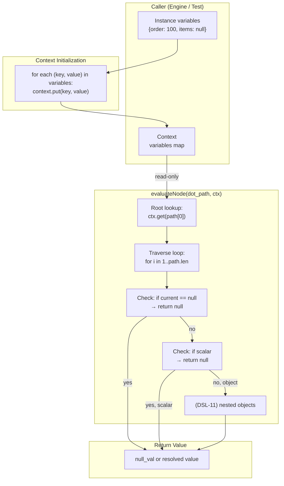

# Module: Context Resolution — DSL-10

**Stage:** Stage 7 — Expression DSL  
**Requirement:** DSL-10 — Context resolution  
**Depends on:** `src/design/expr.md` (module layout, API), `src/design/expr-types.md` (Value/TypeTag)  
**Status:** Final

---

## Module purpose

Define the context resolution mechanism for identifier expressions in the Expression DSL. Identifier expressions (e.g., `order.total`) MUST resolve against a provided context map. Unresolved identifiers MUST evaluate to typed `null` without error or crash. This module defines:

1. The `Context` data structure and initialization semantics
2. The identifier resolution algorithm (root lookup and dot-path traversal)
3. Error handling (unresolved paths, null propagation)
4. The public interface consumed by the evaluator and engine
5. Integration points with DSL-05 (coercion/null), DSL-08 (purity), and DSL-11 (dot-path traversal)

No new source files are created; context resolution is implemented in `src/expr/ast.zig` (Context struct) and `src/expr/mod.zig` (evaluateNode handling of dot_path nodes).

---

## 1. Context Data Structure

### 1.1 Definition

```zig
/// Context maps variable names to runtime values.
/// Used during evaluation to resolve identifier expressions (dot_path nodes).
pub const Context = struct {
    /// String → Value map. Keys are variable names (e.g. "order", "total", "created_at").
    /// Values are arbitrary DSL Values. The context is immutable during evaluation.
    variables: std.StringHashMap(Value),

    /// Initialize a Context with an empty variable map.
    /// Caller owns the allocator; caller is responsible for Context.deinit().
    pub fn init(allocator: std.mem.Allocator) Context {
        return Context{
            .variables = std.StringHashMap(Value).init(allocator),
        };
    }

    /// Deallocate the variable map. Does not deallocate Value payloads
    /// (caller is responsible for arena that owns Value string/slice data).
    pub fn deinit(self: *Context) void {
        self.variables.deinit();
    }

    /// Insert or update a variable binding.
    pub fn put(self: *Context, key: []const u8, value: Value) !void {
        try self.variables.put(key, value);
    }

    /// Retrieve a variable by name. Returns null_val if not found.
    /// (See resolveIdentifier below for the full algorithm.)
    pub fn get(self: *const Context, key: []const u8) Value {
        return self.variables.get(key) orelse Value{ .null_val = {} };
    }
};
```

### 1.2 Lifecycle

**Creation:** Callers create a `Context` via `Context.init(allocator)` and populate it by calling `context.put(key, value)` for each variable. In the engine (EE-05), the context is populated from the current instance variable map before evaluating edge conditions.

**Evaluation:** The context is passed as a read-only pointer to `evaluate()`. It is not modified during evaluation.

**Deallocation:** Callers call `context.deinit()` after evaluation is complete. The allocator and any Arena that owns Value string data must remain valid for the duration of the context's use.

**Mutability guarantee:** The context is immutable during evaluation. No concurrent modifications are permitted while an evaluation is in flight.

---

## 2. Identifier Resolution Algorithm

### 2.1 Overview

An identifier expression in the AST is represented as a `Node.dot_path`, which contains a slice of identifier strings: `[][]const u8`. For example:

- Source: `order` → AST: `dot_path: ["order"]`
- Source: `order.total` → AST: `dot_path: ["order", "total"]`
- Source: `order.items[0].price` → AST: `dot_path: ["order", "items[0]", "price"]` (or, if bracket traversal is not implemented, a parser error)

The evaluator's `dot_path` handler (in `evaluateNode`) implements the following resolution:

1. **Root lookup:** Look up the first identifier string in the context map.
2. **Traverse:** For each subsequent identifier, traverse the current value as a nested object.
3. **Null propagation:** If any step resolves to `null`, all subsequent steps return `null` without error.
4. **Unresolved:** If a lookup fails, return `null`.

### 2.2 Algorithm pseudocode

```
function resolveIdentifier(path: [][]const u8, context: Context) → Value {
    // Step 1: Root lookup
    if path.len == 0 {
        return null_val  // Empty path; should not occur in practice
    }

    var current := context.get(path[0])

    // Step 2: Traverse
    for i in 1..path.len {
        if current == null_val {
            return null_val  // Null propagation
        }

        // At this point, current is a Value of some type.
        // We need to traverse into it using path[i].
        // Since DSL Values are not recursive (no object/array variants),
        // traversal is impossible except for null_val (which we handle above).
        //
        // RESOLUTION (DSL-11 deferral): If path.len > 1, this is a dotted path
        // that attempts to traverse a non-object value. Without object types,
        // the only valid case is:
        //   - current == null_val (handled above)
        //   - path.len == 1 (no traversal needed)
        //
        // For now (DSL-10), return null if a dotted path with depth > 1
        // is used on a non-null value.
        
        return null_val  // Cannot traverse non-object (and non-null) value
    }

    return current
}
```

### 2.3 Practical interpretation for DSL-10

**DSL-10 scope:** Simple identifier expressions and single-level dot paths against **scalar context values**.

- `order` in a context with `{ "order": 42 }` → `42` (int_val)
- `order` in a context with `{ }` → `null` (unresolved)
- `order.total` in a context with `{ "order": null }` → `null` (null propagation)
- `order.total` in a context with `{ "order": 42 }` → **Deferred to DSL-11** (object traversal)

**Current behaviour (DSL-10 implementation):**

The evaluator's `dot_path` case handles:

```zig
case .dot_path => |path| {
    if (path.len == 0) {
        return EvalError.invalid_path;  // Should not occur
    }

    var current = ctx.get(path[0]);

    // If path has additional segments (path.len > 1), we would need
    // to traverse nested objects. Since DSL Values have no object variant,
    // we return null for any attempt to traverse a non-null scalar.
    // (DSL-11 will extend this with object support.)

    if (path.len > 1) {
        if (current == null_val) {
            return null_val;  // Null propagation
        } else {
            // Current is a scalar (int, float, string, bool, timestamp).
            // Cannot traverse it. Return null (DSL-10 constraint).
            return null_val;
        }
    }

    return current;
}
```

**Design rationale:** By returning `null` instead of an error, DSL-10 ensures that undefined paths and type mismatches are graceful (no crash). This aligns with the requirement: "Unresolved identifiers MUST evaluate to typed `null`, not crash."

---

## 3. Error Handling

### 3.1 Unresolved identifiers

An identifier is **unresolved** if:
- The root name is not in the context map, OR
- A dotted path attempts to traverse a non-object value

**Handling:** Return `Value.null_val` without error.

**Rationale:** The DSL is used in contexts where missing variables are expected (e.g., optional task outputs, extensible instance variable maps). Graceful null propagation reduces the need for null-coalescing logic in expressions and is more forgiving than errors.

### 3.2 Null propagation

If any step in a dotted path resolves to `null`, all subsequent steps immediately return `null`.

**Example:**
```
Context: { "order": null }
Expression: order.total.amount
Evaluation:
  1. order → null
  2. (null).total → null (propagate)
  3. (null).amount → null (propagate)
Result: null
```

**Mechanism:** In the evaluator's loop, the first check after each lookup is:
```zig
if (current == null_val) return null_val;
```

This prevents attempting traversal on a null value, which would be a runtime error in a language with object types. Here, it is a graceful short-circuit.

### 3.3 Type mismatches

A type mismatch occurs when a dotted path attempts to traverse a non-null scalar (int, float, string, bool, timestamp).

**Example:**
```
Context: { "order": 42 }
Expression: order.total
Evaluation:
  1. order → 42 (int_val)
  2. (42).total → impossible (can't traverse int)
Result: null (per DSL-10 constraint)
```

**Handling:** Return `null_val` without error (DSL-10 treats this as "unresolved traversal").

**Future (DSL-11):** Once object types are introduced, this case becomes a schema violation and may produce an error or a structured "object not found" result.

---

## 4. Public Interface

The context resolution mechanism is not a standalone module; it is part of `src/expr/`. The public interface for context resolution is:

### 4.1 Context struct (in `src/expr/ast.zig`)

```zig
pub const Context = struct {
    variables: std.StringHashMap(Value),

    pub fn init(allocator: std.mem.Allocator) Context { ... }
    pub fn deinit(self: *Context) void { ... }
    pub fn put(self: *Context, key: []const u8, value: Value) !void { ... }
    pub fn get(self: *const Context, key: []const u8) Value { ... }
};
```

### 4.2 Evaluator integration (in `src/expr/mod.zig`)

The `evaluateNode()` function has a case for `Node.dot_path`:

```zig
// In evaluateNode(node: Node, ctx: *const Context, allocator: Allocator) → EvalResult:

case .dot_path => |path| {
    // Resolve the path against the context.
    // Return null if unresolved or type mismatch.
    return resolveIdentifier(path, ctx);
}

// Helper function:
fn resolveIdentifier(path: [][]const u8, ctx: *const Context) Value {
    // (Pseudocode; see §2.2 above.)
    if (path.len == 0) {
        return Value.null_val;
    }

    var current = ctx.get(path[0]);

    if (path.len > 1) {
        // Dotted path; traversal not yet supported (DSL-11).
        // Return null.
        return if (current == .null_val) Value.null_val else Value.null_val;
    }

    return current;
}
```

### 4.3 Engine integration (EE-05)

The execution engine calls the evaluator when evaluating edge conditions:

```zig
// In engine/transition.zig, EE-05 edge condition evaluation:

var eval_ctx = Context.init(allocator);
defer eval_ctx.deinit();

// Populate the context from the instance variable map.
var it = instance.variables.iterator();
while (it.next()) |entry| {
    try eval_ctx.put(entry.key_ptr.*, entry.value_ptr.*);
}

// Evaluate the condition expression.
const condition_ast: *Ast = ... // from definition snapshot
const result = expr.evaluate(condition_ast, &eval_ctx, allocator);

// Handle result per coercion rules (DSL-05).
```

---

## 5. Data Flow Diagram



---

## 6. Contract with the Expression Evaluator

### 6.1 Responsibilities

**Evaluator (the caller of context resolution):**
- Provides a valid, initialized `Context` with variables populated before evaluation.
- Passes the context as a read-only pointer to `evaluateNode()`.
- Does not modify the context during evaluation.
- Deallocates the context after evaluation.

**Context resolution (within the evaluator):**
- Returns a `Value` for every path (never panics or crashes).
- Returns `null_val` for unresolved or type-mismatched paths.
- Propagates null through dotted paths.
- Does not allocate (all identifiers are already slices in the parsed AST).

### 6.2 No I/O, No Allocation

Context resolution is **pure:** it reads from the context map and returns a value, with no I/O, no state mutations, and no allocations. This ensures:

- **Evaluator purity:** The evaluator remains pure when evaluating expressions (important for DSL-08 and the engine's pure transition function).
- **Determinism:** Identical (context, path) pairs always return the same value.
- **Testability:** Context resolution can be tested with simple in-memory contexts.

---

## 7. Integration with Related DSLs

### 7.1 DSL-05 (Type coercion)

Context resolution produces a `Value`, which may be `null`. DSL-05 coercion rules handle `null` as a special case:

- **Arithmetic on null:** Error (§2.1 of DSL-05).
- **Comparison with null:** Three-valued logic; `null == X` → `null` (§2.2 of DSL-05).
- **Boolean operations on null:** Three-valued logic (§3 of DSL-05).

Example:
```
Context: { "amount": null }
Expression: amount > 100
Evaluation:
  1. Resolve "amount" → null_val
  2. Coerce null > 100 → null (three-valued comparison per DSL-05 §2.2)
Result: null_val
```

### 7.2 DSL-08 (Function purity)

Context resolution does not call built-in functions, so DSL-08 purity constraints do not directly apply here. However, the evaluator as a whole must remain pure, and context resolution contributes to that by:

- Not reading system state (clock, environment, RNG).
- Not performing I/O.
- Returning deterministic results given the same inputs.

### 7.3 DSL-11 (Dot-path traversal)

DSL-11 extends context resolution to support nested objects. The current DSL-10 implementation is a **precursor** that handles only the root-level lookup case. DSL-11 will add:

- Object type variant to `Value`.
- Traversal logic for nested object paths.
- Error handling for invalid traversals.

Example (DSL-11, future):
```
Context: { "order": { "total": 100, "items": [...] } }
Expression: order.total
Evaluation:
  1. Resolve "order" → { "total": 100, ... }
  2. Traverse into object: .total → 100
Result: 100
```

Until DSL-11, dotted paths on non-null scalars return `null` (graceful degradation).

---

## 8. Error Taxonomy

| Scenario | Produced by | Severity | Handling |
|----------|-------------|----------|----------|
| Empty path (path.len == 0) | Parser (should not occur) | Error | Return null_val |
| Root identifier not in context | Context.get() | Success (null) | Return null_val |
| Dotted path on null value | Traversal check | Success (null) | Return null_val (propagate) |
| Dotted path on scalar | Traversal check | Success (null) | Return null_val (type mismatch) |
| (Future) Invalid object traversal | Object resolution | Error (DSL-11) | TBD |

**Key principle:** No evaluation errors are produced by context resolution in DSL-10. All cases return `null` or a valid value.

---

## 9. State Transitions

Not applicable. Context resolution is a pure function with no state machine. The context itself is immutable during evaluation.

---

## 10. Dependencies

| Module | Dependency type | Notes |
|--------|-----------------|-------|
| `src/expr/ast.zig` | Defines Context, Value, Node | Context struct and dot_path node |
| `std.StringHashMap` | Zig stdlib | Variable map implementation |
| `std.mem.Allocator` | Zig stdlib | Allocator parameter for context |

### What it MUST NOT depend on

- `src/engine/` — no coupling to engine; context is populated from engine variables, but resolution is independent.
- `src/db/` — no database access; context is in-memory.
- `std.time`, `std.os`, `std.rand` — no system state; pure function.

---

## 11. Design Decisions Log

| Decision | Rationale | Date |
|----------|-----------|------|
| Return null for unresolved identifiers | Requirement DSL-10: "no crash"; null is the graceful outcome. Reduces need for null-coalescing in expressions. | 2026-05-28 |
| null propagation in dotted paths | DSL-05/DSL-11 convention: null propagates through operations. Prevents cascading errors on missing nested paths. | 2026-05-28 |
| No allocation in context resolution | Evaluator must remain pure (DSL-08); allocating during evaluation breaks determinism. All identifiers are already slices in the AST. | 2026-05-28 |
| Context is immutable during evaluation | Prevents subtle bugs where variable mutations during evaluation affect subsequent operations. Also enables safe concurrent evaluation of independent expressions. | 2026-05-28 |
| Defer nested object support to DSL-11 | DSL-10 defines root identifier lookup only. Objects and traversal are complex and depend on a Value object variant (not yet designed). DSL-11 will add this. | 2026-05-28 |
| Return null instead of error for scalar traversal | Graceful degradation: if a user writes `order.total` but `order` is a scalar, return null (undefined) rather than crashing. Aligns with the "no crash" requirement. | 2026-05-28 |

---

## 12. Open Questions

1. **Q: Should unresolved identifiers be distinguishable from null values in context?**  
   **A (decided):** No. Both return `null_val`. If callers need to distinguish, they can test for variable existence before evaluation, but the evaluator treats them identically.

2. **Q: Should context support nested object updates via dot paths during evaluation?**  
   **A (decided):** No. Context is immutable during evaluation (read-only). Only the engine can populate it before evaluation starts. DSL-11 may introduce read-only traversal of pre-existing nested objects.

3. **Q: What happens if a context has duplicate key names with different cases (e.g., "order" vs "Order")?**  
   **A (decided):** Keys are case-sensitive. `std.StringHashMap` is case-sensitive by default. If the engine populates context from instance variables, it must normalize keys to a consistent case (e.g., lowercase) or accept case-sensitive lookups.

4. **Q: Can expressions cache or reuse contexts across multiple evaluations?**  
   **A (decided):** Yes. A parsed `Ast` can be evaluated against multiple different `Context` values (per DSL-12 cacheability). Each evaluation gets its own context. Contexts are not cached; they are created per evaluation.

---

## 13. Acceptance Criteria Mapping

| Criterion | Section | Coverage |
|-----------|---------|----------|
| Evaluating an expression against a context with missing fields returns `null` without error | §2.2, §3.1 | Yes — unresolved identifiers return null_val |
| Resolved identifiers return the value at the correct type | §2.2, §4.3 | Yes — context.get() returns the value as stored |
| (DSL-11) Dot paths traverse nested objects | §2.3, §7.3 | Deferred; DSL-10 returns null for deep paths |
| (DSL-11) Accessing a field on null yields null | §3.2 | Implemented — null propagation short-circuits |

---

## 14. Test Strategy

### 14.1 Context initialization and lookup

```zig
test "context stores and retrieves variables" {
    var ctx = Context.init(testing.allocator);
    defer ctx.deinit();

    try ctx.put("order", Value.valueInt(100));
    try ctx.put("status", Value.valueStr("pending"));

    try testing.expectEqual(ctx.get("order").int_val, 100);
    try testing.expectEqualStrings(ctx.get("status").str_val, "pending");
}

test "context.get returns null for missing keys" {
    var ctx = Context.init(testing.allocator);
    defer ctx.deinit();

    const missing = ctx.get("nonexistent");
    try testing.expectEqual(missing, Value.valueNull());
}
```

### 14.2 Root-level identifier resolution

```zig
test "evaluate identifier resolves from context" {
    var ctx = Context.init(testing.allocator);
    defer ctx.deinit();
    try ctx.put("amount", Value.valueInt(42));

    var result = try parse(testing.allocator, "amount");
    defer switch (result) {
        .ok => |*a| a.deinit(testing.allocator),
        .fail => |e| testing.allocator.free(e),
    };
    try testing.expect(result == .ok);

    const eval_result = evaluate(&result.ok, &ctx, testing.allocator);
    try testing.expect(eval_result == .ok);
    try testing.expectEqual(eval_result.ok.int_val, 42);
}

test "evaluate identifier returns null for missing variable" {
    var ctx = Context.init(testing.allocator);
    defer ctx.deinit();

    var result = try parse(testing.allocator, "missing");
    defer switch (result) {
        .ok => |*a| a.deinit(testing.allocator),
        .fail => |e| testing.allocator.free(e),
    };

    const eval_result = evaluate(&result.ok, &ctx, testing.allocator);
    try testing.expect(eval_result == .ok);
    try testing.expect(eval_result.ok == .null_val);
}
```

### 14.3 Null propagation

```zig
test "dotted path on null context value returns null" {
    var ctx = Context.init(testing.allocator);
    defer ctx.deinit();
    try ctx.put("order", Value.valueNull());

    var result = try parse(testing.allocator, "order.total");
    defer switch (result) {
        .ok => |*a| a.deinit(testing.allocator),
        .fail => |e| testing.allocator.free(e),
    };

    const eval_result = evaluate(&result.ok, &ctx, testing.allocator);
    try testing.expect(eval_result == .ok);
    try testing.expect(eval_result.ok == .null_val);
}
```

### 14.4 Scalar traversal (DSL-10 constraint)

```zig
test "dotted path on scalar returns null (DSL-10)" {
    var ctx = Context.init(testing.allocator);
    defer ctx.deinit();
    try ctx.put("count", Value.valueInt(42));

    var result = try parse(testing.allocator, "count.items");
    defer switch (result) {
        .ok => |*a| a.deinit(testing.allocator),
        .fail => |e| testing.allocator.free(e),
    };

    // Parser accepts "count.items" as a valid dot_path (names are identifiers).
    // Evaluator returns null because "count" (int) is not traversable.
    const eval_result = evaluate(&result.ok, &ctx, testing.allocator);
    try testing.expect(eval_result == .ok);
    try testing.expect(eval_result.ok == .null_val);
}
```

---

## 15. Future Extensions (Post-DSL-10)

1. **DSL-11 — Objects:** Introduce `Value.object_val` and implement nested traversal.
2. **Array indexing:** Support `order.items[0]` syntax (requires array type).
3. **Null coalescing operator:** Built-in `coalesce()` function (already exists; complements graceful null handling).
4. **Variable schema validation:** Optionally validate context variables against a schema before evaluation (optional).
