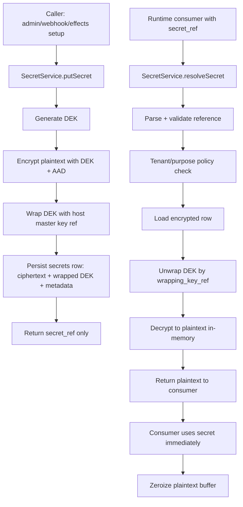
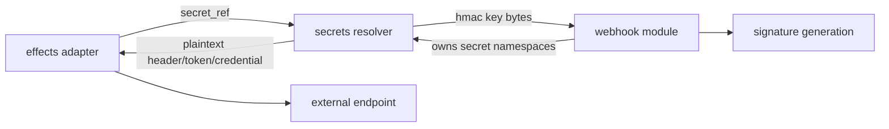

# Module: exp-05-secrets-module

**Covers:** EXP-501 (per-tenant envelope-encrypted secrets, by-reference resolution, no-leak guarantees)
**Epic:** EPIC-5 — Secrets module (Wave 1)
**Related:** EXP-301/302/303 (async effects), webhook key ownership, OIDC provider secret references
**Primary design targets:**
- `src/secrets/mod.zig` — public types and service contracts
- `src/secrets/store.zig` — encrypted persistence boundary
- `src/secrets/crypto.zig` — envelope encryption/wrapping boundary
- `src/secrets/reference.zig` — secret reference parser/validator
- `src/secrets/resolver.zig` — runtime lookup/decrypt contract for consumers
- `src/secrets/redaction.zig` — logging/tracing redaction guards
- `src/secrets/integration/webhook_keys.zig` — webhook HMAC ownership bridge
- `src/effects/adapters/http.zig` and `src/effects/adapters/email.zig` integration points
- `src/identity/provider/bootstrap.zig` and `src/identity/provider/adapters/keycloak/provider.zig` integration points
- `migrations/<TBD>_exp501_secrets.sql` (implemented later by BACKEND-DEV)

---

## Module purpose

The secrets module provides tenant-scoped secret storage and runtime secret resolution without ever placing plaintext secret values in process definitions, logs, traces, or persisted effect/webhook definitions.

The module introduces envelope encryption at rest:
- each secret value is encrypted with a per-secret data encryption key (DEK),
- the DEK is wrapped by a host master key (from environment-managed key material),
- persisted records contain only ciphertext, wrapped DEK, key metadata, and tenant scope.

Runtime consumers (effects adapters, webhook dispatcher, identity provider bootstrap/adapters) receive secret values only by a validated reference string. Plaintext is decrypted in-memory only for the execution path that needs it, zeroized after use, and never emitted to logs/telemetry.

Wave-1 rotation model includes explicit key id metadata now; grace-window dual-read/dual-sign behavior is deferred to a later requirement. This module is designed so that future grace-window rotation can be added without changing reference syntax.

---

## Public interface

### Core identifiers and references

```zig
pub const SecretRef = struct {
    tenant_id: []const u8,
    namespace: []const u8,   // e.g. "effects", "webhook", "identity"
    name: []const u8,        // stable logical name within namespace
    key_id: ?[]const u8,     // optional explicit version selector
};
pub const SecretRecordId = []const u8; // UUID string
pub const SecretAlgorithm = enum { aes_256_gcm };
pub const WrappedKeyAlgorithm = enum { aes_kw_256 };
pub const SecretPurpose = enum { webhook_hmac, http_bearer, smtp_password, oidc_client_secret, generic };
pub const SecretEnvelope = struct {
    algorithm: SecretAlgorithm,
    wrapped_key_algorithm: WrappedKeyAlgorithm,
    ciphertext: []const u8,
    wrapped_data_key: []const u8,
    nonce: []const u8,
    auth_tag: []const u8,
    aad: []const u8,
    wrapping_key_ref: []const u8,
    wrapping_key_version: []const u8,
};
pub const SecretVersion = struct {
    secret_id: SecretRecordId,
    tenant_id: []const u8,
    namespace: []const u8,
    name: []const u8,
    key_id: []const u8,
    purpose: SecretPurpose,
    envelope: SecretEnvelope,
    status: enum { active, disabled, deleted },
};
```

### Write and read contracts

```zig
pub const PutSecretInput = struct {
    tenant_id: []const u8,
    namespace: []const u8,
    name: []const u8,
    purpose: SecretPurpose,
    plaintext_value: []const u8,
    key_id: ?[]const u8,
    actor_id: []const u8,
};
pub const PutSecretOutput = struct { secret_ref: []const u8, key_id: []const u8, created_at: []const u8 };
pub const ResolveSecretInput = struct {
    tenant_id: []const u8,
    secret_ref: []const u8,
    consumer: enum { effects_http, effects_email, webhook_dispatcher, identity_provider },
};
pub const ResolvedSecret = struct { value: []u8, key_id: []const u8, purpose: SecretPurpose };
pub const SecretService = struct {
    putSecret: *const fn (allocator: std.mem.Allocator, input: PutSecretInput) SecretError!PutSecretOutput,
    resolveSecret: *const fn (allocator: std.mem.Allocator, input: ResolveSecretInput) SecretError!ResolvedSecret,
    disableSecretVersion: *const fn (allocator: std.mem.Allocator, tenant_id: []const u8, namespace: []const u8, name: []const u8, key_id: []const u8, actor_id: []const u8) SecretError!void,
};
```

### Reference format and parser contract

Reference values are stable opaque strings with strict tenant scoping.

Canonical format:

`sec://tenant/<tenant_id>/<namespace>/<name>#<key_id>`

Allowed short form (key id omitted, resolve active version):

`sec://tenant/<tenant_id>/<namespace>/<name>`

Parser contract:

```zig
pub fn parseSecretRef(ref_text: []const u8) SecretRefParseError!SecretRef;
pub fn canonicalizeSecretRef(allocator: std.mem.Allocator, ref: SecretRef) ![]const u8;
```

Validation rules:
- scheme must be `sec://tenant/`
- tenant id segment is mandatory
- namespace and name are mandatory and restricted to `[a-z0-9_\-]+`
- key id, if present, must be non-empty and URL-safe
- parser never logs full input on failure; errors use sanitized reason codes only

Resolution rules:
- `ResolveSecretInput.tenant_id` must exactly match parsed tenant in reference
- if key id omitted, resolver returns latest `active` version
- if key id provided, resolver returns that exact active version or `SecretNotFound`

---

## Data flow diagram



### Integration flow: effects and webhook



---

## Storage schema (design-level, for BACKEND-DEV migration)

Table: `secrets`

Required columns (logical):
- `secret_id` UUID PK
- `tenant_id` TEXT NOT NULL
- `namespace` TEXT NOT NULL
- `name` TEXT NOT NULL
- `key_id` TEXT NOT NULL
- `purpose` TEXT NOT NULL
- `status` TEXT NOT NULL CHECK in (`active`,`disabled`,`deleted`)
- `algorithm` TEXT NOT NULL
- `wrapped_key_algorithm` TEXT NOT NULL
- `ciphertext` BYTEA NOT NULL
- `wrapped_data_key` BYTEA NOT NULL
- `nonce` BYTEA NOT NULL
- `auth_tag` BYTEA NOT NULL
- `aad` BYTEA NOT NULL
- `wrapping_key_ref` TEXT NOT NULL
- `wrapping_key_version` TEXT NOT NULL
- `created_at` TIMESTAMPTZ NOT NULL
- `created_by` TEXT NOT NULL
- `disabled_at` TIMESTAMPTZ NULL
- `deleted_at` TIMESTAMPTZ NULL

Indexes and uniqueness:
- unique (`tenant_id`, `namespace`, `name`, `key_id`)
- index (`tenant_id`, `namespace`, `name`, `status`)
- index (`tenant_id`, `purpose`)

Data constraints:
- no plaintext column
- no reversible debug field
- all lookup predicates include `tenant_id`

---

## Module boundaries and dependencies

### Owned by `src/secrets/*`

- Secret reference parsing and canonicalization
- Tenant and namespace scoping enforcement
- Envelope encryption/decryption and DEK wrap/unwrap boundary
- Persistence of encrypted envelopes
- Runtime resolution API for internal consumers
- Redaction/sanitization utilities for logs and tracing

### Consumes from other modules

- `src/config/*`: host master key reference config (identifier only)
- `src/obs/logger.zig`: structured logging (sanitized fields only)
- `src/api/middleware/auth.zig`: actor identity passed to write operations

### Must not depend on

- `src/engine/transition.zig` (no coupling to pure transition engine)
- external network I/O in secrets core path
- webhook/effects implementation details beyond resolver contract

### Integration points

- Effects adapters (`http.zig`, `email.zig`): replace current `SecretResolutionFailed` placeholder path with resolver call using `ResolveSecretInput.consumer = effects_*`
- Webhook route/store/dispatcher: webhook-generated HMAC values stored through `putSecret`; persistent webhook records keep only secret refs and active key id metadata
- Identity provider bootstrap/adapter: provider credentials loaded from secret refs; bootstrap validates refs at startup without logging material

---

## Error taxonomy

```zig
pub const SecretError = error{
    InvalidReference,
    InvalidReferenceTenant,
    InvalidReferenceFormat,

    SecretNotFound,
    SecretVersionDisabled,
    SecretVersionDeleted,

    TenantMismatch,
    NamespaceForbidden,
    PurposeForbidden,

    EncryptionFailed,
    DecryptionFailed,
    WrappedKeyInvalid,
    WrappingKeyUnavailable,
    WrappingKeyVersionUnsupported,

    PersistenceFailed,
    PoolExhausted,

    RedactionViolation,
    InvalidInput,
    OutOfMemory,
};

pub const SecretRefParseError = error{
    InvalidScheme,
    MissingTenant,
    MissingNamespace,
    MissingName,
    InvalidCharacters,
    InvalidKeyId,
};
```

Error mapping guidance:
- invalid ref/policy errors map to caller-visible validation/forbidden classes
- missing/disabled/deleted map to not-found/forbidden semantics without leaking existence across tenants
- crypto and persistence failures map to infrastructure/internal classes
- all errors include machine-safe codes only; no secret-dependent text

---

## Logging and redaction guarantees

Hard guarantees for this module and consumers:
- plaintext secret values are never logged
- ciphertext/wrapped keys are never logged
- references may be logged only in sanitized form: `sec://tenant/<tenant_id>/<namespace>/<name>#***`
- traces may include `tenant_id`, `namespace`, `name`, `key_id`, `consumer`, `result_code` only
- API responses never echo raw secret input except one-time write acknowledgment semantics where already user-provided in-memory values are not re-read from storage
- definition payload validators reject inline secret-like fields for connectors where `secret_ref` exists

Redaction utility contract:

```zig
pub fn redactSecretRefForLog(allocator: std.mem.Allocator, ref_text: []const u8) ![]const u8;
pub fn assertNoSecretMaterialInLogFields(fields_json: []const u8) SecretError!void;
```

Operational policy:
- any attempted log call with forbidden fields returns `RedactionViolation` in debug/test modes and drops field in release mode with security counter increment

---

## Rotation model (Wave 1 now, grace-window later)

Implemented now (EXP-501 scope):
- every stored secret version has `key_id`
- references can pin a version (`#<key_id>`) or use active-version lookup (no suffix)
- webhook/effects/identity consumers receive resolved `key_id` with value for downstream audit tags

Deferred (future requirement):
- grace-window dual key behavior
- automatic rollover scheduling
- dual-sign/dual-verify transition windows for webhook signatures

Compatibility requirement for future work:
- current schema and `SecretRef` format must support multiple active validation paths during grace windows without changing existing reference strings

---

## State transitions

For each `(tenant_id, namespace, name, key_id)`:

- `active` -> `disabled` (manual/security action)
- `disabled` -> `active` (manual recovery, optional)
- `active|disabled` -> `deleted` (logical delete; resolution denied)

Version selection rule:
- unpinned reference resolves highest-priority `active` key for `(tenant_id, namespace, name)`
- pinned reference resolves exact key id if and only if status is `active`

No cross-tenant transition path exists.

---

## Acceptance-criteria mapping (EXP-501)

1. Per-tenant envelope encryption model: defined by `SecretEnvelope`, tenant-scoped storage, AAD binding, and DEK wrapping model.
2. Data-key wrapping with host master key reference: `wrapping_key_ref` + `wrapping_key_version` required; no master key bytes stored.
3. Storage schema: explicit logical schema for encrypted storage and tenant indexes.
4. Secret reference format and resolution contract: canonical `sec://tenant/...` format, parser and resolver interfaces, tenant match enforcement.
5. Integration points for effects/webhook ownership: explicit integration contracts for `http/email` adapters and webhook HMAC ownership.
6. Logging/redaction no-leak rules: hard guarantees + redaction API and policy.
7. Rotation model with key id now, grace-window deferred: explicit implemented/deferred split.

---

## Open questions

1. Should the host wrapping key source be environment-only in Wave 1, or abstracted to support external KMS provider plugins from day one?
2. For webhook verification, does runtime need immediate support for two active verification keys before formal grace-window requirement lands, or can this wait?
3. Should definition/API validation reject all connector fields named `secret`, `token`, `password` when `secret_ref` exists, or only in known connector schemas?
4. Should secrets module emit dedicated audit events (`SECRET_CREATED`, `SECRET_DISABLED`, etc.) in Wave 1, or rely on existing audit middleware records first?
