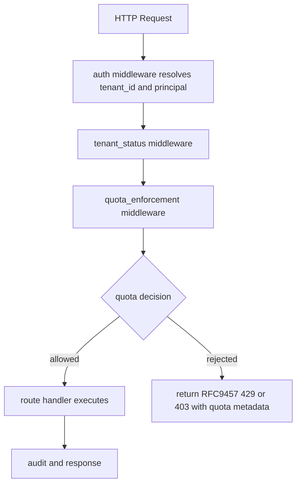
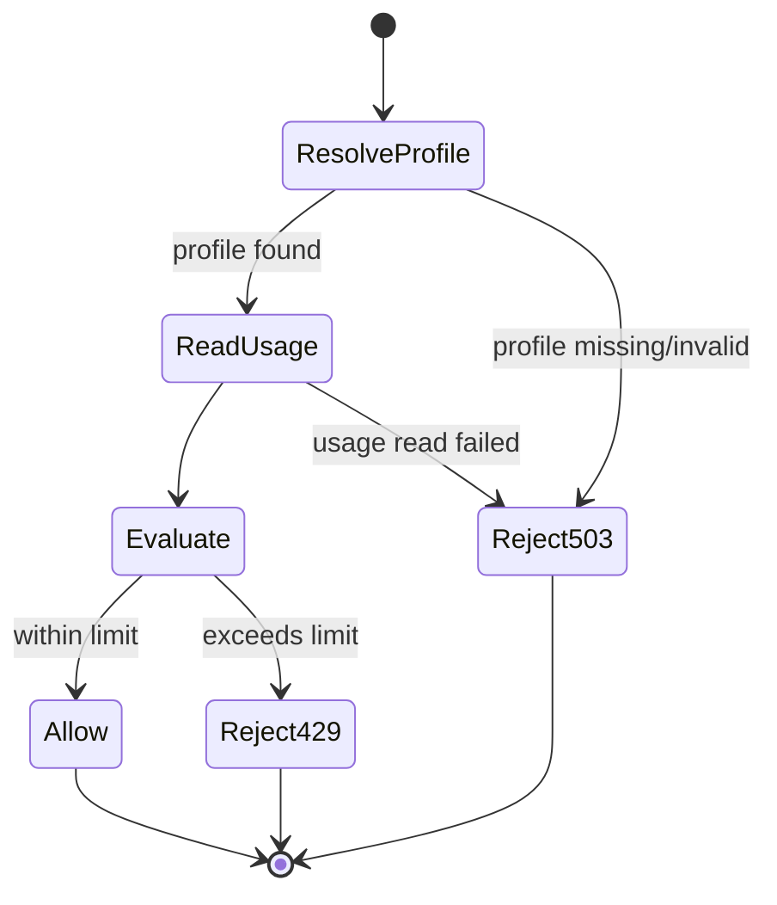

# Module: EXP-601 Tier-to-Quota Central Enforcement Model

## Requirement Coverage
- Requirement ID: EXP-601
- Source: docs/requirements/BPM_Platform_Expansion_Backlog.20260611.md
- Gap rationale source: docs/Audit-Reports/BPM_vs_ASCOA-GO_Gap_Analysis.20260611.md
- Type classification: Type E (cross-cutting kernel middleware + config surface)

## Module purpose
EXP-601 introduces a single, central quota policy model that maps tenant tier to enforceable runtime limits and applies those limits in middleware before route handlers execute state-changing work. The design ensures that quota checks are not scattered across entity, file, sandbox, and agent subsystems. Instead, all checks are routed through one quota policy resolution interface and one middleware gate so that rejection behavior, telemetry, and error semantics are uniform across the API surface.

This design keeps enforcement in the API/kernel boundary and keeps policy definition in one configuration surface under src/config. It also preserves existing middleware composition patterns already used for auth, tenant status, and rate limiting.

## Quota taxonomy (EXP-601)
Quota classes are enforced per tenant and resolved from tier policy plus optional per-tenant overrides:

1. Script compute quota
- script_cpu_millis_per_request: max CPU budget for script execution per request path.
- script_memory_bytes_per_request: max in-process memory budget for script execution per request path.
- scope: script-capable execution paths (DSL/Lua/Wasm adapter boundaries).

2. Entity storage quota
- max_entity_records_total: upper bound for total entity projection records for tenant.
- max_entity_storage_bytes: upper bound on physical entity projection storage budget.
- scope: entity command and projection-affecting write routes.

3. File quota
- max_file_bytes_total: upper bound for aggregate file storage per tenant.
- max_file_count_total: upper bound for total file objects per tenant.
- scope: file upload/create/replace routes.

4. Concurrent sandbox quota
- max_concurrent_sandboxes: upper bound of active sandbox allocations per tenant.
- scope: sandbox claim/provision/start routes.

5. Agent retry budget quota
- max_agent_retries_per_job: upper bound retries allowed for a single agent execution.
- max_agent_retries_per_day: upper bound retries consumed by tenant per rolling day.
- scope: agent loop retry and redrive endpoints.

## Single configuration surface schema and ownership

### Ownership
- Module owner: src/config (configuration model and loading)
- Policy consumer owner: src/api/middleware (enforcement gate)
- Upstream source of truth: active tenant config artifact loaded through existing config loader path

### Configuration surface
Add a single policy envelope in config artifacts named tier_quota_policy, resolved by tenant_id.

Proposed config model (shape only, no implementation code):

- TierQuotaConfig
  - version: string
  - default_tier: enum { free, standard, enterprise, internal }
  - tiers: map<tier_name, TierQuotaProfile>
  - tenant_overrides: map<tenant_id, TenantQuotaOverride>

- TierQuotaProfile
  - script_cpu_millis_per_request: u32
  - script_memory_bytes_per_request: u64
  - max_entity_records_total: u64
  - max_entity_storage_bytes: u64
  - max_file_bytes_total: u64
  - max_file_count_total: u64
  - max_concurrent_sandboxes: u32
  - max_agent_retries_per_job: u16
  - max_agent_retries_per_day: u32

- TenantQuotaOverride
  - tier: optional enum
  - overrides: optional partial TierQuotaProfile

### Config integration point in src/config/*
- src/config/loader.zig
  - extend ConfigKind with quota_policy
  - add parsing + validation branch for quota policy artifact
  - expose loadActiveQuotaPolicy(allocator, pool, tenant_id)
- src/config/rate_limit.zig
  - remains separate for request RPM; no duplication of quota fields
- src/config/identity_provider.zig
  - unaffected directly; included only for config convention consistency

## Public interface

### src/config/quota_policy.zig (new module design)

Public data types:
- QuotaDimension enum
  - script_cpu
  - script_memory
  - entity_records
  - entity_storage
  - file_bytes
  - file_count
  - concurrent_sandboxes
  - agent_retry_per_job
  - agent_retry_per_day

- TierName enum
  - free
  - standard
  - enterprise
  - internal

- EffectiveQuotaProfile struct
  - tenant_id: []const u8
  - tier: TierName
  - script_cpu_millis_per_request: u32
  - script_memory_bytes_per_request: u64
  - max_entity_records_total: u64
  - max_entity_storage_bytes: u64
  - max_file_bytes_total: u64
  - max_file_count_total: u64
  - max_concurrent_sandboxes: u32
  - max_agent_retries_per_job: u16
  - max_agent_retries_per_day: u32

- QuotaUsageSnapshot struct
  - tenant_id: []const u8
  - dimension: QuotaDimension
  - used: u64
  - limit: u64
  - remaining: u64

- QuotaDecision union
  - allowed
  - rejected: QuotaViolation

- QuotaViolation struct
  - dimension: QuotaDimension
  - tenant_id: []const u8
  - tier: TierName
  - used: u64
  - requested_delta: u64
  - limit: u64
  - retry_after_seconds: ?u32

Public functions:
- loadEffectiveQuotaProfile(allocator, pool, tenant_id) !EffectiveQuotaProfile
- evaluateQuota(allocator, profile, usage_snapshot, requested_delta) !QuotaDecision
- mapQuotaDecisionToProblem(allocator, violation) ![]const u8

### src/api/middleware/quota_enforcement.zig (new module design)

Public types:
- QuotaGuardTarget enum
  - entity_write
  - file_write
  - sandbox_allocate
  - agent_retry
  - script_execute

- QuotaCheckInput struct
  - tenant_id: []const u8
  - target: QuotaGuardTarget
  - requested_delta: u64
  - request_path: []const u8
  - request_method: std.http.Method

- QuotaMiddlewareResult union
  - allowed
  - rejected: HandlerResult

Public functions:
- init(allocator) !void
- deinit() void
- check(allocator, pool, input: QuotaCheckInput) !QuotaMiddlewareResult

## Middleware enforcement flow

Detailed sequence:
1. auth middleware resolves tenant context (existing AuthContext.tenant_id).
2. quota middleware derives QuotaGuardTarget from route/method and computes requested_delta.
3. middleware calls config quota policy resolver for effective tier/profile.
4. middleware reads usage snapshot from subsystem-specific usage provider.
5. middleware evaluates usage + requested_delta against effective limit.
6. if exceeded, middleware short-circuits request with standardized problem response.
7. if within limits, request continues to route handler.

## Error taxonomy

Quota-specific error set (design-level):
- QuotaPolicyNotConfigured
  - no active quota policy for tenant and no global default.
  - HTTP mapping: 503 Service Unavailable (platform misconfiguration).
- QuotaPolicyInvalid
  - config artifact malformed or violates schema constraints.
  - HTTP mapping: 503 Service Unavailable.
- QuotaUsageReadFailed
  - usage subsystem unavailable (DB/read path failure).
  - HTTP mapping: 503 Service Unavailable.
- QuotaDimensionUnsupported
  - route mapped to unknown quota target.
  - HTTP mapping: 500 Internal Server Error.
- QuotaExceededScriptCpu
  - exceeded script_cpu_millis_per_request.
  - HTTP mapping: 429 Too Many Requests.
- QuotaExceededScriptMemory
  - exceeded script_memory_bytes_per_request.
  - HTTP mapping: 429 Too Many Requests.
- QuotaExceededEntityStorage
  - exceeded max_entity_records_total or max_entity_storage_bytes.
  - HTTP mapping: 429 Too Many Requests.
- QuotaExceededFileStorage
  - exceeded max_file_bytes_total or max_file_count_total.
  - HTTP mapping: 429 Too Many Requests.
- QuotaExceededConcurrentSandboxes
  - exceeded max_concurrent_sandboxes.
  - HTTP mapping: 429 Too Many Requests.
- QuotaExceededAgentRetryBudget
  - exceeded max_agent_retries_per_job or max_agent_retries_per_day.
  - HTTP mapping: 429 Too Many Requests.

Problem response fields:
- type: https://bpm.local/problems/quota-exceeded
- title: Tenant Quota Exceeded
- status: 429
- detail: human-readable exceeded dimension
- extensions:
  - tenant_id
  - tier
  - dimension
  - used
  - requested_delta
  - limit
  - remaining

## Integration points in src/api/middleware/* and src/config/*

Middleware integration points:
- src/api/middleware/auth.zig
  - source of tenant_id context for quota enforcement.
- src/api/middleware/tenant_status.zig
  - quota guard is chained after tenant write-pause checks.
- src/api/middleware/rate_limit.zig
  - separate concern; quota middleware should not reuse RPM counters.
- src/api/middleware/validate.zig
  - request payload can provide requested_delta inputs after schema validation.

Configuration integration points:
- src/config/loader.zig
  - single loading surface for active tier_quota_policy.
- src/config/rate_limit.zig
  - remains dedicated to request-rate limiting.
- src/config/identity_provider.zig
  - unaffected but follows same strict config validation pattern.

Cross-subsystem usage-provider integration (read-only dependencies):
- entity usage provider (entity record/storage totals)
- file usage provider (file bytes/count)
- sandbox usage provider (active sandbox count)
- agent usage provider (retry usage)

These providers expose usage snapshots only; they do not own policy.

## State transitions

Quota decision state machine per request:

Tenant tier/profile state transitions (config lifecycle):
- DRAFT policy artifact -> ACTIVE policy artifact
- ACTIVE policy artifact -> REPLACED by newer version
- tenant override update does not change API contract; only effective profile resolution output

## Dependencies and forbidden dependencies

Allowed dependencies:
- src/api/middleware/auth.zig (tenant context)
- src/config/loader.zig (policy loading)
- src/api/errors.zig (problem details construction)
- subsystem usage readers for entities/files/sandbox/agent retry

Forbidden dependencies:
- no direct dependency from quota middleware into engine transition logic
- no write-side mutations inside policy resolver (read-only config path)
- no duplication of policy constants across route handlers

## Migration and compatibility notes for existing tenant types

Compatibility goals:
- Existing tenants without explicit tier metadata must continue functioning via default_tier mapping.
- Bootstrap/internal tenants map to internal tier unless overridden.
- Existing API behavior remains unchanged for tenants under limit.

Migration strategy:
1. introduce quota policy config schema with conservative default limits that are above current observed usage envelopes.
2. enable middleware in monitor mode (decision logged, not enforced) for one release window.
3. switch to enforce mode after validation of false-positive rate.
4. for legacy tenants exceeding baseline, apply tenant_overrides before enforce-mode cutover.

Backwards compatibility rules:
- missing tenant tier field does not fail request if default_tier is configured.
- unknown tier value resolves to default_tier and emits warning metric.
- policy read failure is fail-closed for write operations that allocate scarce resources (sandbox, file, entity create) and fail-open only for pure read routes.

## Acceptance traceability (EXP-601)

1. EXP-601 task: Tier classification -> quotas for script CPU/memory, entity storage, file, concurrent sandboxes, retry budget.
- Design elements:
  - Quota taxonomy section
  - TierQuotaProfile schema
  - QuotaDimension enum

2. EXP-601 task: enforced in kernel middleware.
- Design elements:
  - src/api/middleware/quota_enforcement.zig interface
  - middleware enforcement flow
  - state machine for allow/reject

3. EXP-601 task: configured in one place.
- Design elements:
  - single config surface tier_quota_policy in src/config/loader.zig
  - ownership model separating policy from usage providers

4. EXP-601 acceptance: exceeding tenant quota rejected centrally.
- Design elements:
  - QuotaDecision rejected branch
  - standardized RFC9457 quota-exceeded problem
  - uniform error taxonomy with 429 mapping

5. EXP-601 acceptance: limits live in one config surface.
- Design elements:
  - TierQuotaConfig envelope
  - loadEffectiveQuotaProfile as only policy resolution entry point

## Open questions
- Should script_cpu_millis_per_request and script_memory_bytes_per_request be enforced only at middleware admission time, or also at runtime execution sandbox boundaries with hard stop semantics?
- For entity_storage_bytes, is authoritative usage source logical row size approximation or physical storage stats from PostgreSQL catalogs?
- For agent_retry_per_day, should the time window be UTC day boundary or rolling 24-hour window?
- Should quota overages for privileged PLATFORM_ADMIN calls remain enforced uniformly, or is there a documented break-glass exemption path?

## Out of scope
- Implementing new DB tables or counters.
- Changing route handler internals.
- Introducing new tenant billing semantics.
- Frontend UX for quota dashboards.
