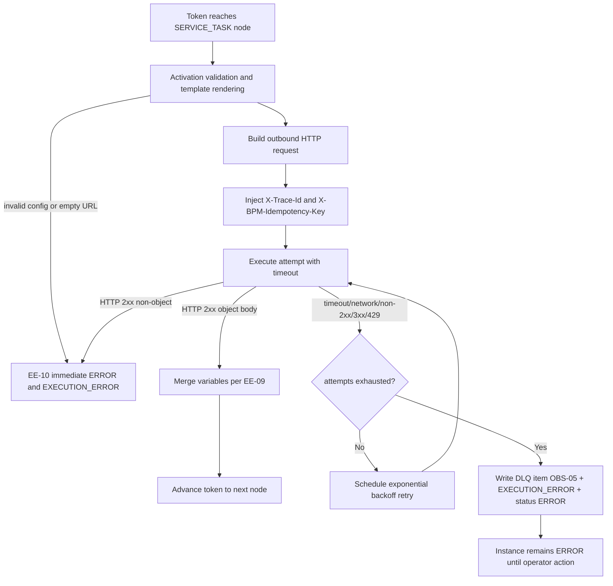
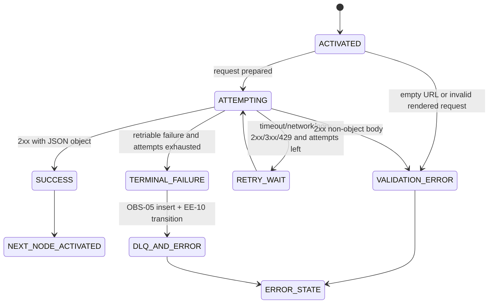

# Module: ext-01-service-task-node

**Covers:** EXT-01 (Service task node type)
**Related:** EE-09 (variable merge), EE-10 (ERROR handling), OBS-05 (DLQ), API-09 (trace propagation), SCH-03/EE-08 (cancel race handling)
**Primary design targets:** src/engine/service_task.zig, src/engine/transition.zig, src/engine/retry_policy.zig, src/api/middleware/trace.zig, src/obs/logger.zig, src/dlq/store.zig, src/api/routes/dlq.zig

## Module purpose

The EXT-01 module defines deterministic SERVICE_TASK execution from node activation through success, retriable failure, and terminal failure. It standardizes outbound HTTP request construction (templated URL, method, optional headers), timeout and retry policy (default 30s timeout, default 3 retries with exponential backoff), redirect handling (3xx is failure, no auto-follow), success-path response merge semantics, and EE-10 transition behavior for non-retriable execution errors. It also defines explicit DLQ handoff to OBS-05 after retry exhaustion and mandatory trace propagation from API-09 into outbound calls.

## Public interface

### Node configuration contract

```json
{
  "id": "charge_customer",
  "type": "SERVICE_TASK",
  "service_task": {
    "url": "https://billing.example/v1/charges/{{variables.order_id}}",
    "method": "POST",
    "headers": {
      "Content-Type": "application/json",
      "X-Tenant": "{{variables.tenant}}"
    },
    "timeout_ms": 30000,
    "retry_limit": 3,
    "body_template": {
      "amount": "{{variables.total_amount}}",
      "currency": "{{variables.currency}}"
    }
  }
}
```

Rules:

1. `url` is required, rendered from template variables at activation time.
2. `method` is required and must be one of `GET|POST|PUT|PATCH|DELETE`.
3. `headers` is optional; if present, keys and rendered values must be non-empty strings.
4. `timeout_ms` is optional; default `30000`.
5. `retry_limit` is optional; default `3`.
6. `body_template` is optional and method-dependent (`GET`/`DELETE` do not send body).

### Zig types

```zig
pub const ServiceTaskConfig = struct {
    node_id: []const u8,
    url_template: []const u8,
    method: HttpMethod,
    headers_json: []const u8, // map[string]string, rendered per attempt
    timeout_ms: u32,          // default 30000
    retry_limit: u8,          // default 3
    body_template_json: ?[]const u8,
};

pub const ServiceTaskAttemptContext = struct {
    instance_id: [16]u8,
    definition_id: [16]u8,
    node_id: []const u8,
    token_id: []const u8,
    trace_id: []const u8,
    attempt_index: u8, // 1-based
    retry_limit: u8,
    started_at_us: i64,
};

pub const ServiceTaskFailureKind = enum {
    timeout,
    network,
    http_non_2xx,
    http_redirect_3xx,
    rate_limited_429,
    invalid_2xx_body,
    request_build_error,
};

pub const ServiceTaskExecutionError = error{
    InvalidConfig,
    EmptyRenderedUrl,
    InvalidHeader,
    Timeout,
    NetworkFailure,
    HttpNon2xx,
    RedirectRejected,
    Invalid2xxBody,
    DlqMoveFailed,
    TransitionError,
    OutOfMemory,
};
```

### Zig functions

```zig
pub fn validateServiceTaskActivation(
    allocator: std.mem.Allocator,
    state: *const engine.InstanceState,
    cfg: ServiceTaskConfig,
) ServiceTaskExecutionError!PreparedServiceTaskRequest;

pub fn executeServiceTaskAttempt(
    allocator: std.mem.Allocator,
    http_client: *http.Client,
    req: PreparedServiceTaskRequest,
    ctx: ServiceTaskAttemptContext,
) ServiceTaskExecutionError!ServiceTaskAttemptResult;

pub fn classifyServiceTaskResult(
    result: ServiceTaskAttemptResult,
) ServiceTaskDecision;

pub fn computeServiceTaskBackoffMs(
    attempt_index: u8,
    base_ms: u32,
    cap_ms: u32,
) u32;

pub fn handleServiceTaskTerminalFailureInTx(
    allocator: std.mem.Allocator,
    tx: *db.Tx,
    failure: TerminalServiceTaskFailure,
) ServiceTaskExecutionError!void;

pub fn mergeServiceTaskSuccessInTx(
    allocator: std.mem.Allocator,
    tx: *db.Tx,
    merge: ServiceTaskSuccessMerge,
) ServiceTaskExecutionError!void;
```

## Execution semantics

### 1. Node activation and request construction

At SERVICE_TASK activation, runtime renders templates against current instance variables.

Validation rules (activation-time):

1. Rendered URL must be non-empty and parse as absolute `http` or `https` URL.
2. Edge case: rendered URL as empty string is rejected immediately with EE-10 transition.
3. Rendered headers must produce non-empty keys and values.
4. `timeout_ms` defaults to `30000` if missing.
5. `retry_limit` defaults to `3` if missing.
6. `retry_limit = 0` means no retries beyond the initial attempt (single-shot execution).

Request construction requirements:

1. Set method from node config.
2. Include optional rendered headers from config.
3. Inject `X-Trace-Id` header with API-09 `trace_id`.
4. Inject deterministic idempotency header `X-BPM-Idempotency-Key` derived from `(instance_id, node_id, token_id)` and kept constant across retries of the same activation.
5. For body-capable methods, serialize rendered `body_template` as JSON.

### 2. HTTP behavior rules

1. Timeout budget per attempt: `timeout_ms` (default 30s).
2. Automatic redirect following is disabled.
3. Any `3xx` response is treated as failure kind `http_redirect_3xx`.
4. Any `429` is treated as failure kind `rate_limited_429`.
5. Any other non-2xx is `http_non_2xx`.
6. Network/TLS/connect failures are `network`.

### 3. Retry and backoff

Retriable failure kinds:

1. `timeout`
2. `network`
3. `http_non_2xx`
4. `http_redirect_3xx`
5. `rate_limited_429`

Non-retriable failure kinds:

1. `invalid_2xx_body`
2. `request_build_error` (invalid activation/rendered config)

Policy:

1. Effective retry limit is node `retry_limit` or default `3`.
2. Attempt numbering is 1-based.
3. After each retriable failure where `attempt_index <= retry_limit`, schedule next attempt with exponential backoff.
4. Backoff formula: `delay_ms = min(cap_ms, base_ms * 2^(attempt_index-1))` with defaults `base_ms=500`, `cap_ms=30000`.
5. When retriable failure occurs and attempts are exhausted, move item to OBS-05 DLQ and transition instance to EE-10 ERROR in one transaction.

### 4. Success-path merge and invalid-body handling

1. On HTTP 2xx, parse response body as JSON.
2. If parsed JSON is an object, merge into instance variables per EE-09:
   - new keys inserted
   - existing keys overwritten
   - overwrite emits `VARIABLE_OVERWRITTEN` events where required
3. If HTTP 2xx body is not a JSON object (array/scalar/null), do not merge and transition instance to EE-10 ERROR with `EXECUTION_ERROR` reason `INVALID_SERVICE_TASK_RESPONSE_BODY`.
4. Invalid 2xx body is treated as non-retriable and does not enter retry loop.

### 5. Terminal failure path (DLQ + EE-10)

When retries are exhausted for a retriable failure:

1. Persist DLQ item via OBS-05 contract with full context:
   - `item_type = SERVICE_TASK`
   - original request payload and config snapshot
   - instance_id
   - error chain with all attempts
   - trace_id
   - retry_count and retry_limit
2. Append `EXECUTION_ERROR` event with structured reason and attempt summary.
3. Set instance status to `ERROR`.
4. Commit all three changes atomically in one transaction.

### 6. Cancellation race behavior

If instance becomes `CANCELLED` while a service attempt is in flight:

1. Best-effort abort in-flight call (EE-08).
2. No further retries are scheduled.
3. No DLQ insertion for cancellation-driven aborts unless an exhausted retry failure already committed before cancellation lock wins.

## Idempotency and side-effect safety

1. Retries can cause external side effects unless remote endpoint is idempotent.
2. Platform mitigates by sending stable `X-BPM-Idempotency-Key` across retries for the same activation.
3. Operators should configure SERVICE_TASK targets to honor idempotency keys.
4. Retry logic must never mutate request payload across attempts except transport metadata (attempt count header is optional).

## Error taxonomy

| Error / condition | Retriable | EE-10 transition | DLQ move | Notes |
|---|---|---|---|---|
| Timeout | Yes | On exhausted retries | Yes | default timeout 30s unless override |
| Network/TLS/connect failure | Yes | On exhausted retries | Yes | includes DNS/connect reset |
| HTTP 429 | Yes | On exhausted retries | Yes | treated as non-success external pressure |
| HTTP non-2xx (except 3xx) | Yes | On exhausted retries | Yes | includes 4xx/5xx |
| HTTP 3xx redirect | Yes | On exhausted retries | Yes | no auto-follow allowed |
| 2xx with non-object JSON body | No | Immediate | No | explicit EXT-01 rule |
| Activation URL renders empty | No | Immediate | No | EXT-01 edge case |
| Header/template render invalid | No | Immediate | No | request construction failure |

## Module boundaries and touchpoints

### Engine layer

- `src/engine/transition.zig`
  - Remains pure; no HTTP calls.
  - Emits command/intention to execute SERVICE_TASK and consumes success/error outcome events.
- `src/engine/service_task.zig`
  - Owns activation validation, request build, attempt execution, result classification.
- `src/engine/retry_policy.zig`
  - Owns retry budget accounting and exponential backoff timing.

### API/trace layer

- `src/api/middleware/trace.zig`
  - Source of request `trace_id` propagated to service-task context.

### Observability/DLQ layer

- `src/dlq/store.zig`
  - Persists exhausted SERVICE_TASK failures with full context.
- `src/obs/logger.zig`
  - Structured logs include `trace_id`, instance_id, node_id, attempt_index, outcome.

### Must not depend on

1. `src/engine/transition.zig` must not depend on HTTP client, logger, database, or wall clock.
2. Service-task execution module must not perform SQL interpolation.
3. Retry logic must not depend on API route handlers.

## Data flow diagram



## State transitions



## Requirement traceability matrix

| Requirement or edge case | Design section(s) | Modules and function touchpoints | Required tests (unit + integration) |
|---|---|---|---|
| EXT-01 AC1: 2xx JSON object merged into variables per EE-09 | Success-path merge and invalid-body handling | `src/engine/service_task.zig` (`executeServiceTaskAttempt`, `mergeServiceTaskSuccessInTx`), `src/engine/transition.zig` | Unit: `service_task_success_merge_test` (object merge). Integration: `instance_service_task_2xx_merge_test` |
| EXT-01 AC2: 2xx non-object body -> not merged, ERROR | Success-path merge and invalid-body handling; Error taxonomy | `src/engine/service_task.zig` (`classifyServiceTaskResult`), EE-10 write path | Unit: `service_task_invalid_2xx_body_test`. Integration: `instance_service_task_invalid_body_error_test` |
| EXT-01 AC3: timeout default 30s + timeout_ms override, timeout retried | Node configuration contract; HTTP behavior rules; Retry and backoff | `src/engine/service_task.zig` timeout wiring, `src/engine/retry_policy.zig` | Unit: `service_task_timeout_default_override_test`, `retry_backoff_sequence_test`. Integration: `service_task_timeout_retries_test` |
| EXT-01 AC4: retries exhausted -> OBS-05 DLQ + EE-10 ERROR | Retry and backoff; Terminal failure path | `src/engine/retry_policy.zig`, `src/dlq/store.zig`, `src/engine/service_task.zig` (`handleServiceTaskTerminalFailureInTx`) | Unit: `service_task_exhausted_retries_terminal_test`. Integration: `service_task_exhausted_to_dlq_and_error_test` |
| EXT-01 AC5: no redirect following; 3xx treated as failure | HTTP behavior rules; Error taxonomy | `src/engine/service_task.zig` redirect classification path | Unit: `service_task_redirect_as_failure_test`. Integration: `service_task_3xx_retry_then_dlq_test` |
| EXT-01 See API-09: trace_id propagated to outgoing headers | Node activation and request construction; API/trace layer touchpoints | `src/api/middleware/trace.zig`, `src/engine/service_task.zig` request builder | Unit: `service_task_trace_header_propagation_test`. Integration: `service_task_outbound_trace_header_test` |
| EXT-01 edge: templated URL resolves to empty string -> reject at activation with EE-10 | Node activation and request construction; Error taxonomy | `src/engine/service_task.zig` (`validateServiceTaskActivation`) | Unit: `service_task_empty_rendered_url_test`. Integration: `instance_service_task_empty_url_error_test` |
| EXT-01 edge: HTTP 429 treated as failure and retried | HTTP behavior rules; Retry and backoff; Error taxonomy | `src/engine/service_task.zig`, `src/engine/retry_policy.zig` | Unit: `service_task_429_retriable_test`. Integration: `service_task_429_retry_policy_test` |
| Task requirement: request construction URL/method/optional headers is explicit and testable | Node configuration contract; Node activation and request construction | `src/engine/service_task.zig` (`validateServiceTaskActivation`) | Unit: `service_task_request_construction_test`. Integration: `service_task_header_template_render_test` |
| Task requirement: idempotency and side-effect safety considerations for retries | Idempotency and side-effect safety | `src/engine/service_task.zig` header injection path | Unit: `service_task_idempotency_key_stable_across_retries_test`. Integration: `service_task_remote_idempotency_contract_test` |

## Open questions

1. None blocking for Step 01 design completion. Retry-limit value `0` is defined here as single-shot execution (initial attempt only) to keep behavior explicit and testable.
