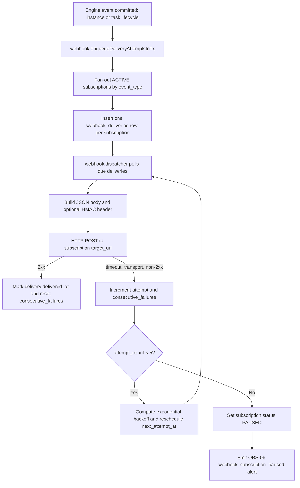
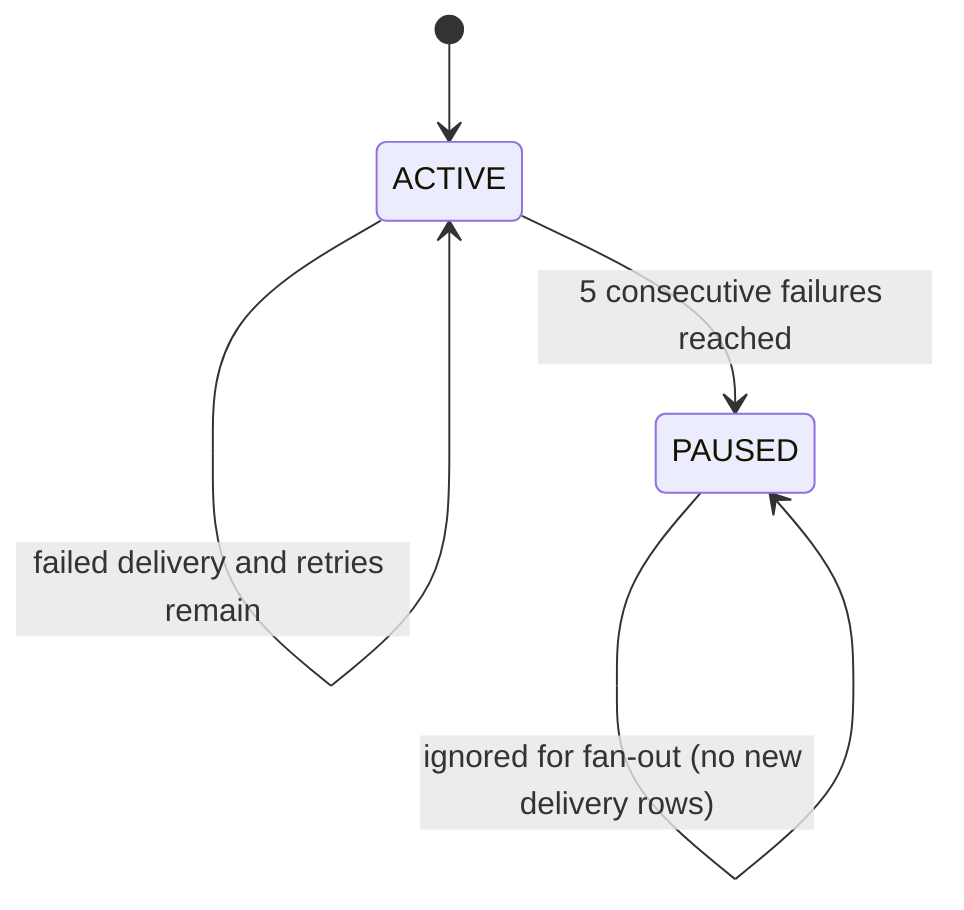
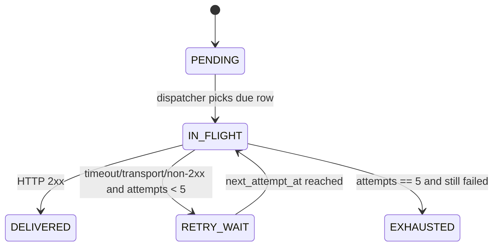

# Module: ext-02-webhook-event-dispatch

**Covers:** EXT-02 (Webhook event dispatch)
**Related:** OBS-03 (audit log), OBS-06 (alerting hooks), OBS-05 (DLQ), API-09 (trace propagation), IDN-03 (PLATFORM_ADMIN authorization)
**Primary design targets:** src/api/routes/webhooks.zig, src/api/middleware/rbac.zig, src/api/middleware/audit.zig, src/webhook/dispatcher.zig, src/webhook/subscription_store.zig, src/webhook/signing.zig, src/event_store/store.zig, src/obs/alerts/dispatcher.zig

## Module purpose

The EXT-02 module defines platform-managed webhook subscriptions and reliable outbound event delivery for runtime events: instance started/completed/errored and task activated/completed. It specifies admin-only subscription management APIs, durable subscription persistence, deterministic payload and signing contracts, at-least-once delivery with per-subscription retry isolation, and pause-on-failure safety behavior that integrates with OBS-06 for operator notification. The module is explicitly separate from EXT-01 SERVICE_TASK execution: EXT-02 is event fan-out infrastructure, not workflow node execution.

## Public interface

### Event types exposed to subscribers

Allowed values for subscription filters:

1. `instance.started`
2. `instance.completed`
3. `instance.errored`
4. `task.activated`
5. `task.completed`

### API contracts

All webhook subscription endpoints require `PLATFORM_ADMIN`.

#### POST /webhooks/subscriptions

Request body:

```json
{
  "target_url": "https://hooks.example.com/bpm/events",
  "event_types": [
    "instance.started",
    "task.completed"
  ],
  "secret": "optional-shared-secret"
}
```

Validation rules:

1. `target_url` required, absolute `https://` URL in production, `http://` allowed only in non-production.
2. `event_types` required, non-empty array, values must be from the 5 allowed event types, duplicates removed before persist.
3. `secret` optional, when present must be non-empty and length-bounded by policy.

Response (`201 Created`):

```json
{
  "subscription_id": "8d4f0dc1-1f5e-4be8-bf0f-b7393679422e",
  "target_url": "https://hooks.example.com/bpm/events",
  "event_types": [
    "instance.started",
    "task.completed"
  ],
  "status": "ACTIVE",
  "consecutive_failures": 0,
  "max_attempts": 5,
  "created_at": "2026-05-25T10:30:00Z",
  "updated_at": "2026-05-25T10:30:00Z"
}
```

Audit requirement:

- Success path writes OBS-03 audit record in the same transaction:
  - `action = "webhook_subscription.create"`
  - `resource_type = "webhook_subscription"`
  - `resource_id = <subscription_id>`
  - `before_state = null`
  - `after_state = created subscription snapshot`

#### GET /webhooks/subscriptions

Response (`200 OK`):

```json
{
  "items": [
    {
      "subscription_id": "8d4f0dc1-1f5e-4be8-bf0f-b7393679422e",
      "target_url": "https://hooks.example.com/bpm/events",
      "event_types": ["instance.started", "task.completed"],
      "status": "ACTIVE",
      "consecutive_failures": 0,
      "last_attempt_at": null,
      "last_failure_at": null,
      "paused_at": null,
      "created_at": "2026-05-25T10:30:00Z",
      "updated_at": "2026-05-25T10:30:00Z"
    }
  ]
}
```

Notes:

1. Read-only endpoint; no OBS-03 audit record.
2. `secret` is never returned.

#### DELETE /webhooks/subscriptions/:id

Response (`204 No Content`) when deleted.

Audit requirement:

- Success path writes OBS-03 audit record in the same transaction:
  - `action = "webhook_subscription.delete"`
  - `resource_type = "webhook_subscription"`
  - `resource_id = <subscription_id>`
  - `before_state = deleted subscription snapshot`
  - `after_state = null`

### Outbound webhook payload contract

For each matching event, platform sends HTTP `POST` to `target_url`.

Headers:

1. `Content-Type: application/json`
2. `X-BPM-Event-Type: <event_type>`
3. `X-BPM-Delivery-Id: <uuid-v4>`
4. `X-BPM-Attempt: <1..5>`
5. `X-Trace-Id: <trace_id or generated correlation id>`
6. `X-BPM-Signature: sha256=<hex_digest>` only when subscription secret is configured

Body schema:

```json
{
  "event_type": "task.completed",
  "instance_id": "6cb8dff4-44dc-4f4f-b1d2-1499ca0af896",
  "timestamp": "2026-05-25T10:30:00Z",
  "payload": {
    "task_id": "8437a278-02d8-48bc-b2f9-74ef42fdb523",
    "node_id": "approve_order",
    "actor_id": "2f808147-50be-4439-8c5a-bfdab3a54b27"
  }
}
```

Payload semantics:

1. `event_type`, `instance_id`, `timestamp`, `payload` are always present.
2. `payload` shape is event-specific and forwarded as JSON object from emitted domain event.
3. Response body from target is ignored for success determination.
4. Any HTTP `2xx` is success, including invalid or non-JSON response body.

### Signing contract

When `secret` exists, signature is mandatory:

1. Canonical input is the exact outbound request body bytes.
2. Digest: `HMAC_SHA256(secret, body_bytes)`.
3. Header format: `X-BPM-Signature: sha256=<lowercase-hex-digest>`.
4. Signature recomputed per delivery attempt because body is stable per delivery.
5. If `secret` absent, `X-BPM-Signature` header is omitted.

### Zig types and function contracts

```zig
pub const WebhookEventType = enum {
    instance_started,
    instance_completed,
    instance_errored,
    task_activated,
    task_completed,
};

pub const SubscriptionStatus = enum {
    ACTIVE,
    PAUSED,
};

pub const WebhookSubscription = struct {
    subscription_id: [16]u8,
    target_url: []const u8,
    event_types: []const WebhookEventType,
    secret_ciphertext: ?[]const u8,
    status: SubscriptionStatus,
    consecutive_failures: u8,
    last_attempt_at_us: ?i64,
    last_failure_at_us: ?i64,
    paused_at_us: ?i64,
    created_at_us: i64,
    updated_at_us: i64,
};

pub const WebhookEnvelope = struct {
    event_type: WebhookEventType,
    instance_id: [16]u8,
    occurred_at_us: i64,
    payload_json: []const u8,
    trace_id: []const u8,
};

pub const DeliveryAttemptResult = struct {
    success: bool,
    http_status: ?u16,
    timeout: bool,
    transport_error: ?[]const u8,
    finished_at_us: i64,
};

pub const WebhookDispatchError = error{
    InvalidSubscription,
    InvalidEventType,
    SecretDecryptFailed,
    SignatureBuildFailed,
    QueueWriteFailed,
    DeliveryTimeout,
    DeliveryTransportError,
    DeliveryHttpNon2xx,
    RetryStateWriteFailed,
    PauseTransitionFailed,
    AlertEmitFailed,
    AuditWriteFailed,
    OutOfMemory,
};

pub fn createSubscriptionInTx(
    allocator: std.mem.Allocator,
    tx: *db.Tx,
    req: CreateWebhookSubscriptionRequest,
    actor_id: [16]u8,
) WebhookDispatchError!WebhookSubscription;

pub fn listSubscriptions(
    allocator: std.mem.Allocator,
    pool: *db.Pool,
) WebhookDispatchError![]WebhookSubscription;

pub fn deleteSubscriptionInTx(
    allocator: std.mem.Allocator,
    tx: *db.Tx,
    subscription_id: [16]u8,
    actor_id: [16]u8,
) WebhookDispatchError!void;

pub fn enqueueDeliveryAttemptsInTx(
    allocator: std.mem.Allocator,
    tx: *db.Tx,
    envelope: WebhookEnvelope,
) WebhookDispatchError!u32;

pub fn dispatchDueWebhookAttempts(
    allocator: std.mem.Allocator,
    pool: *db.Pool,
    client: *http.Client,
) WebhookDispatchError!void;

pub fn computeRetryDelayMs(attempt: u8, base_ms: u32, cap_ms: u32) u32;

pub fn buildSignatureHeader(
    allocator: std.mem.Allocator,
    secret: []const u8,
    body_bytes: []const u8,
) WebhookDispatchError![]const u8;

pub fn pauseSubscriptionAndEmitAlertInTx(
    allocator: std.mem.Allocator,
    tx: *db.Tx,
    subscription_id: [16]u8,
    failure_reason: []const u8,
    occurred_at_us: i64,
) WebhookDispatchError!void;
```

## Persistence model

### Subscription table contract

`webhook_subscriptions` columns:

1. `subscription_id` UUID PK
2. `target_url` TEXT NOT NULL
3. `event_types` JSONB NOT NULL (array of allowed enum values)
4. `secret_ciphertext` TEXT NULL (encrypted-at-rest representation of optional secret)
5. `status` TEXT NOT NULL CHECK (`ACTIVE` or `PAUSED`)
6. `consecutive_failures` INTEGER NOT NULL DEFAULT 0
7. `last_attempt_at` TIMESTAMPTZ NULL
8. `last_failure_at` TIMESTAMPTZ NULL
9. `paused_at` TIMESTAMPTZ NULL
10. `created_at` TIMESTAMPTZ NOT NULL
11. `updated_at` TIMESTAMPTZ NOT NULL

### Delivery attempt queue contract

`webhook_deliveries` columns (one row per subscription per event):

1. `delivery_id` UUID PK
2. `subscription_id` UUID FK -> webhook_subscriptions
3. `event_type` TEXT NOT NULL
4. `instance_id` UUID NOT NULL
5. `payload_json` JSONB NOT NULL
6. `trace_id` TEXT NULL
7. `attempt_count` INTEGER NOT NULL DEFAULT 0
8. `max_attempts` INTEGER NOT NULL DEFAULT 5
9. `next_attempt_at` TIMESTAMPTZ NOT NULL
10. `last_http_status` INTEGER NULL
11. `last_error` TEXT NULL
12. `delivered_at` TIMESTAMPTZ NULL
13. `created_at` TIMESTAMPTZ NOT NULL
14. `updated_at` TIMESTAMPTZ NOT NULL

Invariants:

1. Delivery rows are immutable with respect to envelope payload and destination subscription.
2. Retry state (`attempt_count`, `next_attempt_at`, error metadata) mutates independently per delivery row.
3. Retry updates are isolated per `(delivery_id, subscription_id)` and must not affect sibling subscriptions for the same event.

## Dispatch pipeline semantics

1. Runtime event commit (instance/task lifecycle) emits an internal webhook envelope command.
2. Fan-out query selects all `ACTIVE` subscriptions matching `event_type`.
3. One delivery row is created per matching subscription in the same transaction as event publication command ingestion.
4. Dispatcher polls due rows (`next_attempt_at <= now`) with row locking (`FOR UPDATE SKIP LOCKED`).
5. For each delivery row:
   - increment `attempt_count`
   - send HTTP POST with deterministic body/headers
   - classify result as success or failure
6. Success (`2xx`): set `delivered_at`, clear subscription `consecutive_failures` to 0, persist completion.
7. Failure (timeout/transport/non-2xx):
   - increment subscription `consecutive_failures`
   - if `attempt_count < 5`, schedule retry with exponential backoff
   - if `attempt_count == 5`, mark subscription `PAUSED`, set `paused_at`, trigger OBS-06 alert
8. At-least-once guarantee: duplicate delivery attempts are allowed; system never claims exactly-once semantics.

Backoff rule:

- `delay_ms = min(cap_ms, base_ms * 2^(attempt_count-1))`
- defaults: `base_ms = 1000`, `cap_ms = 30000`, `max_attempts = 5`

Failure classification:

1. Timeout -> failure
2. Transport/network/TLS error -> failure
3. HTTP non-2xx -> failure
4. HTTP 2xx -> success regardless of response body content

Per-subscription retry isolation:

1. Each subscription has its own delivery rows and `consecutive_failures` counter.
2. One failing subscription cannot delay, cancel, or pause deliveries for other subscriptions.
3. The same domain event may be delivered successfully to one subscription while another enters retry/pause flow.

## Data flow diagram



## State transitions

### Subscription state machine



### Delivery row state machine



## Error taxonomy

| Condition | Classification | Retriable | Result |
|---|---|---|---|
| Subscription create validation fails (bad URL/event filter) | `InvalidSubscription` | No | API 422 |
| Unauthorized role for POST/GET/DELETE | authz failure | No | API 403 |
| Secret decrypt/encryption failure | `SecretDecryptFailed` | No | create/delete transaction fails |
| Signature generation failure | `SignatureBuildFailed` | No | delivery attempt fails; counted as failure |
| HTTP timeout | `DeliveryTimeout` | Yes | retry/backoff until attempt 5 |
| Transport/TLS/connect error | `DeliveryTransportError` | Yes | retry/backoff until attempt 5 |
| HTTP non-2xx | `DeliveryHttpNon2xx` | Yes | retry/backoff until attempt 5 |
| HTTP 2xx with invalid/non-JSON response | success | N/A | treated as delivered |
| DB write failure while updating retry state | `RetryStateWriteFailed` | Yes (operational retry cycle) | row remains pending for next dispatcher cycle |
| Pause transition write failure | `PauseTransitionFailed` | Yes (operational retry cycle) | subscription remains active until successful state write |
| OBS-06 emit failure at pause point | `AlertEmitFailed` | Yes (internal retry) | pause remains authoritative; alert retried asynchronously |
| Audit write failure on create/delete | `AuditWriteFailed` | No | entire state change rolled back per OBS-03 |

## Module boundaries and concrete implementation touchpoints

### API layer

- `src/api/routes/webhooks.zig`
  - Defines POST/GET/DELETE handlers and payload validation mapping.
- `src/api/middleware/rbac.zig`
  - Enforces `PLATFORM_ADMIN` for all webhook subscription endpoints.
- `src/api/middleware/audit.zig`
  - Writes create/delete OBS-03 audit entries atomically with state change.

### Engine and event emission layer

- `src/event_store/store.zig`
  - Event append path is source of domain lifecycle events.
- `src/engine/transition.zig`
  - Remains pure; must not perform webhook I/O directly.
- Event emission bridge (proposed in event publication path)
  - Converts committed lifecycle events to `WebhookEnvelope` enqueue requests.

### Extensions/webhook layer

- `src/webhook/subscription_store.zig` (new module boundary)
  - CRUD for subscriptions, filtering by event type, failure counter updates.
- `src/webhook/dispatcher.zig`
  - Due-row polling, outbound POST, retry scheduling, pause policy execution.
- `src/webhook/signing.zig` (new module boundary)
  - HMAC-SHA256 generation and header formatting.

### Persistence layer

- `webhook_subscriptions` and `webhook_deliveries` tables
  - Durable source of subscription and retry state.
- Optional integration with DLQ (`src/dlq/store.zig`)
  - For exhausted delivery observability, if retention policy requires keeping final failure snapshots.

### Observability layer

- `src/obs/logger.zig`
  - Structured logs for delivery attempts and pause transitions.
- `src/obs/alerts/dispatcher.zig`
  - Receives mandatory EXT-02 pause trigger (`webhook_subscription_paused`).

### Must not depend on

1. `src/engine/transition.zig` must not depend on webhook HTTP client, DB access, or wall clock.
2. Webhook dispatcher must not call API route handlers directly.
3. Webhook SQL paths must not use string interpolation of user input.

## Recovery and reactivation considerations

1. Paused subscriptions are excluded from event fan-out until operator action.
2. Baseline recovery path (without new endpoint): operator deletes paused subscription and recreates it via POST.
3. Future-compatible enhancement: explicit reactivation endpoint can reset `status=ACTIVE` and `consecutive_failures=0` with OBS-03 audit.
4. Recreating or reactivating does not retroactively replay already exhausted deliveries unless a future replay API is introduced.

## Requirement traceability matrix (acceptance criteria + edge cases)

| Requirement / edge case | Design section(s) | Module/function touchpoints | Required tests (unit + integration) |
|---|---|---|---|
| AC1: `POST /webhooks/subscriptions` creates subscription with `target_url`, `event_types`, optional `secret`, returns 201 | API contracts (POST), persistence model, signing contract | `src/api/routes/webhooks.zig` (`POST` handler), `createSubscriptionInTx`, `src/webhook/subscription_store.zig` | Unit: payload validation and enum filtering. Integration: `post_webhook_subscription_201_and_persist_test` |
| AC1 authz + task authz requirement `PLATFORM_ADMIN` | API contracts, module boundaries (RBAC) | `src/api/middleware/rbac.zig`, route authorization wiring | Unit: role matrix tests for POST/GET/DELETE deny/allow. Integration: admin token succeeds, non-admin gets 403 |
| AC1 + OBS-03: create is audited atomically | API contracts (POST audit requirement), error taxonomy (`AuditWriteFailed`) | `createSubscriptionInTx`, `src/api/middleware/audit.zig` | Integration: create writes audit record with before=null/after snapshot; forced audit failure rolls back create |
| AC2: matching event sends POST with JSON body and optional `X-BPM-Signature` | Outbound payload contract, signing contract, dispatch semantics | `enqueueDeliveryAttemptsInTx`, `dispatchDueWebhookAttempts`, `buildSignatureHeader`, `src/webhook/dispatcher.zig` | Unit: signature header formatting and deterministic digest. Integration: event trigger sends expected body + headers |
| AC2 payload fields required (`event_type`, `instance_id`, `timestamp`, `payload`) | Outbound payload contract | Envelope builder in event publication path, dispatcher serialization | Unit: payload serializer contains required keys. Integration: captured request body schema validation |
| AC3: at-least-once delivery, non-2xx/timeout retried exponential backoff up to 5 | Dispatch semantics, backoff rule, error taxonomy | `dispatchDueWebhookAttempts`, `computeRetryDelayMs`, `webhook_deliveries` state updates | Unit: backoff sequence for attempts 1..5 and cap behavior. Integration: failing endpoint retried exactly 5 attempts |
| AC3 retry isolation | Dispatch semantics (per-subscription retry isolation), persistence invariants | `webhook_deliveries` row model, subscription-specific counters | Integration: one event -> two subscriptions; one succeeds while the other retries independently |
| AC4: after 5 consecutive failures subscription becomes `PAUSED` and OBS-06 alert is triggered | Dispatch semantics step 7, state transitions, observability touchpoints | `pauseSubscriptionAndEmitAlertInTx`, `src/webhook/dispatcher.zig`, `src/obs/alerts/dispatcher.zig` | Integration: fifth failure sets status PAUSED + paused_at and emits `webhook_subscription_paused` alert payload |
| AC5: `GET` and `DELETE /webhooks/subscriptions/:id` provided, PLATFORM_ADMIN required | API contracts (GET/DELETE), RBAC boundary | `listSubscriptions`, `deleteSubscriptionInTx`, `src/api/routes/webhooks.zig` | Unit: delete path returns 204, list redacts secret. Integration: GET/DELETE authz and lifecycle behavior |
| AC5 + OBS-03: delete is audited atomically | API contracts (DELETE audit requirement), error taxonomy (`AuditWriteFailed`) | `deleteSubscriptionInTx`, `src/api/middleware/audit.zig` | Integration: delete writes audit before snapshot/after null; forced audit failure rolls back delete |
| Edge: target returns 200 with invalid JSON body -> treated as success | Outbound payload semantics item 4, failure classification | `dispatchDueWebhookAttempts` response classifier | Unit: 2xx with non-JSON body classified success. Integration: fake endpoint returns text body 200 and delivery marked successful |
| Edge: same event triggers multiple subscriptions, independent retry counter | Dispatch semantics (fan-out + per-subscription isolation), persistence invariants | `enqueueDeliveryAttemptsInTx`, delivery polling/locking logic | Integration: multi-subscription fan-out with divergent outcomes and independent counters |
| Task requirement: include module boundaries across API, engine emission, webhook dispatcher, persistence, observability | Module boundaries and concrete touchpoints section | listed modules/functions across layers | Design verification checklist + integration harness wiring tests |
| Task requirement: recovery/reactivation considerations after pause | Recovery and reactivation considerations section | `DELETE + POST` baseline path; optional future reactivation function | Integration: pause then recreate subscription resumes deliveries; optional future reactivation tests |

## Open questions

1. Should paused-subscription recovery be limited to delete-and-recreate in Stage 6, or should a dedicated `reactivate` endpoint be added now?
2. Should final exhausted delivery rows be copied into OBS-05 DLQ for operator tooling parity, or kept only in `webhook_deliveries` + logs?
3. Should signature header include timestamp nonce (for replay protection) in this stage, or remain body-only HMAC per EXT-02 baseline?
