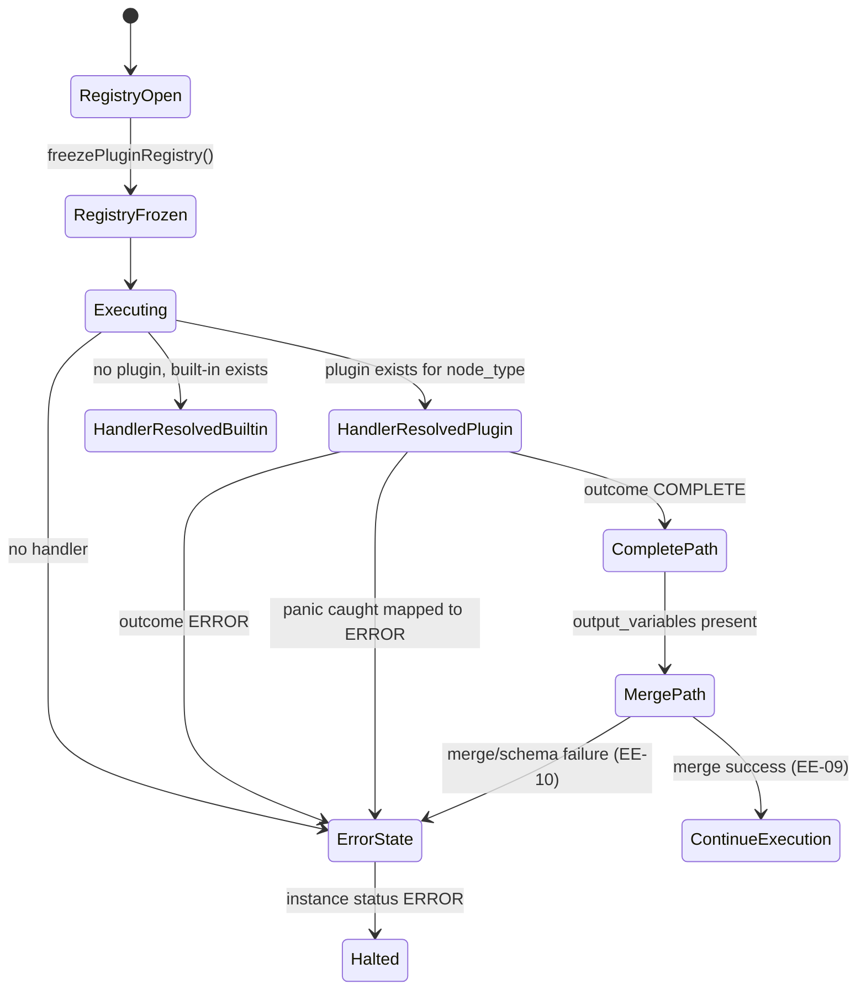

# Module: ext-03-plugin-interface

**Covers:** EXT-03 (Plugin interface)
**Related:** EE-09 (variable merge), EE-10 (execution error handling), EXT-01 (built-in service task handler precedence)
**Primary design targets:** src/engine/plugin_interface.zig, src/engine/plugin_registry.zig, src/engine/executor.zig, src/main.zig, src/config.zig, src/api/errors.zig, src/dlq/store.zig

## Module purpose

The EXT-03 module defines a stable in-process Zig interface for custom node type handlers that are registered once at startup and invoked during node execution. The design guarantees deterministic handler selection (plugin-first shadowing over built-ins), explicit outcome contracts (`COMPLETE` or `ERROR`), panic-to-error conversion, and strict integration with existing EE-09 variable merge and EE-10 error-state transitions. The goal is extensibility without introducing dynamic runtime loading, nondeterministic behavior, or ambiguity in compatibility boundaries.

## Public interface

### Registration contract (startup-only)

```zig
pub const PluginApiVersion = struct {
    major: u16,
    minor: u16,
};

pub const PluginRegistrationError = error{
    DuplicateNodeType,
    InvalidNodeType,
    InvalidHandler,
    RegistryLocked,
    IncompatibleApiVersion,
    OutOfMemory,
};

pub const RegisterPluginHandlerInput = struct {
    node_type: []const u8,
    handler: *const PluginNodeHandler,
    plugin_name: []const u8,
    plugin_version: []const u8,
    target_api: PluginApiVersion,
};

pub fn registerPluginHandler(
    allocator: std.mem.Allocator,
    registry: *PluginRegistry,
    input: RegisterPluginHandlerInput,
) PluginRegistrationError!void;

pub fn freezePluginRegistry(registry: *PluginRegistry) void;
```

Registration rules:

1. Plugins are registered only during startup bootstrap (before worker threads start).
2. `freezePluginRegistry` is called exactly once after bootstrap; subsequent registration attempts fail with `RegistryLocked`.
3. Registration is in-process only; no runtime dynamic loading, no hot reload, no filesystem/module discovery at runtime.
4. Duplicate registrations for the same `node_type` are rejected.
5. A plugin may register a `node_type` already implemented as built-in; plugin handler is selected at runtime by precedence rules below.

### Invocation context and outcome contract

```zig
pub const PluginExecutionContext = struct {
    allocator: std.mem.Allocator,
    instance_id: [16]u8,
    definition_id: [16]u8,
    node_id: []const u8,
    node_type: []const u8,
    instance_variables_json: []const u8,
    node_config_json: []const u8,
    trace_id: []const u8,
};

pub const PluginCompleteOutcome = struct {
    output_variables_json: ?[]const u8,
};

pub const PluginErrorOutcome = struct {
    reason: []const u8,
};

pub const PluginHandlerOutcomeTag = enum {
    COMPLETE,
    ERROR,
};

pub const PluginHandlerOutcome = union(PluginHandlerOutcomeTag) {
    COMPLETE: PluginCompleteOutcome,
    ERROR: PluginErrorOutcome,
};

pub const PluginHandlerInvocationError = error{
    PanicCaught,
    InvalidOutcome,
    InvalidOutputVariables,
    InvalidErrorReason,
    OutOfMemory,
};

pub const PluginNodeHandler = fn (
    ctx: PluginExecutionContext,
) PluginHandlerInvocationError!PluginHandlerOutcome;

pub fn invokePluginHandlerSafely(
    allocator: std.mem.Allocator,
    handler: *const PluginNodeHandler,
    ctx: PluginExecutionContext,
) PluginHandlerInvocationError!PluginHandlerOutcome;
```

Outcome rules:

1. `COMPLETE` may include `output_variables_json` as null or JSON object.
2. If `output_variables_json` is present and not a JSON object, invocation is treated as `ERROR` path.
3. `ERROR.reason` must be non-empty and bounded (implementation-defined max length).
4. Any panic in plugin handler is caught by wrapper and converted to deterministic error path (see panic handling semantics).

### Runtime resolution and precedence contract

```zig
pub const ResolvedNodeHandlerKind = enum {
    plugin,
    builtin,
};

pub const ResolvedNodeHandler = struct {
    kind: ResolvedNodeHandlerKind,
    plugin_handler: ?*const PluginNodeHandler,
    builtin_handler: ?*const BuiltinNodeHandler,
};

pub fn resolveNodeHandler(
    registry: *const PluginRegistry,
    node_type: []const u8,
) ?ResolvedNodeHandler;
```

Precedence rules:

1. If plugin handler exists for `node_type`, it is selected.
2. Else, built-in handler is selected when available.
3. If neither exists, execution transitions to EE-10 (`EXECUTION_ERROR`, unsupported node type).

## Data flow diagram

```mermaid
flowchart TD
    A[Platform Startup] --> B[Load static plugin registration list]
    B --> C[registerPluginHandler for each node_type]
    C --> D[freezePluginRegistry]
    D --> E[Execution starts]
    E --> F[Token reaches node]
    F --> G[resolveNodeHandler(node_type)]
    G -->|plugin found| H[invokePluginHandlerSafely]
    G -->|plugin missing, built-in found| I[invoke built-in handler]
    G -->|none found| J[EE-10 unsupported node type]
    H -->|COMPLETE + optional output vars| K[EE-09 merge output variables]
    H -->|ERROR reason| L[EE-10 transition]
    H -->|panic caught| M[map to ERROR reason panic_caught]
    M --> L
    K --> N[Continue normal token advancement]
    L --> O[Append EXECUTION_ERROR and set instance ERROR]
```

## Error taxonomy

| Error case | Source | Runtime behavior | EE-09 integration | EE-10 integration |
|---|---|---|---|---|
| Duplicate node type registration | Startup registration | Startup failure for that plugin registration; platform bootstrap fails-fast | None | None |
| Registration after freeze | Startup lifecycle violation | Reject with `RegistryLocked`; startup validation fails | None | None |
| Incompatible plugin API major version | Version negotiation | Reject plugin at startup | None | None |
| Plugin handler returns `ERROR` | Plugin runtime outcome | Stop node progression | None | Set instance ERROR, append `EXECUTION_ERROR` with plugin reason |
| Plugin handler panic | Runtime panic wrapped by `invokePluginHandlerSafely` | Panic converted to synthetic `ERROR` outcome | None | Set instance ERROR, append `EXECUTION_ERROR` reason `PLUGIN_PANIC_CAUGHT` |
| COMPLETE output variables is non-object JSON | Outcome validation | Treat as unresolvable execution error | Merge skipped | EE-10 with reason `PLUGIN_OUTPUT_INVALID` |
| COMPLETE output variables schema violation | EE-09 merge validation | Merge rejected | Merge skipped | EE-10 via existing schema rejection path |
| No handler (plugin/built-in) for node type | Resolution | Unresolvable execution error | None | EE-10 with reason `NODE_HANDLER_NOT_FOUND` |

## State transitions



## Dependencies and module boundaries

### Depends on

1. `src/engine/executor.zig` for node dispatch orchestration.
2. `src/engine/transition.zig` only for pure transition decisions after normalized outcomes are produced (no plugin I/O here).
3. `src/engine/variables.zig` (or equivalent merge module) for EE-09 output merge semantics.
4. `src/api/errors.zig` for consistent error-to-problem mapping where API surfaces runtime errors.
5. `src/obs/logger.zig` and `src/dlq/store.zig` for structured diagnostics and operator flows triggered by EE-10.

### Must not depend on

1. Dynamic library loaders or runtime plugin discovery.
2. Direct database or network I/O from plugin registry resolution path.
3. Mutable global state that allows registration after startup freeze.

### Implementation touchpoints

1. Engine execution path:
   - `resolveNodeHandler` + `invokePluginHandlerSafely` integrated before built-in dispatch fallback.
2. Plugin registry:
   - Map `node_type -> PluginNodeHandler` with freeze-state guard.
3. Startup wiring:
   - Bootstrap constructs registry, registers known plugins, validates compatibility, freezes registry.
4. EE-09 merge integration:
   - `COMPLETE.output_variables_json` normalized to object and merged using existing merge/collision/schema rules.
5. EE-10 integration:
   - `ERROR` outcomes and panic-mapped outcomes route through same `EXECUTION_ERROR` append + `status=ERROR` transaction path.

## Versioning and compatibility constraints

The EXT-03 interface is stable by contract and versioned with `PluginApiVersion`.

Compatibility rules:

1. Runtime accepts plugin registrations only when `target_api.major == runtime_api.major`.
2. Runtime may accept `target_api.minor <= runtime_api.minor` when all referenced optional fields/features are supported.
3. Startup rejects incompatible versions before serving traffic.

Breaking API change (requires major version bump):

1. Changing `PluginExecutionContext` field names, types, or required presence.
2. Renaming or removing `PluginHandlerOutcome` variants (`COMPLETE`, `ERROR`).
3. Changing `PluginNodeHandler` function signature or error contract shape.
4. Altering precedence semantics so built-ins can supersede plugins for same node type.
5. Allowing runtime (post-freeze) registration/mutation of plugin registry.
6. Changing panic semantics away from deterministic panic-to-ERROR mapping.

Non-breaking change (minor version bump):

1. Adding optional context fields with default-safe behavior.
2. Adding optional metadata fields in completion/error diagnostics that do not alter handler contracts.
3. Adding new helper APIs that do not change existing signatures or required behavior.

## Requirement traceability matrix

| EXT-03 requirement / edge case | Design sections | Modules and function touchpoints | Required tests (unit + integration) |
|---|---|---|---|
| AC1: startup-registered plugin handler invoked with instance variables + node config | Registration contract; Invocation context; Data flow | `src/engine/plugin_registry.zig` (`registerPluginHandler`, `freezePluginRegistry`), `src/engine/executor.zig` (`resolveNodeHandler`, `invokePluginHandlerSafely`) | Unit: `plugin_registry_register_and_freeze_test`; `plugin_context_contains_variables_and_node_config_test`. Integration: `plugin_node_invocation_flow_test` |
| AC2: handler outcomes restricted to COMPLETE/ERROR and COMPLETE supports optional output vars | Invocation context and outcome contract | `src/engine/plugin_interface.zig` (`PluginHandlerOutcome`), `src/engine/executor.zig` outcome normalization | Unit: `plugin_complete_with_optional_output_test`; `plugin_error_outcome_contract_test`. Integration: `plugin_complete_advances_and_merges_test` |
| AC3: plugin panic caught and treated as ERROR with EE-10 path | Error taxonomy; EE-10 touchpoint | `src/engine/plugin_interface.zig` (`invokePluginHandlerSafely`), `src/engine/executor.zig` EE-10 routing | Unit: `plugin_panic_mapped_to_error_test`. Integration: `plugin_panic_sets_instance_error_and_execution_error_event_test` |
| AC4: in-process startup-only registration, no runtime dynamic loading | Registration contract; Dependencies and boundaries | `src/main.zig` startup wiring, `src/engine/plugin_registry.zig` freeze guard | Unit: `plugin_registration_after_freeze_rejected_test`; `plugin_duplicate_registration_rejected_test`. Integration: `startup_rejects_late_registration_test` |
| AC5: stable Zig interface and major bump on breaking changes | Public interface; Versioning and compatibility constraints | `src/engine/plugin_interface.zig` version constants and compatibility check | Unit: `plugin_api_major_mismatch_rejected_test`; `plugin_api_minor_compatible_test`. Integration: `startup_fails_on_incompatible_plugin_version_test` |
| Edge: plugin shadows built-in handler for same node type | Runtime resolution and precedence contract; Data flow | `src/engine/executor.zig` (`resolveNodeHandler`) | Unit: `plugin_precedence_over_builtin_test`. Integration: `plugin_shadowing_builtin_service_task_test` |
| COMPLETE output merge obeys EE-09 (including schema rejection behavior) | Invocation outcome; Error taxonomy | `src/engine/executor.zig`, variable merge module | Unit: `plugin_complete_output_merge_success_test`; `plugin_complete_output_schema_violation_error_test`. Integration: `plugin_merge_schema_error_transitions_to_error_test` |
| ERROR outcome reason routed through EE-10 and blocks further progression | Error taxonomy; State transitions | `src/engine/executor.zig`, `src/api/routes/tasks.zig` conflict handling for ERROR state | Unit: `plugin_error_outcome_routes_to_ee10_test`. Integration: `error_instance_rejects_followup_task_completion_after_plugin_error_test` |

## Open questions

1. Should `PluginExecutionContext.instance_variables_json` be immutable snapshot bytes only, or should a structured read-only accessor API also be part of stable interface v1?
2. Should `ERROR.reason` have a fixed maximum length (for example 1024 bytes) mandated in requirements, or is this left implementation-defined?
3. Should panic mapping include a sanitized stack fingerprint in `EXECUTION_ERROR` metadata, or should it remain a fixed reason code only?
