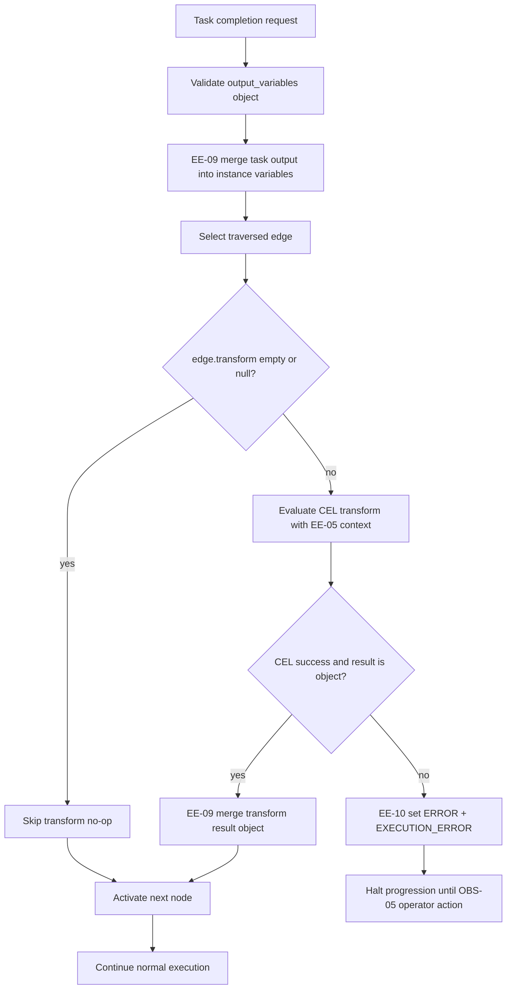
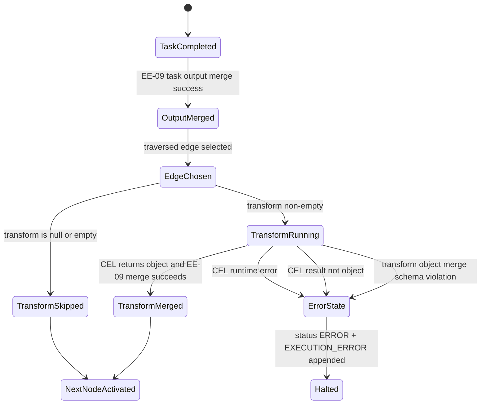

# Module: ext-04-variable-transformer

**Covers:** EXT-04 (Variable transformer)
**Related:** EE-05 (CEL context parity), EE-09 (variable merge semantics), EE-10 (execution error handling), PD-02/PD-06 (definition validation path)
**Primary design targets:** src/definition/graph.zig, src/definition/store.zig, src/definition/export_import.zig, src/definition/snapshot.zig, src/engine/transition.zig, src/engine/instance.zig, src/engine/cel.zig (or current CEL wrapper entrypoint), src/api/routes/definitions.zig

## Module purpose

EXT-04 introduces optional CEL-based edge transformers that execute when a token traverses a selected edge, allowing data shaping between completed task output and next-node activation without introducing an explicit gateway node. The design preserves existing EE-09 and EE-10 contracts by enforcing activation-time syntax validation, runtime context parity with EE-05, strict execution ordering (after task-output merge and before next-node activation), and an object-only transformer result contract merged through the same EE-09 policy. Empty transformer expressions are treated as no-op.

## Public interface

### Definition model additions

```zig
pub const GraphEdge = struct {
    id: []const u8,
    source: []const u8,
    target: []const u8,
    condition: ?[]const u8,
    is_default: bool = false,
    // EXT-04: optional CEL transformer expression.
    // Null or "" means no transformer (no-op).
    transform: ?[]const u8 = null,
};
```

```zig
pub fn validateEdgeTransforms(
    allocator: std.mem.Allocator,
    graph: DefinitionGraph,
) GraphError!ValidationResult;
```

Validation rules for `transform`:
1. `null` means no transformer.
2. `""` is accepted and normalized to no transformer.
3. Non-empty value must pass CEL syntax validation in the same validator family used by PD-06 checks.
4. Validation runs in definition create/update paths and again in activation/import revalidation paths (PD-02/PD-06 lifecycle).

### Runtime transformer contract

```zig
pub const EdgeTransformError = error{
    CelEvaluationFailed,
    NonObjectResult,
    OutOfMemory,
};

pub const EdgeTransformInput = struct {
    edge_id: []const u8,
    expression: []const u8,
    variables: std.json.ObjectMap,
};

pub fn evaluateEdgeTransform(
    allocator: std.mem.Allocator,
    input: EdgeTransformInput,
) EdgeTransformError!std.json.ObjectMap;
```

Runtime rules:
1. Evaluation context is identical to EE-05 condition evaluation context.
2. Transformer output must be a JSON object.
3. Non-object output is treated as unresolvable execution error and routed to EE-10.
4. Runtime CEL evaluation failure is treated as unresolvable execution error and routed to EE-10.
5. If expression is empty, transformer step is skipped (no-op).

### Execution ordering contract

Task completion path in engine runtime:
1. Parse and validate `output_variables` input.
2. Perform EE-09 merge for task output.
3. Determine outgoing edge traversal target (including existing condition/default routing where applicable).
4. If traversed edge has non-empty `transform`, evaluate transformer using post-merge variables.
5. Merge transformer result via EE-09 merge semantics.
6. Activate next node.

This ordering is normative for EXT-04 and must be reflected in tests.

## Data flow diagram



## Error taxonomy

| Error case | Trigger | Required behavior | EE-10 mapping |
|---|---|---|---|
| Invalid transform CEL syntax | Non-empty `edge.transform` fails syntax validation during definition validation/activation | Definition rejected with validation violations (HTTP 422 at API boundary) | Not an EE-10 runtime case (definition-time rejection) |
| Runtime CEL evaluation error | Transformer references undefined value or raises CEL runtime failure | Do not activate target node; transition instance to ERROR atomically with EXECUTION_ERROR append | `error_type = TRANSFORM_EVALUATION_ERROR`, affected edge id, reason contains CEL message |
| Non-object transform result | Expression evaluates to scalar/array/null | Do not merge result; transition instance to ERROR atomically | `error_type = TRANSFORM_RESULT_NON_OBJECT`, affected edge id |
| Transformer merge schema violation | Transformer result object key fails registered schema in EE-09 merge | Do not apply failing merge; transition instance to ERROR atomically | Existing EE-09 schema violation path (`SCHEMA_VIOLATION`) |
| Empty transform expression | `transform == ""` | Treated as no transformer; edge traversal continues | No EE-10 event |

## State transitions



## Dependencies and module boundaries

### Depends on

1. src/definition/graph.zig for edge schema and CEL syntax validation helpers.
2. src/definition/store.zig and src/definition/export_import.zig for PD-02/PD-06 validation pipeline integration.
3. src/definition/snapshot.zig for preserving `transform` in stored graph snapshots.
4. src/engine/transition.zig for deterministic edge traversal point and pre-activation hook.
5. src/engine/instance.zig for EE-09 merge orchestration and EE-10 error transition helpers (`setInstanceError`).
6. CEL evaluation utility currently used by EE-05 condition handling (src/engine/cel.zig or equivalent imported CEL wrapper).

### Must not depend on

1. Any network or database I/O inside pure transition logic.
2. A different CEL variable context than EE-05.
3. Separate merge semantics from EE-09 for transformer output.

### Implementation touchpoints

1. src/definition/graph.zig:
   - Extend `GraphEdge` with `transform`.
   - Add `validateEdgeTransforms` and machine-readable violation codes (for example `EDGE_INVALID_TRANSFORM_CEL`).
2. src/definition/store.zig:
   - Call transform validator wherever graph validation currently runs (create, update, activate re-validation path).
3. src/definition/export_import.zig:
   - Include transform validation in import re-validation.
4. src/definition/snapshot.zig:
   - Copy/free `transform` like existing `condition` ownership handling.
5. src/engine/transition.zig:
   - Introduce pure pre-activation transform hook after edge choice and before `processNodeEntry` for traversed edge.
6. src/engine/instance.zig:
   - Ensure transformer merge uses existing `mergeVariables` contract and routes runtime failures through `setInstanceError` EE-10 path.
7. src/api/routes/definitions.zig:
   - Surface transform validation failures consistently with existing invalid-graph responses.

## Requirement traceability matrix

| EXT-04 requirement / edge case | Design section(s) | Module touchpoints | Required tests |
|---|---|---|---|
| AC1: traversed edge `transform` evaluated; object result merged per EE-09 | Runtime transformer contract; Execution ordering contract | src/engine/transition.zig, src/engine/instance.zig (`mergeVariables`) | Unit: `edge_transform_object_result_merged_test`; Integration: `task_complete_edge_transform_merges_before_next_activation_test` |
| AC2: non-object result is error and EE-10 applied | Error taxonomy; State transitions | src/engine/instance.zig (`setInstanceError`), src/engine/transition.zig | Unit: `edge_transform_non_object_maps_to_execution_error_test`; Integration: `instance_enters_error_on_transform_scalar_result_test` |
| AC3: syntax validated at definition activation time (PD-02 path) | Definition model additions; Dependencies and touchpoints | src/definition/graph.zig, src/definition/store.zig, src/definition/export_import.zig | Unit: `validate_edge_transform_syntax_test`; Integration: `activate_definition_rejects_invalid_transform_cel_test` |
| AC4: ordering after EE-09 merge and before next-node activation | Execution ordering contract; Data flow diagram | src/engine/instance.zig, src/engine/transition.zig | Unit: `transform_sees_post_merge_variables_test`; Integration: `next_node_activation_occurs_after_transform_merge_test` |
| See-link: context parity with EE-05 | Runtime transformer contract | src/engine/transition.zig, shared CEL utility | Unit: `transform_context_matches_gateway_context_test` |
| Edge case: missing variable referenced in transform | Error taxonomy | src/engine/transition.zig, src/engine/instance.zig | Unit: `transform_missing_variable_runtime_error_to_ee10_test`; Integration: `execution_error_payload_contains_edge_and_reason_for_transform_runtime_error_test` |
| Edge case: empty transform `""` is no-op | Definition model additions; Error taxonomy | src/definition/graph.zig (normalization), src/engine/transition.zig | Unit: `empty_transform_treated_as_noop_test`; Integration: `edge_with_empty_transform_follows_without_variable_change_test` |
| Contract: transform output merge follows EE-09 collision/schema rules | Runtime transformer contract; Error taxonomy | src/engine/instance.zig (`mergeVariables`) | Unit: `transform_overwrite_emits_variable_overwritten_test`; Integration: `transform_schema_violation_routes_to_execution_error_test` |

## Open questions

1. Error type naming in EXECUTION_ERROR payload is not explicitly standardized for transformer failures yet (proposed: `TRANSFORM_EVALUATION_ERROR` and `TRANSFORM_RESULT_NON_OBJECT`).
2. The existing CEL syntax checker in definition validation is a minimal structural validator; confirm whether EXT-04 requires full CEL parser parity at activation time.
3. If an edge also participates in EXCLUSIVE_GATEWAY default routing, confirm whether a default edge is allowed to carry `transform` (this design allows it, because transform concerns traversal side effects rather than edge selection).
