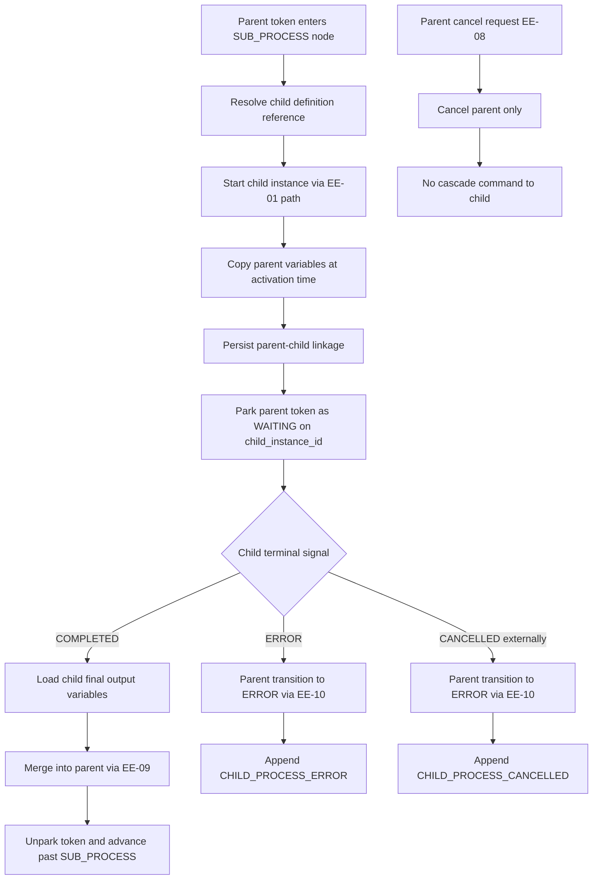
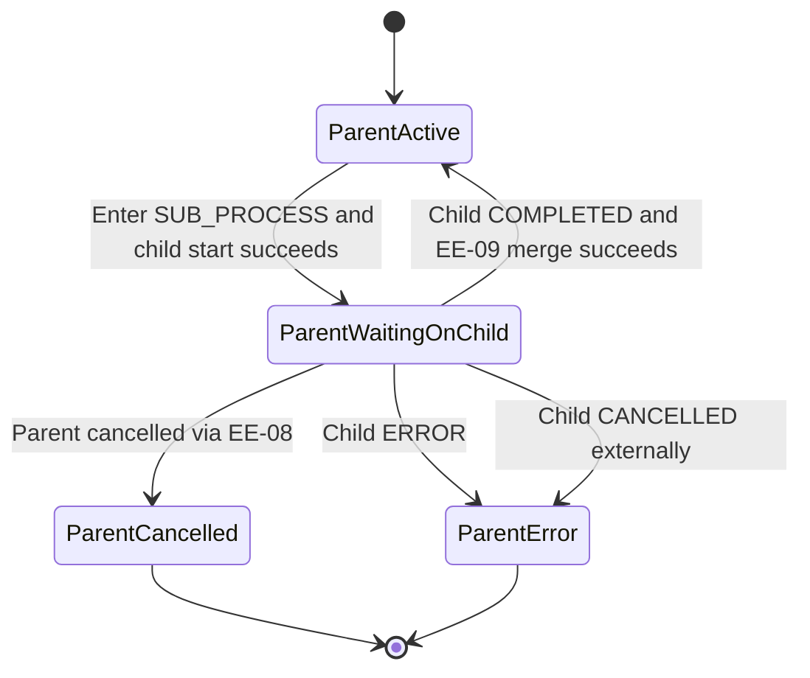

# Module: ext-05-sub-process-support

**Covers:** EXT-05 (Sub-process support)
**Related:** EE-01 (start instance + definition snapshot), EE-08 (instance cancellation), EE-09 (variable merge policy), EE-10 (execution error handling), PD-05 (node model)
**Primary design targets:** src/definition/graph.zig, src/engine/transition.zig, src/engine/instance.zig, src/event_store/store.zig, src/api/routes/instances.zig

## Module purpose

EXT-05 adds deterministic parent-child process orchestration for the SUB_PROCESS node type. When a parent token reaches SUB_PROCESS, the engine starts a child instance from a referenced definition and parks the parent token in a WAITING state until the child reaches a terminal status. Child completion resumes parent execution with EE-09 variable merge semantics; child ERROR and external child cancellation propagate to parent ERROR via typed events. Parent cancellation remains isolated and does not cascade to child. Child execution stability is guaranteed by reusing EE-01 snapshot-at-start behavior for the child instance.

## Public interface

### Definition model addition

```zig
pub const NodeType = enum {
    START,
    END,
    HUMAN_TASK,
    SERVICE_TASK,
    EXCLUSIVE_GATEWAY,
    PARALLEL_GATEWAY,
    TIMER,
    SUB_PROCESS,
};

pub const SubProcessAttributes = struct {
    // Target child process definition (resolved at activation time).
    child_definition_id: []const u8,
};
```

Validation contract:
1. SUB_PROCESS nodes must provide a non-empty child definition reference.
2. Referenced definition must be ACTIVE at child start time (same rule as EE-01).
3. SUB_PROCESS timeout configuration is not accepted for EXT-05.

### Parent-child linkage model

```zig
pub const ParentWaitingReason = enum {
    SUB_PROCESS_CHILD,
};

pub const WaitingToken = struct {
    parent_instance_id: Uuid,
    parent_token_branch_id: []const u8,
    sub_process_node_id: []const u8,
    child_instance_id: Uuid,
    waiting_reason: ParentWaitingReason,
};

pub const ChildLifecycleSignal = union(enum) {
    child_completed: struct {
        child_instance_id: Uuid,
        parent_instance_id: Uuid,
        child_output_variables: std.json.ObjectMap,
    },
    child_error: struct {
        child_instance_id: Uuid,
        parent_instance_id: Uuid,
        reason: []const u8,
    },
    child_cancelled: struct {
        child_instance_id: Uuid,
        parent_instance_id: Uuid,
        reason: []const u8,
    },
};
```

Contract:
1. Parent instance lifecycle status remains ACTIVE while waiting; WAITING is token-level, not instance-level.
2. Exactly one WAITING token exists per active SUB_PROCESS execution path.
3. Parent-child linkage is durable and queryable by child_instance_id and parent_instance_id.

### Event contracts (required payload fields)

```zig
pub const ChildProcessErrorPayload = struct {
    event_type: []const u8, // "CHILD_PROCESS_ERROR"
    parent_instance_id: Uuid,
    child_instance_id: Uuid,
    parent_node_id: []const u8,
    child_status: []const u8, // "ERROR"
    reason: []const u8,
    variable_state: []const u8,
};

pub const ChildProcessCancelledPayload = struct {
    event_type: []const u8, // "CHILD_PROCESS_CANCELLED"
    parent_instance_id: Uuid,
    child_instance_id: Uuid,
    parent_node_id: []const u8,
    child_status: []const u8, // "CANCELLED"
    reason: []const u8,
    variable_state: []const u8,
};
```

Required payload guarantees:
1. Both CHILD_PROCESS_ERROR and CHILD_PROCESS_CANCELLED must include child_instance_id and parent_instance_id.
2. Payload must include parent_node_id (the SUB_PROCESS node) for diagnosis.
3. Payload must include a reason and parent variable snapshot at failure propagation time.

## Data flow diagram



## Engine ordering constraints

### A) SUB_PROCESS activation (parent -> waiting + child start)

Normative order:
1. Parent token reaches SUB_PROCESS in pure transition path.
2. Runtime layer resolves child definition and validates ACTIVE status (EE-01 semantics).
3. Runtime layer deep-copies parent variables at this exact activation point.
4. Runtime layer starts child instance using EE-01 start path with copied variables.
5. Runtime layer persists parent-child linkage and marks parent token WAITING on child_instance_id.
6. Runtime layer appends parent-side activation event for traceability.

Atomicity requirement:
- Steps 4-6 must be committed together so parent cannot be WAITING without a durable child instance and linkage.

### B) Child completion propagation (child -> parent continue)

Normative order:
1. Detect child terminal COMPLETED signal.
2. Confirm parent instance still ACTIVE and token still WAITING on this child.
3. Load child output variable object.
4. Merge child output into parent via EE-09 (including overwrite events and schema checks).
5. If merge succeeds, unpark parent token and advance to next node.
6. Commit merged variables, token movement, and completion propagation event atomically.

### C) Child failure/cancellation propagation (child -> parent error)

Normative order:
1. Detect child terminal ERROR or external CANCELLED signal.
2. Confirm waiting parent linkage still active.
3. Transition parent instance to ERROR using EE-10 mechanism.
4. Append CHILD_PROCESS_ERROR or CHILD_PROCESS_CANCELLED payload with required fields.
5. Halt parent progression until operator action per OBS-05/EE-10.

## Variable handoff rules

### Copy-on-start
1. Child receives a deep copy of parent variable map at SUB_PROCESS activation.
2. Copy is immutable with respect to parent: child mutations never mutate parent during child execution.

### Merge-on-child-complete via EE-09
1. On child COMPLETED, child output variables are merged into parent using EE-09 rules.
2. Existing key overwrite must emit VARIABLE_OVERWRITTEN where applicable.
3. Schema violation during this merge is treated as EE-10 error path (parent becomes ERROR).
4. Empty child output object is a no-op merge and parent still advances.

## Persistence touchpoints

1. Parent-child linkage persistence:
   - Durable mapping between parent_instance_id, child_instance_id, parent_token_branch_id, sub_process_node_id, and waiting state.
2. Parent waiting token persistence:
   - Parent token state includes WAITING metadata and child_instance_id reference.
3. Child start persistence:
   - Child instance creation and child definition snapshot capture reuse EE-01 persistence flow.
4. Child terminal propagation persistence:
   - Parent variable merge (if completed path), status changes (if error/cancelled path), and propagation events are transactional.

Note: This design defines required persisted facts and transaction boundaries; concrete table/column migration choices are delegated to BACKEND-DEV migration implementation.

## Error taxonomy

| Error case | Trigger | Required behavior | EE-10 mapping |
|---|---|---|---|
| Child definition not ACTIVE or not found at activation | SUB_PROCESS attempts child start against invalid definition | Parent does not enter WAITING; activation fails and parent transitions to ERROR | EXECUTION_ERROR with definition resolution cause |
| Child instance start persistence failure | EE-01 child start path fails mid-transaction | Roll back parent waiting transition; no orphan WAITING parent | Persistence failure, no partial linkage |
| Child output merge schema violation | Child COMPLETED but merge to parent fails EE-09 schema check | Parent transitions to ERROR; no partial merge | EXECUTION_ERROR / SCHEMA_VIOLATION |
| Child transitions to ERROR | Child terminal status is ERROR | Parent transitions to ERROR and appends CHILD_PROCESS_ERROR | CHILD_PROCESS_ERROR payload + ERROR status |
| Child cancelled externally | Child terminal status is CANCELLED by external action | Parent transitions to ERROR and appends CHILD_PROCESS_CANCELLED | CHILD_PROCESS_CANCELLED payload + ERROR status |
| Parent cancellation while waiting | Parent receives EE-08 cancel during child run | Parent cancels; child keeps running independently | Not an error; explicit non-cascade behavior |

## State transitions



## Dependencies and module boundaries

### Depends on
1. src/engine/instance.zig: child start orchestration, parent-child linkage persistence, propagation handlers.
2. src/engine/transition.zig: token-level WAITING semantics and SUB_PROCESS entry/exit flow in pure transition logic.
3. src/definition/graph.zig: SUB_PROCESS node typing and attribute parsing.
4. src/event_store/store.zig: append propagation events and retrieval hooks for child terminal detection.
5. src/api/routes/instances.zig: maintain EE-08 parent cancellation semantics without child cascade.

### Must not depend on
1. Any child-cancel side effect in parent cancel path (explicitly forbidden in EXT-05).
2. Runtime mutation of child definition snapshot after child start.
3. Implicit variable sharing references between parent and child maps.

## Child definition snapshot stability

1. Child start reuses EE-01, which captures a definition snapshot atomically at child instance creation.
2. If source definition is deprecated/changed after child start, child execution continues against captured snapshot.
3. Parent propagation logic must not reload updated definition for an already-started child.

## Requirement traceability matrix

| EXT-05 requirement / edge case | Design section(s) | Module touchpoints | Required tests |
|---|---|---|---|
| AC1: SUB_PROCESS starts child and parent token enters WAITING | Public interface (linkage model), ordering A, state transitions | src/engine/transition.zig, src/engine/instance.zig | Unit: sub_process_entry_sets_waiting_token_test; Integration: sub_process_activation_starts_child_and_parents_wait_test |
| AC2: child inherits copy of parent variables; no shared mutation | Variable handoff copy-on-start | src/engine/instance.zig | Unit: child_variable_copy_isolation_test; Integration: child_mutation_does_not_change_parent_until_completion_test |
| AC3: child COMPLETED advances parent and merges output via EE-09 | ordering B, variable handoff merge-on-child-complete | src/engine/instance.zig, src/engine/transition.zig | Unit: child_complete_merges_via_ee09_test; Integration: parent_advances_after_child_completion_with_merged_variables_test |
| AC4: child ERROR propagates parent ERROR + CHILD_PROCESS_ERROR payload | event contracts, ordering C, error taxonomy | src/engine/instance.zig, src/event_store/store.zig | Unit: child_error_maps_to_parent_error_payload_contract_test; Integration: parent_enters_error_on_child_error_test |
| AC5: child CANCELLED externally propagates parent ERROR + CHILD_PROCESS_CANCELLED payload | event contracts, ordering C, error taxonomy | src/engine/instance.zig, src/event_store/store.zig | Unit: child_cancel_maps_to_parent_error_payload_contract_test; Integration: parent_enters_error_on_child_external_cancel_test |
| AC6: parent cancel does not cascade to child | ordering C, error taxonomy, dependencies must-not | src/api/routes/instances.zig, src/engine/instance.zig | Unit: parent_cancel_does_not_emit_child_cancel_command_test; Integration: child_continues_after_parent_cancel_test |
| Edge: child definition deprecated after start uses snapshot captured at start | child definition snapshot stability | src/engine/instance.zig, src/definition/snapshot.zig | Unit: child_uses_start_time_snapshot_test; Integration: child_runs_to_completion_after_definition_deprecation_test |
| Edge: parent cancelled while child waiting on its own sub-process | ordering C + non-cascade | src/engine/instance.zig | Integration: nested_child_wait_parent_cancel_no_cascade_test |
| Required payload fields include child_instance_id and parent_instance_id | event contracts | src/event_store/store.zig | Unit: child_error_payload_requires_parent_and_child_ids_test; Unit: child_cancel_payload_requires_parent_and_child_ids_test |

## Required unit and integration scope

### Unit tests
1. WAITING token creation and linkage integrity.
2. Deep-copy variable isolation semantics.
3. EE-09 merge invocation on child completion.
4. CHILD_PROCESS_ERROR payload shape validation.
5. CHILD_PROCESS_CANCELLED payload shape validation.
6. Parent cancel non-cascade invariant.

### Integration tests
1. End-to-end parent waits, child completes, parent resumes.
2. Child error propagation to parent ERROR with event payload assertions.
3. Child external cancellation propagation to parent ERROR with event payload assertions.
4. Parent cancellation while waiting leaves child active.
5. Definition deprecation after child start does not alter child execution snapshot.

## Open questions

1. Child "output variables" source on completion should be confirmed: full child final variable map versus explicit completion payload subset.
2. If parent is already terminal when a delayed child terminal signal arrives, confirm whether signal is ignored or logged as diagnostic-only event.
3. Correlation-key policy for child starts is inherited from EE-01; confirm whether child starts should always be keyless unless explicitly configured in SUB_PROCESS attributes.
