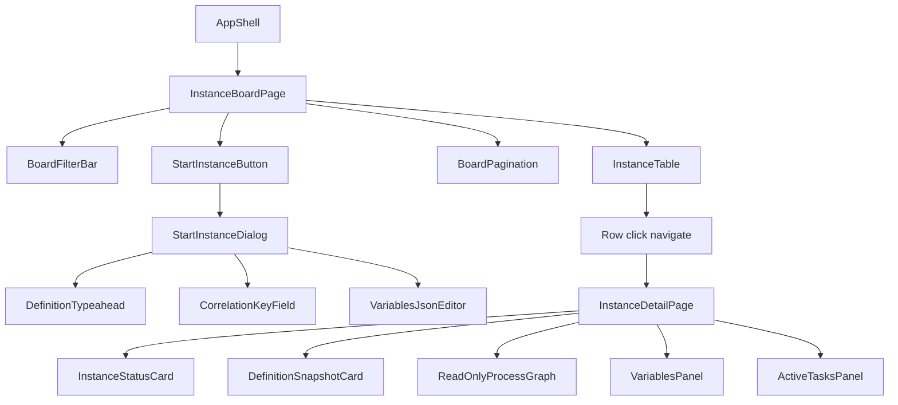
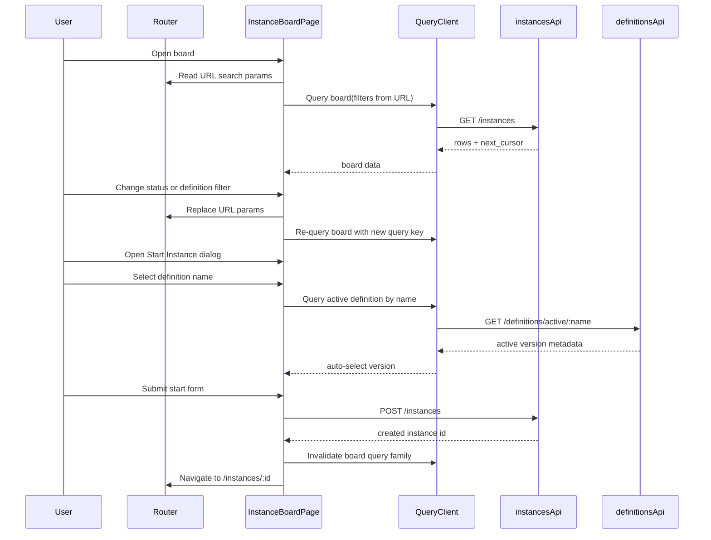

# F3 Instance Monitoring UI Design

## Scope
This design covers Stage F3 batch 1 frontend requirements IN-UI-01, IN-UI-02, IN-UI-03, and IN-UI-04.

## Classification (Lego Catalog)

| Requirement | Selected Type | Rationale |
|---|---|---|
| IN-UI-01 (Instance list) | Type E | The list itself is standard, but it is tightly coupled to route-driven state, cross-page navigation, and detail integration behavior that exceeds a plain list-page template. |
| IN-UI-02 (Status and definition filters) | Type E | Requires URL-persisted multi-select status and definition typeahead coordination with query-cache keys; this is custom interaction logic, not a basic filter form. |
| IN-UI-03 (Start instance flow) | Type E | Requires definition lookup by name with active-version auto-selection and JSON editor input semantics, which are outside the standard list-page create form template. |
| IN-UI-04 (Instance detail view) | Type E | Requires read-only graph rendering with active token highlighting, variable map rendering, and active-task composition from instance detail payload. |

## Module Purpose
The F3 instance monitoring UI module provides a single operational surface for browsing instances, narrowing the list by status and definition, starting new instances from active definitions, and inspecting execution state on a dedicated detail page. The design prioritizes deterministic URL-driven state, stable query-key based caching, and predictable error handling so operators can refresh, deep-link, and recover from transient API failures without losing context.

## Public Interface

### Route interfaces

```typescript
export interface InstanceBoardRouteSearch {
  status?: string[];
  definitionName?: string;
  cursor?: string;
  pageSize?: number;
}

export interface InstanceDetailRouteParams {
  ```

  ```typescript
  instanceId: string;
}
```

### API-facing view models

```typescript
export type InstanceStatus =
  | "RUNNING"
  ```
  | "WAITING"
  ```typescript
  | "COMPLETED"
  | "FAILED"
  | "CANCELLED";

export interface InstanceListRow {
  id: string;
  ```
  definitionName: string;
  ```typescript
  definitionVersion: string;
  status: InstanceStatus;
  correlationKey: string | null;
  startedAt: string;
  updatedAt: string;
}

export interface StartInstanceFormModel {
  definitionName: string;
  definitionVersion: string;
  correlationKey?: string;
  variablesJson: string;
}

export interface InstanceDetailViewModel {
  id: string;
  status: InstanceStatus;
  definitionId: string;
  definitionName: string;
  definitionVersion: string;
  ```
  definitionSnapshot: {
    nodes: unknown[];
    edges: unknown[];
  };
  activeTokenNodeIds: string[];
  variables: Record<string, unknown>;
  activeTasks: Array<{
    taskId: string;
    nodeId: string;
    name: string;
    assignee?: string | null;
    createdAt: string;
  }>;
}
```

### Query key contracts

```typescript
export interface InstanceQueryKeys {
  board: (filters: {
    status?: string[];
    definitionName?: string;
    cursor?: string;
    pageSize?: number;
  }) => readonly unknown[];
  detail: (instanceId: string) => readonly unknown[];
  definitionActiveByName: (definitionName: string) => readonly unknown[];
}
```

### Hook contracts

```typescript
export interface UseInstanceBoardResult {
  rows: InstanceListRow[];
  nextCursor: string | null;
  isLoading: boolean;
  isError: boolean;
  errorCode?: string;
}

export interface UseStartInstanceResult {
  submit: (payload: StartInstanceFormModel) => Promise<{ instanceId: string }>;
  isSubmitting: boolean;
  submitErrorCode?: string;
}

export interface UseInstanceDetailResult {
  detail?: InstanceDetailViewModel;
  isLoading: boolean;
  isError: boolean;
  errorCode?: string;
}
```

## Component Hierarchy



## Data Flow



## State and Query Model

- Board page state is URL-first: `status`, `definitionName`, `cursor`, and `pageSize` are the route source of truth.
- Table query keys are derived from canonicalized URL state; query key generation must not depend on mutable object identity.
- Start dialog local state is form-managed and isolated from board filters.
- Definition active-version lookup is enabled only when `definitionName` is non-empty.
- On successful start, board list queries are invalidated and navigation proceeds to detail view.
- Detail page uses `instanceId` route param as its only key input.

## Error Taxonomy

| Error case | Source | UX behavior | Recovery |
|---|---|---|---|
| Unauthorized | client auth interceptor | Redirect to login, preserve intended path | Re-authenticate and return |
| Forbidden | GET /instances or GET /instances/:id | Show access-denied page state; hide restricted actions | Request proper role |
| Validation error on start | POST /instances | Inline field error summary plus dialog-level message | Correct form values and resubmit |
| Definition not found/active lookup miss | GET /definitions/active/:name | Non-blocking field error on definition selector | Pick an existing definition name |
| Not found (instance) | GET /instances/:id | Detail page not-found state with back-to-board action | Return to list |
| Rate limited | any endpoint | Toast with retry hint; keep current UI state | Retry after delay |
| Network or timeout | any endpoint | Non-destructive error banner; retain current filters and form content | Manual retry |

## State Transitions

### Board page

| Current state | Event | Next state |
|---|---|---|
| Initializing | URL parsed | LoadingList |
| LoadingList | List success | Ready |
| LoadingList | List error | ListError |
| Ready | Filter changed | LoadingList |
| Ready | Start dialog open | StartingInstance |
| StartingInstance | Start success | NavigatingToDetail |
| StartingInstance | Start validation/API error | ReadyWithStartError |

### Detail page

| Current state | Event | Next state |
|---|---|---|
| Initializing | Route param available | LoadingDetail |
| LoadingDetail | Detail success | DetailReady |
| LoadingDetail | 404 | DetailNotFound |
| LoadingDetail | Other error | DetailError |

## Dependencies

### Direct dependencies
- web/src/api/client.ts for auth-aware request behavior and normalized API errors.
- web/src/api/instances.ts for list, start, and detail operations.
- web/src/api/definitions.ts for active definition resolution by name.
- web/src/api/queryKeys.ts for query key factories.
- TanStack Query for server-state lifecycle and invalidation.
- React Router for URL search-param persistence and detail navigation.
- React Hook Form plus Zod for start dialog schema and validation.
- Existing read-only process graph component from the canvas module for detail visualization.

### Must-not dependencies
- No direct fetch or axios calls from pages or components.
- No global mutable singleton for board filters outside router/query state.
- No write-capable canvas editing APIs in detail view graph integration.

## Requirement Coverage Mapping

| Requirement | Covered design sections |
|---|---|
| IN-UI-01 | Component hierarchy, Public interface (InstanceListRow), Data flow, State and query model |
| IN-UI-02 | Classification, Route interfaces, State and query model, Error taxonomy |
| IN-UI-03 | Public interface (StartInstanceFormModel), Component hierarchy (dialog), Data flow, Error taxonomy |
| IN-UI-04 | Public interface (InstanceDetailViewModel), Component hierarchy (detail), State transitions (detail), Dependencies |

## Open Questions

1. IN-UI-02 references definition-name typeahead while the API notes `definition_id` filtering. Confirm whether frontend should map name to id client-side before list query, or whether backend must also support direct name filtering.
2. IN-UI-04 mentions active token highlighting on a read-only graph. Confirm whether token positions are provided as node IDs only, or whether edge-level highlighting is required in this batch.
3. IN-UI-03 says active version auto-selected by definition name. Confirm behavior when there is no active version: block submit vs allow explicit version override.
4. IN-UI-04 references history and timeline tabs in adjacent requirements. Confirm whether this batch should reserve tab layout placeholders now or defer tab container creation to IN-UI-05/06 implementation.
