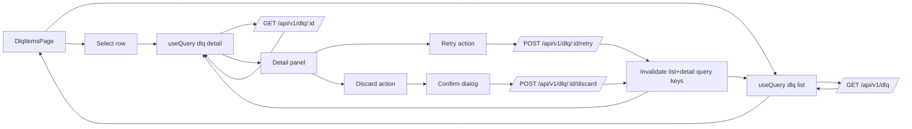

# F6 DLQ UI Batch 1 Design (DLQ-UI-01..04)

## Module purpose
This module defines the frontend interaction design for the Dead Letter Queue list and item handling flow in Stage F6 batch 1. The design combines a generated Type B list-page baseline with custom UI logic for row detail inspection, retry/discard operations, and synchronized list/detail updates so operators can triage failed work safely and quickly.

## Classification summary
- DLQ-UI-01: Type B (`templates/specs/dlq-items.list-page.yaml`)
- DLQ-UI-02: Type E (custom detail panel and payload rendering)
- DLQ-UI-03: Type E (retry mutation behavior and list/detail sync)
- DLQ-UI-04: Type E (discard confirmation policy with conditional warning)

## Public interface
### TypeScript interfaces
```ts
export type DlqStatus = 'pending' | 'retrying' | 'resolved' | 'discarded'

export interface DlqEntrySummary {
  id: string
  entry_type: 'event' | 'timer' | 'webhook' | string
  instance_id?: string
  reason: string
  retry_count: number
  status: DlqStatus
  created_at: string
}

export interface DlqRetryAttempt {
  attempt_no: number
  attempted_at: string
  outcome: 'success' | 'failed'
  error_message?: string
}

export interface DlqEntryDetail extends DlqEntrySummary {
  full_reason: string
  context_json: Record<string, unknown>
  source_payload: Record<string, unknown>
  retry_history: DlqRetryAttempt[]
}
```

### API client contract
```ts
export interface DlqApi {
  list(params?: {
    cursor?: string
    page_size?: number
    status?: string
    source_type?: string
    search?: string
  }): Promise<{ items: DlqEntrySummary[]; next_cursor?: string | null }>

  get(id: string): Promise<DlqEntryDetail>
  retry(id: string): Promise<DlqEntrySummary>
  discard(id: string): Promise<DlqEntrySummary>
}
```

### UI-level hook signatures
```ts
export interface UseDlqItemsResult {
  items: DlqEntrySummary[]
  isLoading: boolean
  error?: string
  selectItem: (id: string) => void
}

export interface UseDlqItemDetailResult {
  selectedId?: string
  detail?: DlqEntryDetail
  isLoading: boolean
  retrySelected: () => Promise<void>
  discardSelected: (opts: { confirmText: string }) => Promise<void>
}
```

## Data flow diagram


## State transitions
### Item status transition model
- `pending -> retrying` on successful retry API response.
- `pending -> discarded` on successful discard API response.
- `retrying -> resolved` occurs asynchronously from backend processing and is reflected by refresh/invalidation.
- `retrying -> pending` may occur if retry enqueue fails after transient transition; UI treats backend response as source of truth after refetch.

### Selection/detail panel state
- `none -> loading -> loaded` on row selection.
- `loaded -> loading` when selected row changes.
- `loaded -> stale -> refreshed` after retry/discard mutations.

## Error taxonomy
- `DlqListLoadFailed`: `GET /dlq` failed. Show non-blocking inline error and retry affordance.
- `DlqDetailLoadFailed`: `GET /dlq/:id` failed. Keep list visible and show panel-level error state.
- `DlqRetryFailed`: `POST /dlq/:id/retry` failed. Keep status unchanged and show action-level error.
- `DlqDiscardFailed`: `POST /dlq/:id/discard` failed. Keep status unchanged and show action-level error.
- `DlqDiscardConfirmRejected`: user canceled confirmation dialog; no mutation sent.
- `DlqPermissionDenied`: API returned 403 for retry/discard. Hide or remove unavailable actions after role resolution.
- `DlqNotFound`: API returned 404 for selected item. Clear selection and refetch list.

## Dependencies
### Calls into
- `web/src/api/dlq.ts` for list/detail/retry/discard requests.
- `web/src/api/queryKeys.ts` for `queryKeys.dlq.list()` and `queryKeys.dlq.detail(id)` key factory usage.
- `web/src/router.tsx` for route integration (`/dlq`).
- `web/src/pages/instances/*` route contract for instance link target from table/detail.

### Must not depend on
- Direct `fetch` or ad-hoc axios usage outside shared API client.
- Webhooks page logic (`/webhooks`) for DLQ item state handling.
- LocalStorage/sessionStorage persistence for transient selection state.

## Coverage matrix
- DLQ-UI-01: Type B spec defines paginated list shape and required columns.
- DLQ-UI-02: Type E detail panel contract defines full reason/context JSON/retry history/source payload.
- DLQ-UI-03: Type E retry mutation path and status synchronization model defines RETRYING transition and UI refresh semantics.
- DLQ-UI-04: Type E discard confirmation policy includes conditional warning when item has active `instance_id` link.

## Open questions
- Does `GET /api/v1/dlq/:id` return retry history and source payload in a single response, or must the frontend call a dedicated attempts endpoint?
- How should the frontend determine "active instance" for discard warning: presence of `instance_id`, or a backend-supplied boolean such as `will_cancel_instance`?
- Should retry/discard actions be visible to both `PROCESS_OPERATOR` and `PLATFORM_ADMIN` in all environments, or should backend capability metadata drive visibility?
