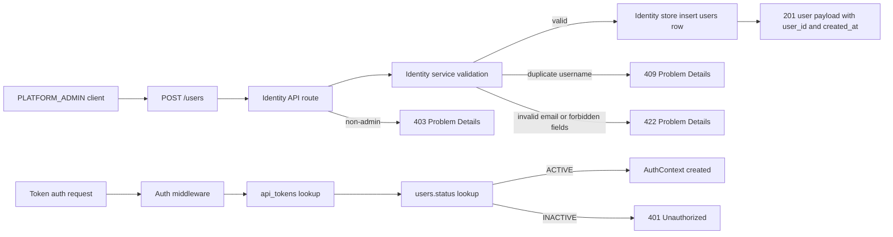
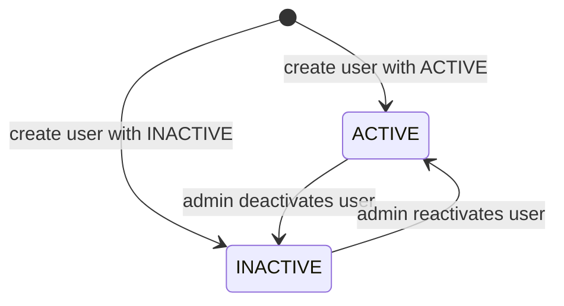

# Module: idn-01-user-registry

**Covers:** IDN-01 (User registry)
**Related:** API-08 (Bearer token auth), IDN-04 (token-user relation), API user management mapping (`POST /users`, `PUT /users/:id`)
**Design scope:** identity user creation and status lifecycle rules that affect authentication

## Module purpose

The identity user registry module provides the canonical user record used by audit and task assignment references, and exposes a programmatic API for PLATFORM_ADMIN callers to create users with platform-assigned identifiers. This module enforces user invariants (`username` uniqueness, email format validity, server-assigned `user_id` and `created_at`) and defines status lifecycle semantics (`ACTIVE` and `INACTIVE`). It also defines the required integration contract with authentication so tokens associated with INACTIVE users are rejected as HTTP 401.

## Module boundaries

- Identity store (`src/identity/registry.zig`): persistence access, uniqueness handling, and status reads/writes.
- Identity service (`src/identity/service.zig`): validation, invariant enforcement, and domain error mapping.
- Identity API route (`src/api/routes/identity.zig`): HTTP request/response contract for create-user and update-user status.
- Auth integration (`src/api/middleware/auth.zig`): token validation must include user status check and emit 401 for INACTIVE users.

Out of scope for this module:
- Human login/password/SSO flows.
- Token issuance lifecycle details (covered by token module).
- Group and role membership modeling (covered by IDN-02 and IDN-03).

## Public interface

### Zig domain types

```zig
pub const UserStatus = enum {
    ACTIVE,
    INACTIVE,
};

pub const User = struct {
    user_id: [16]u8,          // UUID v4, platform-assigned
    username: []const u8,     // unique, immutable after creation unless future requirement adds rename
    display_name: []const u8,
    email: []const u8,        // validated email format
    status: UserStatus,
    created_at_us: i64,       // UTC epoch microseconds, platform-assigned
};

pub const CreateUserInput = struct {
    username: []const u8,
    display_name: []const u8,
    email: []const u8,
    status: UserStatus,
};

pub const UpdateUserStatusInput = struct {
    user_id: [16]u8,
    status: UserStatus,
};

pub const IdentityError = error{
    DuplicateUsername,
    InvalidEmail,
    CallerProvidedUserId,
    Forbidden,
    NotFound,
    PoolExhausted,
    PersistenceFailed,
    OutOfMemory,
};
```

### Zig service/store signatures

```zig
pub fn createUser(
    allocator: std.mem.Allocator,
    actor: AuthContext,
    input: CreateUserInput,
) IdentityError!User;

pub fn updateUserStatus(
    allocator: std.mem.Allocator,
    actor: AuthContext,
    input: UpdateUserStatusInput,
) IdentityError!User;

pub fn getUserById(
    allocator: std.mem.Allocator,
    user_id: [16]u8,
) IdentityError!?User;

pub fn getUserStatusById(
    allocator: std.mem.Allocator,
    user_id: [16]u8,
) IdentityError!?UserStatus;
```

### HTTP API contract

#### `POST /users` (create user)

- AuthZ: caller role must be `PLATFORM_ADMIN`.
- Request body schema:

```json
{
  "username": "string, required, 1..255",
  "display_name": "string, required, 1..255",
  "email": "string, required, RFC 5322-lite format",
  "status": "ACTIVE | INACTIVE"
}
```

- Forbidden input fields: `user_id`, `created_at`.
- Response `201 Created` body schema:

```json
{
  "user_id": "uuid",
  "username": "string",
  "display_name": "string",
  "email": "string",
  "status": "ACTIVE | INACTIVE",
  "created_at": "RFC3339 UTC timestamp"
}
```

- Error mapping:
  - Duplicate `username` -> `409 Conflict` (Problem Details).
  - Invalid `email` format -> `422 Unprocessable Entity`.
  - Caller provides `user_id` or `created_at` -> `422 Unprocessable Entity`.
  - Non-admin caller -> `403 Forbidden`.

#### `PUT /users/:id` (status update contract needed for INACTIVE auth behavior)

- Supported mutable field in IDN-01 scope: `status`.
- `ACTIVE <-> INACTIVE` transitions allowed.
- Successful update returns `200 OK` with full user payload.

## Data types and invariants

- `user_id`:
  - Generated by platform as UUID v4 at creation time.
  - Never accepted from callers.
  - Immutable after creation.
- `username`:
  - Globally unique, case-sensitive unless a later requirement states normalization.
  - Non-empty and bounded length.
- `display_name`:
  - Required at creation time.
- `email`:
  - Must pass email validator before persistence.
  - Stored as submitted; normalization policy deferred.
- `status`:
  - Enum constrained to `ACTIVE` or `INACTIVE`.
  - `INACTIVE` creation is permitted.
- `created_at`:
  - Assigned by platform at persistence commit time (UTC).
  - Immutable and always returned in create response.
- Deletion:
  - Not supported; deactivation uses `status = INACTIVE`.

## Data flow



## State transitions

User status lifecycle:



Auth effect invariant:
- If `users.status = INACTIVE`, any token-authenticated request for that user must fail with HTTP 401.

## Error taxonomy

| Domain condition | Domain error | HTTP status | Notes |
|---|---|---:|---|
| Duplicate `username` on create | `DuplicateUsername` | 409 | Enforced by DB unique constraint and surfaced deterministically |
| Invalid email format | `InvalidEmail` | 422 | Validation before insert |
| Caller supplies `user_id` in create body | `CallerProvidedUserId` | 422 | Explicitly forbidden by contract |
| Caller lacks admin role | `Forbidden` | 403 | Route-level RBAC check |
| User not found on status update | `NotFound` | 404 | For `PUT /users/:id` |
| User INACTIVE during auth | `Unauthorized` (auth module) | 401 | Required by IDN-01 AC |
| DB pool exhausted | `PoolExhausted` | 503 | Shared platform mapping |
| Unexpected persistence fault | `PersistenceFailed` | 500 | Internal error |

## Dependencies

Internal modules:
- `src/identity/registry.zig`
- `src/identity/service.zig`
- `src/api/routes/identity.zig`
- `src/api/middleware/auth.zig`
- `src/api/errors.zig`

Database tables:
- `users` (new or extended in identity migration)
- `api_tokens` (existing; joined to users for status check)

Must not depend on:
- `src/engine/transition.zig` (pure execution logic only)
- UI/frontend modules

## SQL migration impact

Migration impact is required and additive.

- Create or confirm `users` table with columns:
  - `user_id UUID PRIMARY KEY`
  - `username TEXT NOT NULL UNIQUE`
  - `display_name TEXT NOT NULL`
  - `email TEXT NOT NULL`
  - `status TEXT NOT NULL CHECK (status IN ('ACTIVE','INACTIVE'))`
  - `created_at TIMESTAMPTZ NOT NULL DEFAULT NOW()`
- Add index to support auth status checks:
  - `CREATE INDEX IF NOT EXISTS idx_users_status ON users(status);`
- Ensure `api_tokens.user_id` references `users.user_id` (FK already expected in identity schema).
- No destructive schema changes.

Rationale:
- Unique username and status constraints are guaranteed at DB level.
- Auth path needs low-latency status lookup by `user_id`; PK lookup is sufficient, status index is optional optimization for admin/user-list queries.

## Traceability (IDN-01 acceptance criteria -> design elements)

| IDN-01 acceptance criterion | Design element(s) |
|---|---|
| Admin create returns 201 with platform `user_id` and `created_at` | `POST /users` contract, `User` type, create flow, platform-assigned invariants |
| Username unique, duplicate -> 409 | `users.username UNIQUE`, `DuplicateUsername` mapping in error taxonomy |
| Invalid email -> 422 | `CreateUserInput` validation and `InvalidEmail` mapping |
| INACTIVE user token auth -> 401 | Auth integration boundary, data flow auth branch, auth effect invariant |
| Caller must not specify `user_id` | Forbidden field rule in `POST /users`, `CallerProvidedUserId` error mapping |
| INACTIVE creation allowed, delete unsupported | Status lifecycle diagram and invariants section |

## Open questions

1. Email normalization policy is unspecified (case folding and trimming). Current design validates format only and stores as submitted.
2. Username case-sensitivity policy is unspecified. Current design uses direct uniqueness as stored.
3. `PUT /users/:id` partial update shape beyond `status` is not specified in IDN-01; this design limits IDN-01 behavior to status changes for auth integration.
