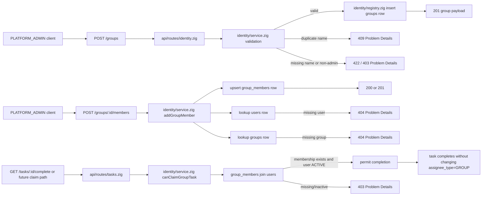
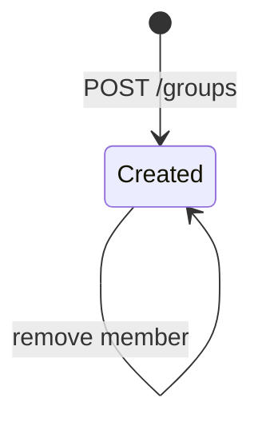
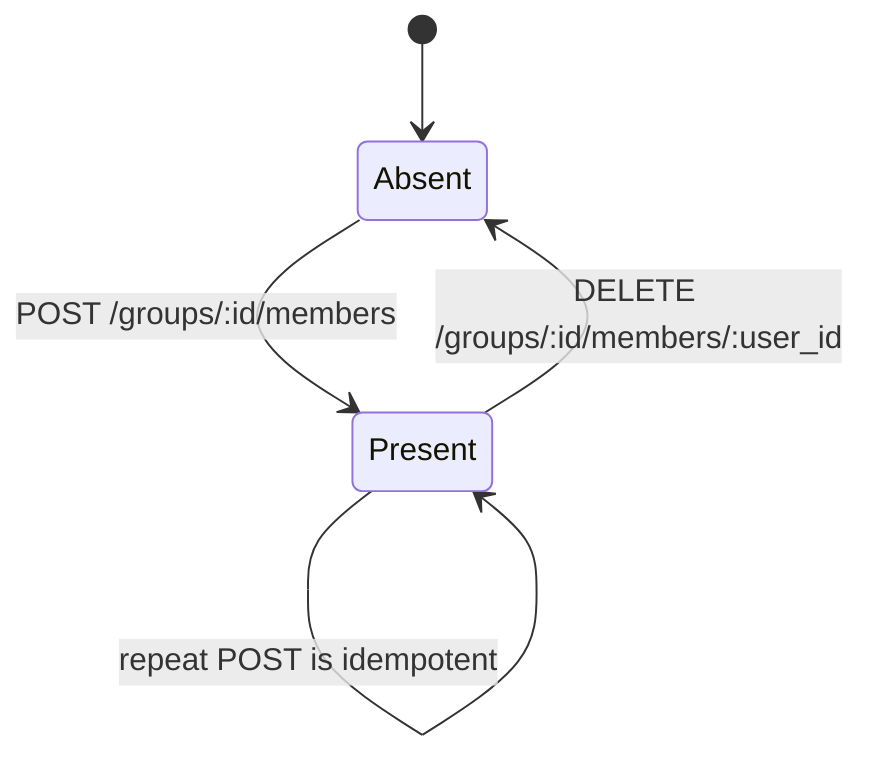

# Module: idn-02-group-management

**Covers:** IDN-02 (Group management), IDN-03 (task access control when `assignee_type = GROUP`)
**Files:** `src/identity/registry.zig`, `src/identity/service.zig`, `src/api/routes/identity.zig`, `src/api/routes/tasks.zig`, `src/tasks/manager.zig`
**Depends on:** `src/api/errors.zig`, `src/api/middleware/auth.zig`, `src/api/middleware/rbac.zig`, `src/identity/registry.zig`, `src/identity/service.zig`, `src/tasks/manager.zig`, `migrations/008_identity.sql`, future identity-group migration file

## Module purpose

The group-management module provides the canonical group registry and membership join model used by task assignment and task completion authorisation. It lets PLATFORM_ADMIN callers create unique named groups, add and remove users from groups idempotently, and page through group members. It also defines the runtime contract used by task completion logic so a HUMAN_TASK assigned to a group can be claimed and completed by any ACTIVE member of that group without mutating the task assignment itself.

## Module boundaries

- Identity registry (`src/identity/registry.zig`): owns persistence for `groups` and `group_members`, uniqueness handling, and membership lookups.
- Identity service (`src/identity/service.zig`): owns validation, authorisation, idempotency semantics, pagination cursor rules, and task-claim eligibility checks.
- Identity routes (`src/api/routes/identity.zig`): expose group create, add-member, list-members, and remove-member endpoints.
- Task completion flow (`src/api/routes/tasks.zig` and `src/tasks/manager.zig`): consults the identity service before allowing a GROUP-assigned task to be completed.

Out of scope for this module:
- Role assignment or role permission changes.
- User lifecycle rules beyond the existing IDN-01 active/inactive status check.
- Task assignment mutation for USER or ROLE assignees.
- Group deletion or soft-delete lifecycle.

## Public interface

### Zig domain types

```zig
pub const Group = struct {
    group_id: []const u8,   // UUID v4, platform-assigned
    name: []const u8,       // unique, human-readable, immutable after create
    created_at: []const u8, // UTC timestamp string
};

pub const GroupMember = struct {
    group_id: []const u8,
    user_id: []const u8,
    added_at: []const u8, // UTC timestamp string, used for pagination and auditing
};

pub const CreateGroupInput = struct {
    name: []const u8,
};

pub const AddGroupMemberInput = struct {
    group_id: []const u8,
    user_id: []const u8,
};

pub const RemoveGroupMemberInput = struct {
    group_id: []const u8,
    user_id: []const u8,
};

pub const ListGroupMembersParams = struct {
    cursor: ?[]const u8,
    page_size: u16,
};

pub const GroupMemberPage = struct {
    items: []UserSummary,
    next_cursor: ?[]const u8,
    count: usize,
};

pub const UserSummary = struct {
    user_id: []const u8,
    username: []const u8,
    display_name: []const u8,
    email: []const u8,
    status: UserStatus,
    created_at: []const u8,
};

pub const GroupError = error{
    Forbidden,
    ValidationFailed,
    DuplicateGroupName,
    GroupNotFound,
    UserNotFound,
    InvalidCursor,
    CursorExpired,
    PoolExhausted,
    PersistenceFailed,
    OutOfMemory,
};
```

### Zig service/store signatures

```zig
pub fn createGroup(
    allocator: std.mem.Allocator,
    actor: AuthContext,
    input: CreateGroupInput,
) GroupError!Group;

pub fn addGroupMember(
    allocator: std.mem.Allocator,
    actor: AuthContext,
    input: AddGroupMemberInput,
) GroupError!struct {
    member: GroupMember,
    created: bool,
};

pub fn removeGroupMember(
    allocator: std.mem.Allocator,
    actor: AuthContext,
    input: RemoveGroupMemberInput,
) GroupError!void;

pub fn listGroupMembers(
    allocator: std.mem.Allocator,
    group_id: []const u8,
    params: ListGroupMembersParams,
) GroupError!GroupMemberPage;

/// Returns true only when the user exists, is ACTIVE, and currently belongs to the group.
pub fn canClaimGroupTask(
    allocator: std.mem.Allocator,
    group_id: []const u8,
    user_id: []const u8,
) GroupError!bool;
```

### HTTP API contract

#### `POST /groups`

- AuthZ: PLATFORM_ADMIN.
- Request body schema:

```json
{
  "name": "string, required, non-empty"
}
```

- Response `201 Created` body schema:

```json
{
  "group_id": "uuid",
  "name": "string",
  "created_at": "RFC3339 UTC timestamp"
}
```

- Error mapping:
  - Duplicate `name` -> `409 Conflict`.
  - Missing/empty `name` -> `422 Unprocessable Entity`.
  - Non-admin caller -> `403 Forbidden`.

#### `POST /groups/:id/members`

- AuthZ: PLATFORM_ADMIN.
- Request body schema:

```json
{
  "user_id": "uuid, required"
}
```

- Semantics:
  - If the group does not exist -> `404 Not Found`.
  - If the user does not exist -> `404 Not Found`.
  - If the membership is new -> `201 Created`.
  - If the membership already exists -> `200 OK` and no duplicate row is created.

#### `GET /groups/:id/members`

- AuthZ: PLATFORM_ADMIN unless the Stage 5 permission matrix broadens read access later.
- Response `200 OK` body schema:

```json
{
  "items": [
    {
      "user_id": "uuid",
      "username": "string",
      "display_name": "string",
      "email": "string",
      "status": "ACTIVE | INACTIVE",
      "created_at": "RFC3339 UTC timestamp"
    }
  ],
  "next_cursor": "opaque base64url cursor or null",
  "count": 0
}
```

#### `DELETE /groups/:id/members/:user_id`

- AuthZ: PLATFORM_ADMIN.
- Semantics: idempotent removal; returns `204 No Content` whether the membership existed or not.
- Removing a membership does not rewrite or cancel any task that was already assigned to the group.

## Data types and invariants

- `group_id`:
  - Platform-assigned UUID v4.
  - Never caller-supplied.
  - Immutable after creation.
- `name`:
  - Unique across all groups.
  - Non-empty and treated as the canonical display name for the group reference used by task assignment.
  - Stored exactly as submitted unless a later requirement introduces normalisation.
- `group_members`:
  - Join table with one row per `(group_id, user_id)` pair.
  - Duplicate inserts are idempotent and must not create duplicate rows.
  - Removal deletes only the join row; it does not mutate tasks or users.
- `UserSummary.status`:
  - Only users with `status = ACTIVE` may claim or complete a GROUP-assigned task.
  - Membership alone is not enough; an INACTIVE user is excluded at claim time.
- `created_at` / `added_at`:
  - Assigned by the platform at commit time in UTC.
  - Used for pagination stability and auditability.
- Group existence:
  - A group with zero members is valid.
  - A GROUP-assigned task may remain PENDING until a qualifying user claims it.

## Data flow



## State transitions

Group lifecycle:



Membership lifecycle:



Task-claim rule:
- A task with `assignee_type = GROUP` remains assigned to the group reference.
- Any ACTIVE current member of that group may complete the task.
- Membership changes only affect future claim checks; they do not rewrite existing task rows.

## Error taxonomy

| Domain condition | Domain error | HTTP status | Notes |
|---|---|---:|---|
| Non-admin caller creates or mutates group membership | `Forbidden` | 403 | Route-level RBAC gate |
| Missing or empty group name | `ValidationFailed` | 422 | Create-group request validation |
| Duplicate group name | `DuplicateGroupName` | 409 | Enforced by DB unique constraint |
| Group id not found | `GroupNotFound` | 404 | Add/remove/list/claim helper lookup |
| User id not found | `UserNotFound` | 404 | Add-member validation |
| Cursor malformed | `InvalidCursor` | 422 | List-members pagination |
| Cursor older than allowed window | `CursorExpired` | 410 | Matches existing list pagination pattern |
| DB pool exhausted | `PoolExhausted` | 503 | Shared platform mapping |
| Unexpected persistence fault | `PersistenceFailed` | 500 | Internal error |
| Allocation failure | `OutOfMemory` | 500 | Route-level fatal error mapping |

## Dependencies

Internal modules:
- `src/identity/registry.zig`
- `src/identity/service.zig`
- `src/api/routes/identity.zig`
- `src/api/routes/tasks.zig`
- `src/tasks/manager.zig`
- `src/api/middleware/auth.zig`
- `src/api/middleware/rbac.zig`
- `src/api/errors.zig`

Database tables:
- `users` (existing identity table from IDN-01)
- `groups` (new)
- `group_members` (new join table)

Must not depend on:
- `src/engine/transition.zig` beyond the existing task-completion call chain.
- Frontend modules or UI state.
- Any task row mutation when a membership row is deleted.

## SQL migration impact

Migration impact is additive and idempotent.

- Create `groups` table:
  - `group_id UUID PRIMARY KEY`
  - `name TEXT NOT NULL`
  - `created_at TIMESTAMPTZ NOT NULL DEFAULT NOW()`
- Create `group_members` join table:
  - `group_id UUID NOT NULL REFERENCES groups(group_id)`
  - `user_id UUID NOT NULL REFERENCES users(user_id)`
  - `added_at TIMESTAMPTZ NOT NULL DEFAULT NOW()`
  - `PRIMARY KEY (group_id, user_id)` to enforce idempotent membership inserts
- Constraints and indexes:
  - `UNIQUE (name)` on `groups`
  - `INDEX group_members_group_added_idx ON group_members(group_id, added_at DESC, user_id DESC)` for paginated member listing
  - `INDEX group_members_user_idx ON group_members(user_id)` for reverse membership and task-claim checks
  - Optional foreign-key `ON DELETE CASCADE` for membership rows if the group or user is ever removed by a later requirement
- No destructive schema changes.

## Traceability (IDN-02 acceptance criteria -> design elements)

| IDN-02 acceptance criterion | Design element(s) |
|---|---|
| PLATFORM_ADMIN creates group with `name`, returns HTTP 201 with UUID `group_id`; names unique | `POST /groups` contract, `Group` type, `groups.name UNIQUE`, `DuplicateGroupName` error mapping |
| Add user to group via `POST /groups/:id/members`; missing `user_id` returns 404; second add is idempotent | `POST /groups/:id/members` contract, `addGroupMember` result `{ member, created }`, `GroupNotFound` / `UserNotFound` mapping, `(group_id, user_id)` primary key |
| `GET /groups/:id/members` returns paginated users | `ListGroupMembersParams`, `GroupMemberPage`, pagination cursor rules, `group_members_group_added_idx` |
| `assignee_type = GROUP` allows any ACTIVE member to claim and complete the task | `canClaimGroupTask`, task data-flow branch into `tasks.zig`, `UserSummary.status = ACTIVE` invariant |
| Removing a user from a group does not affect already-assigned tasks | `DELETE /groups/:id/members/:user_id` contract, membership lifecycle diagram, no task mutation dependency |

## Open questions

1. Group name normalisation is not specified. This design treats names as exact stored strings and enforces uniqueness on the raw value.
2. The Stage 5 permission matrix does not explicitly say who may read group membership. This design uses PLATFORM_ADMIN-only access for all group-management endpoints until a later permission matrix broadens it.
3. The requirement says members may “claim” GROUP-assigned tasks, but API-04 currently exposes only `POST /tasks/:id/complete` rather than a separate claim endpoint. This design binds the claim rule to the existing task-completion authorisation path and leaves any future explicit claim endpoint to reuse `canClaimGroupTask`.
