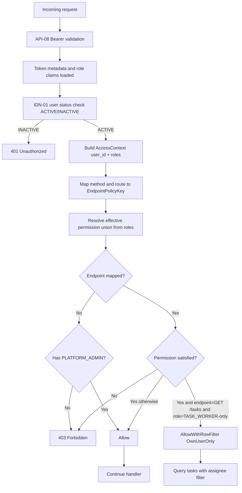
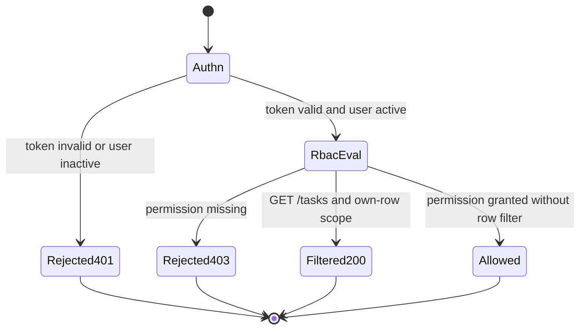

# Module: idn-03-role-based-access

**Covers:** IDN-03 (Role-based access)
**Related:** IDN-01 (users hold roles), IDN-04 (tokens carry role set), API-08 (Bearer token validation and role extraction), API-04 (GET /tasks filtering), API-02 and API-03 write-operation authorization
**Design scope:** Authoritative Stage 5 role-permission policy, additive role evaluation, endpoint authorization behavior, and row-level filtering semantics

## Module purpose

The role-based access module defines the single authoritative Stage 5 authorization contract for backend APIs. It specifies how roles are extracted from authenticated identity context, how additive role semantics produce effective permissions, and how endpoint authorization is enforced with a strict default-to-PLATFORM_ADMIN fallback for endpoints not explicitly mapped. The module also defines the required distinction between deny-by-403 and allow-with-row-filter behavior, especially for `GET /tasks` under `TASK_WORKER`.

## Authoritative Stage 5 role-permission matrix

This matrix is authoritative for Stage 5. If an endpoint is not mapped in this matrix, access defaults to `PLATFORM_ADMIN` only.

| API area | PLATFORM_ADMIN | PROCESS_DESIGNER | PROCESS_OPERATOR | TASK_WORKER |
|---|:---:|:---:|:---:|:---:|
| Create / update / activate definitions | Yes | Yes | No | No |
| Read definitions | Yes | Yes | Yes | Yes |
| Start instances | Yes | Yes | Yes | No |
| Cancel instances | Yes | No | Yes | No |
| Read instance state and history | Yes | Yes | Yes | Yes |
| Complete / assign tasks | Yes | No | Yes | Yes (own tasks only) |
| Manage users, groups, roles | Yes | No | No | No |
| Issue / revoke API tokens | Yes | No | No | No |
| Access audit log | Yes | No | Yes | No |
| Inspect / retry dead letter items | Yes | No | Yes | No |
| Access metrics endpoint | Yes | No | Yes | No |

## Additive role semantics

- A user may hold zero or more roles.
- Effective permissions are the union of all permissions granted by each held role.
- A request is authorized when at least one held role grants the required policy capability.
- Example: `TASK_WORKER + PROCESS_OPERATOR` is allowed to cancel instances because `PROCESS_OPERATOR` grants cancellation.
- A valid token with an empty role set remains authenticated but has no write permissions; only endpoints open to all authenticated roles remain accessible.

## Public interface

### Zig domain types

```zig
pub const Role = enum {
    PLATFORM_ADMIN,
    PROCESS_DESIGNER,
    PROCESS_OPERATOR,
    TASK_WORKER,
};

pub const Permission = enum {
    DefinitionsWrite,
    DefinitionsRead,
    InstancesStart,
    InstancesCancel,
    InstancesRead,
    TasksRead,
    TasksComplete,
    TasksAssign,
    UsersGroupsRolesManage,
    TokensManage,
    AuditRead,
    DlqOperate,
    MetricsRead,
};

pub const AccessDecisionKind = enum {
    Allow,
    Deny403,
    AllowWithRowFilter,
};

pub const AccessContext = struct {
    user_id: []const u8,
    roles: []const Role,
};

pub const EndpointPolicyKey = enum {
    DefinitionsCreate,
    DefinitionsUpdate,
    DefinitionsPatch,
    DefinitionsActivate,
    DefinitionsRead,
    InstancesStart,
    InstancesCancel,
    InstancesRead,
    TasksList,
    TasksGetById,
    TasksComplete,
    TasksAssign,
    TasksReassign,
    UsersManage,
    GroupsManage,
    TokensManage,
    AuditRead,
    DlqReadRetryDiscard,
    MetricsRead,
    Unknown,
};

pub const TaskRowScope = union(enum) {
    All,
    OwnUserOnly: []const u8,
};

pub const AccessDecision = struct {
    kind: AccessDecisionKind,
    granted_permissions: []const Permission,
    task_scope: ?TaskRowScope,
};

pub const RbacError = error{
    Unauthenticated,
    InvalidRoleClaim,
    Forbidden,
    PolicyNotConfigured,
    OutOfMemory,
};
```

### Zig policy signatures

```zig
pub fn resolveEffectivePermissions(
    allocator: std.mem.Allocator,
    roles: []const Role,
) RbacError![]Permission;

pub fn endpointPolicyKey(method: []const u8, path_template: []const u8) EndpointPolicyKey;

pub fn evaluateAccess(
    allocator: std.mem.Allocator,
    ctx: AccessContext,
    endpoint: EndpointPolicyKey,
) RbacError!AccessDecision;

pub fn taskRowScopeForList(ctx: AccessContext) TaskRowScope;
```

### HTTP middleware contract

- Input: authenticated user context from API-08 (`user_id`, role claims from token).
- Output for write endpoints:
  - Allowed: continue to handler.
  - Denied: HTTP 403 Problem Details.
- Output for `GET /tasks`:
  - Allowed with all rows: pass no row-scope restriction.
  - Allowed with `OwnUserOnly`: inject row filter (`assignee_type = 'USER'` and `assignee_ref = actor.user_id`).
  - Never convert this case to 403 solely for lack of elevated role.

## Endpoint-to-permission mapping

This mapping is exhaustive for Stage 5 known endpoints. Any endpoint not present in this table is treated as `Unknown` and defaults to `PLATFORM_ADMIN` only.

| Endpoint | Required permission(s) | Behavior |
|---|---|---|
| POST /definitions | DefinitionsWrite | 403 if missing |
| PUT /definitions/:id | DefinitionsWrite | 403 if missing |
| PATCH /definitions/:id | DefinitionsWrite | 403 if missing |
| POST /definitions/:id/activate | DefinitionsWrite | 403 if missing |
| GET /definitions, GET /definitions/:id | DefinitionsRead | 403 if missing |
| POST /instances | InstancesStart | 403 if missing |
| POST /instances/:id/cancel | InstancesCancel | 403 if missing |
| GET /instances, GET /instances/:id, GET /instances/:id/history | InstancesRead | 403 if missing |
| GET /tasks | TasksRead | row-level scope may apply |
| GET /tasks/:id | TasksRead | 403 if missing |
| POST /tasks/:id/complete | TasksComplete | 403 if missing |
| POST /tasks/:id/assign | TasksAssign | 403 if missing |
| POST /tasks/:id/reassign | TasksAssign | 403 if missing |
| POST /users, PUT /users/:id | UsersGroupsRolesManage | 403 if missing |
| POST /groups, POST /groups/:id/members, DELETE /groups/:id/members/:user_id, GET /groups/:id/members | UsersGroupsRolesManage | 403 if missing |
| POST /tokens, GET /tokens, DELETE /tokens/:id | TokensManage | 403 if missing |
| GET /audit | AuditRead | 403 if missing |
| GET /dlq, POST /dlq/:id/retry, POST /dlq/:id/discard | DlqOperate | 403 if missing |
| GET /metrics | MetricsRead | 403 if missing |
| Any uncovered endpoint | PLATFORM_ADMIN implied fallback | 403 for non-admin |

## Policy rules for critical operations

### Create definition policy check

- Endpoint: `POST /definitions` (and definition-write siblings).
- Allowed roles by matrix: `PLATFORM_ADMIN`, `PROCESS_DESIGNER`.
- Explicit IDN-03 check: `TASK_WORKER` only must receive HTTP 403.
- Additive semantics: if caller has `TASK_WORKER + PROCESS_DESIGNER`, request is allowed.

### Cancel instance policy check

- Endpoint: `POST /instances/:id/cancel`.
- Allowed roles by matrix: `PLATFORM_ADMIN`, `PROCESS_OPERATOR`.
- Explicit IDN-03 check: `TASK_WORKER + PROCESS_OPERATOR` is allowed (union semantics).
- `TASK_WORKER` only receives HTTP 403.

## GET /tasks row-level filtering behavior

For `GET /tasks`, authorization and visibility are separated:

- Authentication required (API-08).
- Base read permission required (`TasksRead`), which all Stage 5 roles hold.
- Visibility scope:
  - `PROCESS_OPERATOR`, `PROCESS_DESIGNER`, `PLATFORM_ADMIN`: `TaskRowScope.All`.
  - `TASK_WORKER` without elevated role: `TaskRowScope.OwnUserOnly(user_id)`.
- SQL row filter for `OwnUserOnly` scope:
  - `assignee_type = 'USER'`
  - `assignee_ref = <authenticated user_id>`
- Outcome for `TASK_WORKER` is HTTP 200 with filtered results, not HTTP 403.

## Policy evaluation flow



## Error taxonomy and HTTP mappings

| Condition | Decision | HTTP | Notes |
|---|---|---:|---|
| Missing/invalid Bearer token | Unauthenticated | 401 | API-08 handles auth failure |
| Token valid but user INACTIVE (IDN-01) | Unauthenticated | 401 | User status gate before RBAC |
| Role claims malformed/unknown | InvalidRoleClaim | 401 or 403 | Prefer 401 if token claim invalid at auth parse; 403 if claim normalizes to no effective rights |
| Endpoint permission not granted | Deny403 | 403 | Standard RBAC deny |
| Unknown endpoint policy and non-admin caller | Deny403 | 403 | Default-to-PLATFORM_ADMIN fallback |
| GET /tasks with TASK_WORKER-only | AllowWithRowFilter | 200 | Restricted rows, never RBAC 403 by role alone |
| Policy table misconfiguration at startup | PolicyNotConfigured | 500 | Deployment defect, not caller fault |

## State transitions

Authorization request decision lifecycle:



## Dependencies and integration boundaries

### Depends on

- IDN-01 user registry:
  - user identity and ACTIVE/INACTIVE status used before RBAC allow.
- API-08 authentication:
  - Bearer token validation and extraction of `user_id` + role claims.
- IDN-04 token management:
  - token role claim source-of-truth (`roles[]` claim persisted with token metadata).
- API route layer:
  - route-template mapping to endpoint policy keys.

### Must not depend on

- Process engine transition logic (`src/engine/transition.zig`).
- Database schema mutation decisions in this design step.
- Frontend visibility logic as an authorization source (UI never replaces backend policy).

## Traceability: IDN-03 acceptance criteria to design elements

| IDN-03 acceptance criterion | Concrete design elements |
|---|---|
| TASK_WORKER-only create definition returns 403 | Authoritative matrix row "Create / update / activate definitions"; Create definition policy check; Endpoint mapping for POST /definitions -> DefinitionsWrite; Error taxonomy 403 mapping |
| TASK_WORKER + PROCESS_OPERATOR can cancel instance | Additive role semantics section; Cancel instance policy check; Endpoint mapping for POST /instances/:id/cancel -> InstancesCancel |
| TASK_WORKER GET /tasks returns only own tasks (row filtering, not 403) | GET /tasks row-level filtering behavior; HTTP middleware contract for AllowWithRowFilter; Policy evaluation flow branch to filtered query; Error taxonomy mapping 200 filtered not 403 |
| Stage 5 matrix authoritative and uncovered endpoints default to PLATFORM_ADMIN-only | Authoritative matrix section; Endpoint-to-permission mapping final uncovered-endpoint row; Policy evaluation flow "Endpoint mapped?" default branch |
| Dependencies and integration points with IDN-01, IDN-04, API-08 are explicit | Dependencies and integration boundaries section; Policy evaluation flow steps API-08 and IDN-01 checks; IDN-04 role claim source statement |

## Open questions

1. `GET /tasks/:id` currently remains readable by any authenticated role per Stage 5 API text, while row-level filtering is specified explicitly only for `GET /tasks`. Confirm whether direct read-by-id should also enforce ownership for TASK_WORKER in a future requirement.
2. Endpoint canonicalization source (route template vs raw path) should be fixed in API middleware contract to avoid policy key mismatches for parameterized routes.
