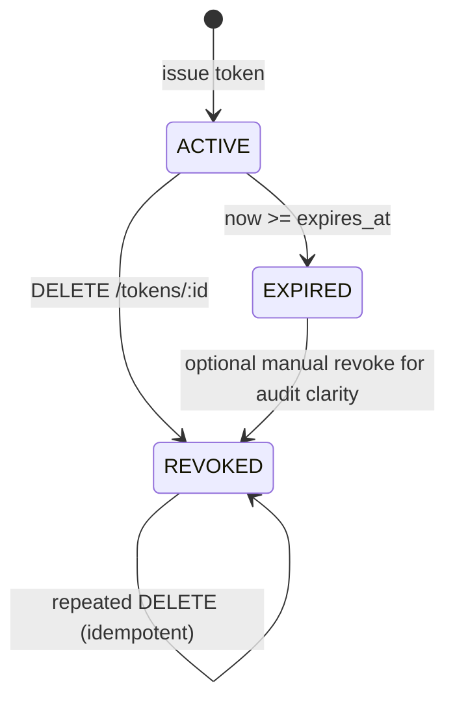
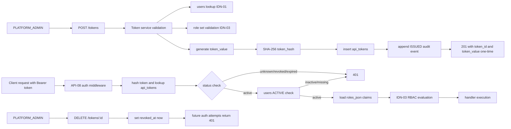

# Module: idn-04-api-token-management

**Covers:** IDN-04 (API token management)
**Related:** IDN-01 (token user must exist and be ACTIVE), IDN-03 (token roles and authorization), API-08 (Bearer validation), API-10 (per-token rate-limit key)
**Design scope:** Token issuance, secure storage, metadata listing, revocation semantics, validation semantics, and integration contracts with auth/RBAC middleware

## Module purpose

The API token management module provides secure, auditable machine-to-machine credentials for the BPM platform. It allows PLATFORM_ADMIN callers to issue a token for a target user and role set, return the plaintext secret exactly once at creation, store only non-reversible token hashes, and support listing and immediate revocation semantics. The same registry is used by authentication middleware so token acceptance/rejection is consistent across issue/list/revoke and runtime request validation.

## Public interface

### Zig domain types

```zig
pub const TokenStatus = enum {
    ACTIVE,
    REVOKED,
    EXPIRED,
};

pub const TokenRecord = struct {
    token_id: []const u8,       // UUID v4, platform-assigned
    user_id: []const u8,        // references users.user_id
    roles: []RoleName,          // role set granted by this token
    expires_at: ?[]const u8,    // RFC3339 UTC timestamp, null means no expiry
    revoked_at: ?[]const u8,    // RFC3339 UTC timestamp
    created_at: []const u8,     // RFC3339 UTC timestamp
    last_used_at: ?[]const u8,  // RFC3339 UTC timestamp
    status: TokenStatus,        // derived from revoked_at/expires_at at read time
};

pub const IssuedToken = struct {
    token_id: []const u8,
    token_value: []const u8,    // plaintext secret shown once only
    user_id: []const u8,
    roles: []RoleName,
    expires_at: ?[]const u8,
    created_at: []const u8,
};

pub const CreateTokenInput = struct {
    user_id: []const u8,
    roles: []RoleName,
    expires_at: ?[]const u8,
};

pub const TokenValidationOutcome = union(enum) {
    valid: struct {
        token_id: []const u8,
        user_id: []const u8,
        roles: []RoleName,
    },
    invalid: TokenValidationFailure,
};

pub const TokenValidationFailure = enum {
    MissingOrMalformedBearer,
    UnknownToken,
    Revoked,
    Expired,
    UserNotFound,
    UserInactive,
    InvalidRoleClaim,
    BackendUnavailable,
};

pub const TokenError = error{
    Forbidden,
    UserNotFound,
    InvalidRoleSet,
    ExpiresAtInPast,
    TokenNotFound,
    PoolExhausted,
    PersistenceFailed,
    OutOfMemory,
};
```

### Zig service/store signatures

```zig
pub fn issueToken(
    allocator: std.mem.Allocator,
    actor: AuthContext,
    input: CreateTokenInput,
) TokenError!IssuedToken;

pub fn listTokens(
    allocator: std.mem.Allocator,
    actor: AuthContext,
    params: ListParams,
) TokenError!TokenPage;

pub fn revokeToken(
    allocator: std.mem.Allocator,
    actor: AuthContext,
    token_id: []const u8,
) TokenError!void;

pub fn validateBearerToken(
    allocator: std.mem.Allocator,
    raw_token: []const u8,
) TokenValidationOutcome;
```

### HTTP endpoint contracts

#### POST /tokens

- AuthZ: PLATFORM_ADMIN only.
- Request body:

```json
{
  "user_id": "uuid, required",
  "roles": ["PLATFORM_ADMIN | PROCESS_DESIGNER | PROCESS_OPERATOR | TASK_WORKER"],
  "expires_at": "RFC3339 UTC timestamp, optional"
}
```

- Validation rules:
  - user_id must exist in users.
  - roles must be non-empty and each role must be valid in the IDN-03 role catalog.
  - expires_at is optional.
  - if provided, expires_at must be strictly greater than request-time now (UTC).
- Response: HTTP 201

```json
{
  "token_id": "uuid",
  "token_value": "opaque secret shown once",
  "user_id": "uuid",
  "roles": ["..."],
  "expires_at": "RFC3339 or null",
  "created_at": "RFC3339"
}
```

- Security guarantee: plaintext token value appears only in this response and is never stored or returned again.

#### GET /tokens

- AuthZ: PLATFORM_ADMIN only.
- Response: HTTP 200

```json
{
  "items": [
    {
      "token_id": "uuid",
      "user_id": "uuid",
      "roles": ["..."],
      "expires_at": "RFC3339 or null",
      "status": "ACTIVE | REVOKED | EXPIRED",
      "created_at": "RFC3339",
      "revoked_at": "RFC3339 or null",
      "last_used_at": "RFC3339 or null"
    }
  ]
}
```

- Never includes token_value.

#### DELETE /tokens/:id

- AuthZ: PLATFORM_ADMIN only.
- Semantics:
  - If token exists and not revoked: set revoked_at = now (UTC) and return 204.
  - If token already revoked: idempotent 204.
  - If token_id not found: 404.
- Revocation effect:
  - In-flight request that already passed auth may complete.
  - Any subsequent request using that token must return 401.

## Token value and identifier format

### token_id format

- UUID v4 generated by platform.
- Stable identifier exposed externally for list/revoke/audit correlation.
- Not a secret.

### token_value format

- Opaque high-entropy secret generated with cryptographically secure randomness.
- Recommended structure for operability and secret-scanning compatibility:
  - Prefix: `bpm_tok_`
  - Body: base64url-encoded random bytes (minimum 32 random bytes before encoding)
- Entire token_value is treated as sensitive and never logged.

## Persistent storage model and hashing strategy

## Database tables and columns

Primary table: api_tokens

- token_id UUID PRIMARY KEY
- token_hash CHAR(64) NOT NULL UNIQUE
- user_id UUID NOT NULL REFERENCES users(user_id)
- roles_json JSONB NOT NULL
- expires_at TIMESTAMPTZ NULL
- revoked_at TIMESTAMPTZ NULL
- created_at TIMESTAMPTZ NOT NULL DEFAULT NOW()
- last_used_at TIMESTAMPTZ NULL

Suggested indexes:

- UNIQUE (token_hash)
- INDEX (user_id, created_at DESC)
- INDEX (revoked_at)
- INDEX (expires_at)

Audit table (append-only): api_token_audit

- audit_id UUID PRIMARY KEY
- token_id UUID NOT NULL
- action TEXT NOT NULL CHECK (action IN ('ISSUED','REVOKED','VALIDATED'))
- actor_user_id UUID NULL
- trace_id TEXT NULL
- created_at TIMESTAMPTZ NOT NULL DEFAULT NOW()
- metadata JSONB NOT NULL DEFAULT '{}'::jsonb

## Hashing

- Hash algorithm: SHA-256 over raw token_value bytes.
- Stored representation: lowercase hex digest (64 chars).
- Plaintext token is not persisted.
- Validation compares hashes only.
- Comparison for bootstrap and runtime token checks must remain constant-time where applicable.

## Lifecycle and state semantics

Derived status function (for list and validation behavior):

- REVOKED if revoked_at is non-null.
- Else EXPIRED if expires_at is non-null and now >= expires_at.
- Else ACTIVE.

Token lifecycle:



Revocation guarantees:

- Guarantee point: request authentication boundary.
- If token is valid at boundary, request may finish.
- After revoked_at commit, future requests fail authentication with 401.
- No eventual-consistency grace window is allowed for future requests.

Expiration semantics:

- expires_at null means no time-based expiry.
- expires_at in the past at issuance is rejected with 422.
- Validation uses UTC clock and compares against stored expires_at.

## Authentication and authorization integration

## API-08 auth middleware integration path

1. Parse Bearer token from Authorization header.
2. Hash presented token with SHA-256.
3. Query api_tokens by token_hash.
4. Reject as 401 if not found, revoked, or expired.
5. Resolve target user from users table and reject as 401 if missing or INACTIVE (IDN-01).
6. Resolve role claims from token roles_json and validate each role name against IDN-03 role catalog.
7. Build AuthContext containing user_id, token_id, role claims.
8. Pass context to RBAC policy evaluation (IDN-03) for endpoint authorization.
9. Update last_used_at best-effort and write audit event (non-blocking for response correctness).

## IDN-01 integration boundaries

- issueToken must verify referenced user exists.
- validateBearerToken must enforce user ACTIVE gate before access.
- user deactivation immediately disables all tokens for that user at next request boundary.

## IDN-02 integration boundaries

- No direct group dependency in token storage or validation.
- Indirect effect: token role claims participate in task/group authorization logic already defined by IDN-02 and IDN-03.

## IDN-03 integration boundaries

- roles supplied at issuance must be valid IDN-03 role names.
- RBAC uses token-provided role set as authorization input.
- Invalid or unknown role claims are treated as auth failure (401) or forbidden (403) per middleware policy, with this module responsible for canonical role validation rules.

## Data flow



## Error taxonomy and HTTP mappings

| Condition | Domain error/failure | HTTP | Notes |
|---|---|---:|---|
| Caller lacks PLATFORM_ADMIN for token endpoints | Forbidden | 403 | IDN-03 TokensManage gate |
| user_id does not exist on POST /tokens | UserNotFound | 404 | IDN-01 dependency |
| roles empty or contain unknown role | InvalidRoleSet | 422 | Must match IDN-03 role catalog |
| expires_at <= now on create | ExpiresAtInPast | 422 | Edge-case acceptance requirement |
| token_id not found on DELETE | TokenNotFound | 404 | Resource semantics |
| Bearer missing/malformed | MissingOrMalformedBearer | 401 | API-08 behavior |
| token hash not found | UnknownToken | 401 | Auth failure |
| token revoked | Revoked | 401 | Immediate post-revoke rejection for new requests |
| token expired | Expired | 401 | expires_at boundary check |
| token user missing/inactive | UserNotFound/UserInactive | 401 | IDN-01 enforcement |
| DB pool exhausted during auth/list/create/revoke | PoolExhausted/BackendUnavailable | 503 | Shared platform mapping |
| Unexpected persistence fault | PersistenceFailed | 500 | Internal fault |

## Security constraints

- Plaintext token secrets are never persisted.
- Plaintext token secrets are never returned except one-time POST /tokens response.
- GET /tokens and DELETE /tokens responses never include token_value.
- API logs and audit metadata must redact token_value; only token_id and token hash prefix (optional, truncated) may be logged for diagnostics.
- All SQL access uses prepared statements with placeholders; no SQL interpolation.
- Token generation uses cryptographically secure randomness.
- Revocation is immediate for subsequent requests at authentication boundary.
- Hash-only comparison path prevents token recovery from DB snapshots.

## Testability anchors

- Issuance with valid payload returns 201 and one-time secret.
- Re-reading via GET /tokens never exposes token_value.
- Deleting token causes next request using that token to return 401.
- Token with expires_at in past on create returns 422.
- Token with future expires_at transitions to expired validation behavior at boundary.
- Token without expiry remains valid unless revoked.
- User deactivation causes otherwise-valid token to fail with 401.

## Dependencies

Internal modules:

- src/identity/tokens.zig
- src/api/routes/identity.zig (or dedicated token route module)
- src/api/middleware/auth.zig
- src/api/middleware/rbac.zig
- src/obs/audit.zig
- src/api/errors.zig

Database objects:

- users
- roles
- user_roles (optional for cross-validation of role assignment policies)
- api_tokens
- api_token_audit

Must not depend on:

- src/engine/transition.zig
- frontend modules
- external secret managers in request-time critical path

## Traceability map: IDN-04 acceptance criteria to design elements

| IDN-04 acceptance criterion | Design element(s) |
|---|---|
| POST /tokens returns 201 with token value shown once and token_id | HTTP contract for POST /tokens; IssuedToken type; security constraints section |
| Token stored as cryptographic hash and plaintext never retrievable again | Persistent storage model (token_hash only); hashing strategy; one-time display guarantees |
| GET /tokens lists metadata and never token value | HTTP contract for GET /tokens; TokenRecord type; security constraints |
| DELETE /tokens/:id revokes immediately; subsequent usage returns 401 | DELETE contract semantics; lifecycle/revocation guarantees; auth integration status checks |
| Expired token rejected with 401 on use | Lifecycle derived EXPIRED status; validation flow step and error taxonomy |
| Optional expires_at supports non-expiring tokens until revoked | CreateTokenInput expires_at optional; expiration semantics section |
| Edge case: create with past expires_at rejected with 422 | POST validation rules; error taxonomy ExpiresAtInPast |
| Edge case: revoke mid-request allows in-flight completion, blocks subsequent requests | Revocation guarantees section |

## Completeness validation checklist (fn:validate-completeness)

- All handoff acceptance criteria are mapped to explicit sections in this design.
- Token lifecycle is fully specified (issue, store, list, revoke, validate).
- Storage schema and hashing strategy are explicit and testable.
- API-08 auth middleware integration path is explicit, including role-claim propagation to IDN-03.
- Security constraints and error-to-HTTP mappings are complete and testable.

## Open questions

1. Current auth middleware in src/api/middleware/auth.zig exposes a single highest-privilege role field, while IDN-03 and IDN-04 require additive role sets. Confirm migration plan to multi-role AuthContext representation.
2. Existing auth role enum currently includes VIEWER while Stage 5 requirement matrix uses TASK_WORKER. Confirm canonical role naming and backward-compatibility strategy.
3. Confirm whether role set on a token must be a subset of roles currently assigned to the user at issuance time, or may be any valid role names constrained only by PLATFORM_ADMIN authority.
