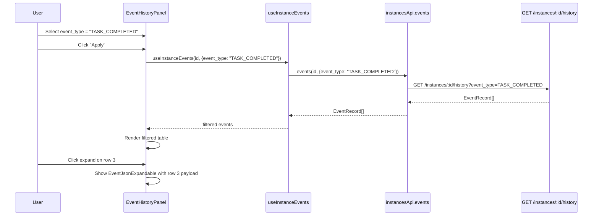

# Module: in-ui-05 — Event history tab with filtering & expandable JSON

**Covers:** IN-UI-05
**Files:** `web/src/pages/instances/InstanceDetailPage.tsx` (History tab section),
          `web/src/components/instances/EventHistoryPanel.tsx` (new),
          `web/src/components/instances/EventJsonExpandable.tsx` (new),
          `web/src/hooks/useInstances.ts` (extend useInstanceEvents with filter params),
          `web/src/api/instances.ts` (extend events() with filter params),
          `web/src/api/queryKeys.ts` (extend events key with filter args)
**Status:** DRAFT

---

## Module purpose

Replace the basic event log table in the History tab with a filterable, interactive
event history panel. Users can filter by event type and time range. Each event row
has an expandable section that reveals the raw JSON payload.

---

## Classification rationale

**Type E** — This is a sub-component within an existing page, not a standalone
list page. The shape is "filter bar + table with expandable rows", which differs
from the Type B pattern (query → table → row actions → create form). There is no
create form, no row-level CRUD actions, and the expandable JSON payload viewer is
a custom interaction not covered by the list-page template.

---

## Public interface

### 3.1 `EventHistoryPanel`

Located in `web/src/components/instances/EventHistoryPanel.tsx`.

```typescript
interface EventHistoryPanelProps {
  instanceId: string
}

// Design signature — no implementation
export function EventHistoryPanel(props: EventHistoryPanelProps): JSX.Element
```

**Behaviour:**
1. Renders a filter bar at the top with:
   - **Event type** — `<select>` dropdown populated from a derived list of distinct
     `event_type` values in the current result set. Includes an "All types" default option.
   - **Time range** — two `<input type="datetime-local">` fields: "From" and "To".
     Both optional; when both set, filter events to `created_at >= from && created_at <= to`.
   - **Apply** button that triggers a re-fetch with the selected filters.
   - **Clear** button that resets filters to defaults.
2. Renders an event table below the filter bar with columns: `#` (sequence_number),
   `Type`, `Actor`, `Time`, and an expand toggle column.
3. Empty state: "No events match the current filters."
4. Loading state: spinner or skeleton while fetching.

### 3.2 `EventJsonExpandable`

Located in `web/src/components/instances/EventJsonExpandable.tsx`.

```typescript
interface EventJsonExpandableProps {
  payload: Record<string, unknown>
}

// Design signature — no implementation
export function EventJsonExpandable(props: EventJsonExpandableProps): JSX.Element
```

**Behaviour:**
1. Renders a `<details>/<summary>` element with a chevron icon.
2. Summary shows "Payload" text with an expand indicator.
3. Expanded state shows a `<pre>` block with `JSON.stringify(payload, null, 2)`.
4. Long payloads are contained in a `max-height: 400px; overflow: auto` container.

### 3.3 Updated `useInstanceEvents` hook

Located in `web/src/hooks/useInstances.ts`.

```typescript
interface EventFilters {
  event_type?: string
  from?: string       // ISO 8601 datetime
  to?: string         // ISO 8601 datetime
}

// Updated signature
export function useInstanceEvents(
  id: string,
  filters?: EventFilters,
): UseQueryResult<EventRecord[]>
```

**Changes:** Pass `filters` through to `instancesApi.events()` and include them in
the query key so TanStack Query re-fetches when filters change.

### 3.4 Updated `instancesApi.events`

Located in `web/src/api/instances.ts`.

```typescript
events: (
  id: string,
  params?: {
    after_seq?: number
    before_seq?: number
    limit?: number
    event_type?: string    // NEW
    from?: string           // NEW — ISO 8601
    to?: string             // NEW — ISO 8601
  },
) => client.get<EventRecord[]>(`/api/v1/instances/${id}/events`, params)
```

**Changes:** Add `event_type`, `from`, `to` params that map to the backend
`GET /instances/:id/history` query parameters (see API-05).

### 3.5 Updated `queryKeys.instances.events`

Located in `web/src/api/queryKeys.ts`.

```typescript
events: (id: string, filters?: { event_type?: string; from?: string; to?: string }) =>
  [...queryKeys.instances.all, 'events', id, filters ?? {}] as const,
```

---

## Data flow



---

## Error taxonomy

| Error | Cause | UI behaviour |
|---|---|---|
| HTTP 400 | Invalid filter value (bad date format) | Show inline error below the filter bar |
| HTTP 401/403 | Session expired or user lacks access to instance | Redirect to login (handled by client.ts) |
| HTTP 404 | Instance deleted between page load and filter apply | Show "Instance not found" message |
| HTTP 500 | Backend error | Show error toast "Failed to load events" |
| Network failure | Backend unreachable | Show error toast with connectivity message |
| Empty result | No events match filters | Show "No events match the current filters." |

---

## Key invariants

1. **Filters are additive** — applying an event_type AND a time range narrows results
   with AND logic (not OR).
2. **No pagination** — the events endpoint returns all matching events (up to backend
   limit). If the backend returns >200 events, show a count indicator: "Showing N events."
3. **JSON payload is read-only** — the expandable view is purely for inspection, no edit.
4. **Event type options are derived from current data** — not a hardcoded list, since
   the backend may add new event types over time.
5. **Time range inputs use `datetime-local`** — browser-native datetime picker. Values
   are converted to ISO 8601 strings before sending to the API.

---

## Dependencies

- `EventRecord` type from `web/src/types/api.ts` (already exists)
- `instancesApi.events` from `web/src/api/instances.ts` (already exists, extending)
- `useInstanceEvents` from `web/src/hooks/useInstances.ts` (already exists, extending)
- `queryKeys` from `web/src/api/queryKeys.ts` (already exists, extending)
- Design system primitives: no Dialog dependency needed, uses native `<details>/<summary>`
