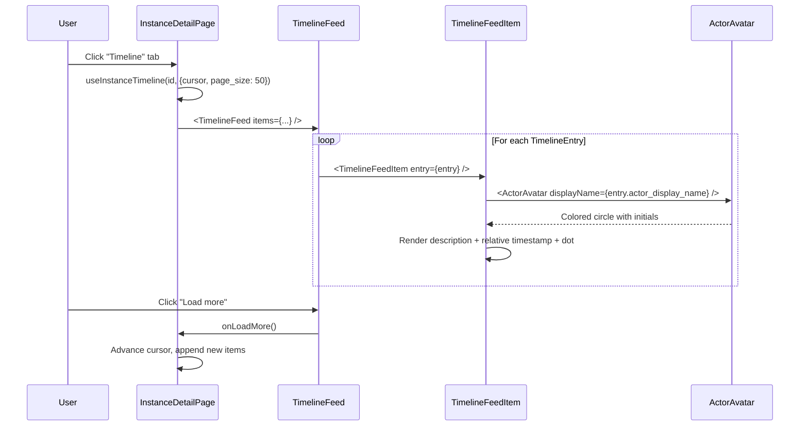

# Module: in-ui-06 — Timeline tab with actor avatars & human-readable descriptions

**Covers:** IN-UI-06
**Files:** `web/src/pages/instances/InstanceDetailPage.tsx` (Timeline tab section),
          `web/src/components/instances/TimelineFeed.tsx` (new),
          `web/src/components/instances/TimelineFeedItem.tsx` (new),
          `web/src/components/instances/ActorAvatar.tsx` (new),
          `web/src/pages/instances/timelineUtils.ts` (extend with description helpers)
**Status:** DRAFT

---

## Module purpose

Enhance the existing Timeline tab from a basic text feed into a rich vertical
chronological timeline with:
- Actor avatar circles (initials-based, colour-coded by actor type)
- Human-readable event descriptions (replacing raw `event_type` strings)
- Relative timestamps alongside absolute times
- Visual differentiation between event categories

The backend `GET /instances/:id/timeline` endpoint (OBS-04) already returns
`TimelineEntry` objects with `actor_display_name`, `description`, `timestamp`,
`event_type`, `node_id`, `task_id`, and `metadata`.

---

## Classification rationale

**Type E** — This is a novel visual component within an existing page. It renders
a vertical chronological feed with actor avatars and rich description formatting.
Not a standard list page (no filters bar, no row actions, no create form). The
cursor-based pagination "load more" pattern is already implemented; this module
enhances the visual presentation of each feed item.

---

## Public interface

### 3.1 `TimelineFeed`

Located in `web/src/components/instances/TimelineFeed.tsx`.

```typescript
interface TimelineFeedProps {
  items: TimelineEntry[]
  isLoading: boolean
  hasMore: boolean
  onLoadMore: () => void
  isFetchingMore: boolean
}

// Design signature — no implementation
export function TimelineFeed(props: TimelineFeedProps): JSX.Element
```

**Behaviour:**
1. Renders a vertical timeline with a left-side connector line (CSS `border-left`).
2. Each item is a `TimelineFeedItem` rendered in chronological order (newest first).
3. At the bottom, shows a "Load more" button when `hasMore` is true.
4. Shows "Loading timeline…" when `isLoading` and `items` is empty.
5. Shows "No timeline entries found." when `items` is empty and not loading.
6. Shows "Loaded N entries" count indicator.

### 3.2 `TimelineFeedItem`

Located in `web/src/components/instances/TimelineFeedItem.tsx`.

```typescript
interface TimelineFeedItemProps {
  entry: TimelineEntry
}

// Design signature — no implementation
export function TimelineFeedItem(props: TimelineFeedItemProps): JSX.Element
```

**Behaviour:**
1. Renders a single timeline entry as an `<article>` with:
   - **Actor avatar** on the left (via `ActorAvatar` component).
   - **Event description** — the `entry.description` field, rendered as bold text.
   - **Relative timestamp** — e.g. "2 minutes ago", with absolute time on hover
     (using `<time>` element with `title` attribute).
   - **Secondary context line** — shows `event_type`, `actor_display_name`, and
     `sequence_num` in muted text. Uses `getTimelineSecondaryContext()` for
     node/task context.
   - **Metadata expansion** — if `entry.metadata` has keys, render a `<details>`
     summary with a `<pre>` JSON block.
2. The dot indicator on the left connector line uses colour based on event category:
   - Lifecycle events (INSTANCE_STARTED, INSTANCE_COMPLETED, INSTANCE_CANCELLED): blue `#2563eb`
   - Task events (TASK_*, HUMAN_TASK_*): green `#16a34a`
   - Error events (ERROR_*): red `#dc2626`
   - Timer events (TIMER_*): amber `#d97706`
   - Default: slate `#64748b`

### 3.3 `ActorAvatar`

Located in `web/src/components/instances/ActorAvatar.tsx`.

```typescript
interface ActorAvatarProps {
  displayName: string | null | undefined
  size?: number  // default 36
}

// Design signature — no implementation
export function ActorAvatar(props: ActorAvatarProps): JSX.Element
```

**Behaviour:**
1. Renders a circular `<div>` with:
   - **Background colour** derived from `displayName` string hash (deterministic
     colour from a 10-colour palette: blues, greens, purples, oranges, teals).
   - **Initials text** — first letter of first word + first letter of last word
     (or single letter if one word). White text, bold, centred.
   - If `displayName` is null/empty (system actor), renders a gear/cog icon `⚙`
     on a grey `#64748b` background.
2. `size` controls both width and height (square circle). Default 36px.
3. Font size is `size * 0.4` px.

### 3.4 Updated timeline utility functions

Located in `web/src/pages/instances/timelineUtils.ts`.

```typescript
// NEW — derive timeline dot colour from event_type
export function getTimelineDotColour(eventType: string): string

// NEW — compute relative time string from ISO timestamp
export function getRelativeTime(isoTimestamp: string): string
```

**`getTimelineDotColour`** maps event type prefixes to colours per the scheme above.
Returns `#64748b` for unknown prefixes.

**`getRelativeTime`** computes a human-readable relative time:
- <60s → "just now"
- <60m → "N min ago"
- <24h → "N hours ago"
- <7d → "N days ago"
- otherwise → formatted date string

---

## Data flow



---

## Error taxonomy

| Error | Cause | UI behaviour |
|---|---|---|
| HTTP 401/403 | Session expired | Redirect to login (handled by client.ts) |
| HTTP 404 | Instance deleted | Show "Instance not found" in timeline area |
| HTTP 500 | Backend error | Show "Failed to load timeline." error message |
| Network failure | Backend unreachable | Show error with retry button |
| Empty timeline | No events yet | Show "No timeline entries found." |

---

## Key invariants

1. **Timeline is newest-first** — entries are displayed in reverse chronological
   order (most recent at the top).
2. **Cursor pagination preserved** — the existing `useInstanceTimeline` hook with
   cursor-based "load more" is unchanged; only the visual rendering changes.
3. **Avatar colour is deterministic** — the same `displayName` always produces the
   same colour, even across page reloads.
4. **System actor** — when `actor_display_name` is empty/null, the avatar shows `⚙`
   on a grey background, and the description line shows "system" as the actor.
5. **No additional API calls** — the timeline data already contains
   `actor_display_name` and `description` from the backend.

---

## Dependencies

- `TimelineEntry`, `TimelinePage` types from `web/src/types/api.ts` (already exist)
- `useInstanceTimeline` from `web/src/hooks/useInstances.ts` (already exists)
- `getTimelineActorDisplayName`, `getTimelineSecondaryContext`, `mergeTimelineItems`
  from `web/src/pages/instances/timelineUtils.ts` (already exists, extending)
- `instancesApi.timeline` from `web/src/api/instances.ts` (already exists)
