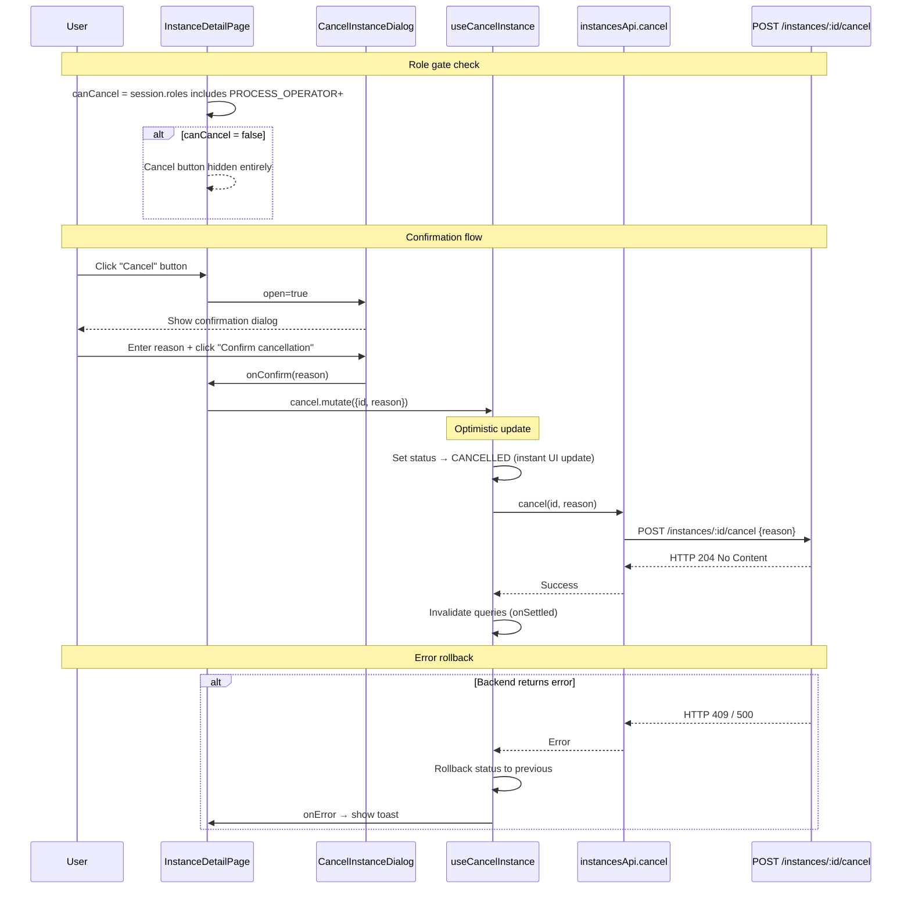

# Module: in-ui-07 — Cancel instance with confirmation dialog & role gating

**Covers:** IN-UI-07
**Files:** `web/src/pages/instances/InstanceDetailPage.tsx` (Cancel button + dialog),
          `web/src/components/instances/CancelInstanceDialog.tsx` (new),
          `web/src/hooks/useInstances.ts` (useCancelInstance — already has optimistic update)
**Status:** DRAFT

---

## Module purpose

Enhance the existing Cancel button on the instance detail page with:
- **Role gating** — hide the button entirely if the user's role set does not include
  `PROCESS_OPERATOR` or `PROCESS_ADMIN` or `PLATFORM_ADMIN`.
- **Confirmation dialog** — before calling `POST /instances/:id/cancel`, show a
  modal dialog asking the user to confirm. Dialog includes a text field for an
  optional cancellation reason.
- **Optimistic update with rollback** — update the status badge to "CANCELLED"
  immediately; if the API call fails, revert to the previous status and show a
  recoverable error toast.

The `useCancelInstance` hook already implements the optimistic update + rollback
pattern in `onMutate` / `onError` / `onSettled`. This module adds the UI layer
(role gating + confirmation dialog).

---

## Classification rationale

**Type E** — This is cross-cutting behaviour that modifies an existing button
component with a confirmation dialog and role-based visibility. It is not a
standalone page, not a CRUD endpoint, not a list page, and not a React Flow node.

---

## Public interface

### 3.1 `CancelInstanceDialog`

Located in `web/src/components/instances/CancelInstanceDialog.tsx`.

```typescript
interface CancelInstanceDialogProps {
  open: boolean
  instanceId: string
  instanceName: string    // "Definition v1" for display
  onConfirm: (reason?: string) => void
  onCancel: () => void
  isPending: boolean      // mutation.isPending
}

// Design signature — no implementation
export function CancelInstanceDialog(props: CancelInstanceDialogProps): JSX.Element
```

**Behaviour:**
1. Renders a modal overlay with:
   - Title: "Cancel instance?"
   - Body text: "This will cancel instance `{instanceName}`. Running tasks and
     timers will be terminated. This action cannot be undone."
   - Optional reason field: `<textarea>` labelled "Reason (optional)", max 500 chars.
   - Two buttons: "Cancel" (dismisses dialog) and "Confirm cancellation" (destructive,
     red background).
   - "Confirm cancellation" button shows a spinner when `isPending` is true and is
     disabled during the mutation.
2. Pressing Escape or clicking the backdrop calls `onCancel`.
3. Focus is trapped inside the dialog while open (focus trap).

### 3.2 Updated Cancel button in `InstanceDetailPage`

**Current state:** The Cancel button is visible when `instance.status === 'ACTIVE'`
and calls `cancel.mutate({ id })` directly.

**New behaviour:**
1. Import `useAuth` from `@/auth/AuthContext`.
2. Compute `canCancel`:
   ```typescript
   const CANCEL_ROLES = ['PROCESS_OPERATOR', 'PROCESS_ADMIN', 'PLATFORM_ADMIN']
   const canCancel = session?.roles.some(r => CANCEL_ROLES.includes(r)) ?? false
   ```
3. Button is rendered only when `instance.status === 'ACTIVE' && canCancel`.
4. Clicking the button sets `showCancelDialog = true` (state).
5. Dialog's `onConfirm` calls `cancel.mutate({ id, reason })` and closes the dialog.
6. On mutation error, `useCancelInstance.onError` already rolls back the optimistic
   update. Additionally, show a toast: "Failed to cancel instance. The status has
   been restored."

### 3.3 Updated `useCancelInstance` — already implemented

No changes to the hook. The existing optimistic update + rollback pattern handles:
- `onMutate`: snapshot previous data, set status to `CANCELLED`
- `onError`: restore previous data from snapshot
- `onSettled`: invalidate detail + list queries

---

## Data flow



---

## Error taxonomy

| Error | Cause | UI behaviour |
|---|---|---|
| HTTP 409 (Conflict) | Instance already completed/cancelled | Rollback status + toast "Instance is no longer active" |
| HTTP 403 (Forbidden) | User role changed mid-session | Rollback + toast "You do not have permission to cancel instances" |
| HTTP 401 | Session expired | Rollback + redirect to login (handled by client.ts) |
| HTTP 500 | Backend error | Rollback + toast "Failed to cancel instance. Please try again." |
| Network failure | Backend unreachable | Rollback + toast "Network error — check your connection" |

**Rollback guarantee:** The optimistic update is always reverted on any error.
The user sees the original status badge restored within ~100ms of the error.

---

## Key invariants

1. **Role gating hides, never disables** — users without the required role never see
   the Cancel button. This follows the role-gated UI pattern in the frontend guide §6.
2. **Confirmation is mandatory** — no way to cancel without the dialog.
3. **Reason is optional** — the reason field is a textarea with no required validation.
4. **Optimistic update is instant** — status badge changes to "CANCELLED" the moment
   "Confirm" is clicked, before the API response.
5. **Rollback is automatic** — any error (network, server, auth) reverts the status
   badge to its pre-click value.

---

## Dependencies

- `useCancelInstance` from `web/src/hooks/useInstances.ts` (already exists with optimistic update)
- `useAuth` from `web/src/auth/AuthContext.tsx` (already exists)
- `instancesApi.cancel` from `web/src/api/instances.ts` (already exists)
- `ProcessInstance` type from `web/src/types/api.ts` (already exists)
- Toast component (from design system — `web/src/components/ui/Toast.tsx` if available,
  otherwise a simple `<div role="alert">` with aria-live)
