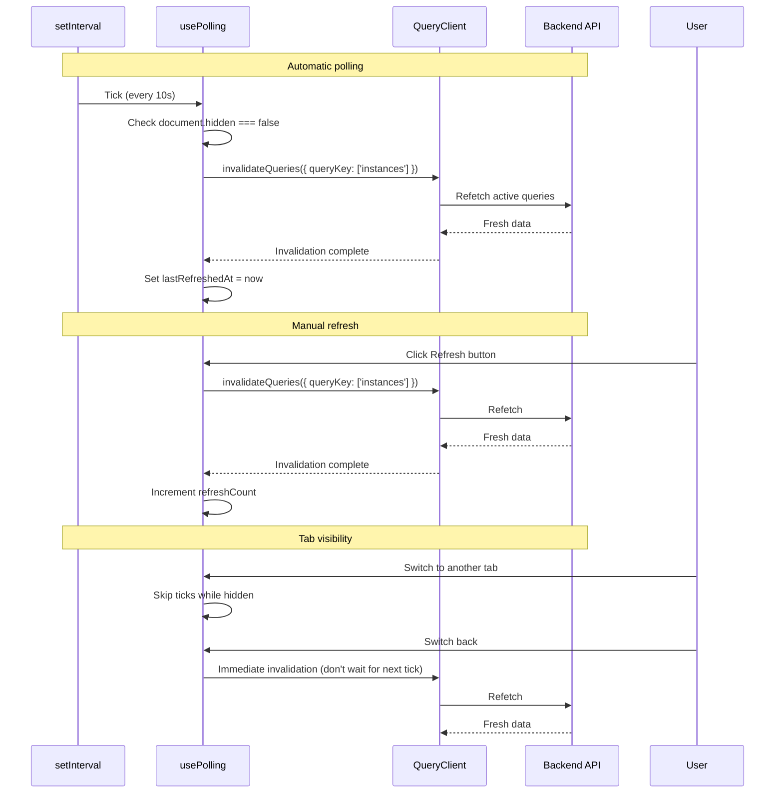

# Module: in-ui-08 — Auto-refresh polling for instance pages

**Covers:** IN-UI-08 (SHOULD priority)
**Files:** `web/src/hooks/usePolling.ts` (new),
          `web/src/pages/instances/InstanceBoardPage.tsx` (integrate polling),
          `web/src/pages/instances/InstanceDetailPage.tsx` (integrate polling)
**Status:** DRAFT

---

## Module purpose

Add auto-refresh polling to the instance board page (IN-UI-01) and instance detail
page (IN-UI-04). The polling hook:
- Periodically invalidates TanStack Query cache at a configurable interval (default 10s).
- Respects the Page Visibility API — pauses when the tab is hidden.
- Shows a "Last refreshed: {time}" indicator and a manual refresh button.
- Configurable via the `VITE_POLL_INTERVAL_MS` environment variable.

---

## Classification rationale

**Type E** — This is a cross-cutting infrastructure hook, not a page, CRUD endpoint,
migration, or React Flow node. It adds behaviour to two existing pages without
changing their visual structure beyond a small status indicator.

---

## Public interface

### 3.1 `usePolling`

Located in `web/src/hooks/usePolling.ts`.

```typescript
interface UsePollingOptions {
  /** TanStack Query queryKey prefix to invalidate on each tick.
   *  Example: ['instances'] invalidates all instance queries. */
  queryKeyPrefix: readonly unknown[]

  /** Interval in milliseconds. Default: import.meta.env.VITE_POLL_INTERVAL_MS ?? 10000 */
  intervalMs?: number

  /** Whether polling is active. Default: true. Set to false to pause. */
  enabled?: boolean
}

interface UsePollingResult {
  /** ISO timestamp of the last successful refresh, or null if never refreshed. */
  lastRefreshedAt: string | null

  /** Manually trigger a refresh now. */
  refreshNow: () => Promise<void>

  /** Number of refreshes performed. */
  refreshCount: number
}

// Design signature — no implementation
export function usePolling(options: UsePollingOptions): UsePollingResult
```

**Behaviour:**
1. On mount, starts an interval timer at `intervalMs`.
2. Each tick: if `document.hidden === false` and `enabled === true`, call
   `queryClient.invalidateQueries({ queryKey: options.queryKeyPrefix })`.
   Wait for invalidation to complete, then set `lastRefreshedAt` to `new Date().toISOString()`.
3. When the tab becomes hidden (`visibilitychange` event), do NOT fire ticks.
   When the tab becomes visible again, fire an immediate refresh (don't wait for
   the next interval tick).
4. On unmount, clear the interval.
5. `refreshNow()` — immediately invalidates and increments `refreshCount`. Returns
   a promise that resolves when invalidation completes. Does NOT reset the interval
   timer (the next automatic tick still fires on schedule).

### 3.2 `RefreshIndicator`

Inline helper component (not a separate file — rendered directly in page components).

```typescript
// Rendered inline, not a standalone component
interface RefreshIndicatorProps {
  lastRefreshedAt: string | null
  onRefreshNow: () => void
  isRefetching: boolean
}
```

**Visual layout:**
```
Last refreshed: 10:45:32 AM    [↻ Refresh]
```
- Timestamp shows `HH:MM:SS` format (no date — user is on the page now).
- If `lastRefreshedAt` is null, shows "Not yet refreshed".
- Refresh button is a small icon button that spins while `isRefetching`.
- Positioned in the top-right area of the page, below the header row.

### 3.3 Integration with `InstanceBoardPage`

```typescript
// In InstanceBoardPage.tsx
const { lastRefreshedAt, refreshNow } = usePolling({
  queryKeyPrefix: queryKeys.instances.all,
})

const { isRefetching } = useInstances(...)

// Render: <RefreshIndicator lastRefreshedAt={lastRefreshedAt}
//   onRefreshNow={refreshNow} isRefetching={isRefetching} />
```

### 3.4 Integration with `InstanceDetailPage`

```typescript
// In InstanceDetailPage.tsx
const { lastRefreshedAt, refreshNow } = usePolling({
  queryKeyPrefix: queryKeys.instances.detail(id!),
})

const { isRefetching } = useInstance(id!)

// Render: <RefreshIndicator lastRefreshedAt={lastRefreshedAt}
//   onRefreshNow={refreshNow} isRefetching={isRefetching} />
```

**Note:** Detail page invalidates only the specific instance detail query, not all
instance queries. This avoids unnecessary re-fetches of the board data while viewing
a single instance.

---

## Data flow



---

## Error taxonomy

| Error | Cause | UI behaviour |
|---|---|---|
| Refetch fails (network) | Backend unreachable | TanStack Query keeps stale data; retry on next tick. Last-refreshed timestamp NOT updated. |
| Refetch fails (401) | Session expired | client.ts redirects to login. Polling stops (component unmounts). |
| Refetch fails (404) | Instance deleted (detail page) | Query returns error; page shows "Instance not found". Polling continues but keeps failing silently. |
| Component unmounts | User navigates away | Interval cleared; no memory leak. |

**Key invariant:** Failed refreshes do NOT update `lastRefreshedAt`. This ensures
the user can see that data may be stale (e.g., "Last refreshed: 2 minutes ago"
implies a connectivity issue).

---

## Key invariants

1. **Tab-hidden = no polling** — respects Page Visibility API to avoid unnecessary
   network traffic and backend load.
2. **Tab-visible = immediate refresh** — when the user returns to the tab, data is
   fetched immediately rather than waiting for the next interval tick.
3. **10s default, configurable** — `VITE_POLL_INTERVAL_MS` env variable overrides.
4. **Manual refresh is instant** — the `↻` button triggers an immediate refetch
   without waiting for the next interval.
5. **No polling in test environments** — `usePolling` checks `import.meta.env.MODE`
   and disables itself in `'test'` mode to avoid flaky tests.
6. **Detail page scopes invalidation** — only invalidates the specific instance
   query, not all instance queries.

---

## Dependencies

- `@tanstack/react-query` `useQueryClient` (already used in the project)
- `queryKeys` from `web/src/api/queryKeys.ts` (already exists)
- `VITE_POLL_INTERVAL_MS` env variable (already referenced in frontend guide)
- Page Visibility API — browser native, no external dependency
