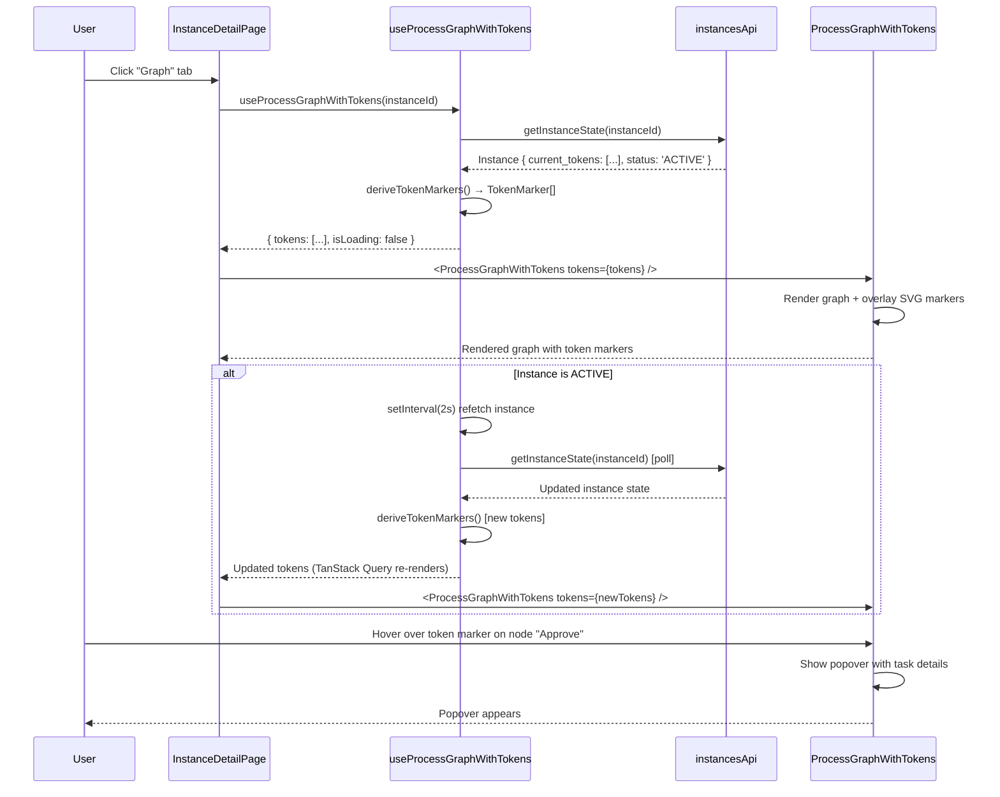

# Module: in-ui-09 — Active token visualisation on process graph

**Covers:** IN-UI-09  
**Files:** `web/src/components/instances/InstanceDetailPage.tsx` (enhance Graph tab),
          `web/src/components/instances/ProcessGraphWithTokens.tsx` (new),
          `web/src/hooks/useProcessGraphWithTokens.ts` (new),
          `web/src/utils/tokenVisualisation.ts` (new)  
**Status:** DRAFT

---

## Module purpose

Enhance the process definition graph view in the Instance Detail page to display
real-time execution token positions. When viewing an active or completed instance,
the graph overlay shows:

- **Active token markers** — coloured dots on nodes where execution tokens currently reside
- **Completed token markers** — muted/crossed-out markers on nodes already visited
- **Token count badge** — displays number of tokens on nodes with multiple concurrent tokens
- **Interactive highlights** — hovering over a token marker shows the task details (if applicable)
- **Colour coding** — visual differentiation between pending, active, completed, and error tokens

This provides a quick visual understanding of process execution state without opening
the timeline or event history.

---

## Classification rationale

**Type E** — This is a novel visual enhancement to an existing page (Instance Detail).
It overlays token state information on top of an existing process graph component.
The shape combines graph rendering with reactive state synchronisation. Not a
standalone list page, no CRUD actions, no form submission.

---

## Public interface

### 3.1 `ProcessGraphWithTokens`

Located in `web/src/components/instances/ProcessGraphWithTokens.tsx`.

```typescript
interface TokenMarker {
  node_id: string
  count: number  // number of concurrent tokens on this node
  status: 'active' | 'completed' | 'pending' | 'error'
}

interface ProcessGraphWithTokensProps {
  instanceId: string
  definitionId?: string  // if not provided, fetch from instance state
  tokens?: TokenMarker[]  // if not provided, derive from instance state events
  isLoading?: boolean
  onNodeClick?: (nodeId: string) => void
}

// Design signature — no implementation
export function ProcessGraphWithTokens(props: ProcessGraphWithTokensProps): JSX.Element
```

**Behaviour:**

1. Renders the full process definition graph (via existing ReactFlow component).
2. Overlays token markers on each node as circular SVG elements:
   - **Active token**: solid filled circle, colour `#3b82f6` (blue)
   - **Completed token**: hollow circle with checkmark, colour `#10b981` (green)
   - **Pending token**: semi-filled circle, colour `#f59e0b` (amber)
   - **Error token**: circle with X, colour `#ef4444` (red)
3. If `count > 1`, displays a small badge inside or near the marker showing the count.
4. Markers are positioned at the top-right corner of the node.
5. On hover over a marker:
   - If the token corresponds to a HUMAN_TASK, shows a popover with:
     - Task ID
     - Assignee (or "Unassigned")
     - Time on task (relative)
     - "Open task" link
   - Otherwise shows the node name and current status.
6. Shows loading skeleton if `isLoading` is true.
7. Shows "No active tokens" message when instance is COMPLETED or CANCELLED with no tokens.

### 3.2 `useProcessGraphWithTokens` hook

Located in `web/src/hooks/useProcessGraphWithTokens.ts`.

```typescript
interface UseProcessGraphWithTokensResult {
  tokens: TokenMarker[]
  isLoading: boolean
  error: Error | null
}

export function useProcessGraphWithTokens(
  instanceId: string,
): UseProcessGraphWithTokensResult
```

**Behaviour:**

1. Fetches the current instance state (via `useInstance`).
2. Derives token positions from `instance.current_tokens` or `instance.active_tokens`.
3. For each token, determines status:
   - If instance.status = COMPLETED/CANCELLED: mark as 'completed'
   - If token's event timestamp is recent (< 1s): mark as 'active'
   - If token has been waiting on a HUMAN_TASK: mark as 'pending'
   - If instance.status = ERROR: mark as 'error'
4. Aggregates tokens by node_id and counts concurrent tokens.
5. Refetches instance state every 2 seconds if instance.status = ACTIVE.
6. Cleanup on unmount: stop polling.

### 3.3 `tokenVisualisation` utilities

Located in `web/src/utils/tokenVisualisation.ts`.

```typescript
// Determine SVG colour for a token status
export function getTokenMarkerColour(status: 'active' | 'completed' | 'pending' | 'error'): string

// Render SVG marker element (circle/checkmark/x)
export function renderTokenMarkerSVG(
  status: 'active' | 'completed' | 'pending' | 'error',
  size?: number  // default 24
): SVGElement

// Compute position on node (top-right, top-left, etc. depending on node size)
export function computeTokenMarkerPosition(
  nodeWidth: number,
  nodeHeight: number,
  markerSize: number
): { x: number; y: number }
```

---

## Data flow



---

## Error taxonomy

| Error | Cause | UI behaviour |
|---|---|---|
| HTTP 401/403 | Session expired | Redirect to login (handled by client.ts) |
| HTTP 404 | Instance deleted | Show "Instance not found" in graph area |
| HTTP 500 | Backend error | Show "Failed to load instance state" message |
| Network failure | Backend unreachable | Show error with retry button |
| Instance has no graph | Corrupted instance | Show "Cannot display graph (no definition snapshot)" |

---

## Key invariants

1. **Tokens are derived from instance state** — not from event log replaying (no real-time
   event stream subscription). Polling every 2 seconds gives near-real-time feedback.
2. **No graph interaction changes** — existing node/edge interactions (pan, zoom, select)
   are unchanged. Token markers are purely visual overlays.
3. **Colour scheme is consistent** — token colours match the timeline dot colours
   (from in-ui-06) where applicable.
4. **Popover on hover** — token markers are small (24px) so hover popover is essential
   for readability and task jumping.
5. **Polling stops on unmount or status change** — if instance transitions to COMPLETED
   or CANCELLED, polling stops to avoid unnecessary API calls.

---

## Dependencies

- `Instance`, `TokenMarker` types from `web/src/types/api.ts`
- `useInstance` from `web/src/hooks/useInstances.ts` (already exists)
- ReactFlow graph component (already integrated in Instance Detail)
- TanStack Query for polling (already used)
- SVG rendering (no external charting library)
