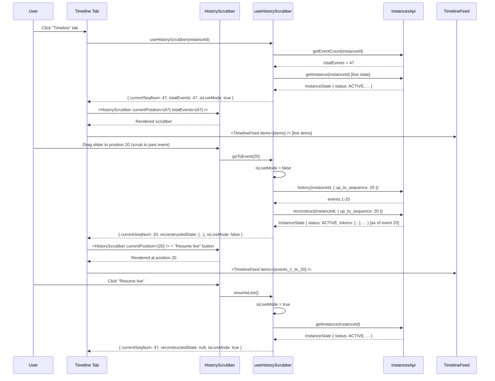

# Module: in-ui-10 — History scrubber with state reconstruction

**Covers:** IN-UI-10  
**Files:** `web/src/components/instances/HistoryScrubber.tsx` (new),
          `web/src/hooks/useHistoryScrubber.ts` (new),
          `web/src/utils/historyScrubberUtils.ts` (new),
          `web/src/pages/instances/InstanceDetailPage.tsx` (enhance Timeline tab)  
**Status:** DRAFT

---

## Module purpose

Enhance the Timeline tab with an interactive timeline scrubber that allows users to:

- **Scrub through event history** — a horizontal timeline slider showing all events
- **Jump to event** — click on any event in the scrubber to jump to that point in history
- **State reconstruction** — when scrubbing to a past event, display the instance state
  as it existed at that moment (via point-in-time query, API-06)
- **Visual feedback** — highlight the current position in the event sequence
- **Event density indication** — visual markers showing event frequency over time

This enables users to understand how the process evolved over time and debug state
changes by stepping through the event log.

---

## Classification rationale

**Type E** — This is a novel timeline interaction component within the existing Timeline tab.
It combines a custom scrubber UI with state reconstruction via point-in-time queries.
Not a standard list page, no CRUD actions, no form submission. The interaction pattern
(slider + state snapshot) is bespoke.

---

## Public interface

### 3.1 `HistoryScrubber`

Located in `web/src/components/instances/HistoryScrubber.tsx`.

```typescript
interface HistoryScrubberProps {
  instanceId: string
  totalEvents: number  // total event count for this instance
  currentPosition: number  // current sequence number (default: totalEvents)
  onPositionChange: (seqNum: number) => void
  isLoading?: boolean
}

// Design signature — no implementation
export function HistoryScrubber(props: HistoryScrubberProps): JSX.Element
```

**Behaviour:**

1. Renders a horizontal timeline scrubber at the top of the Timeline tab:
   - **Slider track**: horizontal bar showing the full event sequence (1 to `totalEvents`)
   - **Thumb**: draggable handle positioned at `currentPosition`
   - **Labels**: "Event N of M" displayed above the slider
2. Event density visualization:
   - Small vertical tick marks along the track at regular intervals
   - Taller ticks for events with higher "significance" (TASK_COMPLETED, INSTANCE_*, ERROR_*)
   - Shorter ticks for routine events (VARIABLE_*, minor state changes)
3. **Hover tooltips**:
   - When hovering over the track or ticks, show event preview:
     - Event type
     - Timestamp (relative + absolute)
     - Brief description (from timeline entry if available)
4. **Click to jump**: clicking anywhere on the track jumps to that event's sequence number
5. **Drag slider**: dragging the thumb continuously updates position (debounced: fire `onPositionChange` every 200ms while dragging)
6. **Keyboard**: arrow keys (left/right) move position by 1; Shift+arrow moves by 10
7. **"Live mode" indicator**: when `currentPosition = totalEvents`, show a "Live" badge.
   Dragging exits live mode; a "Resume live" button reappears to return to latest state.

### 3.2 `useHistoryScrubber` hook

Located in `web/src/hooks/useHistoryScrubber.ts`.

```typescript
interface HistoryScrubberState {
  currentSeqNum: number
  totalEvents: number
  reconstructedState: InstanceState | null  // state as of currentSeqNum
  isLoading: boolean
  isLiveMode: boolean
  error: Error | null
}

export function useHistoryScrubber(
  instanceId: string,
  initialSeqNum?: number  // default: use latest
): HistoryScrubberState & {
  goToEvent: (seqNum: number) => void
  resumeLive: () => void
}
```

**Behaviour:**

1. Initializes with `currentSeqNum = totalEvents` (live mode) unless `initialSeqNum` is provided.
2. Fetches total event count and initial instance state.
3. When `currentSeqNum` changes (via `goToEvent`):
   - Exit live mode (`isLiveMode = false`)
   - Call `instancesApi.history(instanceId, { up_to_sequence: currentSeqNum })`
   - Call `instancesApi.reconstruct(instanceId, { up_to_sequence: currentSeqNum })` to get the state as of that point
   - Update `reconstructedState` and render
4. When `resumeLive()` is called:
   - Set `currentSeqNum = totalEvents`
   - Set `isLiveMode = true`
   - Fetch latest instance state
5. If live mode is active, poll the instance every 2 seconds to detect new events
   and update `totalEvents` and live state.

### 3.3 Updated Timeline tab integration

The Timeline tab (in `web/src/pages/instances/InstanceDetailPage.tsx`) is updated to:

1. Add `<HistoryScrubber>` component at the top of the timeline section
2. When scrubber position changes, re-fetch and display events up to that sequence number
3. Show **"State at event N"** subtitle below the scrubber, with a diff-style indicator
   showing how the state changed after this event:
   - "Variables changed: {keys}"
   - "Tokens moved to: {node_names}"
   - "Tasks completed: {count}"

### 3.4 `historyScrubberUtils` utilities

Located in `web/src/utils/historyScrubberUtils.ts`.

```typescript
// Determine visual "significance" of an event for tick height
export function getEventSignificance(eventType: string): 'high' | 'medium' | 'low'

// Generate human-readable description of state change
export function describeStateChange(
  prevState: InstanceState,
  nextState: InstanceState
): string

// Compute tick positions for timeline visualization
export function computeTickPositions(
  totalEvents: number,
  trackWidth: number,
  minSpacing?: number  // default 8px
): Array<{ position: number; significance: 'high' | 'medium' | 'low' }>
```

---

## Data flow



---

## Error taxonomy

| Error | Cause | UI behaviour |
|---|---|---|
| HTTP 401/403 | Session expired | Redirect to login (handled by client.ts) |
| HTTP 404 | Instance deleted | Show "Instance not found" in scrubber area |
| HTTP 422 | Invalid up_to_sequence | Show "Invalid position" and reset to live |
| HTTP 500 | Backend error | Show "Failed to load event history" message |
| Network failure | Backend unreachable | Show error with retry button |
| State reconstruction timeout | Slow backend | Show spinner "Reconstructing state..." with timeout fallback |

---

## Key invariants

1. **Scrubber is read-only** — does not allow deleting or modifying events, only navigating.
2. **State reconstruction is on-demand** — not cached across different scrubber positions to avoid stale snapshots.
3. **Live mode auto-updates** — while `isLiveMode = true`, the scrubber polls for new events every 2s.
4. **No real-time event stream** — uses polling, not WebSocket subscriptions.
5. **Scrubber position and displayed timeline are synchronized** — if scrubber is at position 20,
   timeline shows events 1-20, not the live timeline.
6. **Timeline entries update on scrub** — when position changes, the timeline component re-renders
   with the new event list for that range.

---

## Dependencies

- `Instance`, `InstanceState`, `EventRecord` types from `web/src/types/api.ts`
- `useInstance` from `web/src/hooks/useInstances.ts` (already exists)
- `useInstanceHistory` from `web/src/hooks/useInstances.ts` (already exists, might need extension for `up_to_sequence`)
- `TimelineFeed` from in-ui-06 (already implemented)
- TanStack Query for polling and state management (already used)
- Input range slider (native `<input type="range">` or external component like rc-slider)
