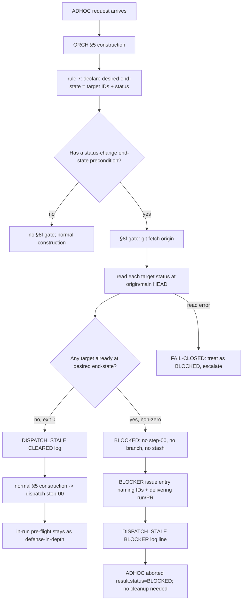

# ORCH Dispatch-Time Staleness Gate — Design Artefact (GH-797 / ISS-0710)

**Module:** `iss0710-gh797-dispatch-staleness-gate`
**Type:** E — Cross-cutting process/docs change (no production code)
**Workflow:** WF-03 Step 2 (fix design) · Run `WF03-GH797-20260816`
**Scope:** `docs/agents/ORCHESTRATOR.md` §5 (new rule 7) + new §8f, mirrored to
`.claude/agents/orchestrator.md`, `.github/instructions/orchestrator.instructions.md`,
`.github/agents/orchestrator.agent.md` per AGENT_SYSTEM.md §9 (A007 — adapters must not drift).

---

## 1. Module purpose

This design specifies a **dispatch-time staleness gate** for the ORCH agent: a lightweight
pre-flight check ORCH performs **before** dispatching any ADHOC run whose desired end state
is a status change in a tracked YAML/data file (for example marking PRM-02/03/04/05
`RELEASED` in `docs/requirements.yaml`). The gate reads each target requirement's status at
`origin/main` HEAD and short-circuits the ADHOC with a BLOCKER if any target is **already**
at the ADHOC's declared desired end state — before step-00 creates a branch or a stash.

The change is **process/docs only**. It adds one construction rule (§5 rule 7) and one
pre-dispatch gate (§8f) to `docs/agents/ORCHESTRATOR.md`, and mirrors that rule into the
canonical per-role ORCH file and the two GitHub-harness adapters. No Zig, no SQL, no
TypeScript, no schema change, no production code path is touched.

The incident this eliminates (ISS-0710 / GH-797): `ADHOC-prm-reqctl-status-20260816` was
dispatched to mark PRM-02/03/04/05 `RELEASED` in `docs/requirements.yaml`, but that work had
already been completed independently by `WF02-prm02-05-20260816` (PR #795). The ADHOC's
**in-run** pre-flight correctly detected the already-`RELEASED` state and aborted BLOCKER —
but only **after** step-00 had already created the housekeeping branch
`housekeeping/reqctl-status-stale-20260816` and a setup stash, which were then orphaned.
The root cause is dispatch-time staleness: no cheap check existed between "ORCH authorizes
the ADHOC against a possibly-stale repo view" and "step-00 mutates the repo". This gate
closes that window.

---

## 2. Verified background (no speculation)

- `python tools/reqctl.py show PRM-02` and `... show PRM-05` both exit 0 on the current
  tree and report `status: RELEASED`, `released_at: 2026-08-15T23:28:26Z` (PRM-02) and
  `23:28:29Z` (PRM-05), with `note: Released via WF02-prm02-05-20260816 (stage 16,
  promotion pipeline)`. PRM-03/PRM-04 share the same `RELEASED` status and the same
  `released_at` window (verified in Step 0.5 / Step 1).
- `docs/issues/ISS-0710.json` records the abort BLOCKER of `ADHOC-prm-reqctl-status-20260816`
  and the orphaned branch/stash. Step 1 (`handoffs/WF03-GH797-20260816/step-01-issue-fixer.json`)
  confirmed the root cause and produced the fix spec this design implements.
- `tools/reqctl.py` `cmd_show` reads `docs/requirements.yaml` from the **working tree**
  (`REQ_FILE = REPO_ROOT / "docs" / "requirements.yaml"`), not from `origin/main`. The
  design therefore treats `git show origin/main:docs/requirements.yaml` + parse as the
  authoritative origin/main read, and `reqctl.py show <id>` as valid only when the working
  tree is confirmed to be at `origin/main` HEAD (see §4.3 and §15).

---

## 3. Classification (Lego selection rules)

Applying `templates/lego-catalog.md` §Selection rules in order:

| Type | Rule match? |
|---|---|
| C — DB migration | No — no table/column/migration is added |
| A — CRUD endpoint | No — no HTTP route is added |
| D — React Flow node | No |
| B — list page | No |
| **E — novel / cross-cutting** | **Yes** — a new ORCH process gate mirrored across four instruction surfaces |

**Result: Type E** → full prose design artefact (this file). No `templates/specs/*.yaml`
parameter file is produced. No `src/design/*.md` beyond this one. The matching codegen does
not apply (Type E has none); the artefact is validated with
`tools/lint_design_artefact.py <file>`.

---

## 4. Public interface

The gate is a **procedural contract ORCH executes at ADHOC construction time**. It is not a
library; its "signature" is the sequence below.

### 4.1 Trigger / applicability

The gate **must** run for every ADHOC run that satisfies **all** of:

1. The ADHOC's desired end state is a status change in a tracked YAML/data file
   (e.g. `docs/requirements.yaml`, `docs/status/requirement_status.yaml`), and
2. The end state is expressed as "requirement IDs → target status" (e.g.
   `{PRM-02, PRM-03, PRM-04, PRM-05} → RELEASED`), and
3. That target status could already be satisfied at `origin/main` HEAD.

If the ADHOC declares no status-change end-state precondition (pure doc write, new content,
infra task), rule 7 requires ORCH to record "no end-state precondition" and the §8f gate is
**not** run — nothing to be stale against.

### 4.2 Inputs

| Input | Source | Example |
|---|---|---|
| `run_id` | ADHOC id | `ADHOC-prm-reqctl-status-20260816` |
| target requirement IDs | the ADHOC's declared end state | `PRM-02, PRM-03, PRM-04, PRM-05` |
| desired end-state status | the ADHOC's declared end state | `RELEASED` |
| `origin/main` | the fetched remote-tracking ref (never the local `main` branch, never the working tree) | — |

### 4.3 Check mechanics (exact commands)

Run **in this order**, before any `fn:git-setup` dispatch:

```bash
# 1. Refresh the true remote state. This is the whole point of the gate: the local
#    view is exactly what went stale in the incident. Failure here = fail-closed.
git fetch origin

# 2a. Authoritative origin/main read: print docs/requirements.yaml at origin/main HEAD
#     and parse the status of each target requirement ID. This reads the fetched ref,
#     NOT the working tree — correct even when the working tree is on a feature branch.
git show origin/main:docs/requirements.yaml
```

`git show origin/main:docs/requirements.yaml` returns non-zero if the path does not exist
at `origin/main` — treat as fail-closed (§9).

**2b. Valid `reqctl.py` alternative (only when the working tree is at origin/main):**
`python tools/reqctl.py show <id>` reads the working-tree file. It is a correct substitute
**only** if the working tree is verified to be at `origin/main` HEAD (e.g. freshly checked
out `main`, clean tree, no local commits ahead). If that cannot be confirmed, do **not**
use `reqctl.py` — use the `git show` parse of step 2a. `reqctl.py show <id>` exits non-zero
with `error: <id> not found` on a missing ID — treat as fail-closed (§9), because an ID that
cannot be read cannot be proven not-already-done.

**3. Compare.** For each target ID, compare the status read at `origin/main` HEAD against
the ADHOC's declared desired end-state status.

### 4.4 Verdict (exit-code-only, per §8a/§8e shape)

| Outcome | Exit code | Verdict |
|---|---|---|
| No target is already at the desired end-state | `0` | **CLEARED** — proceed with normal §5 construction and dispatch step-00 |
| At least one target is already at the desired end-state | non-zero | **BLOCKED** — short-circuit (§5) |
| The read itself failed (fetch/show error, missing ID, unparseable status) | non-zero | **BLOCKED** — fail-closed (§9), escalate, do NOT dispatch |

Follow the §8a/§8e rule verbatim: **judge this gate by the exit code only.** Never phrase
an ADHOC task as "make X stop appearing" — the same trap that produced the 2026-05-30
label-renaming incident (`docs/anti-patterns.md`). If the gate's definition is wrong,
change the definition; do not arrange for it to pass.

### 4.5 Log lines (exact wording)

Append to `handoffs/orchestrator.log` with action `DISPATCH_STALE`, one line on **both**
branches, in the `§9 Orchestrator Log` format:

```
<ISO8601> | DISPATCH_STALE | <RUN-ID> | --- | ORCH | CLEARED — no target already at <end-state> at origin/main HEAD
<ISO8601> | DISPATCH_STALE | <RUN-ID> | --- | ORCH | BLOCKER — target already at <status> at origin/main HEAD (<delivering run/PR>) — ADHOC short-circuited before step-00
```

The BLOCKER line is **normative** (fix-spec mandated):
`<ts> | DISPATCH_STALE | <run-id> | --- | ORCH | BLOCKER — target already at <status> at origin/main HEAD (<delivering run/PR>) — ADHOC short-circuited before step-00`
where `<status>` is the observed end-state status (e.g. `RELEASED`) and
`<delivering run/PR>` is, where known, the run/PR that delivered it (here:
`WF02-prm02-05-20260816` / `PR #795`), else `unknown`.

---

## 5. Short-circuit behavior (BLOCKED path)

If ANY target requirement is already at the ADHOC's desired end-state at `origin/main` HEAD:

1. **ORCH does NOT create or dispatch step-00** — no branch, no `fn:git-setup`, no stash,
   no git-setup handoff. This is the primary control; nothing about the repo is mutated.
2. Abort the ADHOC with `result.status = BLOCKED` (a legal value per
   `docs/agents/shared/HANDOFF_PROTOCOL.md` §4) on the ADHOC's dispatch handoff, with a
   **BLOCKER issue entry** (`docs/issues/ISS-NNNN.json` + GitHub issue, per "No Issue Left
   Local-Only") naming:
   - the already-done requirement IDs (e.g. `PRM-02, PRM-03, PRM-04, PRM-05`), and
   - the delivering run/PR where known (e.g. `WF02-prm02-05-20260816` / `PR #795`).
3. Append the BLOCKER `DISPATCH_STALE` log line (§4.5).
4. **No cleanup is required** — because no branch or stash is ever created. This is the
   structural improvement over the incident, where step-00 had already created both.

If the check passes (no target already at end-state), proceed with normal §5 construction
and dispatch step-00 unchanged.

---

## 6. Defense-in-depth: keep the existing in-run pre-flight

The gate is the **first** line of defence and removes the branch/stash side effect. It does
**not** replace the existing in-run pre-flight ("if already RELEASED, STOP and FAIL with
BLOCKER (someone else fixed it)") — that check stays as **defense-in-depth** for the
dispatch-to-execution race window (work merged between the gate's `git fetch` and step-00's
execution). Both layers remain:

| Layer | When | Protects against |
|---|---|---|
| **§8f dispatch-time gate** (new) | before step-00 | stale view at dispatch → prevents branch/stash creation on already-done work |
| **in-run pre-flight** (existing) | inside the run, after step-00 | the narrow race between gate and execution; never relies on it as the primary control |

Rule for Step 3: the in-run pre-flight wording is **not** removed or weakened by this
change. The §8f section states this explicitly so no future edit deletes it as "redundant".

---

## 7. Data flow diagram



---

## 8. State transitions

ADHOC run lifecycle with the gate inserted:

| State | Transition | Note |
|---|---|---|
| `REQUESTED` | → `CONSTRUCTED` | ORCH classifies; §5 rule 1–6 |
| `CONSTRUCTED` | → `GATED` | rule 7 declares end-state; §8f runs |
| `GATED` | → `DISPATCHED` | verdict CLEARED → step-00 dispatched |
| `GATED` | → `ABORTED` | verdict BLOCKED → no step-00, `result.status = BLOCKED` |
| `GATED` | → `ESCALATED` | fail-closed read error → no dispatch, escalate for investigation |

`ABORTED` is **terminal for the run attempt**: the run is not reworked and not retried
automatically; the BLOCKER issue entry records it. A human/ORCH decides whether the
still-desired work (if any) needs a differently-scoped run. No branch, stash, or git state
exists to unwind.

---

## 9. Error taxonomy

| Error case | Detectable by | Gate outcome | Disposition |
|---|---|---|---|
| `git fetch origin` fails (network/auth) | non-zero exit | BLOCKED, fail-closed | do not dispatch; escalate — true origin state unknown |
| `git show origin/main:docs/requirements.yaml` fails (path absent at origin/main) | non-zero exit | BLOCKED, fail-closed | do not dispatch; escalate — cannot read canonical file |
| target ID missing at origin/main (or via `reqctl.py show` → `error: <id> not found`) | non-zero exit | BLOCKED, fail-closed | do not dispatch; escalate — cannot prove not-already-done |
| target entry unparseable / no `status` field | parse error | BLOCKED, fail-closed | do not dispatch; escalate |
| status value present but unrecognised | compare fails | BLOCKED, fail-closed | do not dispatch; escalate — cannot compare |
| target already at desired end-state | compare matches | BLOCKED (short-circuit) | §5: BLOCKER entry + DISPATCH_STALE BLOCKER log |
| no target at desired end-state | compare clean | CLEARED | proceed to step-00 |

**Fail-closed principle:** every read/parse failure blocks dispatch. Treating any error as
"CLEARED" would recreate the exact gap the gate exists to close — an unverified target must
never be assumed not-done. This mirrors the §8a/§8e "never arrange for the gate to pass"
rule.

---

## 10. Dependencies

**Calls (reads only):**
- `git fetch origin` / `git show origin/main:<path>` — the authoritative origin/main read.
- `tools/reqctl.py show <id>` — optional equivalent, valid only when the working tree is at
  `origin/main` HEAD (see §4.3, §15).
- `docs/requirements.yaml` — the canonical status file this gate class of ADHOC mutates.
- `docs/agents/ORCHESTRATOR.md` — the file the new §5 rule 7 and §8f section live in.
- Mirror surfaces: `.claude/agents/orchestrator.md` (canonical per-role ORCH file),
  `.github/instructions/orchestrator.instructions.md`, `.github/agents/orchestrator.agent.md`
  (GitHub-harness adapters).

**Must not depend on:**
- The local `main` branch or the working tree as the source of truth (that staleness is the
  failure mode being eliminated). Only the fetched `origin/main` ref may drive the verdict.
- The in-run pre-flight as the primary control (it is defense-in-depth only, §6).
- Any production code, `src/`, `migrations/`, or build tooling — this gate runs entirely at
  the repo/git level and must not require a compiled binary or DB.

---

## 11. Exact wording for the new `ORCHESTRATOR.md` §8f section

Step 3 (BACKEND-DEV) inserts the following section into `docs/agents/ORCHESTRATOR.md`
immediately after §8e, mirroring the §8a/§8e shape (timing, command, exit-code verdict,
log line on both branches, "judge by exit code only", ADHOC/handoff consequence):

> ## 8f. Dispatch-Time Staleness Check — BEFORE an ADHOC run's Step 00
>
> Before ORCH constructs and dispatches any ADHOC run whose desired end state is a status
> change in a tracked YAML/data file (e.g. marking PRM-02/03/04/05 `RELEASED` in
> `docs/requirements.yaml`), it MUST verify no target requirement is already at that end
> state at `origin/main` HEAD. **Check before step-00 — do not create the branch or stash
> first and discover afterwards.** This gate closes the dispatch-time staleness window
> behind GH-797 / ISS-0710, where `ADHOC-prm-reqctl-status-20260816` aborted BLOCKER only
> after step-00 had already created a housekeeping branch and stash.
>
> ```bash
> git fetch origin
> git show origin/main:docs/requirements.yaml   # then parse each target ID's status
> ```
>
> For each requirement ID targeted by the ADHOC's declared desired end-state, read its
> status at `origin/main` HEAD and compare it against the declared desired status. Use
> `git show origin/main:docs/requirements.yaml` + parse as the authoritative read;
> `python tools/reqctl.py show <id>` is a valid substitute only when the working tree is
> verified to be at `origin/main` HEAD.
>
> **Exit 0 → CLEARED.** No target is already at the desired end-state. Log:
> `<ISO8601> | DISPATCH_STALE | <RUN-ID> | --- | ORCH | CLEARED — no target already at <end-state> at origin/main HEAD`
> Then proceed with normal §5 construction and dispatch step-00.
>
> **Non-zero exit → BLOCKED.** At least one target is already at the ADHOC's desired
> end-state at `origin/main` HEAD, OR the read could not be completed. Do NOT create or
> dispatch step-00 — no branch, no stash, no `fn:git-setup`. Abort the ADHOC with
> `result.status = BLOCKED`, file a BLOCKER issue entry naming the already-done requirement
> IDs and, where known, the delivering run/PR (here: `WF02-prm02-05-20260816` / `PR #795`),
> and log:
> `<ISO8601> | DISPATCH_STALE | <RUN-ID> | --- | ORCH | BLOCKER — target already at <status> at origin/main HEAD (<delivering run/PR>) — ADHOC short-circuited before step-00`
> No cleanup is required because no branch or stash is ever created.
>
> **Judge this gate by the exit code only.** Never phrase an ADHOC task as "make X stop
> appearing" — the same trap as §8a/§8e and the 2026-05-30 label-renaming incident
> (`docs/anti-patterns.md`). If the gate's definition is wrong, change the definition; do
> not arrange for it to pass. **Fail-closed:** a fetch/show/parse failure is BLOCKED, never
> CLEARED — an unverified target must not be assumed not-done.
>
> **Defense-in-depth:** the existing in-run pre-flight ("if already RELEASED, STOP and FAIL
> with BLOCKER (someone else fixed it)") is retained for the dispatch-to-execution race
> window; it is not the primary control.

---

## 12. Exact wording for the new `ORCHESTRATOR.md` §5 construction rule 7

Step 3 appends rule 7 to the §5 "Construction rules" numbered list:

> 7. **Dispatch-time end-state precondition.** If the ADHOC's desired end state is a status
>    change in a tracked YAML/data file, declare the target requirement IDs and the desired
>    end-state status as part of the constructed workflow, then run the **§8f Dispatch-Time
>    Staleness Check BEFORE dispatching step-00**. If any target is already at the desired
>    end-state at `origin/main` HEAD, do NOT create or dispatch step-00 (no branch, no
>    stash) — abort with `result.status = BLOCKED` (see §8f).

---

## 13. Adapter mirroring (AGENT_SYSTEM.md §9 / A007)

Per `docs/agents/AGENT_SYSTEM.md` §9, per-role instruction text is canonical in
`.claude/agents/orchestrator.md`; `.github/instructions/orchestrator.instructions.md` and
`.github/agents/orchestrator.agent.md` are adapters that **must not drift**. Step 3 MUST
apply the same change to **all three** surfaces:

1. `.claude/agents/orchestrator.md` (canonical) — add the §8f-equivalent dispatch-time
   staleness gate (rule 7 + the gate prose) in its ad-hoc-construction section.
2. `.github/instructions/orchestrator.instructions.md` (GitHub-harness adapter) — mirror
   the same rule/gate in its ad-hoc construction section.
3. `.github/agents/orchestrator.agent.md` (GitHub-harness adapter) — mirror the same.

`tools/lint_agent_docs.py` A007 computes Jaccard similarity between the canonical file and
each adapter and flags pairs below 0.55 (MINOR). The three `orchestrator` surfaces are
currently in the acknowledged baseline below threshold (`orchestrator.agent.md` 0.40,
`orchestrator.instructions.md` 0.42) — so the mirroring for this change must be applied to
the canonical file **and** both adapters in the same Step 3 change, moving similarity
upward, and A007 must show no NEW drift introduced by this change. Do not edit only
`CLAUDE.md`'s pointer table (the role line is unchanged).

---

## 14. Validation plan (what runs on this artefact)

- `tools/lint_design_artefact.py src/design/iss0710-gh797-dispatch-staleness-gate.md` must
  exit 0 with BLOCKER=0 and MAJOR=0 (this is an acceptance criterion for Step 2; the linter
  applies to Type E markdown in `src/design/`, process/docs designs included).
- No codegen `--dry-run` applies (Type E has no matching codegen; no `templates/specs/*.yaml`
  is produced).
- Step 3 (BACKEND-DEV) must implement the docs change and verify: (a) the §8f section and
  rule 7 exist verbatim in `docs/agents/ORCHESTRATOR.md`; (b) the mirror surfaces match;
  (c) `tools/lint_agent_docs.py` shows no new A007 drift below threshold from this change;
  (d) `tools/lint_handoffs.py` still exits 0 after the run's handoff updates.

---

## 15. Open questions

1. **`reqctl.py` origin/main read.** `tools/reqctl.py` reads only the working-tree file and
   has no `--ref`/`--file` option, so the authoritative origin/main read in this design is
   `git show origin/main:docs/requirements.yaml` + parse, with `reqctl.py show` valid only
   on a confirmed-at-origin/main working tree. A future enhancement (give `reqctl.py` a
   `--ref origin/main` option) would remove the two-mechanism split. **Flag for
   REQ-ANALYST/ORCH:** out of scope for this fix; noted for a possible follow-up.
2. **Scope of "desired end-state" preconditions.** This gate covers status-change ADHOCs
   (end state = IDs → status). Should future ADHOCs that are "idempotent content writes"
   (e.g. regenerate a snapshot) also declare an end-state precondition? Current design:
   no — rule 7 only mandates the gate when a status-change precondition is declared.
   **Flag:** confirm this boundary is acceptable.
3. **`origin/main` vs "already merged anywhere".** The gate reads only `origin/main` HEAD,
   which is where pipeline merges land. It does not scan open PRs/branches for
   in-flight duplicate work (that is §10 deconfliction's job). **Flag:** confirm no
   additional check is expected here.
