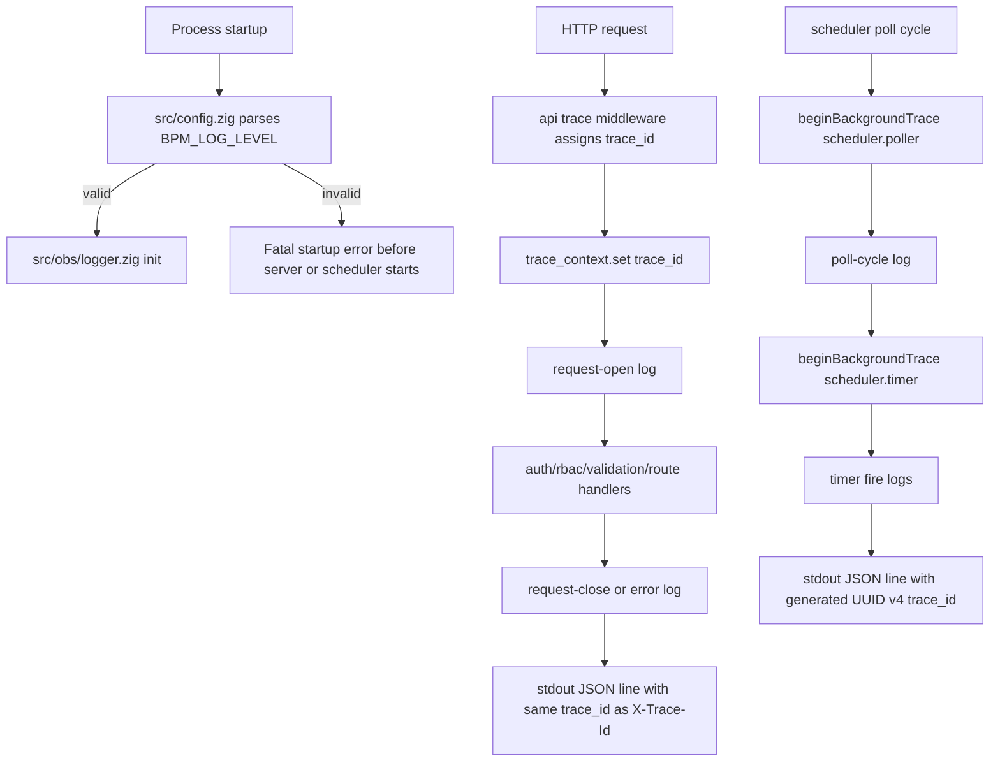
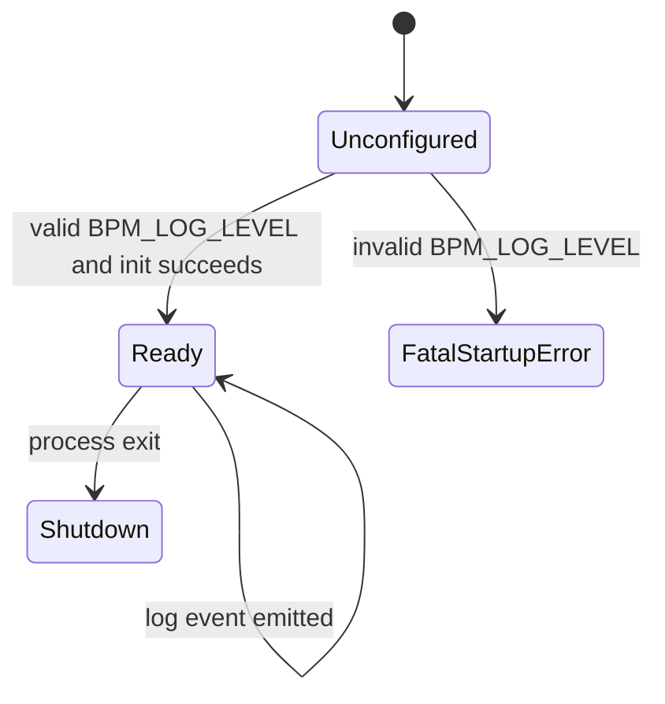
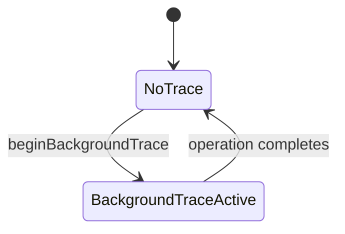

# Module: obs-01-structured-logging

**Covers:** OBS-01 (Structured logging)
**Related:** API-09 (request tracing), OBS-03 (audit log separation), API-12 (health requests still traced), Stage 6 observability subsystem
**Primary design target:** `src/obs/logger.zig`

## Module purpose

The structured logging module is the platform-wide boundary for emitting single-line JSON log entries to stdout without leaking sensitive data. It defines the canonical log schema, startup-time `BPM_LOG_LEVEL` validation, request-trace integration with API-09, and explicit background-operation trace generation for scheduler and timer work. The module is intentionally narrow: it formats, redacts, and writes structured log events, while request trace assignment remains owned by the API tracing design and audit persistence remains a separate concern.

## Module boundaries

- `src/obs/logger.zig`
  - Owns log-level filtering, JSON line serialization, stdout writes, and context redaction.
  - Exposes request-safe and background-safe logging entry points.
- `src/config.zig`
  - Owns `BPM_LOG_LEVEL` environment parsing and fatal invalid-config handling during startup.
  - Passes validated log configuration into logger initialization.
- `src/api/trace_context.zig`
  - Remains the source of truth for request-scoped `trace_id` values defined by API-09.
  - Logger reads from this module when no explicit trace override is provided.
- `src/api/middleware/trace.zig`
  - Continues to assign and return request trace IDs.
  - Must run before any middleware that logs request activity.
- `src/api/server.zig` or middleware chain assembly
  - Uses the logger for request-open and request-close events.
- `src/scheduler/scheduler.zig`
  - Creates a background operation trace scope for each poll cycle and each due-timer execution chain.

Out of scope:

- Audit-log database writes (`src/obs/audit.zig`).
- Metrics collection (`src/obs/metrics.zig`).
- Database schema changes.
- External log shipping or retention policies.

## Public interface

### Zig types

```zig
pub const LogLevel = enum(u8) {
    DEBUG,
    INFO,
    WARN,
    ERROR,
};

pub const LoggerConfig = struct {
    level: LogLevel,
    component: []const u8,
};

pub const LogField = struct {
    key: []const u8,
    value: LogValue,
};

pub const LogValue = union(enum) {
    string: []const u8,
    integer: i64,
    float: f64,
    boolean: bool,
    null: void,
};

pub const TraceContext = struct {
    trace_id: []const u8,
    source: enum {
        request,
        background,
        none,
    },
};

pub const LogEntry = struct {
    timestamp: []const u8,
    level: LogLevel,
    trace_id: []const u8,
    component: []const u8,
    message: []const u8,
    fields: []const LogField,
};

pub const BackgroundTraceScope = struct {
    trace_id: [36]u8,
    component: []const u8,
};

pub const LoggerError = error{
    InvalidLogLevel,
    ReservedField,
    JsonSerialisationFailed,
    StdoutWriteFailed,
    OutOfMemory,
};
```

### Zig functions

```zig
pub fn parseLogLevel(raw: []const u8) LoggerError!LogLevel;

pub fn init(config: LoggerConfig) LoggerError!void;

pub fn log(
    allocator: std.mem.Allocator,
    level: LogLevel,
    component: []const u8,
    message: []const u8,
    fields: []const LogField,
) LoggerError!void;

pub fn logWithTrace(
    allocator: std.mem.Allocator,
    level: LogLevel,
    component: []const u8,
    trace: TraceContext,
    message: []const u8,
    fields: []const LogField,
) LoggerError!void;

pub fn beginBackgroundTrace(
    component: []const u8,
) BackgroundTraceScope;

pub fn currentTraceContext() TraceContext;

pub fn redactFields(
    allocator: std.mem.Allocator,
    fields: []const LogField,
) LoggerError![]LogField;
```

## Log schema

Every emitted entry is exactly one JSON object on one stdout line. No multi-line pretty printing is permitted.

### Required fields

| Field | Type | Rule |
|---|---|---|
| `timestamp` | string | RFC 3339 / ISO 8601 UTC timestamp; logger emits the final serialized form |
| `level` | string | One of `DEBUG`, `INFO`, `WARN`, `ERROR` |
| `trace_id` | string | Request trace from API-09, background-generated UUID v4, or `""` when no active trace exists |
| `component` | string | Stable subsystem identifier such as `api.server`, `scheduler.poller`, `identity.registry` |
| `message` | string | Human-readable event summary; must not contain raw secrets |

### Optional context field rules

- Optional fields are serialized as additional top-level JSON properties to match the backend architecture example.
- Reserved keys are `timestamp`, `level`, `trace_id`, `component`, and `message`.
- If a caller supplies a reserved key in `fields`, the logger returns `error.ReservedField` to the immediate caller during design validation paths; implementation callers should not pass reserved names.
- Field order is stable: required fields first in the order above, then optional fields in input order after redaction.
- Optional context is intended for identifiers and measurements such as `instance_id`, `task_id`, `status_code`, `duration_ms`, `definition_id`, `timer_id`, and `poll_cycle`.

### Example request log line

```json
{
  "timestamp": "2026-05-24T08:42:20.123456Z",
  "level": "INFO",
  "trace_id": "550e8400-e29b-41d4-a716-446655440000",
  "component": "api.server",
  "message": "request completed",
  "method": "POST",
  "path": "/instances",
  "status_code": 201,
  "duration_ms": 14
}
```

### Example background log line

```json
{
  "timestamp": "2026-05-24T08:42:25.000000Z",
  "level": "DEBUG",
  "trace_id": "6f1d9f1d-44aa-4c15-8f6a-6f6d0d7f3d31",
  "component": "scheduler.poller",
  "message": "timer poll cycle started",
  "poll_cycle": 184,
  "due_count": 3
}
```

## BPM_LOG_LEVEL parsing and fatal-startup rules

`BPM_LOG_LEVEL` is validated in `src/config.zig` before the process accepts requests or starts scheduler threads.

Rules:

1. If `BPM_LOG_LEVEL` is unset, default to `INFO`.
2. Allowed exact values are `DEBUG`, `INFO`, `WARN`, and `ERROR`.
3. Parsing is case-sensitive for startup determinism. Values such as `debug`, `Info`, `TRACE`, `WARNING`, empty string, or whitespace-only are invalid.
4. Any invalid value causes fatal startup failure before logger initialization completes.
5. Fatal startup failure must include a clear operator-facing error message naming the invalid value and the allowed set.
6. Fatal startup failure must occur before the HTTP server or scheduler begins work, so no request or background logs are emitted under an invalid configuration.

Startup ownership:

- `src/config.zig` parses the env var and returns `error.InvalidLogLevel` on mismatch.
- `src/main.zig` treats `error.InvalidLogLevel` as fatal process startup failure.
- `src/obs/logger.zig` assumes it receives a validated enum, not raw env text.

## Trace propagation design

### Request path integration with API-09

- API-09 remains the only place that assigns request trace IDs.
- `src/api/middleware/trace.zig` sets `src/api/trace_context.zig` before any request-open logging occurs.
- `currentTraceContext()` first checks for an explicit trace passed by `logWithTrace`; otherwise it reads `trace_context.get()`.
- Any log emitted during request processing without an explicit override must resolve to the same trace ID that API-09 returns in the `X-Trace-Id` response header.
- This includes request-open logs, request-close logs, route-handler logs, auth failures, validation failures, and error-response logs.

### Background-task trace generation

- Background work cannot rely on request thread-local state.
- Each scheduler poll cycle calls `beginBackgroundTrace("scheduler.poller")` once at cycle start.
- Each due-timer execution chain may either reuse the poll-cycle trace when treated as one operation or create a new scope with `beginBackgroundTrace("scheduler.timer")` when an individual timer fire needs distinct correlation. The design standard is: one generated trace per timer-fire transaction, plus an optional separate poll-cycle trace for aggregate cycle logging.
- Background traces must be UUID v4 values generated internally by the platform.
- The generated trace is passed explicitly through `logWithTrace`, never by mutating request thread-local storage.
- When a background operation triggers outbound API or webhook calls in later stages, the same generated trace is the correlation value to propagate outward.

### No-trace fallback

- If code logs outside a request and outside a background trace scope, `trace_id` is serialized as `""`.
- This fallback is allowed for one-time startup/shutdown logs and other process-level events not tied to a request or background operation.

## Redaction policy

Redaction is deterministic and applied before serialization.

### Sensitive-field rules

The logger must replace the value with `"[REDACTED]"` when a context field key matches any of the following case-insensitive names:

- `authorization`
- `password`
- `password_hash`
- `token`
- `access_token`
- `refresh_token`
- `bootstrap_token`
- `api_token`
- `secret`
- `client_secret`
- `credential`
- `credentials`
- `set-cookie`
- `cookie`

Additional matching rules:

- Keys ending in `_token`, `_secret`, `_password`, or `_credential` are also redacted.
- Nested or encoded payload snapshots must not be logged as raw request bodies when they may contain secrets; callers should log stable identifiers instead.
- Free-text `message` values must use fixed templates and must not interpolate sensitive values.

### Redaction behavior

- The key remains present in the output so operators can see that data existed.
- Only the value is replaced with `"[REDACTED]"`.
- Non-sensitive sibling fields remain untouched.
- Redaction applies equally to request logs, auth logs, scheduler logs, and internal error logs.

### Concrete examples

Input fields:

```json
{
  "authorization": "Bearer abc123",
  "username": "alice",
  "password": "p@ssw0rd"
}
```

Serialized fields:

```json
{
  "authorization": "[REDACTED]",
  "username": "alice",
  "password": "[REDACTED]"
}
```

## Data flow diagram



## State transitions

Logger lifecycle:



Background trace lifecycle:



## Error taxonomy

| Condition | Error | Severity | Handling rule |
|---|---|---|---|
| `BPM_LOG_LEVEL` invalid | `InvalidLogLevel` | BLOCKER | Fatal startup failure in `src/main.zig` |
| Optional field uses reserved key | `ReservedField` | MAJOR | Caller bug; reject at logger boundary in development and tests |
| JSON serialization fails | `JsonSerialisationFailed` | MAJOR | Request/background work continues; implementation records fallback internal error path without leaking secrets |
| stdout write fails | `StdoutWriteFailed` | MAJOR | Request/background work continues; operational fault surfaced through process supervision and diagnostics |
| Allocation failure while building line | `OutOfMemory` | MAJOR | Propagate to caller; do not silently emit partial JSON |

## Dependencies and forbidden dependencies

Depends on:

- `src/config.zig` for validated log level.
- `src/api/trace_context.zig` for request-scoped trace lookup.
- `src/api/middleware/trace.zig` and server assembly order from API-09.
- `std.io.getStdOut()` or equivalent stdout writer.
- UUID v4 generation utility already used by API-09 or a shared internal helper.

Must not depend on:

- Database access or migrations.
- `src/obs/audit.zig` internals.
- `src/engine/transition.zig`.
- Frontend code.

## Integration points

### API request pipeline

- Request-open logging is step 2 of the backend architecture request pipeline and must execute after trace injection but before auth.
- Request-close logging is step 10 and must reuse the same request trace.
- Auth failures still log with the assigned request trace per API-09 edge-case rules.

### Scheduler and timer work

- Scheduler poll start/end logs use a poll-cycle background trace.
- Each fired timer transaction logs with a generated timer-operation trace so all timer-fire logs for one execution chain remain correlated.
- Late-fire recovery and jitter handling logs reuse the same background trace for a single timer-fire operation.

### Health and startup

- Health endpoint requests are normal API requests and therefore use request trace propagation.
- Startup logs before the server is ready may use `trace_id = ""`.

### Audit separation

- Audit logging remains a separate subsystem and must not be implemented by stdout structured logs.
- Structured logging can include audit-related outcome summaries, but it does not replace durable audit records.

## Acceptance-criteria traceability

| OBS-01 requirement | Design elements | Integration points | Validation notes |
|---|---|---|---|
| Every log entry is single-line JSON with minimum fields | `Log schema`, `LogEntry`, field-order rules, examples | `src/obs/logger.zig`, request-open/request-close logging | Unit test serializes one entry and asserts one line, valid JSON, and required keys |
| `BPM_LOG_LEVEL` supports DEBUG/INFO/WARN/ERROR | `LogLevel`, `parseLogLevel`, startup rules | `src/config.zig`, `src/main.zig` | Table-driven config parsing test for valid values and default-to-INFO behavior |
| Invalid `BPM_LOG_LEVEL` is fatal at startup | `BPM_LOG_LEVEL parsing and fatal-startup rules`, error taxonomy | `src/config.zig` before server/scheduler start | Startup configuration test asserts invalid values return `InvalidLogLevel` and process init aborts |
| Sensitive fields are not logged | `Redaction policy`, `redactFields`, fixed-message rule | all logger call sites | Unit tests cover named keys, suffix-based matches, and sibling-field preservation |
| Request logs carry same trace as API-09 response header | `Trace propagation design`, request path rules | `src/api/middleware/trace.zig`, `src/api/trace_context.zig`, request-open/request-close logs | Integration test captures `X-Trace-Id` and stdout lines and asserts equality across request logs |

## Edge-case traceability

| Edge case | Design handling | Integration points | Validation notes |
|---|---|---|---|
| Background scheduler or timer log entry | `Background-task trace generation` with UUID v4 | `src/scheduler/scheduler.zig` | Unit/integration test asserts non-empty UUID-shaped trace on timer-fire log lines |
| Sensitive field would otherwise be logged | `Redaction behavior` replaces value with `"[REDACTED]"` | any logger caller with sensitive context | Unit test asserts key remains and value is redacted |
| Request with caller-supplied non-UUID `X-Trace-Id` | API-09 owns acceptance; logger uses propagated trace as-is | `src/api/middleware/trace.zig`, `src/api/trace_context.zig` | Integration test asserts log `trace_id` equals exact caller header value |
| Startup/shutdown log outside request scope | `No-trace fallback` emits empty string | `src/main.zig` startup path | Unit test asserts `trace_id` is `""` when no trace context is active |

## Open questions

1. The backend architecture shows microsecond-precision timestamps, while OBS-01 requires ISO 8601 generally. This design aligns on RFC 3339 UTC with microsecond precision; confirm that this precision is the platform-wide standard.
2. The design reserves top-level context fields to match the architecture example. If future requirements need nested structured objects, the schema rules should be extended explicitly rather than allowing arbitrary JSON values now.