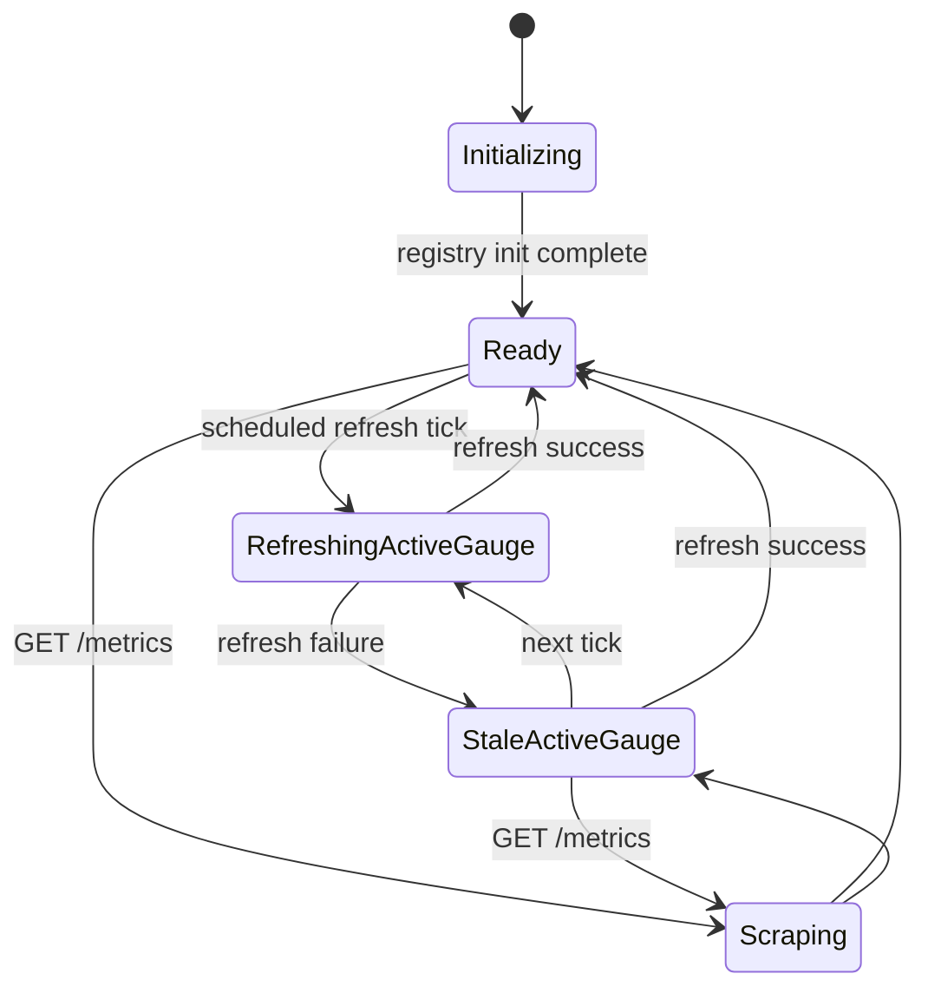

# Module: obs-02-prometheus-metrics

**Covers:** OBS-02 (Prometheus metrics)
**Related:** OBS-01 (structured logs), API-12 (health endpoints are separate), API-09 (trace-aware HTTP instrumentation)
**Primary design targets:** `src/obs/metrics.zig`, `src/api/routes/metrics.zig`, integration hooks in `src/api/server.zig`, `src/db/pool.zig`, `src/event_store/store.zig`, and task-completion flow modules

## Module purpose

The OBS-02 metrics module provides a non-blocking Prometheus scrape endpoint at `GET /metrics` and a process-local registry that captures platform behavior for request traffic, error rates, event append latency, DB query latency, active instance count, and task completions. The design guarantees that scrape requests never execute write-path database queries and never contend with request processing locks. During database outages, the endpoint continues to return HTTP 200 with in-memory metric state; only `bpm_active_instances_total` is allowed to become stale.

## Public interface

```zig
pub const MetricsRegistry = struct {
    allocator: std.mem.Allocator,
    clock: *const Clock,
    active_instances: Gauge,
    task_completions: CounterVec,
    event_append_duration: Histogram,
    db_query_duration: HistogramVec,
    http_requests: CounterVec,
    http_errors: CounterVec,
    snapshot_meta: SnapshotMeta,
};

pub const SnapshotMeta = struct {
    last_active_instances_refresh_unix_ms: i64,
    active_instances_stale: bool,
    last_refresh_error: ?MetricsErrorCode,
};

pub const QueryType = enum {
    select,
    insert,
    update,
    delete,
    begin,
    commit,
    rollback,
    migration,
    other,
};

pub const HttpLabels = struct {
    method: []const u8,
    path: []const u8,
    status: u16,
};

pub const MetricsErrorCode = enum {
    ActiveInstanceRefreshFailed,
    RenderFailed,
};

pub const MetricsError = error{
    OutOfMemory,
    RenderFailed,
};

pub fn init(
    allocator: std.mem.Allocator,
    clock: *const Clock,
) MetricsError!MetricsRegistry;

pub fn deinit(registry: *MetricsRegistry) void;

pub fn observeEventAppendDurationSeconds(
    registry: *MetricsRegistry,
    duration_seconds: f64,
) void;

pub fn observeDbQueryDurationSeconds(
    registry: *MetricsRegistry,
    query_type: QueryType,
    duration_seconds: f64,
) void;

pub fn incTaskCompletions(
    registry: *MetricsRegistry,
    definition_id: []const u8,
) void;

pub fn incHttpRequest(
    registry: *MetricsRegistry,
    labels: HttpLabels,
) void;

pub fn incHttpError5xx(
    registry: *MetricsRegistry,
    path: []const u8,
) void;

pub fn setActiveInstances(
    registry: *MetricsRegistry,
    count: u64,
) void;

pub fn markActiveInstancesStale(
    registry: *MetricsRegistry,
    now_unix_ms: i64,
) void;

pub fn collectPrometheusText(
    registry: *MetricsRegistry,
    allocator: std.mem.Allocator,
) MetricsError![]const u8;

pub fn handleMetrics(
    allocator: std.mem.Allocator,
    registry: *MetricsRegistry,
) HandlerResult;
```

## Data types

```zig
pub const Gauge = struct {
    value_bits: std.atomic.Value(u64),
};

pub const CounterVec = struct {
    // Map<labelset_key, atomic u64>
};

pub const Histogram = struct {
    buckets: []const f64,
    cumulative_counts: []std.atomic.Value(u64),
    sum_bits: std.atomic.Value(u64),
    count: std.atomic.Value(u64),
};

pub const HistogramVec = struct {
    // Map<labelset_key, Histogram>
};
```

## Metric contracts

All metrics use the `bpm_` prefix and are process-local (reset on process restart).

| Metric | Type | Unit | Labels | Contract |
|---|---|---|---|---|
| `bpm_active_instances_total` | Gauge | count | none | Current count of `instances.status = ACTIVE`; updated by periodic refresher and never scraped from DB in request path |
| `bpm_task_completions_total` | Counter | count | `definition_id` | Increment exactly once after successful task completion transaction commit |
| `bpm_event_append_duration_seconds` | Histogram | seconds | none | Observe end-to-end latency for append operation around event-store append boundary |
| `bpm_db_query_duration_seconds` | Histogram | seconds | `query_type` | Observe DB statement latency in pool/query wrapper using normalized query type classification |
| `bpm_http_requests_total` | Counter | count | `method`, `path`, `status` | Increment once per completed HTTP response, including failures |
| `bpm_http_errors_total` | Counter | count | `path` | Increment once for each HTTP response with status 500-599 |

### Prometheus exposition requirements

`GET /metrics` must emit:

1. HTTP status `200`.
2. Header `Content-Type: text/plain; version=0.0.4`.
3. Valid text exposition including `# HELP` and `# TYPE` for all six required metrics.

Example lines (abridged):

```text
# HELP bpm_active_instances_total Current number of ACTIVE instances.
# TYPE bpm_active_instances_total gauge
bpm_active_instances_total 42

# HELP bpm_task_completions_total Total task completions since process startup.
# TYPE bpm_task_completions_total counter
bpm_task_completions_total{definition_id="order_approval_v2"} 128

# HELP bpm_event_append_duration_seconds Event append latency in seconds.
# TYPE bpm_event_append_duration_seconds histogram
bpm_event_append_duration_seconds_bucket{le="0.005"} 17
bpm_event_append_duration_seconds_bucket{le="0.01"} 36
bpm_event_append_duration_seconds_bucket{le="+Inf"} 128
bpm_event_append_duration_seconds_sum 2.913
bpm_event_append_duration_seconds_count 128
```

## Histogram bucket strategy (p50/p95/p99 support)

For both histograms (`bpm_event_append_duration_seconds`, `bpm_db_query_duration_seconds`), use explicit bucket boundaries:

```text
[0.001, 0.0025, 0.005, 0.01, 0.025, 0.05, 0.1, 0.25, 0.5, 1.0, 2.5, 5.0, 10.0, +Inf]
```

Rationale:

1. Dense low-latency buckets for sub-10ms precision.
2. Mid-range buckets for steady-state DB/API performance.
3. High-end buckets for outage/degradation visibility.
4. Accurate quantile approximation for p50, p95, p99 via `histogram_quantile`.

Reference queries:

```promql
histogram_quantile(0.50, sum(rate(bpm_event_append_duration_seconds_bucket[5m])) by (le))
histogram_quantile(0.95, sum(rate(bpm_event_append_duration_seconds_bucket[5m])) by (le))
histogram_quantile(0.99, sum(rate(bpm_event_append_duration_seconds_bucket[5m])) by (le))
```

Same query shape applies to `bpm_db_query_duration_seconds_bucket` with `query_type` grouping when needed.

## Instrumentation integration points

### 1. API routing and middleware

- Integration location: final response write path in `src/api/server.zig`.
- Increment `bpm_http_requests_total{method,path,status}` exactly once per completed request.
- If `status` is 5xx, also increment `bpm_http_errors_total{path}`.
- `path` must use canonical route template values (for example `/instances/:id`, not raw IDs).

### 2. Event append flow

- Integration location: event append service boundary around `event_store.append` call.
- Start monotonic timer immediately before append invocation; observe elapsed seconds after completion/failure return.
- Record every attempt (success and failure) so latency visibility includes degraded paths.

### 3. DB query execution

- Integration location: low-level query/exec/queryRow wrappers in `src/db/pool.zig` or a shared DB instrumentation adapter.
- Classify each statement into `query_type` using first SQL verb plus transaction verbs.
- Observe elapsed query duration for each DB call.

### 4. Task completion path

- Integration location: task completion service after transaction commit that transitions task to `COMPLETED`.
- Increment `bpm_task_completions_total{definition_id}` once per committed completion.
- `definition_id` comes from resolved instance-definition linkage in the same command context.

### 5. Active instance gauge lifecycle

- Integration location: background refresher thread under observability subsystem.
- Refresh query: `SELECT count(*) FROM instances WHERE status = 'ACTIVE'` at fixed interval (default 5s).
- On successful refresh: update gauge value and clear stale flag.
- On DB failure: preserve last gauge value and mark stale metadata.
- Scrape path never issues this DB query.

## Data flow diagram

```mermaid
flowchart TD
    A[HTTP/API request path] --> B[Route execution]
    B --> C[Response writer in api.server]
    C --> D[bpm_http_requests_total++]
    C --> E{status >= 500}
    E -->|yes| F[bpm_http_errors_total++]

    G[Event append command] --> H[Timer start]
    H --> I[event_store.append]
    I --> J[Timer stop]
    J --> K[bpm_event_append_duration_seconds.observe]

    L[db.pool query/exec wrappers] --> M[Classify query_type]
    M --> N[Measure elapsed]
    N --> O[bpm_db_query_duration_seconds.observe]

    P[Task completion commit] --> Q[resolve definition_id]
    Q --> R[bpm_task_completions_total{definition_id}++]

    S[Background refresher interval] --> T[COUNT ACTIVE query]
    T -->|success| U[set bpm_active_instances_total]
    T -->|failure| V[keep previous value + stale flag]

    W[GET /metrics] --> X[collectPrometheusText in-memory]
    X --> Y[HTTP 200 + text/plain; version=0.0.4]
```

## Scrape handler behavior

`src/api/routes/metrics.zig::handleMetrics` behavior:

1. No authentication required (public endpoint by requirement).
2. No database calls on request path.
3. Serialize registry snapshot into Prometheus text.
4. Return HTTP 200 with `Content-Type: text/plain; version=0.0.4`.
5. If serialization allocation fails, still avoid blocking unrelated API traffic; return RFC 9457 500 for this request only.

## Non-blocking guarantees

1. Metric updates use lock-free atomics on hot paths (request, DB, event append).
2. Label-set maps use striped mutexes only during first-seen label registration; steady-state increments are atomic.
3. Scrape rendering reads immutable bucket metadata and atomic counters; no global write lock.
4. Active-instance DB refresh runs in background and publishes latest snapshot atomically.
5. Slow client scrape affects only the scrape response writer; it never acquires business-path locks.

## Cardinality controls

1. `path` label source is route template, never raw URL path, preventing unbounded IDs.
2. `method` limited to known HTTP methods.
3. `status` label stored as canonical 3-digit string.
4. `query_type` limited to enum values in `QueryType`.
5. `definition_id` label capped by max length (128 chars); unknown/empty values normalized to `_unknown`.
6. No additional dynamic labels beyond required contracts.

## Stale-data behavior during DB outage

When DB refresh fails:

1. `GET /metrics` still returns HTTP 200 and all in-memory counters/histograms.
2. `bpm_active_instances_total` keeps the last successful value.
3. Registry marks snapshot metadata `active_instances_stale = true` and records refresh failure code internally for logs.
4. On next successful refresh, stale flag clears and gauge updates.

This directly satisfies the OBS-02 edge case requiring availability of metrics output during DB outage with possibly stale active-instance gauge.

## State transitions



## Error taxonomy

| Condition | Error | Severity | Handling |
|---|---|---|---|
| Prometheus text render allocation failure | `RenderFailed` | MAJOR | Return HTTP 500 for `/metrics` request; no impact to other API handlers |
| Background active-instance refresh query failure | `ActiveInstanceRefreshFailed` | MAJOR | Keep prior gauge value, mark stale metadata, continue periodic retries |
| Unknown `definition_id` in task completion context | normalization event | MINOR | Use `_unknown` label value; never fail business command |
| Unknown SQL classification | normalization event | MINOR | Map to `query_type="other"` |

## Key invariants

1. `GET /metrics` always attempts in-memory exposition; it never blocks on live DB reads.
2. Exactly six required OBS-02 metric names are always present in exposition.
3. Histogram families always emit `_bucket`, `_sum`, `_count` series.
4. `bpm_http_errors_total` only counts responses with status 5xx.
5. Metrics updates cannot cause request-path failures (best-effort instrumentation).

## External dependencies

Depends on:

1. `src/api/server.zig` route template + response finalization hooks.
2. `src/db/pool.zig` query wrapper integration.
3. `src/event_store/store.zig` append boundary timing integration.
4. Task completion service/store for post-commit metric increment.
5. Existing logger for stale-refresh diagnostics.

Must not depend on:

1. Frontend code.
2. Migration-time schema mutation logic.
3. `src/engine/transition.zig` pure-function internals.

## Acceptance and edge-case traceability

| OBS-02 requirement or edge case | Concrete design element | Validation target |
|---|---|---|
| `GET /metrics` returns 200 and Prometheus content type | Scrape handler behavior section; explicit header contract | Integration test for status/header/body format |
| No authentication required | Scrape handler behavior step 1 | Routing/auth integration test proving public access |
| `bpm_active_instances_total` gauge present | Metric contracts table + active gauge lifecycle | Parse exposition and assert gauge family exists |
| `bpm_task_completions_total{definition_id}` counter present | Metric contracts + task completion integration point | Task completion test asserts counter increment per definition |
| `bpm_event_append_duration_seconds` histogram present for p50/p95/p99 | Histogram bucket strategy + event append integration | Histogram bucket presence + quantile query compatibility test |
| `bpm_db_query_duration_seconds{query_type}` histogram present | Metric contracts + DB wrapper integration | DB operation test asserts query_type labeled series |
| `bpm_http_requests_total{method,path,status}` counter present | API routing/middleware integration point | Request test asserts template-path labels and status label |
| `bpm_http_errors_total{path}` for 5xx present | API routing/middleware integration + invariant #4 | 5xx route test increments error counter only on 5xx |
| Non-blocking metrics collection | Non-blocking guarantees section | Concurrency test: scrape under load does not increase API latency beyond threshold |
| DB outage edge case: 200 with in-memory metrics; active gauge may be stale | Stale-data behavior section + state transitions | Fault-injection test with DB down verifies HTTP 200 and stale gauge continuity |

## Open questions

1. None blocking implementation. Route-template normalization for `path` labels should follow the same template resolver already used by authorization policy mapping.
