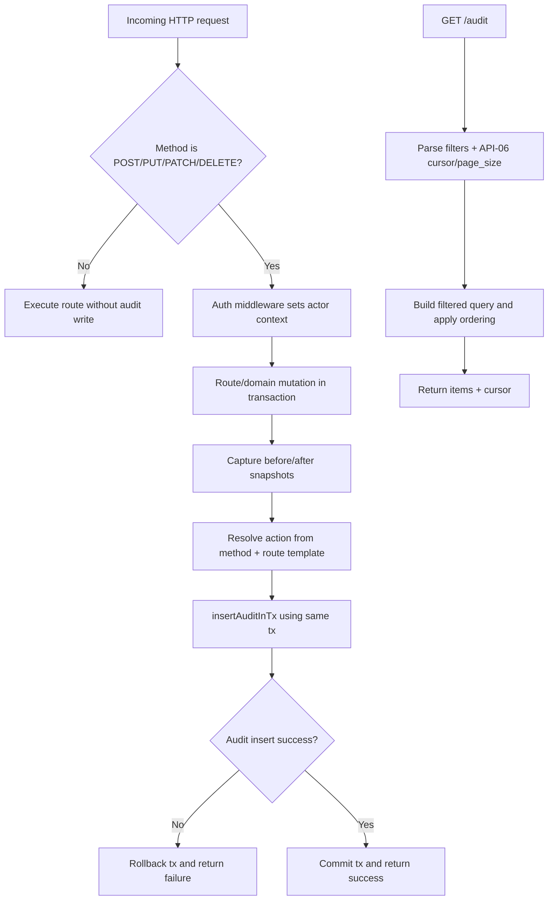
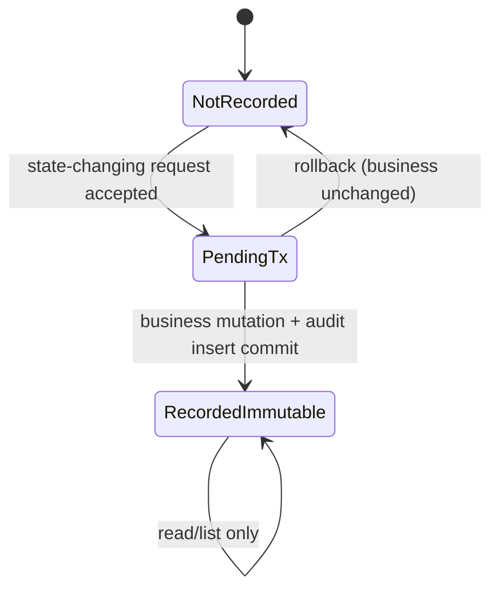

# Module: obs-03-audit-log

**Covers:** OBS-03 (Audit log)
**Related:** DB-03 (atomic writes), API-06 (cursor pagination), API-08 (actor identity from auth), OBS-05 (DLQ discard audited)
**Primary design targets:** `src/obs/audit.zig`, `src/api/middleware/audit.zig`, `src/api/routes/audit.zig`, transaction call sites in state-changing route handlers

## Module purpose

The OBS-03 audit module provides immutable, queryable, transactionally consistent audit records for every successful state-changing API request (POST/PUT/PATCH/DELETE). The module guarantees that business state mutation and audit insertion are committed or rolled back together in one database transaction. It also defines a read API (`GET /audit`) that supports API-06-compatible pagination and deterministic ordering with optional filters over actor, resource identity, and time range.

## Module boundaries

- `src/obs/audit.zig`
  - Owns audit record contract, insert-in-transaction API, and read-query builder logic.
  - Owns immutability enforcement checks at the module boundary.
- `src/api/middleware/audit.zig`
  - Owns write-verb gating (POST/PUT/PATCH/DELETE only), request-context extraction, and action naming resolution.
  - Owns exclusion of GET/read-only requests.
- `src/api/routes/audit.zig`
  - Owns `GET /audit` handler, filter parsing/validation, API-06 pagination integration, and RFC 9457 error mapping.
- State-changing domain modules and route handlers
  - Provide before/after snapshots and canonical resource identifiers to audit middleware/service.

Out of scope:

- Any endpoint that updates or deletes audit rows (forbidden by design).
- Structured stdout log formatting (OBS-01).
- Prometheus metrics definitions (OBS-02).

## Public interface

### Zig types

```zig
pub const AuditRecord = struct {
    audit_id: [16]u8, // UUID
    actor_id: ?[16]u8,
    action: []const u8,
    resource_type: []const u8,
    resource_id: [16]u8,
    timestamp: i64, // UTC microseconds for API field `timestamp`
    before_state: ?[]const u8, // JSON bytes
    after_state: ?[]const u8,  // JSON bytes
};

pub const AuditInsert = struct {
    actor_id: ?[16]u8,
    action: []const u8,
    resource_type: []const u8,
    resource_id: [16]u8,
    before_state: ?[]const u8,
    after_state: ?[]const u8,
};

pub const AuditQueryFilters = struct {
    actor_id: ?[16]u8,
    resource_type: ?[]const u8,
    resource_id: ?[16]u8,
    from_ts_us: ?i64,
    to_ts_us: ?i64,
    cursor: ?[]const u8,
    page_size: ?u16,
};

pub const AuditError = error{
    AuditInsertFailed,
    AuditTableUnavailable,
    ImmutableViolation,
    InvalidAction,
    InvalidFilter,
    InvalidCursor,
    CursorExpired,
    OutOfMemory,
};
```

### Zig functions

```zig
pub fn shouldAuditMethod(method: []const u8) bool;

pub fn resolveAuditAction(
    method: []const u8,
    route_template: []const u8,
) AuditError![]const u8;

pub fn insertAuditInTx(
    allocator: std.mem.Allocator,
    tx: *db.Tx,
    record: AuditInsert,
) AuditError!AuditRecord;

pub fn listAudit(
    allocator: std.mem.Allocator,
    pool: *db.Pool,
    filters: AuditQueryFilters,
) AuditError!pagination.PageResponse(AuditRecord);
```

## Audit record contract and immutable guarantees

Required persisted contract for every inserted record:

| Field | Type | Rule |
|---|---|---|
| `audit_id` | UUID | Generated once at insert; immutable primary identifier |
| `actor_id` | UUID or null | Actor snapshot from auth context at request admission time |
| `action` | text | Canonical `<resource_type>.<verb_or_operation>` name |
| `resource_type` | text | Canonical resource domain (`definition`, `instance`, `task`, `token`, `dlq`, etc.) |
| `resource_id` | UUID | Stable target identifier of mutated resource |
| `timestamp` | UTC timestamp | API field name is `timestamp`; persisted source is immutable creation time |
| `before_state` | JSON or null | Snapshot prior to mutation |
| `after_state` | JSON or null | Snapshot after mutation |

Immutability guarantees:

1. Audit module exposes insert and list only; no update/delete interfaces exist.
2. No API route is defined for modifying or deleting audit rows.
3. Data access policy for audit storage is append-only from application code path.
4. Attempted mutation of existing audit row is treated as `error.ImmutableViolation` in tests and rejected in code review gates.

## Actor extraction and canceled-token handling

Actor extraction source of truth:

1. Auth middleware validates bearer token and writes actor context to request context.
2. Audit middleware reads actor snapshot from request context before transaction commit.
3. `actor_id` for audit write is the context snapshot, not a post-commit re-lookup.

Canceled-token edge case:

- If a token was valid at authentication time and the request reached a successful state-changing action, audit write still uses the captured actor snapshot and must commit with the business change.
- Later token revocation/cancellation cannot retroactively suppress the audit record.

## Action naming conventions across routes

Canonical rule: `action = <resource_type>.<operation>`.

Operation derivation:

1. For generic REST verbs on collection/resource routes:
   - `POST` create endpoint -> `create`
   - `PUT` -> `replace`
   - `PATCH` -> `update`
   - `DELETE` -> `delete`
2. For verb-like route suffixes (`/activate`, `/publish`, `/cancel`, `/complete`, `/discard`), use suffix token verb directly.
3. Route template, not concrete path values, is used for deterministic naming.

Examples:

| Method + route template | resource_type | action |
|---|---|---|
| `POST /definitions` | `definition` | `definition.create` |
| `POST /definitions/:id/activate` | `definition` | `definition.activate` |
| `POST /instances` | `instance` | `instance.create` |
| `POST /instances/:id/cancel` | `instance` | `instance.cancel` |
| `POST /tasks/:id/complete` | `task` | `task.complete` |
| `POST /tasks/:id/reassign` | `task` | `task.reassign` |
| `POST /dlq/:id/discard` | `dlq` | `dlq.discard` |
| `POST /webhooks/subscriptions` | `webhook_subscription` | `webhook_subscription.create` |
| `DELETE /webhooks/subscriptions/:id` | `webhook_subscription` | `webhook_subscription.delete` |

## Snapshot semantics (before_state / after_state)

Snapshot rules:

1. Create-style mutation: `before_state = null`, `after_state = <created entity JSON>`.
2. Delete-style mutation: `before_state = <deleted entity JSON>`, `after_state = null`.
3. Update/transition mutation: both snapshots non-null when both representations are available.
4. `before_state = null` and `after_state = null` is allowed only for operations where entity snapshots are not representable (for example command-style actions not directly tied to a mutable entity payload); this must be deterministic per route and covered by tests.
5. Snapshots are stored as JSON objects/arrays/scalars and may be null; they must not contain secret token plaintext values.

## Transaction integration and failure behavior

Atomicity rule:

- Business write(s) and audit insert execute on the same transaction handle (`tx`) and commit once.

Required transaction sequence:

1. Begin transaction.
2. Load pre-mutation state snapshot where required.
3. Execute business mutation.
4. Build `AuditInsert` payload (actor/action/resource/snapshots).
5. Execute `insertAuditInTx(tx, payload)`.
6. Commit transaction.

Failure semantics:

- If audit insert fails for any reason, including audit table unavailable, transaction commit is not attempted and the full transaction rolls back.
- Returned error maps to write-request failure response and no business mutation persists.

Explicit method exclusion:

- `shouldAuditMethod` returns `false` for `GET`, `HEAD`, and `OPTIONS`.
- No audit record is produced for read-only requests.

## GET /audit retrieval contract

### Endpoint and query parameters

`GET /audit` supports optional filters:

- `actor_id` (UUID)
- `resource_type` (string)
- `resource_id` (UUID)
- `from` (ISO 8601 UTC inclusive lower bound)
- `to` (ISO 8601 UTC inclusive upper bound)
- `cursor` (opaque API-06 cursor)
- `page_size` (default 50, max 200)

Filter semantics:

1. Filters combine with logical AND.
2. `from` and `to` are inclusive.
3. `from > to` returns HTTP 422.
4. Invalid UUID/timestamp/cursor returns HTTP 422 (or 410 for expired cursor per API-06).

### Response shape and ordering

Response body:

```json
{
  "items": [
    {
      "audit_id": "b8d1d2c3-1f22-4ac0-a0e1-0c2f2d3f4a5b",
      "actor_id": "29d2f3b8-3bd4-4fca-a96d-c7f1bc4a9c31",
      "action": "definition.activate",
      "resource_type": "definition",
      "resource_id": "7c9dbfe7-5808-4be5-8e7c-6bece6f9800d",
      "timestamp": "2026-05-25T09:10:30Z",
      "before_state": {"status": "DRAFT"},
      "after_state": {"status": "ACTIVE"}
    }
  ],
  "cursor": "<opaque>",
  "count": 1
}
```

Ordering guarantee:

- Primary sort: `timestamp DESC`.
- Tie-breaker sort: `audit_id DESC`.
- Cursor encodes both sort position fields to ensure deterministic paging without duplicates or gaps for stable snapshots.

Pagination alignment (API-06):

1. Opaque cursor passed via `?cursor=<value>`.
2. Cursor expires after 24 hours.
3. Default `page_size = 50`; max `200`.
4. Endpoint-scoped cursor prefix (recommended `A:`) prevents cross-endpoint cursor reuse.

## Query and index strategy

Query plan goals:

1. Efficient newest-first listing with deterministic tie-break.
2. Efficient filtered scans by actor and by resource identity.
3. Time-window bounded scans for incident investigations.

Logical index strategy:

1. Primary listing index keyed by `(timestamp DESC, audit_id DESC)`.
2. Actor-focused index keyed by `(actor_id, timestamp DESC, audit_id DESC)`.
3. Resource-focused index keyed by `(resource_type, resource_id, timestamp DESC, audit_id DESC)`.

Query shape principles:

- Apply equality filters (`actor_id`, `resource_type`, `resource_id`) first.
- Apply bounded timestamp predicate second.
- Apply cursor continuation predicate on `(timestamp, audit_id)` pair.
- Fetch `page_size + 1` rows to determine next cursor.

## Data flow diagram



## State transitions



## Error taxonomy

| Condition | Error | HTTP mapping | Handling |
|---|---|---|---|
| Audit insert fails due to relation unavailable/permission/storage error | `AuditTableUnavailable` or `AuditInsertFailed` | 500/503 per error mapper | Roll back whole mutation transaction |
| Attempt to mutate audit row via internal API | `ImmutableViolation` | 500 in internal path, blocked in tests | Reject operation, keep row unchanged |
| Invalid action resolution for route | `InvalidAction` | 500 (developer misconfiguration) | Fail request before commit |
| Invalid `actor_id`/`resource_id`/time filter | `InvalidFilter` | 422 | Return RFC 9457 validation details |
| Cursor malformed or for wrong endpoint | `InvalidCursor` | 422 | Return RFC 9457 invalid cursor error |
| Cursor expired | `CursorExpired` | 410 | Return RFC 9457 cursor expired error |

## Dependencies and forbidden dependencies

Depends on:

- `src/db/pool.zig` transaction handles.
- `src/api/middleware/auth.zig` actor context.
- `src/api/pagination.zig` API-06 cursor/page-size rules.
- Route-template metadata from API server/router.

Must not depend on:

- `src/engine/transition.zig` I/O-free engine internals.
- Frontend modules under `web/`.
- Any endpoint-specific mutable global state for cursor storage.

## Requirement-to-design traceability matrix

| Requirement / edge case | Design element(s) | Module/function targets | Test obligations |
|---|---|---|---|
| AC1: successful POST/PUT/PATCH/DELETE writes audit row in same transaction with full contract fields | `Audit record contract`, `Transaction integration and failure behavior`, `Public interface` | `src/obs/audit.zig::insertAuditInTx`, write route transaction orchestrators | Integration test: each write endpoint commits mutation + one audit row atomically; contract field assertions |
| AC2: `GET /audit` filterable by actor/resource/time and paginated per API-06 | `GET /audit retrieval contract`, `Query and index strategy` | `src/api/routes/audit.zig::handleList`, `src/obs/audit.zig::listAudit` | Integration test matrix for filters and API-06 cursor/page_size/expiry behavior |
| AC3: audit records immutable (no modification/deletion API) | `Audit record contract and immutable guarantees` | `src/api/routes/audit.zig` (read-only), `src/obs/audit.zig` | Route test confirms no mutate endpoints; unit/integration guard tests reject update/delete attempts |
| AC4: GET/read-only requests do not create audit records | `Transaction integration and failure behavior` (method exclusion) | `src/api/middleware/audit.zig::shouldAuditMethod` | Integration test sends GET endpoints and asserts zero new audit rows |
| Edge: audit table unavailable causes full mutation failure | `Transaction integration and failure behavior`, `Error taxonomy` | `src/obs/audit.zig::insertAuditInTx`, transaction commit path | Fault-injection integration test: simulate audit insert failure, assert business state rollback |
| Edge: canceled token request that already took action still audited | `Actor extraction and canceled-token handling` | `src/api/middleware/auth.zig`, `src/api/middleware/audit.zig` | Concurrency/integration test: revoke token during in-flight write and assert committed audit with captured actor |
| Handoff edge: null before/after snapshots | `Snapshot semantics` | snapshot builders in write handlers + `insertAuditInTx` payload validation | Unit tests for create/delete/null-null-allowed route cases and serialization checks |
| Handoff requirement: action naming conventions across routes | `Action naming conventions across routes` | `src/api/middleware/audit.zig::resolveAuditAction` | Table-driven unit tests mapping route templates to canonical actions |
| Handoff requirement: ordering guarantees and index/query strategy | `GET /audit retrieval contract`, `Query and index strategy` | `src/obs/audit.zig::listAudit` query builder | Integration test verifies stable ordering and cursor continuation without duplicates |

## Open questions

1. Persisted column name in architecture is `created_at`, while API contract names the field `timestamp`. Design assumes API maps persisted immutable creation time to `timestamp` in response payload.
2. For bootstrap-token authenticated writes in non-production environments, confirm whether `actor_id` should be null or a synthetic stable UUID; current design allows nullable `actor_id` for this case.