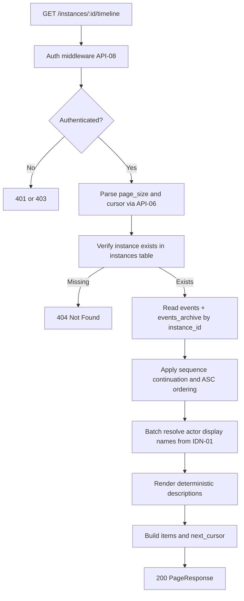
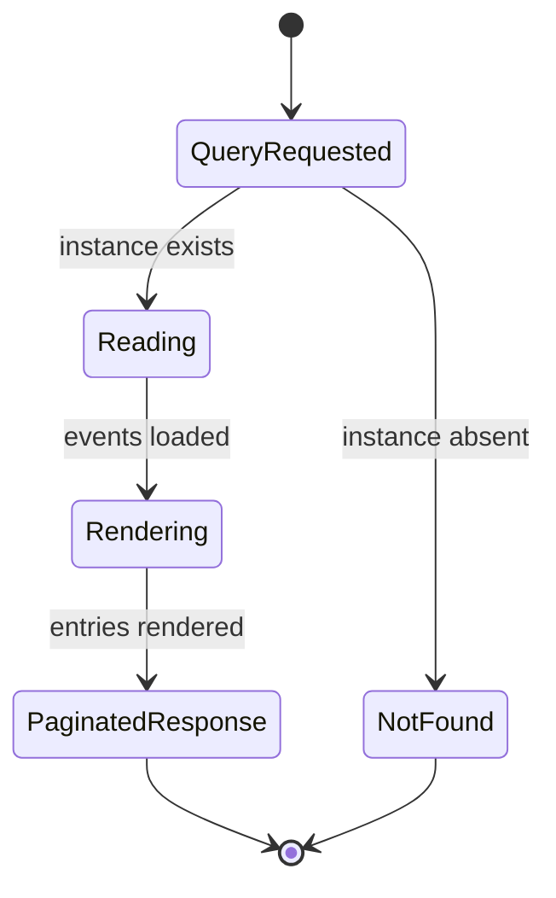

# Module: obs-04-instance-timeline

**Covers:** OBS-04 (Instance timeline view)  
**Related:** ES-02 (ordered read), ES-07 (archived events), API-06 (cursor pagination), API-08 (authenticated access), IDN-01 (user display names), IDN-04 (token context)  
**Primary design targets:** `src/api/routes/instances.zig`, `src/obs/timeline.zig`, `src/event_store/store.zig`, `src/identity/registry.zig`

## Module purpose

The OBS-04 timeline module provides `GET /instances/:id/timeline` as a deterministic, human-readable event history endpoint for monitoring UIs and operator workflows. The module reads both live and archived event logs, resolves actor display names, renders event descriptions for key event families, and returns API-06 paginated results in strict ascending chronological order. The design ensures that timeline behavior is stable across archived data boundaries and terminal instance states, including complete history for `CANCELLED` instances.

## Module boundaries

- `src/api/routes/instances.zig`
  - Owns HTTP route contract, auth gate, query parameter parsing, and error mapping.
- `src/obs/timeline.zig` (new)
  - Owns timeline query orchestration, actor display-name resolution, entry rendering, and response shaping.
- `src/event_store/store.zig`
  - Owns ordered event retrieval from `events` and `events_archive`.
- `src/identity/registry.zig`
  - Owns `user_id -> display_name` resolution for timeline actor labels.
- `src/api/pagination.zig`
  - Owns API-06 cursor and page-size semantics for this endpoint.

Out of scope:

- Frontend rendering components.
- Event append logic.
- Audit log query endpoints (`GET /audit`).

## Public interface

### HTTP endpoint contract

`GET /instances/:id/timeline`

Query parameters:

- `cursor`: optional opaque API-06 cursor.
- `page_size`: optional integer, default `50`, max `200`.

Authorization:

- Any authenticated role may access (API-08 authenticated principal required).
- No additional role restriction is applied for this endpoint.

Success response: `200 OK`

```json
{
  "items": [
    {
      "event_type": "TASK_COMPLETED",
      "timestamp": "2026-05-25T11:20:40Z",
      "actor_display_name": "Alice Kim",
      "description": "Task Review Request completed by Alice Kim",
      "instance_id": "d5a8b7c6-5a9c-4d95-b2cf-706b9395666f",
      "event_id": "7ccf1f98-0cb5-4df4-a9dc-fd57e7d53ac3",
      "sequence_num": 88,
      "task_id": "759b66fe-e6c6-47d4-af61-97d5e5ccfe6a",
      "node_id": "task_review",
      "metadata": {
        "source": "api"
      }
    }
  ],
  "next_cursor": "VEw6MTc0ODE3ODUzMDAwMDAwMDowODg",
  "count": 1
}
```

Error responses:

- `404 Not Found`: instance does not exist.
- `422 Unprocessable Entity`: invalid cursor/page_size.
- `410 Gone`: expired cursor (API-06).
- `500 Internal Server Error`: unexpected timeline assembly failure.

### Zig types

```zig
pub const TimelineEntry = struct {
    event_type: []const u8,
    timestamp: []const u8, // RFC3339 UTC
    actor_display_name: []const u8,
    description: []const u8,

    instance_id: [16]u8,
    event_id: [16]u8,
    sequence_num: i64,

    task_id: ?[16]u8,
    node_id: ?[]const u8,
    metadata_json: []const u8,
};

pub const TimelineQuery = struct {
    instance_id: [16]u8,
    cursor: ?[]const u8,
    page_size: ?u16,
};

pub const TimelineError = error{
    InstanceNotFound,
    InvalidCursor,
    CursorExpired,
    InvalidPageSize,
    EventStoreFailure,
    IdentityLookupFailure,
    RenderFailure,
    OutOfMemory,
};
```

### Zig functions

```zig
pub fn handleInstanceTimeline(ctx: *api.RequestContext) !void;

pub fn listTimeline(
    allocator: std.mem.Allocator,
    pool: *db.Pool,
    identity_registry: *identity.Registry,
    query: TimelineQuery,
) TimelineError!pagination.PageResponse(TimelineEntry);

pub fn readTimelineEvents(
    allocator: std.mem.Allocator,
    pool: *db.Pool,
    instance_id: [16]u8,
    after_sequence: ?i64,
    limit_plus_one: u16,
) TimelineError![]EventRecord;

pub fn resolveActorDisplayNames(
    allocator: std.mem.Allocator,
    identity_registry: *identity.Registry,
    events: []const EventRecord,
) TimelineError!ActorDisplayMap;

pub fn renderTimelineEntry(
    allocator: std.mem.Allocator,
    event: EventRecord,
    actor_map: *const ActorDisplayMap,
) TimelineError!TimelineEntry;
```

## Timeline entry schema

Required fields per OBS-04:

| Field | Type | Source | Rule |
|---|---|---|---|
| `event_type` | string | event log row | Must match persisted event type |
| `timestamp` | RFC3339 UTC string | event `created_at` | Chronological ordering uses timestamp + sequence tie-break |
| `actor_display_name` | string | IDN-01 lookup + fallback policy | Must resolve to display name, token label, or `system` |
| `description` | string | renderer | Human-readable deterministic string |

Context fields:

| Field | Type | Required | Rule |
|---|---|---|---|
| `instance_id` | UUID | yes | Path instance identifier |
| `event_id` | UUID | yes | Stable event identity |
| `sequence_num` | int64 | yes | Stable chronological tie-break key |
| `task_id` | UUID | no | Included when event payload/metadata carries task context |
| `node_id` | string | no | Included when event payload/metadata carries node context |
| `metadata` | object | yes | Event metadata object (possibly empty) |

## Ordering and pagination semantics

Deterministic ordering:

1. Primary order: `created_at ASC`.
2. Tie-break order: `sequence_num ASC`.
3. Because `sequence_num` is append-ordered, response order is deterministic even when two events share timestamp precision.

Pagination contract (API-06 aligned):

- Default `page_size = 50`, max `200`.
- Cursor prefix: `TL:` (timeline-specific to prevent cross-endpoint reuse).
- Raw cursor shape: `TL:{cursor_created_at_us}:{last_sequence_num}`.
- Decode validates:
  - base64url format,
  - prefix `TL:`,
  - 24-hour expiry,
  - numeric `last_sequence_num`.
- Query continuation: `WHERE sequence_num > :last_sequence_num`.
- Read `page_size + 1` rows to determine `next_cursor`.

## Event-log replay/query strategy (live + archive)

Timeline must include archived events (ES-07). Query strategy:

1. Confirm instance existence from `instances` table first.
   - If not found: return `404` before any timeline read.
2. Read events from a unioned timeline source scoped by `instance_id`:

```sql
SELECT event_id, instance_id, event_type, payload, metadata, actor_id, created_at, sequence_num
FROM events
WHERE instance_id = $1

UNION ALL

SELECT event_id, instance_id, event_type, payload, metadata, actor_id, created_at, sequence_num
FROM events_archive
WHERE instance_id = $1
```

3. Apply continuation and ordering at outer query:

```sql
SELECT *
FROM ( ...union above... ) timeline_source
WHERE ($2::bigint IS NULL OR sequence_num > $2)
ORDER BY created_at ASC, sequence_num ASC
LIMIT $3
```

4. Assemble entries and return paged payload.

Rationale:

- Works whether archival has moved early history or not.
- Maintains full history for `CANCELLED` instances.
- Preserves deterministic order through archive boundaries.

## Actor display-name resolution flow

Actor resolution is performed in `resolveActorDisplayNames` with a batched lookup for unique `actor_id` values.

Resolution order per event:

1. If `actor_id` is non-null and IDN-01 user exists: use `users.display_name`.
2. Else if event metadata includes `token_description`: use that value.
3. Else if metadata includes `actor_label`: use that value.
4. Else return `"system"`.

Behavior coverage:

- Automated scheduler/system actions: `actor_display_name = "system"`.
- Token-originated action with no associated user row: use token description when available, otherwise `system`.
- Inactive/deleted user reference: fallback to token label or `system` (timeline remains readable and non-failing).

## Description rendering rules

Description templates must be deterministic, language-stable, and based on event_type + context fields.

### Instance lifecycle family

| Event type | Description template |
|---|---|
| `INSTANCE_STARTED` | `Instance started by {actor_display_name}` |
| `INSTANCE_COMPLETED` | `Instance completed` |
| `INSTANCE_CANCELLED` | `Instance cancelled by {actor_display_name}` |
| `INSTANCE_ERROR` | `Instance entered ERROR: {error_summary}` |

### Task activation/completion family

| Event type | Description template |
|---|---|
| `TASK_ACTIVATED` | `Task {task_name_or_node_id} activated` |
| `TASK_COMPLETED` | `Task {task_name_or_node_id} completed by {actor_display_name}` |
| `TASK_CANCELLED` | `Task {task_name_or_node_id} cancelled` |

### Cancellation and termination family

| Event type | Description template |
|---|---|
| `TIMER_CANCELLED` | `Timer for node {node_id} cancelled` |
| `SERVICE_TASK_ABANDONED` | `Service task abandoned after cancellation` |

### Error family

| Event type | Description template |
|---|---|
| `EXECUTION_ERROR` | `Execution error at node {node_id}: {error_code_or_message}` |
| `SERVICE_TASK_FAILED` | `Service task failed at node {node_id}: {failure_reason}` |

Fallback rule:

- Unknown event type uses `Event {event_type} recorded`.

## CANCELLED-instance behavior

For `GET /instances/:id/timeline` where `instances.status = CANCELLED`:

1. Return full timeline history (not truncated).
2. Include `INSTANCE_CANCELLED` event entry.
3. Preserve chronological order including pre-cancel events from archive and active tables.
4. Return `200` if instance exists, even when terminal.

## Authorization model

- Endpoint requires authenticated caller (API-08).
- Any authenticated role is allowed (no RBAC role filtering).
- Unauthorized/invalid token handling remains in auth middleware (`401` / `403` per existing API-08 behavior).

## Index, query, and performance considerations

Required indexes:

1. `events(instance_id, sequence_num)` (existing pattern from ES-02).
2. `events_archive(instance_id, sequence_num)` for archive reads.
3. Optional covering index: `(instance_id, created_at, sequence_num)` where query planner benefits.

Performance strategy:

1. Filter by `instance_id` before union materialization.
2. Cursor by `sequence_num` to avoid expensive timestamp seek ambiguity.
3. Fetch `page_size + 1` only; avoid total-count query.
4. Batch actor lookups with `WHERE user_id IN (...)` once per page.

Expected operational behavior:

- Read path remains bounded by page size.
- Large historical instances remain navigable via cursor pages.
- Archive inclusion does not require dual round-trips in application code.

## Failure semantics

| Condition | Error | HTTP mapping | Behavior |
|---|---|---|---|
| Instance missing | `InstanceNotFound` | 404 | Fail fast before timeline query |
| Invalid cursor format/prefix | `InvalidCursor` | 422 | Return RFC 9457 invalid cursor |
| Cursor expired | `CursorExpired` | 410 | Return RFC 9457 cursor expired |
| Invalid page size | `InvalidPageSize` | 422 | Return RFC 9457 invalid page_size |
| Event store query failure | `EventStoreFailure` | 500/503 | No partial timeline payload |
| Actor lookup failure | `IdentityLookupFailure` | 500/503 | Fail request (do not emit mixed unresolved names) |
| Description render failure | `RenderFailure` | 500 | Fail request to preserve deterministic contract |

## Data flow diagram



## State transitions



## Dependencies

Depends on:

1. `src/api/pagination.zig` for API-06 cursor/page-size behavior.
2. `src/event_store/store.zig` for ordered event retrieval.
3. `src/identity/registry.zig` for user display-name lookup.
4. `instances`, `events`, and `events_archive` database tables.

Must not depend on:

1. `src/engine/transition.zig` (pure execution module).
2. Frontend files under `web/`.
3. Mutable audit-log state for timeline rendering.

## Requirement-to-design traceability matrix

| OBS-04 criterion / edge case | Design element(s) | Module/function targets | Test obligations |
|---|---|---|---|
| AC1: `GET /instances/:id/timeline` returns 200 with ascending chronology | Ordering and pagination semantics; replay/query strategy | `src/obs/timeline.zig::listTimeline`, `src/event_store/store.zig::readTimelineEvents` | Integration: assert ascending `timestamp` and `sequence_num`; stable ordering across pages |
| AC2: Entry includes `event_type`, `timestamp`, `actor_display_name`, `description`, context fields | Timeline entry schema; actor resolution flow; description rendering rules | `src/obs/timeline.zig::renderTimelineEntry`, `resolveActorDisplayNames` | Integration: response-shape contract test including task/node context extraction |
| AC3: API-06 pagination semantics | Cursor `TL:` format, expiry, default/max page size, `page_size+1` fetch | `src/api/pagination.zig` integration in `handleInstanceTimeline` | Integration: cursor continuation, invalid cursor=422, expired cursor=410, max-page-size enforcement |
| AC4: Any authenticated role may access | Authorization model section | `src/api/routes/instances.zig::handleInstanceTimeline` middleware chain | Auth integration: each valid role receives 200; unauthenticated rejected |
| AC5: 404 for missing instance | Fail-fast instance existence check | `src/obs/timeline.zig::listTimeline` | Integration: nonexistent instance id returns 404 |
| Edge: automated token with no associated user -> `system` or token description | Actor display-name resolution fallback order | `src/obs/timeline.zig::resolveActorDisplayNames` | Integration: token-origin/system-origin events assert token label fallback then `system` |
| Edge: CANCELLED instance includes complete history incl. `INSTANCE_CANCELLED` | CANCELLED-instance behavior; archive+live union query | `src/event_store/store.zig::readTimelineEvents`, renderer | Integration: cancelled instance timeline includes pre-cancel + `INSTANCE_CANCELLED` from full history |
| See: ES-07 archived events included | Live+archive query union and ordering | `src/event_store/store.zig::readTimelineEvents` | Integration: seed archived + live rows and assert single ordered timeline |
| See: IDN-01 display names resolved from registry | Actor lookup from users display_name | `src/identity/registry.zig`, `resolveActorDisplayNames` | Unit/integration: actor_id -> display_name mapping and inactive/missing fallback |

## Open questions

1. None blocking for implementation. Token-label fallback is deterministic using `metadata.token_description` when present, otherwise `system`.